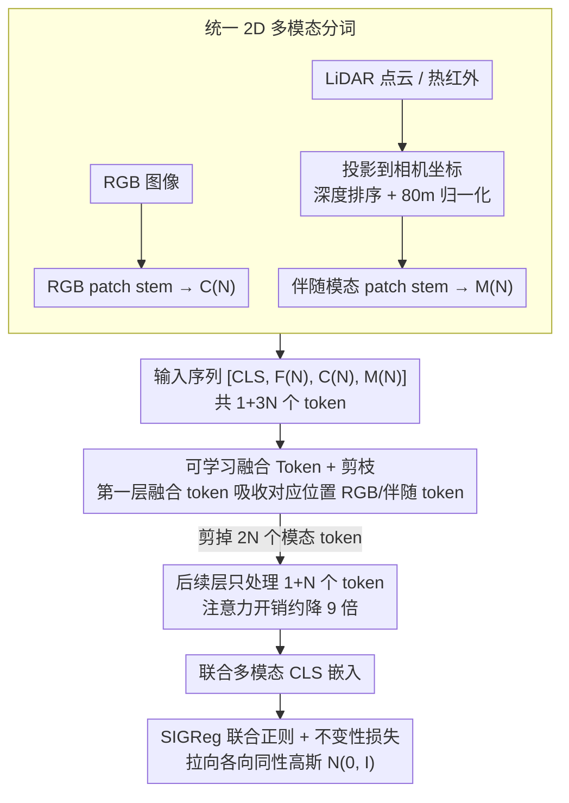

# Le MuMo JEPA: Multi-Modal Self-Supervised Representation Learning with Learnable Fusion Tokens

**会议**: CVPR 2026  
**arXiv**: [2603.24327](https://arxiv.org/abs/2603.24327)  
**代码**: 无  
**领域**: 自动驾驶 / 多模态自监督学习  
**关键词**: 多模态自监督, JEPA, 融合token, 潜在瓶颈, RGB-LiDAR融合

## 一句话总结

将LeJEPA自监督框架扩展到多模态设置，引入可学习融合token作为Perceiver式潜在瓶颈在共享Transformer内高效融合RGB与伴随模态（LiDAR深度/热红外），采用剪枝策略将注意力开销降低约9倍，在Waymo上CenterNet 3D检测mAP XY达23.6（比RGB-only LeJEPA提升4.3），Depth MAE从4.704降至2.860。

## 研究背景与动机

**领域现状**：自动驾驶感知系统依赖多传感器（相机、LiDAR等），但主流多模态感知模型（BEVFusion、TransFusion等）仍是全监督训练，需要大量3D标注。自监督学习（BYOL、DINO、MAE、I-JEPA等）在单模态取得优秀成果，但几乎都只处理单一模态。

**现有痛点**：(1) 单模态自监督丢失多传感器互补信号——RGB提供纹理颜色，LiDAR提供几何深度，单独学无法充分利用；(2) 现有多模态自监督方法（ImageBind用对比学习、MultiMAE用掩码重建）在严格的from-scratch训练下并未明显超越单模态基线；(3) 弱后融合不够表达，全token all-to-all注意力计算二次复杂度过高。

**核心矛盾**：多模态融合需要跨模态的密集交互以捕获互补信息，但两种模态的token完全交叉注意力计算成本过高（token数量翻倍导致注意力开销约4倍）。

**切入角度**：JEPA框架的SIGReg正则化提供了模态无关的共享目标——将两种模态的嵌入都拉向各向同性高斯分布 $\mathcal{N}(0, \mathbf{I})$，无需成对对比的负样本挖掘。

**核心idea**：引入可学习融合token作为空间记忆缓冲，在第一层注意力后剪枝模态特定token，通过信息瓶颈迫使模型早期将跨模态证据压缩到融合token网格中，同时大幅降低后续层计算量。

## 方法详解

### 整体框架

这篇论文想解决的是：自动驾驶里相机和 LiDAR 提供互补信号，但单模态自监督学不到跨模态信息，而把两种模态的 token 全部塞进 Transformer 做 all-to-all 注意力又因为 token 翻倍带来约 4 倍的计算开销。它的做法是在一个共享的 ViT-Small/16 编码器里，额外引入一组「融合 token」当作跨模态信息的中转站，让信息先压缩进去、再把原始模态 token 剪掉。

整条 pipeline 这样转：先把 LiDAR 深度投影到相机坐标系、和 RGB 对齐成 2D 深度图，再让每种模态各走一个独立 patch stem 分词；编码器输入是 $[\text{CLS}(1), \mathbf{F}(N), \mathbf{C}(N), \mathbf{M}(N)]$ 这一串 token——$\mathbf{F}$ 是融合 token，$\mathbf{C}$ 是 RGB token，$\mathbf{M}$ 是伴随模态（LiDAR 深度或热红外）token，三组加 CLS 共 $1+3N=589$ 个。第一层注意力让融合 token 吸收两种模态后，模型把 $2N$ 个模态 token 全部剪掉，后续层只在 $1+N$ 个 token 上跑。训练目标是 LeJEPA 的不变性损失加 SIGReg 正则，作用在联合多模态 CLS 嵌入上。

### 关键设计

**1. 统一 2D 空间的多模态分词：不引入单独的 3D 骨干**

异构传感器数据格式不一，LiDAR 是稀疏点云、热红外是另一种 2D 图，如果各配一套骨干会让架构复杂、难复用。这里统一把它们渲染回共享的 2D token 网格：LiDAR 点云投影到相机坐标系后做深度排序（近处覆盖远处）、按最大 80m 归一化成对齐深度图；热红外直接 resize 到同一 spatial grid。各模态再走独立 patch stem，并加上模态嵌入 $\mathbf{e}_{cam}, \mathbf{e}_{mod}$ 区分来源。这样做的代价是丢掉了点云的原生 3D 结构，但换来一套统一的 dense ViT 架构——同一个框架只要换 patch stem 就能从 RGB-LiDAR 切到 RGB-Thermal，不必为每种传感器单独搭 3D 稀疏网络。

**2. 可学习融合 Token + 剪枝：用一层注意力换信息瓶颈**

分词后两种模态的 token 都进了同一个序列，但直接做全 token 的跨模态注意力，开销是 $\mathcal{O}((1+3N)^2)$，token 翻倍会把成本顶上去；而弱后融合又表达不够。这里的折中是创建 $N$ 个可学习融合 token（数量和 patch 数相同），在第一层里让每个融合 token $\mathbf{f}_i$ 只注意它对应空间位置的 RGB patch $\mathbf{c}_i$ 和伴随模态 patch $\mathbf{m}_i$，把这一处的跨模态证据收进来。第一层之后，所有 $2N$ 个模态 token 被直接剪掉，后续层只处理 $1+N$ 个 token，注意力开销从 $\mathcal{O}((1+3N)^2)$ 降到 $\mathcal{O}((1+N)^2)$，约 9 倍减少（以本文 $N=196$ 算，589 个 token 在第一层后收缩到 197 个）。

这一剪不只是省算力，更关键的是它强制模型在第一层就把跨模态信息压进融合 token——后面层再也拿不到原始模态 token，融合 token 成了唯一的跨模态载体，形成一个显式的信息瓶颈，逼模型学到压缩得更狠、更互补的表示。而被剪掉的模态 token 并不会让梯度断流：第一层的交叉注意力路径仍然能把梯度回传给两个模态的 patch stem，所以分词器照样在更新。

**3. SIGReg 联合多模态正则化：把两种模态拉向同一个高斯**

剪枝后只剩融合 token 在编码器里继续聚合，训练目标作用在它汇出的联合多模态 CLS 嵌入上。多模态自监督最怕表示坍缩，而对比学习要挖负样本、蒸馏要维护教师-学生网络，在多模态下都偏重。SIGReg 换了个思路：把联合多模态 CLS 嵌入过一个投影头后，用随机投影的特征函数匹配，把经验嵌入分布直接拉向各向同性高斯 $\mathcal{N}(0, \mathbf{I})$，复杂度只有 $\mathcal{O}(BK(T+d))$。相比 VICReg 只匹配方差和协方差，对各向同性高斯的匹配能更直接地压掉模态特定的各向异性——也就是消除前面那个「RGB 和 LiDAR 各自结块」的倾向。而且整个过程不需要 stop-gradient、不需要教师网络，把多模态训练框架简化成单一共享目标，这也是它能当「模态粘合剂」的原因。

### 损失函数 / 训练策略

$$\mathcal{L}_{\text{MM}} = \lambda \cdot \mathcal{L}_{\text{SIGReg}}(\mathbf{Z}^{(\text{joint})}) + (1 - \lambda) \cdot \mathcal{L}_{\text{inv}}^{(\text{joint})}$$

其中 $\mathcal{L}_{\text{inv}}^{(\text{joint})}$ 是均方不变性损失，拉近全局和局部融合crop嵌入。训练采用multi-crop增强：全局crop $224 \times 224$（scale $[0.4, 1.0]$）和局部crop $96 \times 96$（scale $[0.05, 0.4]$）。Waymo/nuScenes均为5 epoch SSL + 5 epoch probe训练。

## 实验关键数据

### 主实验（Waymo, from-scratch）

| 方法 | 训练数据 | mAP XY ↑ | Depth MAE ↓ | Seg. mIoU ↑ |
|------|---------|----------|-------------|-------------|
| LeJEPA | RGB | 19.3 | 4.704 | 0.261 |
| DINOv3 | RGB | 15.2 | 5.314 | 0.239 |
| LiDAR-only | Depth | 15.4 | 2.982 | 0.151 |
| MultiMAE-SS | RGB+Depth | 13.5 | 4.441 | 0.221 |
| ImageBind | RGB+Depth | 13.4 | 4.309 | 0.243 |
| **Le MuMo JEPA** | **RGB+Depth** | **23.6** | **2.860** | **0.275** |

### 消融实验（Waymo融合策略对比）

| 配置 | mAP XY ↑ | Depth MAE ↓ | Seg. mIoU ↑ |
|------|----------|-------------|-------------|
| Early Fusion RGBD | 18.1 | 4.767 | 0.248 |
| Late Fusion | 18.7 | 4.802 | 0.251 |
| FT-Pruned + VICReg | 22.8 | 2.911 | 0.248 |
| FT-Persistent + SIGReg | 23.1 | 2.846 | 0.271 |
| Le MuMo JEPA (default) | 23.6 | 2.860 | 0.275 |

### 关键发现
- Le MuMo JEPA在mAP XY上比最强单模态（LeJEPA 19.3）提升4.3，Depth MAE从4.704降至2.860
- 从零训练的ImageBind和MultiMAE在Waymo上甚至不如单模态LeJEPA——对比和重建目标在小数据from-scratch设置下对数据量要求更高
- 剪枝融合比persistent路由在效率-精度权衡上更优——信息瓶颈迫使早期跨模态压缩
- SIGReg比VICReg在联合多模态CLS嵌入上更好——各向同性高斯目标更直接抑制模态特定各向异性
- nuScenes上同样全面最优（mAP XY 9.52 vs 次优6.95）；FLIR RGB-Thermal上跨域迁移后最优（Waymo→FLIR mAP50 1.56 vs ImageBind 0.72）

## 亮点与洞察
- **信息瓶颈设计精妙**：融合token仅在第一层吸收跨模态信息后即剪枝模态token，用计算约束换取更好的表示压缩——类似Perceiver但更激进（一层即剪枝）
- **SIGReg作为模态粘合剂**：将两各种模态都拉向相同的数据无关目标分布，比成对对比学习更自然——无需负样本，无需教师，简洁高效
- **统一2D避免3D骨干**：将LiDAR投影到2D而非保持3D稀疏格式，虽丢弃部分3D结构信息，但换来了架构统一性和灵活性（同一框架切换RGB-Thermal仅需换patch stem）
- **from-scratch公平对比**：所有方法在相同数据和计算预算下从零训练，排除了预训练权重的混杂因素

## 局限与展望
- LiDAR投影到2D丢弃了原生3D结构（如遮挡关系、点云密度变化），可能限制复杂3D推理场景的性能
- 仅用ViT-Small/16评估，更大模型（ViT-Base/Large）可能有不同的融合动态
- 训练epoch数非常短（5 epoch），与标准SSL训练（300+ epoch）差距大，可能尚未收敛
- 剪枝后模态token信息完全依赖第一层的一次注意力传递，可能丢失需要多层交互才能提取的复杂跨模态关系
- 下游评估仅用冻结patch probe，未展示端到端微调的全面结果

## 相关工作与启发
- **vs ImageBind**: ImageBind用对比学习对齐多模态嵌入，from-scratch训练在Waymo上mAP XY仅13.4（甚至低于LeJEPA的19.3）；Le MuMo JEPA达23.6，说明对比目标在小数据下不如SIGReg+fusion token
- **vs MultiMAE**: MultiMAE用掩码重建学习多模态表示，from-scratch表现同样不佳（13.5-13.7）；即使加上multitask监督（MultiMAE-MT），仍远不如Le MuMo JEPA
- **vs BEVFusion**: BEVFusion是全监督的，需要大量3D标注；Le MuMo JEPA完全自监督，但未与其直接比较（数值不可比）
- **启发**：自监督多模态融合的关键不在于对齐两个模态，而在于共享表示空间中的信息压缩——瓶颈设计比融合粒度更重要

## 评分
- 新颖性: ⭐⭐⭐⭐ 融合token+SIGReg在JEPA框架中的多模态扩展新颖，剪枝策略设计巧妙
- 实验充分度: ⭐⭐⭐⭐ 三个数据集、多种基线、详细消融、计算效率分析；但训练epoch短、模型规模小
- 写作质量: ⭐⭐⭐⭐ 方法描述清晰，实验设置透明（from-scratch），消融有说服力
- 价值: ⭐⭐⭐⭐ 对多模态自监督领域提供了高效融合范式，但实际部署价值待在更大规模验证

<!-- RELATED:START -->

## 相关论文

- [\[CVPR 2026\] RPGFusion: 4D Radar Prior-Guided Multi-Modal Fusion for 3D Detection](rpgfusion_4d_radar_prior-guided_multi-modal_fusion_for_3d_detection.md)
- [\[AAAI 2026\] Dual-branch Spatial-Temporal Self-supervised Representation for Enhanced Road Network Learning](../../AAAI2026/autonomous_driving/dual-branch_spatial-temporal_self-supervised_representation_for_enhanced_road_ne.md)
- [\[CVPR 2026\] CCF: Complementary Collaborative Fusion for Domain Generalized Multi-Modal 3D Object Detection](ccf_complementary_collaborative_fusion_for_domain_generalized_multi-modal_3d_obj.md)
- [\[CVPR 2026\] TerraSeg: Self-Supervised Ground Segmentation for Any LiDAR](terraseg_self-supervised_ground_segmentation_for_any_lidar.md)
- [\[CVPR 2026\] Towards Balanced Multi-Modal Learning in 3D Human Pose Estimation](towards_balanced_multi-modal_learning_in_3d_human_pose_estimation.md)

<!-- RELATED:END -->
