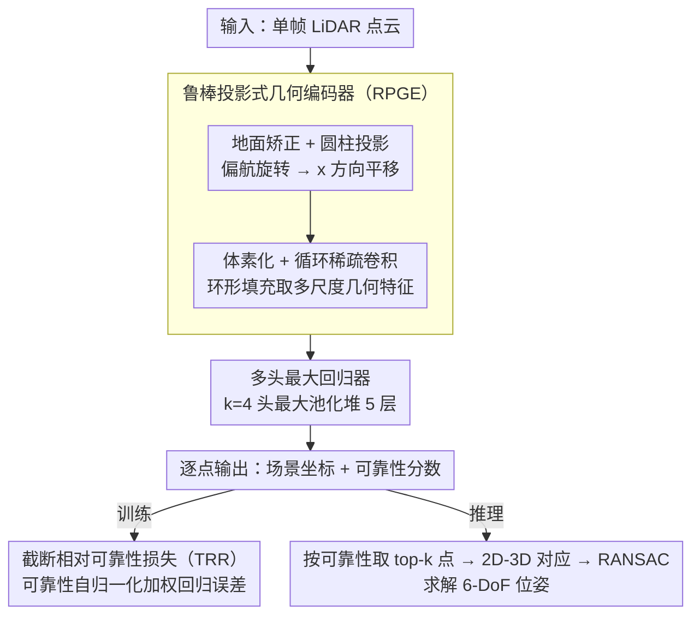

# LEADER: Learning Reliable Local-to-Global Correspondences for LiDAR Relocalization

**会议**: CVPR 2026  
**arXiv**: [2604.11355](https://arxiv.org/abs/2604.11355)  
**代码**: [https://github.com/JiansW/LEADER](https://github.com/JiansW/LEADER)  
**领域**: 自动驾驶  
**关键词**: LiDAR重定位, 场景坐标回归, 偏航不变, 可靠性估计, 点云

## 一句话总结
LEADER 通过鲁棒的投影式几何编码器（偏航不变）和截断相对可靠性损失（抑制不可靠点），在 LiDAR 重定位任务上分别实现 24.1% 和 73.9% 的位置误差相对降低。

## 研究背景与动机

**领域现状**：LiDAR 重定位在自动驾驶中至关重要。主流方法分为"检索+配准"（需存储密集点云地图）和基于学习的回归方法，后者又分为绝对位姿回归（APR）和场景坐标回归（SCR）。

**现有痛点**：(1) 检索+配准方法存储和通信开销大；(2) APR 精度有限；(3) 现有 SCR 网络架构不具备偏航不变性，车辆转弯时性能下降；(4) 所有预测点被同等对待，退化区域（无纹理、动态物体）的错误对应点严重干扰位姿估计。

**核心矛盾**：自动驾驶场景中偏航旋转频繁且场景中大量点不适合重定位（动态物体、重复纹理），但现有方法既不能处理旋转又不能区分点的可靠性。

**核心 idea**：设计偏航不变的几何编码器 + 点级可靠性量化，共同提升 SCR 的鲁棒性。

## 方法详解

### 整体框架
LEADER 走的是场景坐标回归（SCR）路线：给一帧 LiDAR 点云，直接回归每个点在全局地图坐标系下的 3D 坐标，再用这些 2D-3D（点到场景坐标）对应关系做 RANSAC 求出 6-DoF 位姿。它要解决两个 SCR 一直没处理好的麻烦——车辆频繁转弯带来的偏航旋转，以及场景里大量根本不该信任的点（动态物体、地面、重复纹理）。

整条 pipeline 先把原始点云做地面估计与平面矫正摆正，再做圆柱投影，把"绕 Z 轴转多少度"这件事变成投影图里沿一个轴的平移；投影后体素化，用循环稀疏卷积抽多尺度几何特征；特征送进多头最大回归器，每个点同时吐出场景坐标和一个可靠性分数；坐标恢复到笛卡尔系后，可靠性分数既参与训练时的损失加权，也在推理时用来挑出最可信的点驱动 RANSAC。

### 关键设计

**1. 鲁棒投影式几何编码器（RPGE）：把"偏航旋转"变成网络天然能处理的"平移"**

SCR 网络本身没有任何旋转不变性，车一转弯，同一片场景在网络眼里就成了完全不同的输入，精度随之掉。RPGE 的做法是先做圆柱投影，把点 $(x',y',z')$ 映到 $(x^p = s\cdot\arctan2(y',x'),\ y^p=\sqrt{x'^2+y'^2},\ z^p=z')$——绕 Z 轴的偏航旋转在这个坐标里就退化成 $x^p$ 方向的一个平移量。但平移到投影图边界会绕回另一头，普通卷积在这条接缝处会算出断裂的特征，所以这里换成循环稀疏卷积，边界特征环形填充，保证沿偏航维度是连续的。最后还有一道关键约束：喂给网络的初始特征只用距离、高度、反射强度这些与偏航无关的量，绝不放偏航相关的坐标，这样"旋转→平移"的等变性才从输入端就立住，而不是寄望网络自己学出来。

**2. 多头最大回归器：用多头最大池化抽出更鲁棒的坐标预测**

退化区域的特征本就容易被单一投影方向带偏，回归头需要更强的表达力。这里把 512 维特征投影到 $k\times512$ 维（$k=4$ 个头），在每一维上取各头的最大值，相当于让多条并行变换竞争、只保留响应最强的那支；这样的操作堆 5 层后再接全连接层，每个点输出 3D 场景坐标和一个可靠性分数。多头最大池化让回归对局部噪声更不敏感，也给下面的可靠性判断提供了更稳的特征基础。

**3. 截断相对可靠性损失（TRR）：让网络学会主动放弃不该信的点**

SCR 默认把所有预测点一视同仁，可现实里动态物体、地面、弱纹理区域的坐标预测本质上就是噪声，平均进位姿估计反而拖累结果。TRR 拿回归器输出的可靠性分数 $u_i$，经 arctan 缩放并截断后转成一组自归一化权重 $w_i$，可靠点权重大、不可靠点权重被压到接近零，训练目标按权重聚合每个点的原始回归误差：

$$\mathcal{L}_{TRR} = \sum_i w_i\,\mathcal{L}_{raw,i}$$

因为权重自归一化、且对低可靠点做了截断，网络无法靠"把所有点都标成不可靠"来偷懒降损失，只能去识别哪些点真正稳定。训练完它学出来的可靠性图和直觉吻合——建筑立面这类稳定结构分高，地面和植被分低，全程不需要任何语义标注或先验。

### 损失函数 / 训练策略
全程用截断相对可靠性损失（TRR）端到端训练，坐标回归与可靠性估计联合优化。推理时取可靠性分数 top-k 的点构造 2D-3D 对应，再用 RANSAC 解出 6-DoF 位姿。

## 实验关键数据

### 主实验

| 数据集 | 指标 | LEADER | 之前SOTA | 相对降低 |
|--------|------|--------|----------|---------|
| Oxford RobotCar | 位置误差(m) | 0.63 | 0.83 (LightLoc) | -24.1% |
| NCLT | 位置误差(m) | 0.19 | 0.72 (SGLoc→LiSA) | -73.9% |
| Oxford | 方向误差(°) | 1.11 | 1.12 | -0.9% |

### 消融实验

| 配置 | Oxford位置误差 | NCLT位置误差 | 说明 |
|------|--------------|-------------|------|
| Full LEADER | 0.63 | 0.19 | 完整模型 |
| w/o 循环卷积 | 增大 | 增大 | 偏航边界不连续 |
| w/o TRR | 增大 | 增大 | 不可靠点干扰 |
| w/o 投影变换 | 增大 | 增大 | 偏航不变性缺失 |

### 关键发现
- NCLT 数据集上改进最为显著（73.9%），因为 NCLT 包含更多偏航变化和退化区域
- TRR 损失学到的可靠性分数与直觉一致——建筑立面等稳定结构高、地面和植被低
- SCR 方法整体优于 APR 方法，因为显式利用了几何约束

## 亮点与洞察
- **圆柱投影+循环卷积**：将偏航旋转问题优雅地转化为平移等变问题，计算上高效且理论上合理
- **自学习可靠性**：网络自动学会区分可靠/不可靠区域，无需手动标注或语义先验

## 局限与展望
- 仅处理偏航旋转，俯仰和翻滚变化未显式建模
- 可靠性阈值的自适应选择仍可改进
- 未来可结合语义信息进一步提升可靠性估计

## 相关工作与启发
- **vs LiSA**: LiSA 用语义先验区分点贡献，LEADER 用学习的可靠性分数，无需额外语义标注
- **vs RALoc**: RALoc 也处理旋转但方式不同，LEADER 的投影方法更自然

## 评分
- 新颖性: ⭐⭐⭐⭐ 投影变换+可靠性损失的组合简洁有效
- 实验充分度: ⭐⭐⭐⭐⭐ 两个权威数据集上大幅领先
- 写作质量: ⭐⭐⭐⭐ 方法描述清晰
- 价值: ⭐⭐⭐⭐ 对自动驾驶 LiDAR 定位有实际价值

<!-- RELATED:START -->

## 相关论文

- [\[ECCV 2024\] DVLO: Deep Visual-LiDAR Odometry with Local-to-Global Feature Fusion and Bi-directional Structure Alignment](../../ECCV2024/autonomous_driving/dvlo_deep_visual-lidar_odometry_with_local-to-global_feature_fusion_and_bi-direc.md)
- [\[AAAI 2026\] Beta Distribution Learning for Reliable Roadway Crash Risk Assessment](../../AAAI2026/autonomous_driving/beta_distribution_learning_for_reliable_roadway_crash_risk_a.md)
- [\[CVPR 2026\] BEV-SLD: Self-Supervised Scene Landmark Detection for Global Localization with LiDAR Bird's-Eye View Images](bev-sld_self-supervised_scene_landmark_detection_for_global_localization_with_li.md)
- [\[CVPR 2026\] LiREC-Net: A Target-Free and Learning-Based Network for LiDAR, RGB, and Event Calibration](lirec-net_a_target-free_and_learning-based_network_for_lidar_rgb_and_event_calib.md)
- [\[CVPR 2026\] Learning Geometric and Photometric Features from Panoramic LiDAR Scans for Outdoor Place Categorization](learning_geometric_and_photometric_features_from_p.md)

<!-- RELATED:END -->
