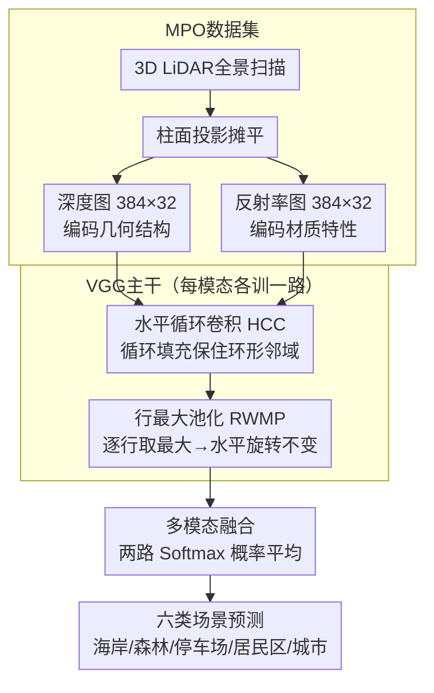

# Learning Geometric and Photometric Features from Panoramic LiDAR Scans for Outdoor Place Categorization

**会议**: CVPR 2026  
**arXiv**: [2603.12663](https://arxiv.org/abs/2603.12663)  
**代码**: 无  
**领域**: 自动驾驶 / 场景理解  
**关键词**: 户外场景分类, LiDAR全景图, 多模态融合, CNN, 深度与反射率

## 一句话总结
本文利用3D LiDAR获取的全景深度图和反射率图作为CNN的输入，构建了一个大规模户外场景分类数据集MPO，并提出了水平循环卷积(HCC)和行最大池化(RWMP)两种改进策略，实现了对六类户外场景的高精度分类（最高97.87%），显著优于传统手工特征方法。

## 研究背景与动机
1. **领域现状**：自主机器人和车辆需要理解周围环境以实现自主导航和决策。场景分类（place categorization）是其中的关键任务，要求机器人判断自身所在位置的语义类别。
2. **现有痛点**：传统方法主要依赖RGB相机，但户外环境面临昼夜光照变化剧烈、行人和车辆遮挡等问题，导致视觉特征不稳定。此外，现有的3D数据集（如KITTI）主要面向定位和建图任务，场景类别标注有限（仅4类）。
3. **核心矛盾**：RGB图像对光照变化敏感，而LiDAR提供的深度和反射率信息对光照具有鲁棒性，但缺乏针对LiDAR数据的大规模户外场景分类数据集和专用CNN架构。
4. **本文目标** (1) 构建大规模多模态LiDAR户外场景分类数据集；(2) 设计适合全景LiDAR图像的CNN架构；(3) 探索深度和反射率两种模态的最优融合策略。
5. **切入角度**：作者观察到LiDAR全景图具有环形结构（水平方向首尾相连），标准卷积在边界处使用零填充会破坏这种连续性，且车辆偏航运动导致特征在水平方向大幅移动。
6. **核心 idea**：通过水平循环卷积保持全景图的环形结构特性，配合行最大池化实现旋转不变性，并利用深度+反射率多模态融合提升分类精度。

## 方法详解

### 整体框架
这篇论文要解决的是户外场景分类：让机器人在昼夜光照剧变、行人车辆遮挡的环境里依然能稳定判断自己处在什么类型的地点。作者的整体思路是绕开对光照敏感的RGB相机，改用3D LiDAR。具体来说，车顶LiDAR扫一圈得到的点云先经柱面投影摊平成两张2D全景图——一张是深度图（编码几何结构），一张是反射率图（编码材质特性），分辨率都是384×32。这两张图分别或联合送进CNN，最终输出六类户外场景（海岸、森林、室内停车场、室外停车场、居民区、城市区域）的预测。整条流水线的两个关键改动都围绕全景图特有的"环形+可旋转"性质展开，融合阶段再把深度和反射率两路结果合到一起。

### 关键设计

**1. MPO数据集：先有大规模LiDAR场景基准，才谈得上训CNN**

这个工作的前提性贡献是数据。现有数据集要么只有RGB（如Places），对光照变化不鲁棒；要么是面向定位建图的3D数据集（如KITTI），场景类别标注只有4类，远不够训一个场景分类器。作者用车顶的Velodyne HDL-32e LiDAR，以30–50km/h的速度跑遍福冈市10个区域、六类场景，采集出34,200个全景扫描，每个扫描都同时含深度图和反射率图两种模态，总量59.23GB。另外他们还用FARO Focus 3D S120采了650个扫描的高分辨率Dense MPO作为补充。正是这个规模和双模态结构，让后面所有的架构实验和模态对比成为可能。

**2. 水平循环卷积（HCC）：让卷积尊重全景图首尾相连的环形结构**

全景图覆盖360度，图像最左列和最右列在物理空间里其实是紧挨着的同一片区域。但标准卷积在图像边界用零填充，等于硬生生在这条本该连续的接缝上插入了一段"空白邻域"，导致边界附近的特征提取能力明显衰减。HCC的做法很直接：把零填充换成循环填充——水平方向上，把图像右端的像素补到左端的padding区，反之亦然，这样卷积核滑到边界时拿到的仍是真实的环形邻域。这个循环数据流在前向计算和反向梯度传播里都保持一致。后面的Grad-CAM也印证了它的作用：加了HCC后模型能在图像边界处均匀提取特征，消除了标准CNN边界特征衰减的现象。

**3. 行最大池化（RWMP）：用"同一仰角取最大"换来水平旋转不变性**

车辆的偏航运动加上LiDAR的安装角度，会让同一个视觉概念在全景图里沿水平方向大幅平移，而标准CNN对这种平移并不具备不变性——同一片森林转个角度，网络看到的就是另一张图。RWMP在最后一个卷积层和第一个全连接层之间插一层：对每张特征图的每一行取最大值，把整行压成一个标量，输出一个列向量。这样只要相同的视觉概念出现在同一行（也就是同一仰角），不管它在水平方向被旋转到哪里，输出都不变。旋转不变性测试里，基线VGG在90°/270°旋转时精度明显掉，而HCC+RWMP组合让精度曲线平坦了许多。

**4. 多模态融合：四种策略对比，最简单的概率平均反而最好**

深度和反射率是两路互补的信息，怎么把它们合起来作者系统比了四种做法。**Softmax Average** 让两种模态各自训出最优的单模态模型，测试时把两个模型的softmax概率取平均再选最大类别，结果反而最优（97.87%）。**Adaptive Fusion** 在此基础上加一个门控网络，从中间特征自适应估计两路权重，但训练样本不足以喂饱门控网络，效果略逊。**Early Fusion** 把深度图和反射率图直接拼成双通道端到端训练，受梯度消失拖累表现较差。**Late Fusion** 让两个卷积流各自提特征、到全连接层再合并，提升也有限。这个对比的洞察在于：深度和反射率关注的视觉线索本就不同，两路独立训练再在概率层面平均，既保住了各自的判别力，又避开了早期融合的优化难题。

### 损失函数 / 训练策略
使用交叉熵损失，SGD优化器（学习率$10^{-4}$，动量0.9），batch size 64，$L_2$正则化（系数$5 \times 10^{-4}$），Dropout 50%。采用早停策略（验证集loss连续10个epoch不下降则停止）。数据增强包括水平翻转和随机水平循环位移。

## 实验关键数据

### 主实验（单模态分类精度 %）

| 模态 | 方法 | Coast | Forest | ParkingIn | ParkingOut | Residential | Urban | 总计 |
|------|------|-------|--------|-----------|------------|-------------|-------|------|
| Depth | LBP+SVM | 84.25 | 94.93 | 96.41 | 86.86 | 94.58 | 92.71 | 92.00 |
| Depth | VGG (baseline) | 92.73 | 97.26 | 99.94 | 94.23 | 98.35 | 99.20 | **97.18** |
| Reflect | VGG+RWMP+HCC | 91.83 | 98.20 | 91.45 | 95.16 | 97.99 | 98.27 | **95.92** |
| 多模态 | Softmax Average | - | - | - | - | - | - | **97.87** |

### 消融实验（HCC与RWMP的影响）

| 配置 | Depth精度 | Reflectance精度 | 说明 |
|------|----------|----------------|------|
| VGG baseline | 97.18% | 94.75% | 基线 |
| VGG + RWMP | 97.11% | 95.74% | 仅加行池化 |
| VGG + HCC | 96.89% | 95.45% | 仅加循环卷积 |
| VGG + RWMP + HCC | 96.92% | **95.92%** | 两者组合 |

### 关键发现
- 深度模态的分类精度（97.18%）整体优于反射率模态（95.92%），但反射率在Forest和ParkingOut类别上更有优势
- HCC和RWMP对反射率模态提升更显著（+1.17%），对深度模态提升有限甚至略降，说明深度信息本身对水平位移较不敏感
- Softmax Average是最简单也最有效的融合方式，多模态比最好的单模态提升0.69%
- Grad-CAM可视化显示：HCC+RWMP使模型能在图像边界处均匀提取特征，消除了标准CNN在边界处特征衰减的问题
- 旋转不变性测试中，HCC+RWMP组合使精度曲线更平坦，基线VGG在90°/270°旋转时精度下降

## 亮点与洞察
- **水平循环卷积的设计非常直觉**：全景图的环形结构是已知先验，但在此之前很少有工作在CNN层面显式利用这一特性。这个思路可以直接迁移到任何处理全景/球形图像的任务中
- **深度 vs 反射率的互补性**：两种模态关注不同的视觉线索——深度捕获几何结构（建筑轮廓、道路形状），反射率捕获材质特性（植被、路面纹理），这种互补性解释了为什么简单的概率平均就能有效融合
- **Grad-CAM分析揭示了模型的决策逻辑**：海岸类别依赖水平线特征（中心区域），居民区依赖车辆前后方向的建筑特征，森林依赖分布式的纹理特征

## 局限与展望
- 仅使用了Sparse MPO进行训练和评估，Dense MPO因数据量小未被充分利用
- 六类场景的划分粒度较粗，更细粒度的分类（如区分不同类型的城市区域）未被探索
- 多模态融合中，Early Fusion和Late Fusion表现不佳，更先进的注意力融合机制（如Transformer）可能带来改进
- 数据增强仅涉及水平翻转和循环位移，未探索更复杂的增强策略
- 未在其他城市或国家的数据上验证泛化能力

## 相关工作与启发
- **vs Places/Places2**: Places数据集用RGB场景图片训练CNN，本文用LiDAR全景图，对光照变化更鲁棒
- **vs KITTI**: KITTI仅有4个场景类别且主要面向驾驶任务，MPO提供6类且专注场景分类
- **vs Song et al. (SUN RGB-D)**: SUN通过拼接RGB和深度CNN特征融合室内场景，本文聚焦户外LiDAR场景

## 评分
- 新颖性: ⭐⭐⭐ 环形卷积和行池化思路简洁有效，但技术上较为直接
- 实验充分度: ⭐⭐⭐⭐ 多种模型变体对比、多模态融合策略探索、旋转不变性分析、Grad-CAM可视化都很充分
- 写作质量: ⭐⭐⭐⭐ 结构清晰，实验设计系统，可视化分析有深度
- 价值: ⭐⭐⭐ 数据集贡献有价值，但研究话题相对小众，影响力有限

<!-- RELATED:START -->

## 相关论文

- [\[CVPR 2026\] Panoramic Multimodal Semantic Occupancy Prediction for Quadruped Robots](panoramic_multimodal_semantic_occupancy_prediction.md)
- [\[CVPR 2026\] C-LaV: Conditional Latent Velocity Field Denoising for Weather-Robust LiDAR Place Recognition](c-lav_conditional_latent_velocity_field_denoising_for_weather-robust_lidar_place.md)
- [\[CVPR 2025\] LightLoc: Learning Outdoor LiDAR Localization at Light Speed](../../CVPR2025/autonomous_driving/lightloc_learning_outdoor_lidar_localization_at_light_speed.md)
- [\[CVPR 2026\] Test-Time Training for LiDAR Semantic Segmentation under Corruption via Geometric Inlier Discrimination](test-time_training_for_lidar_semantic_segmentation_under_corruption_via_geometri.md)
- [\[CVPR 2026\] SG-NLF: Spectral-Geometric Neural Fields for Pose-Free LiDAR View Synthesis](sgnlf_spectralgeometric_neural_fields_for_posefre.md)

<!-- RELATED:END -->
