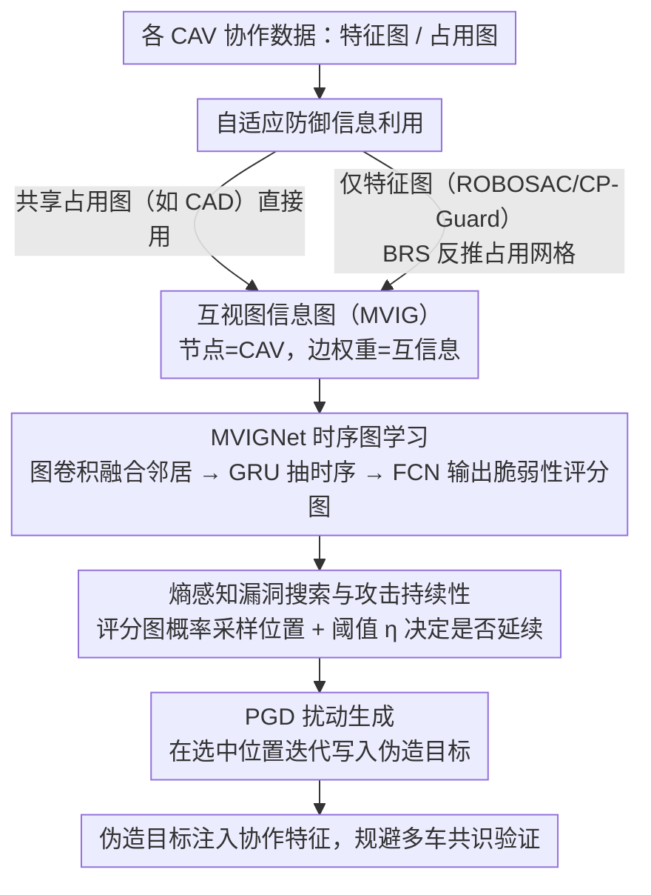

# Learning Mutual View Information Graph for Adaptive Adversarial Collaborative Perception

**会议**: CVPR 2026  
**arXiv**: [2602.19596](https://arxiv.org/abs/2602.19596)  
**代码**: [有](https://github.com/yihangtao/MVIG)  
**领域**: 自动驾驶  
**关键词**: 协作感知安全, 对抗攻击, 图神经网络, 时序建模, 自动驾驶

## 一句话总结

提出 MVIG 攻击框架，通过将不同防御型协作感知系统的脆弱性统一建模为互视图信息图(Mutual View Information Graph)，结合时序图学习与熵感知漏洞搜索，实现自适应的伪造攻击，使防御成功率最高下降 62%。

## 研究背景与动机

### 1. 领域现状
协作感知(Collaborative Perception, CP)允许联网自动驾驶车辆(CAV)之间共享感知数据（如特征图），扩展单车的视野范围并解决遮挡问题。现有防御系统如 ROBOSAC、CP-Guard、MADE、CAD 等通过共识验证来对抗恶意代理的攻击。

### 2. 痛点
现有防御型 CP 系统存在两个关键弱点：
- **缺乏对系统化时空优化攻击的鲁棒性**：现有攻击方法没有系统性地确定何时何地发起伪造攻击，但攻击者完全可以针对多车共识验证机制开发更有针对性的策略
- **防御过程中无意泄露脆弱性知识**：CAV 之间交换的协作数据（特征图、占用图等）天然嵌入了关于周围环境的隐式置信度信息，攻击者可利用这些信息识别集体不确定性区域

### 3. 核心矛盾
CP 系统的安全防御依赖于多车共识验证，但验证过程中交换的数据本身在暴露系统薄弱点，形成"防御即泄密"的悖论。

### 4. 要解决什么
设计一种自适应对抗攻击框架，能够从不同防御型 CP 系统中学习其脆弱性，自动优化攻击位置、时机和持续性，且对不同防御配置具有通用性。

### 5. 切入角度
将不同防御系统泄露的信息统一建模为图结构（MVIG），利用图的频谱特性和时序演化来发现脆弱区域。

### 6. 核心 idea
构建互视图信息图(MVIG)，以 CAV 为节点、互信息为边权重，编码多车感知的一致性与分歧；通过时序图学习预测未来脆弱区域，用熵感知搜索优化攻击策略。

## 方法详解

### 整体框架

这篇论文要解决的是：站在攻击者的角度，怎么在「有共识防御的协作感知系统」里找到最佳的下手时机和位置，把伪造目标塞进去而不被多车验证揪出来。核心观察是——防御系统在验证过程中交换的协作数据（特征图、占用图）本身就泄露了"哪些区域多车看法不一致"，而那些不一致的区域正是攻击的窗口。

整条 pipeline 顺着这个观察展开：先把每一帧里各 CAV 的感知状态压成一张**互视图信息图（MVIG）**，节点是车、边权重是两车感知的互信息（看法越一致权重越高）；再用一个带时序的图网络 **MVIGNet** 读历史几帧 MVIG，提前预测未来帧每个位置的脆弱性评分；拿到评分图后用**熵感知搜索**采样出攻击位置、并决定这次攻击要不要持续到下一帧；最后用 PGD 在选中的位置上生成特征扰动，把伪造目标写进去。攻击位置（掩码）的优化和扰动数值的优化被**刻意解耦**成两阶段，既保证质量又压住计算量、跑到实时。其中构建 MVIG 所需的占用信息按受害系统的不同自适应获取（见下方框架图最上游的输入分支）。

### 关键设计

**1. 互视图信息图（MVIG）：把"多车看法分歧"显式画成一张图**

攻击者最想知道的是"哪里好下手"，而协作感知里好下手的地方恰恰是多车感知互相矛盾、集体不确定的区域——往那里塞伪造目标，看起来就像正常的视角差异。MVIG 把这件事显式建模：每个 CAV 是一个节点，节点特征由三部分拼成——基本占用分布 $\mathbf{h}_i^{\text{basic}}$（每个格子是 free/occupied/unknown 的三态频率）、位姿信息 $\mathbf{h}_i^{\text{pos}}$、以及多尺度空间上下文特征 $\mathbf{h}_i^{\text{spatial}}$。两车之间的边权重则用互信息来量化它们在每个位置上看法的一致程度：

$$\mathbf{W}_{ij} = \mathbb{E}_{(x,y)}\left[\sum_{a,b} p_{ij}(a,b) \log \frac{p_{ij}(a,b)}{p_i(a) p_j(b)}\right]$$

互信息高意味着两车在该区域感知高度一致、共识强、难以攻击；互信息低则说明感知冲突、集体不确定，就是攻击窗口。把脆弱性统一编码成一张加权图带来的好处是通用性——不管底层是哪套防御机制，攻击者面对的都是同一种"图上找低互信息区"的问题，不必为每种防御单独定制策略。

**2. MVIGNet 时序图学习：提前两帧预判脆弱区**

光看当前帧不够，因为攻击有执行延迟、车辆又在动，覆盖盲区时刻在变；等看到漏洞再动手就晚了。MVIGNet 因此读一段历史 MVIG 序列去预测未来帧的脆弱性，分三步走：先用图卷积层按边权重调制邻居间的消息传递，把每个节点的特征与周围车辆的看法融合；再用 GRU 沿时间维度抽取演化模式 $\mathbf{z}^{t+m} = \Phi_{\text{GRU}}(\{\mathbf{f}^\tau\})$，捕捉车辆运动带来的盲区动态；最后用一个 FCN 评分头输出未来帧的脆弱性评分图 $\mathbf{S}_{t+m} \in [0,1]^{H \times W}$。这里的 $m$ 是提前量（论文取 $m=2$ 帧）⚠️ 以原文为准，相当于让攻击者预判两帧之后哪里会出现可乘之机，把执行延迟提前补偿掉。

**3. 熵感知漏洞搜索与攻击持续性：该出手时出手，该收手时收手**

有了脆弱性评分图，下一个问题是在哪个具体位置下手、以及这次攻击要不要延续到后面几帧。论文不是简单挑评分最高点，而是把评分图当成 fabrication risk map 做概率采样，让攻击位置带一点随机性、不至于每次都落在同一处而显得刻意。更关键的是持续性决策：连续多帧在同一区域伪造会留下时序异常、容易被检测，所以用一个持续性阈值 $\eta$ 来判断是否延续——只有当目标邻域的平滑脆弱性评分仍然够高时才继续攻击，否则主动放弃：

$$\mathcal{C}_{t+m+j} = \mathbb{I}\left[\mathbb{E}_{(x,y) \in \mathcal{N}(x_c,y_c)}[\tilde{\mathbf{S}}_{t+m}(x,y)] \geq \eta\right]$$

这种"在低伪造概率区主动收手"的设计反直觉但有效：放弃一些边际攻击机会，换来的是整体时序模式的连贯，让攻击看起来更像正常的感知波动，被检测率大幅下降。

**4. 自适应防御信息利用：有占用图就直接用，没有就估一个**

要构建 MVIG 需要各车的占用信息，但不是所有防御系统都把占用图共享出来。论文据此自适应取输入：像 CAD 这种本身就交换占用图的系统，直接拿来用；而 ROBOSAC、CP-Guard 等只共享特征图的系统，则用盲区分割算法（BRS）从特征图里反推出近似的占用网格。这一步让同一套 MVIG 攻击能跨不同防御配置工作，而不必假设受害系统一定会泄露占用图。

### 一个完整示例

设想一个十字路口，四辆 CAV 协作感知、跑的是共享占用图的 CAD 防御。攻击者先把最近几帧每辆车的占用分布、位姿、空间上下文拼成节点特征，按互信息算出两两边权重，得到一串历史 MVIG。MVIGNet 读这串图，发现路口东侧因为两辆车视角互相遮挡、互信息持续偏低，预测出未来第 2 帧那里会出现一片高脆弱性评分区。熵感知搜索在这片区域里概率采样出一个伪造位置，PGD 在对应特征上迭代出扰动，把一个并不存在的"障碍物"写进协作特征——因为落点正好在多车本就看法分歧的地方，CAD 的共识验证把它当成正常视角差异放行。到了下一帧，攻击者检查该位置邻域的平滑评分：若仍 $\geq \eta$ 就延续伪造、维持这个幽灵目标；一旦车辆移动让该区域重新进入多车共同视野、评分跌破 $\eta$，攻击就主动终止，避免在已被多车看清的位置硬撑而暴露时序破绽。

### 损失函数 / 训练策略

扰动用 PGD 优化。Spoofing（凭空造目标）最大化伪造框的置信度，目标函数 $\phi(\boldsymbol{\delta}, M_t^*) = \sum_{b \in B'} \text{IoU}(b, b_t) \cdot \log(b_\sigma)$；Removal（抹掉真实目标）则取负号，转为最小化真实目标的检测置信度。扰动受 $\|\delta\|_\infty \leq 1.0$ 约束，PGD 迭代 5 次、步长 0.01。

掩码（攻击位置）由 MVIGNet 优化，用三个目标联合训练：攻击有效性损失最大化伪造置信度、同时惩罚离受害者太远的落点；框区分损失最小化伪造框与已有检测结果的重叠，避免和真目标撞在一起；防御规避损失则主动避开多车占用图中的矛盾区域。训练上两阶段解耦——MVIGNet 用 PGD 生成的检测框来算损失，但梯度不回传到 PGD，掩码预测和扰动优化各管各的，这也是框架能跑到实时的原因之一。

## 实验关键数据

### 主实验

**数据集**：OPV2V（训练）、Adv-OPV2V（测试，300场景 × spoofing/removal）

| 攻击方法 | 无防御 ASR | ROBOSAC DSR | CP-Guard DSR | GCP DSR | CAD DSR |
|---------|-----------|-------------|-------------|---------|---------|
| Basic [31] | 100.0 | 100.0 | 100.0 | 100.0 | 100.0 |
| RC spoof [39] | 92.4 | 12.0 | 18.1 | 12.2 | 83.5 |
| BAC [29] | 99.2 | 23.0 | 37.0 | 28.0 | 90.5 |
| **MVIG spoof** | 94.3 | **14.8** | **17.2** | **13.0** | **32.0** (-62%) |

| 攻击方法 | ROBOSAC DSR | CP-Guard DSR | GCP DSR | CAD DSR |
|---------|-------------|-------------|---------|---------|
| RC remove [39] | 14.2 | 21.4 | 15.0 | 90.1 |
| **MVIG remove** | **12.2** (-14%) | 21.3 | **14.2** (-5%) | **78.2** (-13%) |

MVIG 对 CAD 防御效果最为突出：spoof 模式下 DSR 从 83.5% 降至 32.0%（↓62%）。

### 持续性攻击（3-frame）

| 攻击方法 | ROBOSAC DSR | CP-Guard DSR | GCP DSR | CAD DSR |
|---------|-------------|-------------|---------|---------|
| BAC [29] | 74.2 | 68.1 | 86.0 | 98.0 |
| RC spoof [39] | 38.1 | 24.0 | 42.1 | 100.0 |
| **MVIG spoof** | **37.0** | **26.2** | **42.0** | **63.2** (-37%) |

持续攻击下 BAC 和 RC 的 DSR 大幅上升（易被时序检测），而 MVIG 保持显著优势。

### 消融实验

- **影响区域大小**：spoof 攻击从 15m→50m，DSR 从 40.2% 降至 14.8%（更大搜索空间有利）；remove 攻击相对稳定（72.1%-84.5%），受限于必须瞄准已有物体
- **持续阈值 η**：无阈值时 DSR 85.3%/91.7%（spoof/remove）；阈值 0.45-0.50 时最优，平衡攻击机会与被检测风险
- **实时性能**：MVIG 达到 15.6-29.9 FPS，满足实时要求

### 关键发现

1. MVIG 在 CAD 防御上优势最大（-62%），因为 CAD 共享占用图暴露了更多可利用的脆弱性信息
2. 时序一致性是多帧攻击规避检测的关键——BAC 的空间攻击产生不一致时序模式（DSR>98%），而 MVIG 的时序优化保持攻击连贯性（DSR=63.2%）
3. ROC 分析显示 MVIG 从本质上降低了恶意/良性传输的可分离性（AUC 0.77 vs 0.85-0.91）
4. 攻击利用多车自然遮挡和视角差异带来的感知冲突区域，使伪造看起来像正常感知差异

## 亮点与洞察

1. **"防御即泄密"洞察**：首次系统揭示 CP 防御机制在验证过程中无意泄露系统脆弱性的安全悖论，这是一个深刻的安全性观察
2. **统一图表示**：MVIG 用互信息作为边权重，优雅地统一了不同防御系统的脆弱性建模，无需针对特定防御定制
3. **时空解耦攻击**：将掩码预测和扰动优化解耦，既保证攻击质量又满足实时约束（29.9 FPS）
4. **智能攻击终止**：熵感知的持续性控制是巧妙设计——主动放弃低概率窗口，反而大幅提升整体攻击隐蔽性

## 局限与展望

1. **Removal 攻击空间受限**：必须瞄准已有物体，优化空间天然有限，相比 spoof 攻击提升幅度较小
2. **受覆盖率约束**：当良性 CAV 的联合覆盖率很高时，攻击效果会下降（虽然可利用动态覆盖间隙）
3. **仅验证 LiDAR 场景**：未扩展到相机或多模态融合感知，Camera-based CP 是潜在方向
4. **防御对策缺失**：作为攻击论文，未提出有效的防御策略建议（仅附录讨论）
5. **仿真环境**：仅在 CARLA 仿真器数据上验证，真实物理世界场景的可行性未知

## 相关工作与启发

- **Tu et al. [31]** (Basic)：特征图扰动先驱，但修改过于明显，容易被异常检测发现
- **Tao et al. [29]** (BAC)：利用受害者视角盲区进行混淆攻击，但仅考虑单车知识，缺乏对集体验证的规避
- **Zhang et al. [39]** (RC + CAD)：引入 LiDAR 光线投射和占用图验证，但缺少时空系统优化
- **启发**：协作系统的"共享即暴露"问题在联邦学习、多智能体通信等领域普遍存在，MVIG 的图建模思路可迁移

## 评分

⭐⭐⭐⭐ 安全性视角新颖、统一框架设计优雅、实验全面，但 removal 攻击提升有限且缺少真实场景验证。

<!-- RELATED:START -->

## 相关论文

- [\[CVPR 2026\] CoLC: Communication-Efficient Collaborative Perception with LiDAR Completion](colc_communication-efficient_collaborative_perception_with_lidar_completion.md)
- [\[CVPR 2026\] CATNet: Collaborative Alignment and Transformation Network for Cooperative Perception](catnet_collaborative_alignment_and_transformation_network_for_cooperative_percep.md)
- [\[CVPR 2026\] Hybrid Robust Collaborative Perception with LiDAR-4D Radar Fusion under Adverse Weather Conditions](hybrid_robust_collaborative_perception_with_lidar-4d_radar_fusion_under_adverse_.md)
- [\[CVPR 2026\] AdaRadar: Rate Adaptive Spectral Compression for Radar-based Perception](adaradar_rate_adaptive_spectral_compression_for_radar-based_perception.md)
- [\[ICLR 2026\] SiMO: Single-Modality-Operable Multimodal Collaborative Perception](../../ICLR2026/autonomous_driving/simo_single-modality-operable_multimodal_collaborative_perceptio.md)

<!-- RELATED:END -->
