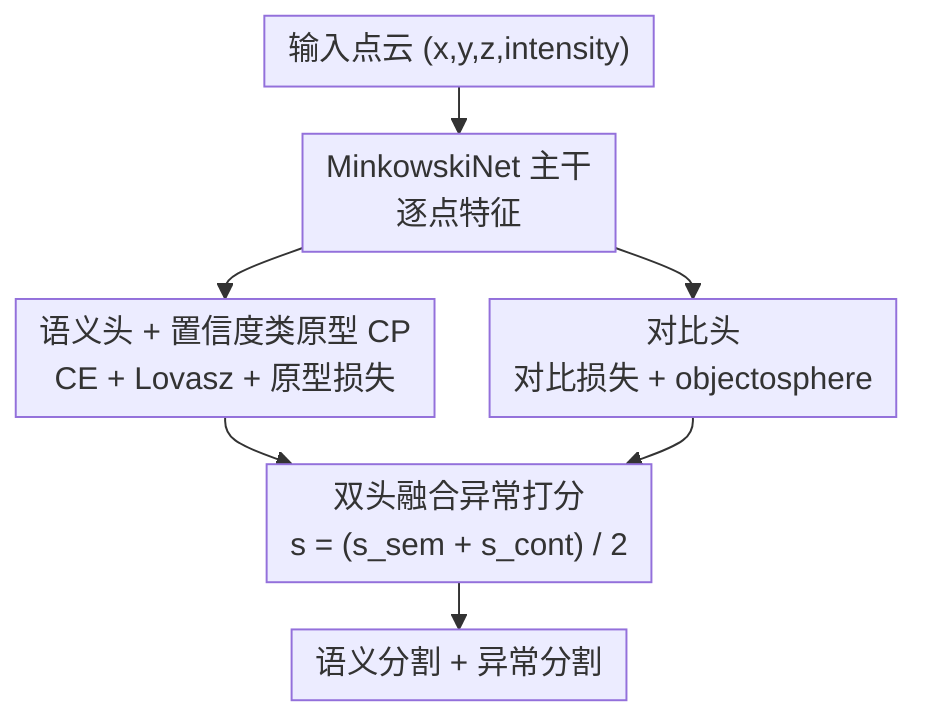

# Learning to Identify Out-of-Distribution Objects for 3D LiDAR Anomaly Segmentation

**会议**: CVPR 2026  
**论文**: [CVF Open Access](https://openaccess.thecvf.com/content/CVPR2026/html/Mosco_Learning_to_Identify_Out-of-Distribution_Objects_for_3D_LiDAR_Anomaly_Segmentation_CVPR_2026_paper.html)  
**代码**: https://simom0.github.io/lido-page/  
**领域**: 自动驾驶 / 3D视觉 / 自监督表示学习  
**关键词**: LiDAR 异常分割, 分布外检测, 特征空间建模, 类原型, 混合真实-合成数据集

## 一句话总结
LIDO 直接在特征空间里建模 inlier 类别的分布——用一个语义头维护「置信度类原型」、一个对比头把 inlier 特征推离超球心，推理时融合余弦距离、熵和特征范数三种信号给每个点打异常分，无需任何异常样本即可在 3D LiDAR 异常分割上取得 SOTA；同时作者还造了一套混合真实-合成的 OoD 数据集补齐该领域的评测短板。

## 研究背景与动机

**领域现状**：LiDAR 语义分割是自动驾驶感知的核心，但绝大多数方法都建立在闭集假设上——训练时见过的固定类别集合内做逐点分类。真实路面上随时可能冒出训练没见过的物体（异常 / 分布外 OoD），闭集模型对它们束手无策。异常分割（anomaly segmentation）就是要在做语义分割的同时，给每个点打一个「属于异常的概率」。

**现有痛点**：异常分割的研究几乎都集中在 2D 图像域，3D LiDAR 这块很薄。少数 3D 方法要么是把 2D 的后处理技巧（softmax 阈值、Max Logit）直接搬过来，要么依赖模型集成（Deep Ensemble）——后者计算昂贵、推理慢；还有的开集方法把训练数据里的未标注 / void 区域当异常来学，等于偷看了异常先验。数据层面也很窘：唯一公开的真实 LiDAR 异常数据集 STU 是 128 线高分辨率，和常规训练数据存在巨大域间隙，且只给二值异常掩码；其余数据集要么专有不公开，要么异常物体在训练里也出现过。

**核心矛盾**：异常本质是「不像任何已知类」，但闭集 softmax 总会把异常点强行归到某个已知类并给出高置信，导致漏检；想绕开就得引入异常样本或集成，又带来「偷看先验」或「算力爆炸」的代价。

**本文目标**：（1）设计一个不依赖异常样本、也不依赖未标注区域、且轻量的 3D 异常分割方法；（2）造一套异常频繁、环境多样、带语义标签、覆盖多种 LiDAR 分辨率的公开评测集，补齐 3D 评测短板。

**切入角度**：与其在输出层 softmax 上做文章，不如直接在**特征空间**建模 inlier 类别的分布——让同类特征向「类原型」靠拢、把 inlier 特征整体推离超球心，那么任何落在分布之外的点自然就是异常。

**核心 idea**：用「置信度类原型 + 对比/objectosphere 约束」联合塑造一个判别性强的特征空间，再融合多种几何/熵信号打异常分，全程不碰任何异常样本。

## 方法详解

### 整体框架
LIDO（Learning to Identify Out-of-Distribution）以 MinkowskiNet 稀疏卷积为主干提取逐点特征，接两个并行分支：**语义头**负责输出逐点类别，同时在特征空间累积「置信度类原型」（confidence-based prototypes, CP）；**对比头**专门塑造特征分布，用对比损失和 objectosphere 损失让 inlier 类特征既互相分离、又远离超球心。训练和推理都走主干 + 双头，推理时再把两个头各自产出的异常信号融合成最终逐点异常分。整套方法不需要异常样本，仅靠 inlier 类别本身的分布约束来「反衬」出异常。

### 关键设计

**1. 语义头 + 置信度类原型：在做语义分割的同时塑造可判别的类中心**

语义头一边出语义预测、一边为每个 inlier 类构建一个鲁棒原型。它用加权交叉熵 $\mathcal{L}_{ce}=-\frac{1}{N}\sum_n w_c\,y_n\log(\sigma(f_n))$ 训练分类，并对每个类的真正例（预测=真值的点）按置信度加权聚合特征得到置信度原型：$\mathrm{CP}_c=\big(\sum_{p\in\hat{X}_c}\kappa_p f_p\big)/\big(\sum_{p\in\hat{X}_c}\kappa_p\big)$，其中置信度 $\kappa_p=\max(f_p)$ 取 pre-softmax 特征的最大分量。为什么用置信度加权？因为高置信点更可能是该类的「典型样本」，加权后原型更干净、不被边界模糊点带偏。每个 epoch 开始用上一轮原型 $\mathrm{CP}^{e-1}_c$ 做一个原型余弦嵌入损失 $\mathcal{L}_{prot}=\frac{1}{N}\sum_c\sum_{p\in X_c}(1-\langle\mathrm{CP}^{e-1}_c,f_p\rangle)$，把同类特征往原型拉近（首轮无原型故不激活）。语义头总损失为 $\mathcal{L}_{shead}=\lambda_1\mathcal{L}_{ce}+\lambda_2\mathcal{L}_{lovasz}+\lambda_3\mathcal{L}_{prot}$。

**2. 对比头：把 inlier 特征互相分离并整体推离超球心**

光有原型还不够判别，对比头进一步雕刻特征空间。它先算每类对比特征均值 $\bar{f}_c=\frac{1}{|X_c|}\sum_{p\in X_c}f'_p$，再用对比损失把 $\bar{f}_c$ 对齐到归一化的置信度原型、同时推离其它类：$\mathcal{L}_{cont}=-\sum_c\log\frac{\exp(\langle\bar{f}_c,\mathrm{CP}^{e-1}_c\rangle/\tau)}{\sum_i\exp(\langle\bar{f}_c,\mathrm{CP}^{e-1}_c\rangle/\tau)}$（$\tau$ 为温度）。关键的 objectosphere 损失 $\mathcal{L}_{obj}$ 对 inlier 点要求 $\max(r-\|f'_p\|^2,0)$、对其余点要求 $\|f'_p\|^2$，即把已知类特征的范数顶到阈值 $r$ 以上、远离 $C$ 维超球心。与所借鉴的 [55] 不同，LIDO **不**用未标注 / void 区域来学异常特征——它只约束 inlier 类远离球心，从而推理时「范数小=离球心近=不像任何已知类=异常」。对比头总损失 $\mathcal{L}_{chead}=\lambda_4\mathcal{L}_{cont}+\lambda_5\mathcal{L}_{obj}$。

**3. 双头融合异常打分：把余弦距离、熵和特征范数三路信号合一**

推理时三种信号互补。语义头给两路：余弦距离分 $s^{cos}_n=1-\max_c(\mathrm{sim}_{n,c})$（$\mathrm{sim}_{n,c}=\langle f_n,\mathrm{CP}_c\rangle$，离所有原型都远则分高）、归一化香农熵分 $s^{ent}_n=-\frac{1}{\log C}\sum_c p_{n,c}\log p_{n,c}$（softmax 越不确定则分高），两者相乘并归一化得 $s^{sem}_n=s^{cos}_n\cdot s^{ent}_n$。对比头基于 objectosphere 给 $s^{cont}_n=\max(0,1-\|f'_n\|^2/r)$（范数为 0 时分=1，超过阈值 $r$ 则分=0）。最终融合为 $s_n=\frac{1}{2}(s^{sem}_n+s^{cont}_n)$。三路信号分别捕捉「离已知类原型多远」「分类有多犹豫」「特征范数有多小」，互为补充地刻画「不像任何已知类」。

**4. 混合真实-合成 OoD 数据集与物理插入协议：补齐 3D 异常评测短板**

针对真实数据稀缺，作者基于 SemanticKITTI/SemanticPOSS/nuScenes 三个不同分辨率基准构建混合真实-合成 OoD 数据集（64/40/32 线），异常物体取自 ModelNet 并过滤掉与真实类别重叠的模型。插入协议讲究物理真实：把合成物体 $O$ 注入真实扫描 $P$ 得 $S=[P,O]$（single 划分只放在路面、multi 划分还可放人行道/停车场），投影到 range image 再反投影回 3D，以恢复被遮挡点并把物体点采样成 LiDAR 波束格式；强度按朗伯反射模型 $i=\rho\cdot\max(0,-\langle n,r\rangle)/d^2$ 计算（$\rho$ 反射率、$n$ 法向、$r$ 波束方向、$d$ 距离），比 CARLA 仅按距离算强度更贴近真实。每个数据集分 single（约 40% 含异常）/ multi（约 60% 含异常）两版，难度递增。

### 损失函数 / 训练策略
总损失为语义头与对比头之和。超参 $r=5.0$、$\tau=0.1$、$\lambda_1=1.0,\lambda_2=1.5,\lambda_3=0.1,\lambda_4=0.5,\lambda_5=0.5$。单卡 NVIDIA A40 从头训 64 epoch、batch=4，SGD + 余弦退火 + 线性 warm-up（5 epoch 内升到 $2.4\times10^{-1}$ 再降到 $1\times10^{-2}$，权重衰减 $1\times10^{-4}$），仅用旋转/翻转/缩放增强，不用集成也不用测试时增强。

## 实验关键数据

评测指标：**AUROC**（ROC 曲线下面积，越高越好）、**FPR@95**（真正例率 95% 时的假正例率，越低越好）、**AP**（平均精度，越高越好）；语义分割用 **mIoU**。

### 主实验

真实数据集 STU 上对比（验证 / 测试集）：

| 方法 | AUROC↑(val) | FPR@95↓(val) | AP↑(val) | AUROC↑(test) | AP↑(test) |
|------|------|------|------|------|------|
| Mask4Former3D + Max Logit | 87.27 | 68.76 | 2.02 | 84.53 | 0.95 |
| Mask4Former3D + Void Classifier | 89.77 | 79.50 | 2.62 | 85.99 | 3.92 |
| Mask4Former3D + Deep Ensemble | 90.93 | 37.34 | 6.94 | 86.74 | 5.17 |
| **LIDO (ours)** | **95.05** | **34.86** | **27.53** | **93.67** | **14.99** |

在 STU 上 LIDO 全指标碾压，AP 比最强的 Deep Ensemble 高 +9.82%（val），且 FPR 更低、AUROC 更高——在巨大域间隙下，特征空间建模依旧稳。

合成 OoD 数据集上（competitive，节选 single 划分）：

| 数据集 | 方法 | AUROC↑ | FPR@95↓ | AP↑ |
|------|------|------|------|------|
| SemanticPOSS-OoD | Deep Ensemble | 85.86 | 58.12 | 0.82 |
| SemanticPOSS-OoD | **LIDO** | **91.51** | **45.10** | **3.97** |
| SemanticKITTI-OoD | Deep Ensemble | 92.87 | **27.69** | 6.20 |
| SemanticKITTI-OoD | **LIDO** | **93.36** | 31.19 | **10.60** |
| nuScenes-OoD | Deep Ensemble | **91.79** | **34.59** | **18.34** |
| nuScenes-OoD | **LIDO** | 89.33 | 39.70 | 6.79 |

### 复杂度与效率（nuScenes-OoD，A40）

| 方法 | 参数(M) | 运行时(ms) | 显存(GB) |
|------|------|------|------|
| Mask4Former3D | 39.6 | 168 | 1.8 |
| Deep Ensemble (Sequential) | 118.8 | 861 | 1.9 |
| Deep Ensemble (Parallel) | 118.8 | 287 | 5.7 |
| **LIDO (ours)** | **21.7** | **38** | **0.6** |

### 关键发现
- **真实数据上全面 SOTA、合成数据上有强有弱**：STU 上 AP 几乎是 Deep Ensemble 的 4 倍（27.53 vs 6.94）；但在 nuScenes-OoD 这种低分辨率集成法反而占优，作者归因于高 FPR 反映的模型不确定性——稀疏远点和相似表面易被误判，导致 AP 受限。
- **轻量是硬优势**：LIDO 仅 21.7 M 参数、38 ms、0.6 GB 显存，相比 Deep Ensemble（118.8 M、287~861 ms、最高 5.7 GB）快一个量级且省资源，落地友好。
- **AP 普遍偏低是任务难点**：作者坦言 LiDAR 数据天然类别不均衡 + 语义分割模型本身的不确定性，使各方法 AP 都被压低；multi 划分因异常点更多反而 AP 偏高。
- **语义性能基本保住**：加了异常分割的额外损失后，标准语义分割 mIoU 仅小幅下降（如 KITTI-OoD single 64.99→61.34），代价可接受。

## 亮点与洞察
- **「不看异常」的纯 inlier 建模**：全程不碰异常样本、也不把 void/未标注区当异常，纯靠塑造 inlier 分布反衬异常，避免了「偷看先验」且天然支持开放世界。
- **置信度加权原型**很实用：用 pre-softmax 最大分量当置信度去加权聚合原型，简单一招就让类中心更干净，可迁移到任何需要类原型的少样本/开集任务。
- **三路异常分互补**：余弦距离（离原型远）+ 熵（分类犹豫）+ 范数（离超球心近）从三个正交角度刻画「陌生」，比单一阈值鲁棒得多。
- **物理插入协议**有独立价值：用朗伯反射模型算强度、反投影对齐波束格式，比 CARLA 按距离近似更真实，为 3D 异常评测提供了可复用的数据合成范式。

## 局限与展望
- **低分辨率/稀疏场景受限**：nuScenes-OoD、SemanticPOSS-OoD 上性能被界住，稀疏远点和相似表面易误判成异常，特征可用信息也随分辨率下降而变少。
- **AP 整体偏低**：受类别不均衡与语义模型不确定性拖累，绝对 AP 仍不高，距离实用阈值有差距。
- **依赖语义分割质量**：异常分强耦合在 inlier 类原型与 softmax 之上，主干语义若退化，异常打分也会跟着失真。
- **合成异常的域真实性**：插入物体虽做了波束对齐与强度建模，但 ModelNet 合成物体与真实路面异常的分布差异⚠️ 以原文与补充材料为准。

## 相关工作与启发
- **vs Deep Ensemble / Mask4Former3D 后处理基线**：集成法靠多模型分歧测异常，效果尚可但算力爆炸、推理慢；2D 后处理（Max Logit / RbA / Void Classifier）直接搬到 3D 则 FPR 高、AP 低。LIDO 单模型、轻量，靠特征空间建模在真实集上全面反超。
- **vs 借鉴来源 [55]（2D 特征建模）**：LIDO 把「建模 inlier 特征分布」的思路引入 3D LiDAR，但关键差异是**去掉了对未标注/void 区域的依赖**，只约束 inlier 远离超球心，更干净也更贴近真实开集设定。
- **vs STU / CODA 等数据集**：STU 仅二值掩码 + 高分辨率域隙、CODA 异常物体可能在训练里出现；LIDO 的混合真实-合成集提供多分辨率、带语义标签、异常频繁的评测，补齐了 3D 异常分割的 benchmark 空白。

## 评分
- 新颖性: ⭐⭐⭐⭐ 特征空间建模思路源自 2D 工作，但「去 void 依赖 + 置信度原型 + 三路融合 + 物理插入数据集」的组合在 3D LiDAR 上是扎实的新贡献。
- 实验充分度: ⭐⭐⭐⭐⭐ 真实 STU + 三套自建多分辨率数据集、多基线对比 + 复杂度/语义分割分析，且诚实报告了合成集上的劣势。
- 写作质量: ⭐⭐⭐⭐ 公式与流程交代清晰，三路打分机制讲得明白；部分超参与失败模式可再展开。
- 价值: ⭐⭐⭐⭐ 轻量高效 + 公开数据集，对自动驾驶 3D 异常检测的研究与落地都有实际推动。

<!-- RELATED:START -->

## 相关论文

- [\[CVPR 2026\] Neural Distribution Prior for LiDAR Out-of-Distribution Detection](neural_distribution_prior_for_lidar_ood_detection.md)
- [\[CVPR 2026\] ProOOD: Prototype-Guided Out-of-Distribution 3D Occupancy Prediction](proood_prototype-guided_out-of-distribution_3d_occupancy_prediction.md)
- [\[CVPR 2026\] ClimaOoD: Improving Anomaly Segmentation via Physically Realistic Synthetic Data](climaood_improving_anomaly_segmentation_via_physically_realistic_synthetic_data.md)
- [\[NeurIPS 2025\] Extremely Simple Multimodal Outlier Synthesis for Out-of-Distribution Detection and Segmentation](../../NeurIPS2025/autonomous_driving/extremely_simple_multimodal_outlier_synthesis_for_out-of-distribution_detection_.md)
- [\[CVPR 2026\] TerraSeg: Self-Supervised Ground Segmentation for Any LiDAR](terraseg_self-supervised_ground_segmentation_for_any_lidar.md)

<!-- RELATED:END -->
