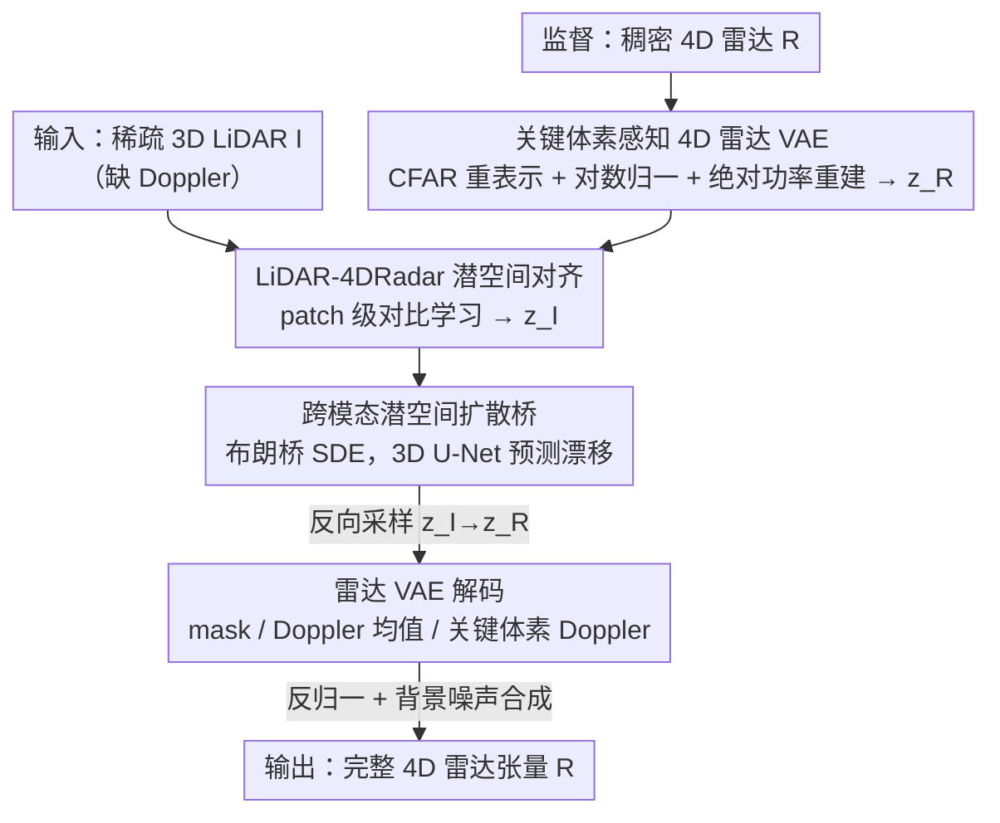

# LiDAR-to-4DRadar Diffusion Bridge via Cross-Modal Alignment and Translation in Latent Space

**会议**: CVPR 2026  
**论文**: [CVF Open Access](https://openaccess.thecvf.com/content/CVPR2026/html/Shen_LiDAR-to-4DRadar_Diffusion_Bridge_via_Cross-Modal_Alignment_and_Translation_in_Latent_CVPR_2026_paper.html)  
**代码**: 无（论文未公开）  
**领域**: 自动驾驶 / 扩散模型 / 跨模态生成  
**关键词**: 4D 毫米波雷达, LiDAR-to-Radar, 扩散桥, 潜空间对齐, 数据增强  

## 一句话总结
L2RLDB 首次把稀疏 3D LiDAR 翻译成带 Doppler 维度的完整 4D 雷达张量——先用「关键体素感知 VAE」把高维含噪雷达压进低维潜空间，再用 patch 级对比学习把 LiDAR 潜码对齐到雷达潜空间，最后用布朗扩散桥在对齐潜空间里完成跨模态翻译，生成的合成雷达能显著提升下游 3D 检测精度。

## 研究背景与动机
**领域现状**：毫米波雷达因其全天候、全天时的鲁棒性，在自动驾驶感知里越来越关键；其原生 4D 张量（Doppler 速度、距离 Range、方位 Azimuth、俯仰 Elevation 四轴）同时编码了空间结构与运动信息。但采集和标注大规模 4D 雷达数据成本极高，于是「用生成模型造雷达数据来增强数据集」成了热门方向。

**现有痛点**：受限于 4D 雷达分布的复杂性，早期工作只生成简化的 2D 表示（Range-Doppler 或 Range-Azimuth 图），或者退一步用 LiDAR 引导生成稀疏雷达点云 / 3D 笛卡尔空间张量（如 L2RDaS 生成 3D 空间 cube）。这些方法都会丢掉信息——尤其是丢掉 Doppler 速度这一雷达独有、对检测至关重要的维度，导致下游性能受限。

**核心矛盾**：要生成「完整 4D 原生极坐标雷达张量」面临三重困难：① 4D 稠密张量变量呈指数级增长，且信号功率动态范围极大（跨好几个数量级），还混入大量电磁散射/衍射背景噪声，分布极难建模；② LiDAR 是稀疏 3D 点云、雷达是稠密 4D 体素张量，维度和稀疏度差异巨大，语义/空间难以对齐；③ 两种模态关注场景的不同侧面（LiDAR 没有 Doppler），特征分布存在天然信息鸿沟。

**本文目标**：定义并解决全新任务 **LiDAR-to-4DRadar Translation**——给定稀疏 3D LiDAR 张量 $I\in\mathbb{R}^{R\times A\times E}$，生成对应的稠密 4D 雷达张量 $R\in\mathbb{R}^{D\times R\times A\times E}$，且保持原生极坐标、不做坐标变换以避免畸变。

**切入角度**：与其在原始高维空间硬翻译，不如把两种模态都压进**对齐的潜空间**，再把翻译建模成一个直接连接两个分布的**扩散桥（diffusion bridge）**过程，让源域 LiDAR 同时引导前向与反向，绕开普通条件扩散「域鸿沟」的难题。

**核心 idea**：用「关键体素感知 VAE 压缩 + patch 级对比对齐 + 布朗扩散桥翻译」三段式，在对齐潜空间里把缺 Doppler 的 LiDAR 桥接成完整 4D 雷达。

## 方法详解

### 整体框架
L2RLDB 是一个三阶段串行 pipeline：**压缩 → 对齐 → 翻译**。① 压缩阶段先训一个关键体素感知 4D 雷达 VAE，把含噪高维雷达张量编码进紧凑潜空间 $z_R$，同时学会区分关键物体体素与背景噪声；② 对齐阶段固定雷达 VAE，训一个结构相同的 LiDAR VAE，用 patch 级对比学习把 LiDAR 潜码 $z_I$ 在语义与空间上对齐到雷达潜空间；③ 翻译阶段在对齐潜空间里训一个布朗扩散桥（用 3D U-Net 预测漂移），把 $z_I$ 桥接成 $z_R$，再用雷达 VAE 解码器还原成完整 4D 雷达张量，最后通过反归一化 + 背景噪声合成补回整张张量。三个模块分别训练，推理时按 Alg. 1 串起来。

### 关键设计

**1. 关键体素感知 4D 雷达 VAE：把含噪高维张量压成可精确数值重建的潜码**

直接对 $\mathbb{R}^{D\times R\times A\times E}$ 的稠密雷达建模会被两件事拖垮：信号功率动态范围跨好几个数量级，且充满电磁散射/衍射造成的背景杂波。本文先做**雷达重表示**——参照雷达文献把杂波建模为高斯白噪声，用恒虚警率检测器（CFAR，自适应阈值、维持固定虚警率）在 Range-Azimuth-Elevation 网格上识别关键物体体素，得到二值掩码 $M_{key}\in\{0,1\}^{R\times A\times E}$（关键体素约占 1.5%）。关键体素保留原始 $D$ 维 Doppler 功率向量，背景体素只用沿 Doppler 轴的均值 $\bar{R}_{p'}=\frac{1}{D}\sum_d R_{d,r',a',e'}$ 概括，被省略的逐 bin 涨落用「高斯白噪声 + softmax」分布建模、保持总功率不变。于是雷达被表示成三元组 $\{\bar{R}, M_{key}, R_{key}\}$。

VAE 输入端对 $\bar{R}$ 和 $R_{key}$ 做**对数 + z-score 归一化**以压住动态范围，沿 Doppler 轴拼接后送进 3D ResNet 编码器（插自注意力捕获长程依赖），编码成 $z_R\in\mathbb{R}^{C\times R/l\times A/l\times E/l}$。解码器开三个头分别重建二值掩码 $\hat{M}_{key}$、Doppler 均值 $\hat{\bar{R}}'$、关键体素 Doppler $\hat{R}'_{key}$，训练目标见公式 3：掩码用 BCE、连续量用 L2，关键的是**额外对反归一化后的绝对功率 $(\hat{R},\hat{R}_{key})$ 加 L1 损失**，让模型不仅拟合归一化空间还能还原真实信号功率值——消融显示去掉 L1 后关键体素 IoU 从 0.2885 掉到 0.2843，下游增强检测 AP3D@0.5 从 56.00 掉到 54.84。

**2. LiDAR-4DRadar 潜空间对齐：patch 级对比学习把缺 Doppler 的 LiDAR 拉进雷达潜空间**

雷达 VAE 预训练好后固定。本文再训一个**结构完全相同、仅输入通道为 1** 的 LiDAR VAE，让其潜码 $z_I\in\mathbb{R}^{C\times R/l\times A/l\times E/l}$ 与雷达潜码形状/维度一致、且每个潜码 $c_{I_i}=z_I(r,a,e)$ 与对应雷达潜码 $c_{R_i}$ 共享同一感受野。但仅有 VAE 重建损失只能保证 LiDAR 自重建，无法保证两个潜空间语义对齐。于是引入 **patch 级对比学习**：在配对样本 $(I_i,R_i)$ 上，**同一空间位置** $(r,a,e)$ 的 LiDAR 潜码 $c_{I_{i,j}}$ 与雷达潜码 $c_{R_{i,j}}$ 构成正对，不同位置/不同样本为负对，用 InfoNCE 形式的对比损失（公式 4）：

$$\mathcal{L}_{cont}=\sum_{i,j}\log\frac{\exp(\mathrm{sim}(c_{I_{i,j}},c_{R_{i,j}})/\tau)}{\sum_{k,l}\exp(\mathrm{sim}(c_{I_{i,j}},c_{R_{k,l}})/\tau)}$$

LiDAR 编码器总损失为 $\mathcal{L}_I=\mathcal{L}^{vae}_I-\lambda_{cl}\mathcal{L}_{cont}$。这一步是后续扩散桥的前提——只有两个潜空间在语义和空间上对齐，桥才能在「同一坐标系」里平稳地从 LiDAR 端漂到雷达端。消融去掉 $\mathcal{L}_{cont}$ 后合成检测 AP3D@0.5 从 30.71 掉到 28.27，验证对齐不可或缺。

**3. 跨模态潜空间扩散桥：布朗桥 SDE 直接连接两个分布而非条件生成**

普通条件扩散从纯噪声出发、把 LiDAR 当条件，仍要跨越巨大域鸿沟。本文改用**布朗扩散桥**：把翻译建模成一个双边界随机过程，$t=1$ 端是 LiDAR 潜码 $z_I$、$t=0$ 端是雷达潜码 $z_R$。给定配对 $(z_I,z_R)$，构造随机插值 $z_t=(1-t)z_R+tz_I+\sigma_t\epsilon$（公式 5），其中方差 $\sigma_t=\sigma\sqrt{t(1-t)}$ 在两端归零、中间最大，保证平滑过渡；其时间演化是一个漂移为 $v(z_t,t)=(z_R-z_t)/t$ 的 SDE（公式 6）。训练时用 3D U-Net（编码-解码 + skip connection + 自注意力 + AdaLN 融合正弦时间嵌入）回归漂移，目标是最小化 $\mathbb{E}[\|(z_R-z_t)/t-v_\theta(z_t,t)\|_2^2]$（公式 7）。

推理时仿照 DDIM 用非马尔可夫加速采样（公式 8-9），从 $z_I$ 出发反向迭代生成 $\hat{z}_R$，$\delta=0$ 时退化为确定性采样器。相比 Latent Diffusion 这类条件扩散，扩散桥让源域同时引导前向与反向、渐进式地协调潜轨迹——实验里 Latent Diffusion 合成检测 AP3D@0.5 仅 1.79，而 L2RLDB 达 30.71，差距极其悬殊，说明「桥匹配」比「条件生成」更适合这种大域鸿沟翻译。

### 损失函数 / 训练策略
三模块分阶段训练：① 雷达 VAE 损失 $\mathcal{L}^{vae}_R=\mathbb{E}[D_R]+\beta\mathrm{KL}$，其中重建项 $D_R$ 含 BCE（掩码）+ L2（归一化重建）+ L1（绝对功率，公式 3）；② LiDAR VAE 损失 $\mathcal{L}_I=\mathcal{L}^{vae}_I-\lambda_{cl}\mathcal{L}_{cont}$；③ 扩散桥漂移回归 $\mathcal{L}_{db}$（公式 7）。关键超参 $\delta=2.0$、$\lambda_{bce}=0.5$、$\lambda_{cl}=0.3$、$\sigma=1.0$，扩散 1000 步线性噪声调度，潜空间下采样因子 4，2×A800、batch 32、Adam、lr 1e-4 + warm-up。

## 实验关键数据

数据集为 **K-Radar**（35K 对 4D 雷达-LiDAR，多种天气），雷达原生极坐标网格 $(63,192,96,32)$ 对应 Doppler/Range/Azimuth/Elevation；CFAR 虚警率 0.1，关键体素约占 1.5%。下游检测用 K-Radar 官方 baseline RTNH，按 4:2:1 切训练/扩展/测试集。

### 主实验（4D 雷达合成质量）

由于是首个完整 4D（RAE+Doppler）合成任务，无直接可比方法，作者构造了若干 baseline。指标在 XYZ（笛卡尔）与 RAE（极坐标）两空间各算 MAE/PSNR/SSIM，关键体素另算 MAE/PSNR/IoU。

| 模型 | Doppler | XYZ-PSNR↑ | XYZ-SSIM↑ | RAE-PSNR↑ | 关键体素 IoU↑ |
|------|---------|-----------|-----------|-----------|---------------|
| L2RDaS（3D，无 Doppler） | ✗ | 31.01 | 0.897 | - | - |
| Pix2PixHD RAE（3D） | ✗ | 30.13 | 0.8875 | 25.95 | - |
| Latent Pix2PixHD（4D） | ✓ | 31.36 | 0.8980 | 28.23 | 0.1960 |
| Latent Diffusion（4D） | ✓ | 29.51 | 0.8786 | 27.07 | 0.1350 |
| **L2RLDB（本文）** | ✓ | **33.01** | **0.9092** | **29.21** | **0.2885** |

L2RLDB 在三套空间指标上全面领先。两点观察：① 潜空间模型（Latent Pix2PixHD）优于非潜空间对抗模型，说明跨模态潜对齐有益；② 桥匹配显著超过条件扩散（Latent Diffusion），靠的是渐进式潜轨迹协调。

### 消融实验

| 配置 | XYZ-PSNR↑ | 关键体素 IoU↑ | 合成检测 AP3D@0.5↑ | 增强检测 AP3D@0.5↑ |
|------|-----------|---------------|--------------------|--------------------|
| 完整 L2RLDB | 33.01 | 0.2885 | 30.71 | 56.00 |
| w/o L1（去绝对功率重建） | 32.72 | 0.2843 | 29.90 | 54.84 |
| w/o $\mathcal{L}_{cont}$（去跨模态对齐） | 32.85 | 0.2626 | 28.27 | 52.49 |

下游 3D 检测（K-Radar，AP@0.3/0.5、BEV/3D）在两种设置下对比：

| 设置 | 方法 | APbev@0.3 | AP3D@0.5 |
|------|------|-----------|----------|
| 仅合成数据 | 真实数据上限 | 62.50 | 36.14 |
| 仅合成数据 | Latent Diffusion | 7.314 | 1.790 |
| 仅合成数据 | **L2RLDB** | **57.37** | **30.71** |
| 真实+合成增强 | 真实数据基线 | 71.98 | 49.25 |
| 真实+合成增强 | **L2RLDB** | **77.14** | **56.00** |

### 关键发现
- **仅用合成数据**训练检测器即可达到真实数据 ~80%–92% 的性能（如 APbev@0.3 达真实的 91.9%），证明 4D 合成保真度足够高；而 Latent Diffusion 等条件方法几乎不可用（AP3D@0.5 仅 1.79）。
- **数据增强**下 L2RLDB 把检测全面推高于真实-only 训练（增强后相对真实达 106%–116%），其它方法只带来边际收益。
- 跨天气分析（Fig. 3）显示多数条件下增益稳定，但**雾天增益有限、雨夹雪下 AP3D 略降**——因为这些极端天气 LiDAR 本身严重退化、输入质量受损。
- RAE 空间指标普遍高于 XYZ 空间，作者归因于**极坐标→笛卡尔的插值与重体素化伪影**带来的平滑与信息损失。

## 亮点与洞察
- **CFAR + 三元组重表示是点睛之笔**：把「区分关键体素 vs 背景噪声」从 VAE 的隐式负担变成显式监督（掩码头 + 关键体素 Doppler 头），让模型在 1.5% 稀疏关键体素上集中火力，这套思路可迁移到任何「稀疏前景 + 稠密背景噪声」的张量生成任务。
- **绝对功率 L1 损失补回数值真实性**：纯归一化空间的重建会丢掉跨数量级的真实功率，额外在反归一化输出上加 L1 是个简单但有效的 trick。
- **扩散桥替代条件扩散**：在大域鸿沟跨模态翻译里，「直接学两个分布之间的桥」远胜「从噪声出发条件生成」——AP3D 1.79 → 30.71 的悬殊差距是很有说服力的对照。

## 局限与展望
- **极端天气仍是软肋**：雾/雨夹雪下 LiDAR 输入退化导致增益消失甚至倒退，方法本质上受限于引导模态的质量，缺乏对 LiDAR 退化的鲁棒性补偿。
- **坐标转换伪影**：XYZ 空间指标明显低于 RAE 空间，极坐标到笛卡尔的插值损失尚未解决，下游若需笛卡尔表示会折损。
- **依赖配对数据**：patch 级对齐与扩散桥训练都需 LiDAR-雷达严格配对样本，迁移到无配对/弱配对场景需重新设计对齐策略。⚠️ 论文未公开代码，部分实现细节（如背景噪声合成的具体方差设定）以原文为准。
- **可改进方向**：引入天气感知的条件分支或多模态融合（如加 RGB）来补偿 LiDAR 退化；探索无配对对齐放宽数据要求。

## 相关工作与启发
- **vs L2RDaS / L2RGAN（LiDAR→低维雷达）**：它们用 cGAN 生成 2D/3D 笛卡尔雷达、且无 Doppler；本文首次生成原生极坐标完整 4D（RAE+Doppler）张量，保留运动信息，且用扩散桥替代对抗训练，稳定性与保真度更高。
- **vs Latent Diffusion（条件扩散）**：同在对齐潜空间操作、且共享同样的预训练 VAE，但 Latent Diffusion 把 LiDAR 当 cross-attention 条件从噪声生成，跨域鸿沟难弥合（合成检测近乎失效）；本文用布朗桥让源域同时引导前向反向，渐进协调潜轨迹。
- **vs 传统物理雷达仿真**：物理仿真计算昂贵且缺真实复杂度；本文用数据驱动的深度生成，效率与真实性兼顾。

## 评分
- 新颖性: ⭐⭐⭐⭐⭐ 首次定义并解决完整 4D（含 Doppler）雷达生成任务，三段式潜空间扩散桥设计自洽。
- 实验充分度: ⭐⭐⭐⭐ K-Radar 上合成质量 + 双设置下游检测 + 跨天气分析齐全，但仅单数据集、无代码。
- 写作质量: ⭐⭐⭐⭐ 三阶段动机清晰、公式完整，个别符号（$z_L$ vs $z_I$）小笔误。
- 价值: ⭐⭐⭐⭐ 直击雷达数据稀缺痛点，合成数据可独立训练且增强真实数据，对自动驾驶雷达感知有实用价值。

<!-- RELATED:START -->

## 相关论文

- [\[CVPR 2026\] Look Before You Fuse: 2D-Guided Cross-Modal Alignment for Robust 3D Detection](look_before_you_fuse_2d-guided_cross-modal_alignment_for_robust_3d_detection.md)
- [\[CVPR 2026\] x2-Fusion: Cross-Modality and Cross-Dimension Flow Estimation in Event Edge Space](x2-fusion_cross-modality_and_cross-dimension_flow_estimation_in_event_edge_space.md)
- [\[CVPR 2026\] Structure-to-Intensity Diffusion for Adverse-Weather LiDAR Generation](structure-to-intensity_diffusion_for_adverse-weather_lidar_generation.md)
- [\[ICLR 2026\] x²-Fusion: Cross-Modality and Cross-Dimension Flow Estimation in Event Edge Space](../../ICLR2026/autonomous_driving/x2-fusion_cross-modality_and_cross-dimension_flow_estimation_in_event_edge_space.md)
- [\[CVPR 2026\] L3DR: 3D-aware LiDAR Diffusion and Rectification](l3dr_3d-aware_lidar_diffusion_and_rectification.md)

<!-- RELATED:END -->
