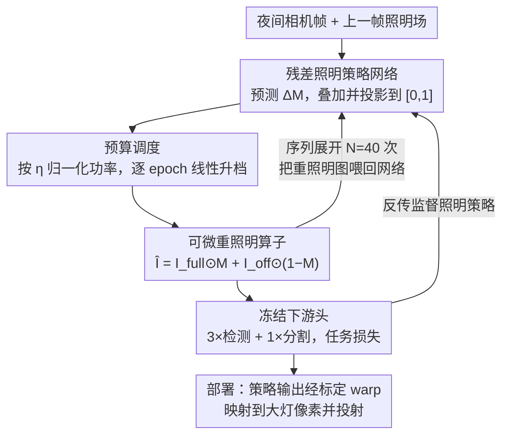

# LiDAS: Lighting-driven Dynamic Active Sensing for Nighttime Perception

**会议**: CVPR 2026  
**论文**: [CVF Open Access](https://openaccess.thecvf.com/content/CVPR2026/html/de_Moreau_LiDAS_Lighting-driven_Dynamic_Active_Sensing_for_Nighttime_Perception_CVPR_2026_paper.html)  
**代码**: 项目页 https://simondemoreau.github.io/LiDAS/  
**领域**: 自动驾驶 / 夜间感知  
**关键词**: 主动照明、夜间感知、闭环控制、可微重照明、高清大灯

## 一句话总结
LiDAS 把车辆的高清大灯当成一个"视觉执行器"，用一个学习到的照明策略网络在闭环里动态决定"把光打到哪里"，从而在不重训下游感知模型、甚至省电 40% 的前提下，让白天训练的检测/分割模型在夜间零样本可用（合成场景 +10.4% mAP50 / +6.8% mIoU，真车闭环 +18.7% mAP50 / +5.0% mIoU）。

## 研究背景与动机

**领域现状**：夜间是严重交通事故的高发时段，而纯相机的感知管线在弱光、无路灯路段性能急剧下降。主流的应对路线有两条：一是域适应 / 域泛化（DA/DG），让白天训练的模型适应夜间分布；二是加装 LiDAR、雷达、红外等主动 / 非可见光传感器。

**现有痛点**：DA/DG 在场景严重欠曝、或与训练分布偏移过大时仍然失效——它改的是模型，但相机收到的光子本身就不够，巧妇难为无米之炊。加传感器则推高成本，在中低价位车上几乎不可得。而此前少数"用大灯辅助感知"的工作要么任务定制、要么只是理论分析单一仿真场景，没有真实闭环验证。

**核心矛盾**：标准感知管线**被动**依赖场景里现成的光照，但这是一个设计惯性、而非物理必然。现代车的高清大灯其实能控制"往哪打、打多亮"，可这一可控自由度从来没有被感知任务直接利用——照明和感知是两个割裂的环节。

**本文目标**：把"照明"纳入感知优化回路，让车自己决定一个**最有利于下游感知的照明场**，并且要满足三个约束：① 下游模型冻结、不重训；② 实时（闭环逐帧）；③ 功率受预算约束、尽量省电。

**切入角度**：与其均匀提亮整个场景（既费电又会在已亮区压低对比度），不如把有限的光"重新分配"——从空旷区域抽走、堆到目标区域。作者的观察是：感知性能取决的不是总光通量，而是光在空间上**怎么分配**。

**核心 idea**：训练一个由下游任务损失直接监督的照明策略网络，通过一个**可微重照明算子**端到端学习，部署时驱动真实高清大灯形成"感知→调光→投射→再感知"的闭环。

## 方法详解

### 整体框架
LiDAS 的输入是当前夜间相机帧，输出是一张图像空间的照明场 $M \in [0,1]^{H\times W}$（每像素该打多亮），它被高清大灯投回真实场景，改变下一帧相机看到的画面。训练时由于无法在每个梯度步真的去开灯拍照，作者用一个**可微重照明算子**当代理，把"投光→成像"近似成可求导的运算，于是整套系统能被冻结的下游感知头的任务损失端到端监督。部署时只保留策略网络，作为一个"外挂"模块接到车辆现有的大灯和相机之间，原生感知栈完全不动。

整个流程是一个闭环：**任务驱动监督**给出"光该往哪打"的信号 → **可微重照明算子**把照明场变成重照明图像 → **残差照明策略网络 + 预算调度**预测下一步照明场 → **序列展开（闭环模拟）**让模型在自己造成的照明下反复迭代，逼近真实部署的闭环行为。

### 关键设计

**1. 任务驱动监督：用冻结感知头的损失直接定义"好照明"**

痛点在于"什么是好照明"很难手工定义——亮度直方图、显著性这些启发式都不等价于"下游任务做得更好"。LiDAS 干脆把目标定成下游任务损失本身：重照明后的图像被送进三个 COCO 预训练检测器（YOLO11L、YOLOv8L、YOLOv8L-Worldv2）和一个 Cityscapes 预训练分割器（Mask2Former），训练损失是它们任务损失的加权和。作者观察到不同任务会拉出不同的照明风格——检测这类**局部/块状**任务倾向于打出局部、提升对比度的光斑，而分割这类**场景级语义**任务则偏好空间上更宽的光、在显著区域做精细补光。用多任务、多头联合监督能起到正则作用，避免照明策略过拟合到某一个头的偏好。关键好处是下游模型全程冻结，性能增益**纯粹来自照明控制**，因此能直接吃白天大规模数据训练出来的模型、不会过拟合到稀缺的夜间数据。

**2. 可微重照明算子：用两张渲染图线性插值，把"投光→成像"变成可求导**

端到端训练需要一个快速、可微的代理来刻画"投出去的光如何变成相机图像"。LiDAS 不去做物理重渲染，而是在两张极端渲染图之间线性插值：一张是全功率照明图 $I_{\text{full}}$（大灯在全视场打到最大），一张是无大灯图 $I_{\text{off}}$。给定照明场 $M$，重照明图为

$$\hat{I} = I_{\text{full}} \odot M + I_{\text{off}} \odot (1 - M)$$

其中 $\odot$ 是逐元素乘。这个式子对 $M$ 可导、保留梯度，且环境光与他车灯光（在 $I_{\text{off}}$ 和 $I_{\text{full}}$ 里都存在）天然被纳入，仅凭一对渲染图就能廉价穷举各种照明配置。对经典 LB/HB 基线，作者另外建模场景几何与大灯光度：用逐像素深度把图像点抬到 3D、变换到大灯坐标系，把大灯当针孔投影器投回像素，再采样真车实测的角度强度分布 $\Phi_{\text{LB/HB}}$。局限是没建模材质反射率、$I_{\text{full}}$ 里过曝区域在降 $M$ 时也找不回细节——但它给出了"光在哪有用 / 在哪有害"的正确信号，足以训练策略。

**3. 残差照明策略网络 + 功率预算调度：在功率约束下学"光的增量"**

网络输入是 RGB 图 $I$、上一帧照明场 $M_{t-1}$ 和一个 CoordConv 风格的坐标通道 $C=(x,y)$——喂 $M_{t-1}$ 是让网络区分"自己打的光"和环境光，坐标通道提供粗空间先验引导光的分布。结构是带跳连的编码器-解码器（下采到 1/16、上采到 1/4、再 resize 回全分辨率），共 54M 参数。关键设计是网络学**残差**而非绝对照明：预测头输出增量 $\Delta M_t \in [-1,1]$，叠加到上一帧并逐元素投影到合法区间

$$\widetilde{M}_t = \min(\max(M_{t-1} + \Delta M_t, 0), 1)$$

然后用功率预算 $\eta$ 把照明场归一化（$\bar m_t$ 为 $\widetilde M_t$ 的均值，$\epsilon$ 防除零）：$M_t = \frac{\eta}{\max(\epsilon,\ \bar m_t)} \widetilde M_t$。预算在训练中逐 epoch 线性升档 $\eta(e) = \eta_{\text{final}}\big(\alpha + (1-\alpha)\tfrac{e}{E_{\max}}\big)$，$\alpha=10\%$——先在紧预算下学会"优先照最关键区域"，再逐步放宽学精细补光。这让同一个模型能在不同功率档下都把光花在刀刃上。

**4. 序列展开闭环模拟：让监督看到模型"在自己造成的照明下"的行为**

监督虽然在单张图上做，但部署是闭环的：模型动作后会在下一帧观察到自己打的光。为了对齐这一设定，LiDAS 在同一张训练图上把策略**展开 $N=40$ 次**：每步用重照明算子得到 $\hat I_t$ 再喂回网络 $M_{t+1} = \text{LiDAS}(\hat I_t, M_t, C)$。下游任务损失在第一次迭代和随机抽取的若干步上反传 $K=5$ 次，但**梯度不跨迭代传播**——每步把 $(\hat I_t, M_t)$ 当作下一步的常量，从而鼓励模型在自身照明下保持稳定，同时避免对长时序做完整 BPTT 的开销。这一策略让模型在长时闭环里维持平稳性能，正是真车部署能 work 的关键。

### 损失函数 / 训练策略
训练 60 epochs，AdamW（lr $10^{-4}$、指数衰减 $\gamma=0.96$）、混合精度；能量从 $0.1\eta_{\text{final}}$ 线性升到 $\eta_{\text{final}}$。初始化用 blockwise 常数噪声（块大小 20–80 px）作为 $M_0$，以 0.5 概率直接用全黑场 $M_0=0$ 逼网络学会"重新点亮原本漆黑的区域"。模型 54M 参数，单张 H100 训练约 16 小时，RTX 4090 上推理 6.8 ms，几乎不给管线增加开销。

## 实验关键数据

### 主实验
合成数据集（Applied Intuition 仿真器，关闭路灯模拟最差照明，2250/250/1000 训/验/测）。检测用 YOLO11L、分割用 Mask2Former，功率均以 Low Beam（LB）为 1 归一化。

| 方法[功率] | mAP50 ↑ | mAP50-90 ↑ | mIoU ↑ | mAcc ↑ |
|------|------|------|------|------|
| No Ego Light[0] | 21.5 | 11.6 | 47.6 | 65.4 |
| Static[1] | 42.6 | 26.3 | 68.7 | 82.7 |
| Low Beam[1] | 36.9 | 21.5 | 66.0 | 80.5 |
| High Beam[1.8] | 43.0 | 26.8 | 67.9 | 82.4 |
| Uniform[4] | 44.5 | 28.2 | 71.9 | 86.1 |
| **LiDAS[0.6]（省 40% 电）** | 45.9 | 29.1 | 70.0 | 84.1 |
| **LiDAS[1]** | **47.3** | **30.0** | **72.8** | **85.6** |
| **LiDAS[1.8]** | 47.6 | 30.4 | 73.5 | 87.0 |

- 同功率下，LiDAS[1] 比 Low Beam[1] 检测 +10.4% mAP50、分割 +6.8% mIoU；甚至超过用 1.8× 功率的 High Beam[1.8]。
- LiDAS[0.6] 省电 40%，仍全面超过所有基线；连功率最高、整场提亮的 Uniform[4] 都比不过——因为均匀提亮会压低对比度。结论是**感知更依赖光的空间分配，而非总光通量**。

真车零样本闭环部署（专业试车场，12 个认证人体目标 + 10 辆车，每种照明模式开 12 km，LiDAR 标注投影到相机视角作 GT）：相比 LB，LiDAS 检测 **+18.7% mAP50**、分割 **+5.0% mIoU**，验证了 sim-to-real 零样本闭环可行。

### 消融 / 鲁棒性实验
零样本跨环境（有路灯城区 / 雨天）：

| 场景 | 方法[功率] | mAP50 ↑ | mIoU ↑ | 说明 |
|------|------|------|------|------|
| 城区有路灯 | Low Beam[1] | 48.3 | 76.6 | 路灯已足够，自车灯贡献小 |
| 城区有路灯 | LiDAS[1] | 47.4 | 81.5 | 各法接近，分割仍占优 |
| 雨天 | Low Beam[1] | 29.3 | 57.6 | 未见过的恶劣场景 |
| 雨天 | LiDAS[1] | 39.2 | 59.4 | 零样本泛化，明显领先 |
| 雨天 | High Beam[1.8] | 34.5 | 60.2 | 高功率仍不及 LiDAS[1.8] 的 41.5 |

### 关键发现
- **静态 vs 动态**：把 LiDAS 在验证集上的预测取平均得到 Static[x]（一个"感知优化但不自适应"的固定光场），它已强于 LB/HB，但仍逊于动态 LiDAS——说明逐场景自适应本身有额外收益。
- **预算自适应**：紧预算下 LiDAS 只照最关键区域，预算变大则逐步扩大覆盖、加细对全局理解有帮助的结构。
- **行为可解释**：LiDAS 减少近场照明避免自眩光，把能量重分配到地平线远处目标；对已亮区域（他车灯光、行人白外套）主动降光以提升局部对比度和边界清晰度。补充材料显示 LiDAS[1] 在 20–60 m 这一对自动紧急制动安全关键的距离带表现领先。

## 亮点与洞察
- **把执行器引入感知回路**：以往感知是"被动接收光子"，LiDAS 第一次把"主动调光"作为可学习自由度直接接到任务损失上——大灯从照明设备变成了视觉执行器，这个范式迁移很巧妙。
- **两图线性插值当可微相机模型**：用 $I_{\text{full}}$、$I_{\text{off}}$ 一对渲染图插值，既保梯度又自动包含环境/他车光，绕开了昂贵的可微物理渲染，是个高性价比的训练 trick，可迁移到任何"投光/补光"类主动感知任务。
- **省电反而更准**：LiDAS[0.6] 省 40% 电还超过所有基线，颠覆"更亮=更好"的直觉，对车载能耗/续航是实打实的价值。
- **冻结下游 + 外挂部署**：不碰原生感知栈、不重训，作为 bolt-on 模块即插即用，工程落地门槛低，也能和 DA/DG 方法叠加进一步增鲁棒。

## 局限与展望
- **重照明算子的近似误差**：不建模材质反射率，$I_{\text{full}}$ 过曝区在降光时找不回细节；真实材质/天气下的成像偏差可能限制精度上界。
- **依赖高清大灯硬件**：方法需要可像素级控制的 HD 大灯（实验车 320×80 px）和一次性相机-大灯标定 warp，普及度仍受限于车型。
- **仿真训练 + 单一仿真器**：训练数据来自单一商用仿真器，虽零样本迁移到真车成功，但跨更多真实路况/极端天气的泛化仍待更大规模验证。
- ⚠️ 缓存为 OCR 文本，部分公式（残差投影、预算调度、升档）由原文符号还原，个别下标可能有偏差，以原文为准。
- 改进方向：把可微算子升级为带材质/HDR 的物理代理；引入显式跨帧时序建模替代当前"梯度不跨迭代"的近似；联合学习下游头与照明策略以突破冻结模型的上界。

## 相关工作与启发
- **vs 域适应 / 域泛化（如 SoMA）**：DA/DG 改的是模型去适应夜间分布，但无法突破传感器物理极限、严重欠曝时仍失效；LiDAS 改的是输入端的光照分布、把观测拉回训练分布，二者正交可叠加。
- **vs 专用传感器（LiDAR / 雷达 / 红外）**：它们对光照不敏感但要加硬件、抬成本；LiDAS 只用现有相机 + 大灯，低成本主流车可落地。
- **vs 启发式自适应远光 / 此前大灯感知工作**：以往按手工显著性或简单目标线索反应、或只在单一仿真场景做理论分析；LiDAS 直接以下游任务损失为目标、并在真车闭环验证，通用性和实用性更强。

## 评分
- 新颖性: ⭐⭐⭐⭐⭐ 把主动调光作为可学习自由度接入感知任务损失，是一个干净且有说服力的范式迁移。
- 实验充分度: ⭐⭐⭐⭐ 合成 + 真车闭环 + 跨环境鲁棒性较完整，但仅单一仿真器训练、真实场景多样性有限。
- 写作质量: ⭐⭐⭐⭐ 动机—方法—实验链条清晰，闭环训练细节交代到位；公式排版受 OCR 影响略需还原。
- 价值: ⭐⭐⭐⭐⭐ 省电还更准、即插即用不重训，对夜间自动驾驶安全有直接落地价值。

<!-- RELATED:START -->

## 相关论文

- [\[CVPR 2026\] Learnability-Driven Submodular Optimization for Active Roadside 3D Detection](learnability-driven_submodular_optimization_for_active_roadside_3d_detection.md)
- [\[CVPR 2026\] Mind the Hitch: Dynamic Calibration and Articulated Perception for Autonomous Trucks](mind_the_hitch_dynamic_calibration_and_articulated_perception_for_autonomous_tru.md)
- [\[CVPR 2026\] Perception Characteristics Distance: Measuring Stability and Robustness of Perception System in Dynamic Conditions under a Certain Decision Rule](perception_characteristics_distance_measuring_stability_and_robustness_of_percep.md)
- [\[CVPR 2026\] ActiveAD: Planning-Oriented Active Learning for End-to-End Autonomous Driving](activead_planning-oriented_active_learning_for_end-to-end_autonomous_driving.md)
- [\[CVPR 2026\] Beyond Rule-Based Agents: Active Markov Games for Realistic Multi-Agent Interaction in Autonomous Driving](beyond_rule-based_agents_active_markov_games_for_realistic_multi-agent_interacti.md)

<!-- RELATED:END -->
