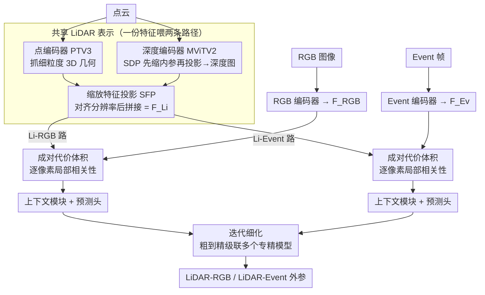

# LiREC-Net: A Target-Free and Learning-Based Network for LiDAR, RGB, and Event Calibration

**会议**: CVPR 2026  
**arXiv**: [2602.21754](https://arxiv.org/abs/2602.21754)  
**代码**: 无  
**领域**: 自动驾驶  
**关键词**: 多传感器标定, 无靶标标定, 三模态融合, 事件相机, 外参估计

## 一句话总结

提出LiREC-Net，首个统一框架同时完成LiDAR-RGB和LiDAR-Event相机的无靶标外参标定，通过共享LiDAR表示（融合3D点特征和投影深度特征）和成对代价体积实现跨模态对齐，在KITTI上达到1.80cm/0.11°、DSEC上达到2.51cm/0.14°（LiDAR-RGB）和1.18cm/0.07°（LiDAR-Event）的标定精度。

## 研究背景与动机

自动驾驶系统依赖多传感器融合来构建一致的环境感知。传感器融合的前提是**精确的外参标定**——知道每个传感器在公共坐标系中的相对位姿。然而在实际部署中，车辆振动、温度变化、轻微碰撞和日常维护会导致传感器位姿逐渐漂移，初始标定不再准确。

传统的**靶标标定**（棋盘格、ArUco标记等）虽然精度高，但需要专门的受控场景、仔细摆放、重复采集和人工监督，**无法在运行中频繁执行**。**无靶标方法**直接从自然驾驶场景中标定，无需特殊setup，可随时重复。

基于深度学习的无靶标标定方法（LCCNet、RegNet、CalibNet等）已取得进展，但存在一个关键局限：**它们只处理单一模态对**。例如LCCNet只做LiDAR-RGB，MULiEv只做LiDAR-Event。当一个系统同时有3种传感器时，需要**独立训练两个网络**，这不仅增加了计算冗余，还可能导致**标定不一致**——两个独立网络分别估计的LiDAR-RGB和LiDAR-Event变换可能在3D空间中不自洽。

LiREC-Net的核心idea是：**设计一个共享LiDAR表示，让同一个LiDAR特征同时服务于LiDAR-RGB和LiDAR-Event两条标定路径**，既减少冗余又保证一致性。

## 方法详解

### 整体框架

LiREC-Net 要解决的是：一辆同时装了 LiDAR、RGB 相机、Event 相机的车，怎么用**一个**网络同时标定 LiDAR-RGB 和 LiDAR-Event 两组外参，而不是各训一个网络。它的做法是让 LiDAR 特征只提取一次、被两条标定路径共享——点云先经共享 LiDAR 分支得到统一表示，RGB 和 Event 各自有编码器提视觉/事件特征，然后分别和这份共享 LiDAR 特征构建一个成对代价体积，最后两个上下文模块 + 预测头各自回归出一组外参；整个网络再以粗到精的多 stage 级联做迭代细化。

### 关键设计

**1. 共享 LiDAR 表示：用一份 LiDAR 特征同时喂两条标定路径**

如果给 LiDAR-RGB 和 LiDAR-Event 各配一个独立 LiDAR 编码器，不仅算力翻倍，两条路径估出的变换在 3D 空间还可能互相打架。LiREC-Net 让 LiDAR 只编码一次，但这一份特征必须既有细粒度几何、又有密集空间上下文，于是用两个互补编码器并行提取：点编码器用 Point-Transformer-V3（PTV3）直接处理无序 3D 点，靠空间填充曲线序列化做高效局部注意力，抓的是细粒度几何结构；深度编码器把点云投到图像平面生成单通道深度图，用 MViTV2 提密集空间上下文。两路特征经缩放特征投影（SFP）对齐到同一分辨率后拼接：$\mathbf{F}^{\text{Li}} = \text{Concat}(\text{SFP}(\mathbf{F}^{\text{point}}), \mathbf{F}^{\text{depth}})$。这两种特征缺一不可——消融里只留点特征时 LiDAR-RGB 平移误差从 2.51cm 暴增到 14.43cm，因为点特征缺密集空间上下文。

**2. 缩放深度/特征投影（SDP & SFP）：先缩内参再投影，别先投影再 resize**

把点云投到图像平面时，传统做法是用原始内参投影再 resize，但 resize 会引入模糊伪影，破坏精细的特征对齐。SDP 改成先缩放内参矩阵、再投影：$R' = \text{diag}\left(\frac{W'}{W}, \frac{H'}{H}, 1\right), \quad \mathbf{K'}_{\text{Cam}} = R' \mathbf{K}_{\text{Cam}}$，从源头保证投影点落在正确位置。消融显示移除 SDP 和 SFP 后 LiDAR-Event 误差从 1.18cm/0.07° 恶化到 3.35cm/0.30°，说明在这种亚厘米级标定任务里，投影精度本身就是瓶颈。

**3. 成对代价体积：用逐像素局部相关性显式度量跨模态对齐程度**

有了对齐好的 LiDAR 特征和相机特征，怎么衡量它们差多少？借鉴 PWC-Net 和 LCCNet，对每个像素 $\mathbf{p}=(x,y)$ 在一个位移窗口 $(\Delta x, \Delta y)$ 内算逐通道内积：$\mathcal{C}(y,x,\Delta x,\Delta y) = \frac{1}{C}\sum_{c=1}^{C} \mathbf{F}^{\text{Li}}_{c,y,x} \cdot \mathbf{F}^{\text{Cam}}_{c,y+\Delta y,x+\Delta x}$，得到维度为 $H'' \times W'' \times (2d+1)^2$ 的代价体积。它把“两个模态在每个局部位置是否对齐”显式编码进特征里，供后续预测头回归位姿偏差。LiDAR-RGB 和 LiDAR-Event 各建一个这样的代价体积，是两条路径唯一分叉的地方。

**4. 迭代细化：粗到精级联多个专精不同误差范围的模型**

单个网络很难同时 handle ±20° 的大偏差和亚度级的微调。LiREC-Net 训练多个独立模型，每个专门负责一段误差范围（从大到小：±20°/150cm → ±1°/10cm），评估时级联应用：$\hat{\mathbf{T}}^{v,(k)} = \Delta\hat{\mathbf{T}}^{v,(k)} \hat{\mathbf{T}}^{v,(k-1)}$。前一级把大偏差拉回大致范围，后一级在小范围内精修，每个 stage 只需专注自己那段精度——这也是 DSEC 上 5 stages（2.51cm/0.14°）明显优于 2 stages（2.62cm/0.30°）的原因。

### 损失函数 / 训练策略

总损失由两个模态对的损失相加：$\mathcal{L}_{\text{total}} = \mathcal{L}^{\text{Li-RGB}} + \mathcal{L}^{\text{Li-Ev}}$

每对的损失包含3项：

$$\mathcal{L}^v = (1-w)(\lambda_t \mathcal{L}^v_{\text{trans}} + \lambda_r \mathcal{L}^v_{\text{rot}}) + w \mathcal{L}^v_{\text{pcd}}$$

- **平移损失**: Smooth L1 loss on $\hat{\mathbf{t}}^v$
- **旋转损失**: 预测和真值四元数之间的角距离 $\theta(\hat{\mathbf{q}}^v, \mathbf{q}^v)$
- **点云距离损失**: 变换后点云与真值变换后点云的L2距离，确保几何一致

训练细节：Adam优化器，lr=3e-4，milestone衰减(×0.5)；DSEC第一阶段150 epochs，后续70 epochs；batch size 64，4×A6000/L40S GPU。

## 实验关键数据

### 主实验 — KITTI数据集

| 方法 | LiDAR-RGB误差 | LiDAR-Event误差 |
|------|-------------|----------------|
| RegNet | 6.00cm / 0.28° | — |
| CalibNet | 4.34cm / 0.41° | — |
| LCCNet | 1.59cm / 0.16° | — |
| PseudoCal | **1.18cm / 0.05°** | — |
| **LiREC-Net** | 1.80cm / 0.11° | **1.82cm / 0.12°** |

### 主实验 — DSEC数据集（5 stages）

| 方法 | LiDAR-RGB误差 | LiDAR-Event误差 |
|------|-------------|----------------|
| MULiEv (2 stages) | — | 0.81cm / 0.10° |
| LiREC-Net (2 stages) | 2.62cm / 0.30° | 2.05cm / 0.25° |
| **LiREC-Net (5 stages)** | **2.51cm / 0.14°** | **1.18cm / 0.07°** |

### 消融实验 — 特征融合（DSEC）

| Point特征 | Depth特征 | LiDAR-RGB | LiDAR-Event |
|-----------|-----------|-----------|-------------|
| ✓ | ✗ | 14.43cm/0.70° | 14.05cm/0.64° |
| ✗ | ✓ | 2.97cm/0.70° | 2.16cm/0.60° |
| ✓ | ✓ | **2.51cm/0.14°** | **1.18cm/0.07°** |

### 三模态 vs 双模态效率对比

| 配置 | 推理时间(s) | 参数量(B) | 显存(GiB) |
|------|------------|----------|-----------|
| 双模态（KITTI, 两个独立网络） | 0.51 | 1.9 | 14.6 |
| **三模态（KITTI, 统一网络）** | **0.33** | **1.7** | **11.1** |
| 双模态（DSEC） | 0.44 | 1.9 | 14.6 |
| **三模态（DSEC）** | **0.31** | **1.7** | **11.1** |

### 关键发现

- **点特征+深度特征缺一不可**：仅用点特征时平移误差暴增5.8倍（2.51→14.43cm），因为点特征缺少密集空间上下文；仅用深度特征时旋转误差高5倍（0.14→0.70°），因为深度图丢失了3D细粒度结构
- **三模态优于双模态**：不仅精度相当甚至更好（共享LiDAR特征提供正则化），效率也更高（推理快35%，显存省24%）
- **SDP和SFP的投影精度至关重要**：两种缩放投影各自贡献了互补的精度提升
- **MViTV2 > ResNet**：Transformer的全局特征建模能力对跨模态对齐更有利

## 亮点与洞察

- **"三模态统一"的思路有实用价值**：随着事件相机在自动驾驶中越来越普及（如Prophesee），统一的多传感器标定方案是实用需求
- **共享LiDAR表示既是效率优势也是精度优势**：避免了两个独立LiDAR编码器的不一致性
- **SDP/SFP的工程洞察**很有价值：resize引入的模糊伪影在精细对齐任务中是关键瓶颈
- 在DSEC上首次建立了LiDAR-RGB标定基线（此前没有方法在DSEC上报告LiDAR-RGB结果）

## 局限与展望

- **假设RGB和Event相机已预标定**：即 $\mathbf{T}^{\text{Ev} \to \text{RGB}}$ 已知。作者指出可以尝试在框架内联合估计此变换
- 仅处理LiDAR/RGB/Event三种传感器，未扩展到热成像、毫米波雷达等
- 需要为每个误差范围独立训练模型（5 stages = 5个模型），训练成本较高
- 点云固定采样 $N$ 个点（KITTI 20000, DSEC 5000），不够灵活
- 代价体积的滑动窗口大小 $d$ 未充分分析其对不同误差范围的影响

## 相关工作与启发

- 直接受LCCNet启发，将其核心思想（代价体积+迭代细化）从双模态扩展到三模态
- Point-Transformer-V3作为点云编码器的选择值得注意——空间填充曲线序列化使其比PointNet++更高效
- MULiEv是唯一的LiDAR-Event标定先驱工作，但仅处理单模态对
- 与CalibNet的自监督标定思路不同，LiREC-Net采用有监督回归，依赖人工扰动的伪不对齐

## 评分

- **新颖性**: ⭐⭐⭐⭐ 三模态统一标定是新颖且有意义的问题定义，共享LiDAR表示的设计有创意
- **实验充分度**: ⭐⭐⭐⭐ 两个数据集、全面消融、效率分析，但缺少真实场景（非人工扰动）的验证
- **写作质量**: ⭐⭐⭐⭐ 结构清晰，formulation严谨，图表直观
- **价值**: ⭐⭐⭐⭐ 对多传感器自动驾驶系统有直接应用价值，三模态基线具有参考意义

## 评分
- 新颖性: 待评
- 实验充分度: 待评
- 写作质量: 待评
- 价值: 待评

<!-- RELATED:START -->

## 相关论文

- [\[CVPR 2026\] Learning to Drive is a Free Gift: Large-Scale Label-Free Autonomy Pretraining from Unposed In-The-Wild Videos](learning_to_drive_is_a_free_gift_large-scale_label-free_autonomy_pretraining_fro.md)
- [\[CVPR 2026\] SG-NLF: Spectral-Geometric Neural Fields for Pose-Free LiDAR View Synthesis](sgnlf_spectralgeometric_neural_fields_for_posefre.md)
- [\[CVPR 2026\] Mind the Hitch: Dynamic Calibration and Articulated Perception for Autonomous Trucks](mind_the_hitch_dynamic_calibration_and_articulated_perception_for_autonomous_tru.md)
- [\[CVPR 2026\] FlashCap: Millisecond-Accurate Human Motion Capture via Flashing LEDs and Event-Based Vision](flashcap_millisecond-accurate_human_motion_capture_via_flashing_leds_and_event-b.md)
- [\[CVPR 2026\] x2-Fusion: Cross-Modality and Cross-Dimension Flow Estimation in Event Edge Space](x2-fusion_cross-modality_and_cross-dimension_flow_estimation_in_event_edge_space.md)

<!-- RELATED:END -->
