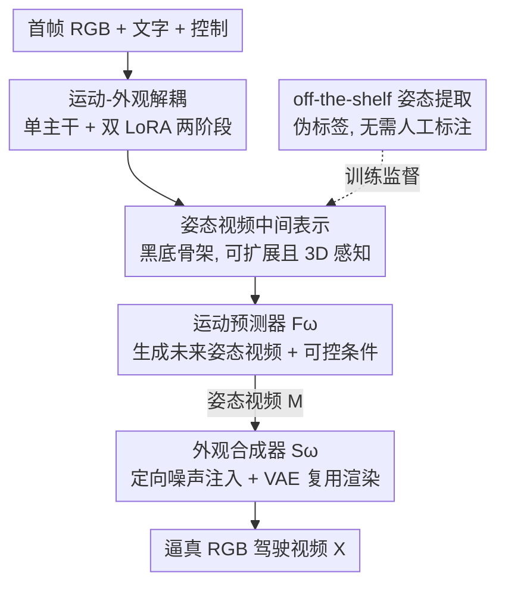

# MAD: Motion Appearance Decoupling for Efficient Driving World Models

**会议**: CVPR 2026  
**论文**: [CVF Open Access](https://openaccess.thecvf.com/content/CVPR2026/html/Rahimi_MAD_Motion_Appearance_Decoupling_for_efficient_Driving_World_Models_CVPR_2026_paper.html)  
**代码**: 项目页 https://vita-epfl.github.io/MAD-World-Model/  
**领域**: 自动驾驶  
**关键词**: 驾驶世界模型, 视频扩散, 运动-外观解耦, LoRA 高效适配, 姿态视频

## 一句话总结
MAD 把通用视频扩散模型改造成驾驶世界模型的代价砍到极致：用同一个主干、两个轻量 LoRA，先生成只画骨架的"姿态视频"预测运动、再给骨架"穿上"纹理渲染 RGB，把运动与外观解耦后只用对手 6% 的算力就追平了此前 SOTA。

## 研究背景与动机

**领域现状**：近期视频扩散模型（VGM，如 SVD、LTX）能生成逼真、时序连贯的视频，被寄望当自动驾驶的世界模型用——给定首帧和高层指令，预测未来 ego 视角的 RGB 视频。把通用 VGM 适配到驾驶域已被证明可行（VISTA、GEM、ReSim 等）。

**现有痛点**：这种适配贵得离谱。VISTA、GEM 各花 25,000 和 50,000 GPU 小时去微调 SVD 主干；Cosmos-Predict 这类更强的模型干脆在海量私有数据上从头训，算力门槛把多数研究实验室挡在门外。高昂的适配成本让社区没法快速吃到通用视频模型的进步红利。

**核心矛盾**：驾驶世界模型必须同时精通两件深度耦合的难事——① 逼真的像素级**外观**合成，② 物理 / 社会层面合理的多智能体**动力学**。通用 VGM 擅长视觉真实感，但物理一致性、多目标交互、因果交互一塌糊涂（它们倾向复现统计上最常见的运动模式，而非适应被扰动的环境）。把外观和动力学一起学，数据和算力都极其昂贵。

**本文目标**：把"外观 + 动力学"这个联合难题拆成两个更可控的子问题，用最少的监督把任意通用 VGM 高效适配成可控驾驶世界模型。

**切入角度**：作者借用动画师的工作流——专业动画师不会一上来就画逼真成片，而是先做 animatic（一串定好时序的简单草图）把节奏、构图、交互和运动定下来，最后才机械地渲染光影纹理。这个"先定动力学、再渲外观"的解耦思路是个强有力的范式。

**核心 idea**：用单个 VGM 主干 + 两个 LoRA 分别扮演动画师工作流的两步——运动预测器（Motion Forecaster）先从噪声生成抽象骨架姿态视频，外观合成器（Appearance Synthesizer）再以该姿态为条件渲染逼真 RGB；这等价于一种"链式思维"，先生成中间推理步骤（运动 animatic）再产出最终答案（渲染视频）。

## 方法详解

### 整体框架
MAD 把生成过程拆成两个顺序阶段，但两阶段共用同一个预训练 VGM 主干、各挂一个轻量 LoRA。第一阶段 $F_\omega$（运动预测器）从噪声出发、在运动相关控制 $C_{motion}$（文字、ego 运动、首帧 RGB）条件下生成未来的中间运动表示 $M$；第二阶段 $S_\omega$（外观合成器）以生成的 $M$ 和外观控制 $C_{appearance}$（首帧 RGB、文字）为条件，渲染出最终逼真视频 $X$。

设计上有两条主线贯穿始终：一是**最大化复用基模型的先验**——不另造复杂条件注入网络，而是把所有控制信号（中间姿态、首帧、甚至新提出的 ego 运动表示）都用 VGM 自带的预训练 VAE 投影进它本就"听得懂"的视觉隐空间；二是用 LoRA 做轻量适配而非全量微调，把训练负担压到最低。

### 关键设计

**1. 运动-外观解耦：单主干 + 双 LoRA 的两阶段范式**

针对"外观和动力学一起学、数据算力都爆炸"的核心矛盾，MAD 引入中间运动表示 $M$ 把联合分布拆成两步：$N \xrightarrow[C_{motion}]{F_\omega} M$（从噪声生成运动）和 $N \xrightarrow[\{M,C_{appearance}\}]{S_\omega} X$（条件于运动渲染外观）。关键是两阶段**不从头训**——作者认定大规模通用 VGM 已经隐含了运动动力学和视觉外观的双重知识，于是用 LoRA 把同一个预训练主干微调成两个专才。这种"单模型两步走"概念上类似链式思维：模型先"推理"出中间步骤（运动 animatic）再产出"答案"（渲染视频）。消融里这是质量的首要来源——MAD-LTX 对"同算力直接端到端微调 LTX"的 Fine-tuned LTX 基线呈压倒性人类偏好（2B：29 vs 16；13B：33 vs 15），证明解耦本身、而非主干或数据，才是质量主因。

**2. 姿态视频中间表示：可扩展、3D 感知、对齐 VGM 先验**

针对"中间表示选什么才既能抽离外观又便于 VGM 理解"的问题，作者把 $M$ 定义为"姿态视频"——黑底上渲染动态智能体（车、行人）骨架与关键静态元素（车道线）的帧序列，关节和边用不同颜色区分类别。训练数据用现成姿态提取器（OpenPifPaf 提车 / 车道、DWPose 提人体）做伪标签，无需新增人工标注。作者对比了三种候选：HDMap（3D 框）太抽象、VGM 难以把框关联到车 / 人，迁移先验受阻且依赖完整感知栈不可扩展；全景分割虽像素精确但基本是 2D 的，抓不住 3D 朝向和行人细节；而姿态表示三者兼顾——可扩展（任意视频都能生成伪标签）、3D 感知、以物体为中心，恰好对齐 VGM 的先验，同时简化预测和合成两端。消融里换成全景分割 / HDMap，人类对完整模型的偏好高达 74% / 78%。

**3. 可控运动条件 + VAE 原生复用：把所有控制都说成 VGM 的"母语"**

针对"驾驶世界模型必须可控、但又不想引入复杂新条件网络"的需求，作者把运动预测器设计成对初始场景状态条件的隐空间扩散模型，并把全部控制信号都过预训练 VAE 投影进主干原生隐空间再 concat 进 DiT。具体：① 把姿态视频编码成隐变量 $z=E_{VAE}(M)$，首帧姿态对应的 $z_0$ 保持干净（不加噪）concat 到加噪序列上做条件；② 文字用 T5 编码经 cross-attention 注入（不像 VISTA / GEM 那样丢掉文字）；③ 首帧 RGB $I_0$ 含红绿灯状态等关键上下文，用 VAE 编码成 $c_{rgb}$ concat 进去；④ **ego 运动控制**用一个新颖的视觉表示——在合成世界里渲染一段 ego 相机视角视频 $V_{ego}$，背景是带棋盘纹理的静态球面和静态尘粒，旋转可从棋盘的视运动推断、平移从尘粒的视差运动推断，再 VAE 编码成 $c_{ego}$；⑤ **物体运动控制**从姿态数据抽 2D 框 + 跟踪得轨迹，随机选最多 5 条渲染成稀疏控制视频 $V_{obj}$ 编码进去。这一整套不加任何新适配网络，全靠 VAE 复用，数据和算力都极省。

**4. 定向噪声注入：弥合训练用真值姿态、推理用预测姿态的域差**

针对一个隐蔽但致命的训练-推理不一致：外观合成器 $S_\omega$ 训练时吃的是伪标签提取的干净真值姿态 $M_{gt}$，推理时却吃运动预测器吐出的、带模糊 / 弯折等伪影的 $M_{pred}$。作者在训练时主动模拟推理期的不完美——对姿态隐变量 $c_{pose}$ 做**定向加噪**：在隐空间加噪（因为 $F_\omega$ 是隐空间扩散，其伪影在隐空间比像素空间更真实），且只给对应骨架部分的稀疏隐特征加方差 $\omega\sim U(0,0.3)$ 的高斯噪声、保持黑背景隐变量干净（因为观察到 $F_\omega$ 生成的背景并不噪）。这迫使 $S_\omega$ 对运动结构的瑕疵鲁棒、又不破坏干净背景。消融里去掉该策略，人类对完整模型的偏好达 62%。

### 损失函数 / 训练策略
两个模型都从同一基模型（SVD 或 LTX）初始化、用 LoRA 微调。优化器 AdamW，学习率 $2\times10^{-4}$，batch size 32。数据用 OpenDV（1700 小时 YouTube 驾驶视频），预处理到 24fps、$1056\times704$，切 5 秒片段（120 帧，3 秒重叠），过滤掉物体数最少的 50% 片段；从训练视频采 10 万片、验证视频采 5 千片（确保无泄漏），用 Qwen2.5-VL-32B 基于首帧生成文字描述。运动预测器 $F_\omega$ 在 139 小时数据上训 9,000 步，外观合成器 $S_\omega$ 随后训 5,000 步。LTX 版总微调成本：2B 仅 128 GPU 小时、13B 700 GPU 小时（SVD 版 1500 GPU 小时），实验跑在 32 张 GH200 上。作者强调一个方法论发现：必须在 VGM 的"舒适区"（原生分辨率和帧率）训练，下采样会逼模型学分布外运动先验、需要多得多的数据。

## 实验关键数据

### 主实验
作者发现 FID / FVD 在复杂驾驶场景与感知质量相关性差，故主评测用大规模人类偏好研究（100 个随机场景、14 组模型对比、成对 A/B 选"总体质量 / 运动真实感 / 视觉质量")。核心结论：

| 对比 | 结果 | 关键含义 |
|------|------|------|
| MAD-SVD vs VISTA | 数据少 >12×（139h vs 1700h）、算力少 16×（1500 vs 25,000 GPU-hr）下追平 | 解耦带来极致高效适配 |
| MAD-SVD vs GEM | 用 GEM 3% 算力逼近其性能 | 同上（GEM 用 50,000 GPU-hr） |
| MAD-LTX vs 开源 SOTA（GEM/VISTA/Cosmos-Predict 1） | 2B / 13B 两尺度均被显著更偏好 | 超过所有此前开源驾驶模型 |
| MAD-LTX vs Fine-tuned LTX（同算力端到端） | 2B 29 vs 16、13B 33 vs 15 偏好 | 质量主因是解耦、非主干 / 数据 |
| MAD-LTX-13B vs Cosmos Predict 2（14B，闭源） | 生成质量接近持平，且推理更快 | 开源逼近闭源 SOTA |

开环运动规划评测（OpenDV，5 秒预测，每片生成 6 段无条件视频用 MapAnything 抽 ego 轨迹；minADE6 越低越好、APD6 越高越好）：

| 模型 | 2B minADE6 ↓ | 2B APD6 ↑ | 13B minADE6 ↓ | 13B APD6 ↑ |
|------|------|------|------|------|
| Base LTX | 5.42 | 102.96 | 4.14 | 101.46 |
| Fine-tuned LTX | 5.28 | 68.20 | 5.83 | 63.06 |
| **MAD-LTX（ours）** | **4.88** | 76.21 | **3.64** | 101.45 |

MAD-LTX 在两尺度都取得最低 minADE6，且不像直接微调那样塌缩多样性。

### 消融实验
均用 MAD-LTX-2B 的人类偏好（数值=完整模型相对该变体的偏好率，越高越好）。

| 配置 | 完整模型偏好率 ↑ | 说明 |
|------|------|------|
| w/o noise（去定向噪声注入） | 62% | 去掉后训练-推理域差未弥合，质量下降 |
| Panoptic Seg.（中间表示换全景分割） | 74% | 2D 表示抓不住 3D 朝向 / 行人细节 |
| HDMap（中间表示换 HDMap） | 78% | 太抽象、VGM 难关联、不可扩展 |

### 关键发现
- **解耦是质量主因，不是主干或数据**：同算力下 MAD-LTX 压倒端到端微调的 Fine-tuned LTX，这条 apples-to-apples 对比最有说服力。
- **直接视频微调会触发记忆 / 模式塌缩**：Fine-tuned LTX 在 13B 上 APD6 比 MAD-LTX 低 37.8%、minADE6 退化 40%；作者归因于扩散模型在像素空间的记忆，而 MAD 在抽象姿态空间预测、剥离视觉纹理后被迫学真正的运动而非伪相关（如"看到救护车就停""看到穿粉衣行人就左转"）。
- **姿态表示三者里最优**：消融偏好率 HDMap 78% > 全景分割 74% > 无噪声 62%，印证可扩展 + 3D 感知 + 物体中心的姿态表示价值。
- **必须在原生分辨率 / 帧率训练**：下采样会逼模型学分布外运动先验，显著拉高数据需求。

## 亮点与洞察
- **"先推理动力学、再渲染外观"= 视频版链式思维**：把动画师 animatic 工作流抽象成两阶段生成，中间的姿态视频就是"推理草稿"，是个非常直觉且可迁移的范式——任何"运动 + 外观耦合"的生成任务都能照搬。
- **VAE 原生复用代替造新条件网络**：把 ego 运动、物体框、首帧、姿态全部投进主干自带 VAE 隐空间，等于用模型的"母语"下指令，省掉大量适配参数——这是它算力惊人省的关键工程洞见。
- **棋盘球 + 尘粒编码 ego 运动**：用静态纹理球的视运动表旋转、尘粒视差表平移，把抽象的 3D 相机位姿变成 VGM 一眼能懂的视觉线索，是个很巧的"把控制信号视觉化"的设计。
- **抽象空间预测天然抗模式塌缩**：在剥离纹理的姿态空间建模，反而逼模型学底层运动、躲开像素空间的记忆与伪相关——解耦的一个意外红利。

## 局限与展望
- 主评测依赖人类偏好研究，作者也承认 FID / FVD 不可靠；但人类研究规模和可复现性有限，缺乏被广泛接受的客观指标。
- 方法重度依赖现成姿态提取器（OpenPifPaf / DWPose）做伪标签，姿态质量上限受这些工具制约，长尾 / 遮挡场景的骨架可能不可靠。
- 自己看：两阶段串行意味着推理要跑两遍生成，运动预测器的误差会传导给外观合成器（虽有定向噪声注入缓解），误差累积在长时序下可能放大。
- 改进思路：把 ego / 物体控制扩展到更细粒度的交互编辑、或探索运动与外观两阶段的联合微调以缓解误差传导。

## 相关工作与启发
- **vs VISTA / GEM**：二者都靠对 SVD 大规模端到端微调（25k / 50k GPU-hr）适配驾驶，且丢弃文字条件；MAD-SVD 用其 6% / 3% 算力追平，并保留文字控制。
- **vs Cosmos-Predict**：Cosmos 在海量私有数据上从头训，门槛极高；开源的 MAD-LTX-13B 用零头算力逼近 Cosmos Predict 2 质量且推理更快。
- **vs Epona（驾驶域两阶段）**：Epona 用专门轨迹预测器建模未来 ego 运动，但中间表示只限 ego 车、抓不住多智能体交互；MAD 是（据作者）首个在驾驶世界模型里完整分离多智能体运动预测与外观合成的工作。
- **vs 外观编辑类方法**：那些方法条件于 HD 地图 / 语义布局，几何和运动是从真实视频"抽取"而非"预测"，属编辑任务而非预测设定；MAD 的运动是生成出来的。

## 评分
- 新颖性: ⭐⭐⭐⭐⭐ 把动画师解耦范式 + 单主干双 LoRA + VAE 原生复用组合成一套全新的高效驾驶世界模型适配框架。
- 实验充分度: ⭐⭐⭐⭐ 两主干两尺度 + 人类研究 + 开环规划 + 三项消融很扎实，但客观指标偏弱、主要靠人类偏好。
- 写作质量: ⭐⭐⭐⭐⭐ 用动画师比喻把方法讲得极清晰，控制信号设计交代充分。
- 价值: ⭐⭐⭐⭐⭐ 把驾驶世界模型适配成本砍一两个数量级，对算力受限的研究社区意义重大，且开源 SOTA。

<!-- RELATED:START -->

## 相关论文

- [\[CVPR 2026\] WorldLens: Full-Spectrum Evaluations of Driving World Models in Real World](worldlens_full-spectrum_evaluations_of_driving_world_models_in_real_world.md)
- [\[CVPR 2026\] Deformable Gaussian Occupancy: Decoupling Rigid and Nonrigid Motion with Factorized Distillation](deformable_gaussian_occupancy_decoupling_rigid_and_nonrigid_motion_with_factoriz.md)
- [\[CVPR 2026\] Learning Vision-Language-Action World Models for Autonomous Driving](vla_world_learning_vision_language_action_world_models_for_autonomous_driving.md)
- [\[AAAI 2026\] Unlocking Efficient Vehicle Dynamics Modeling via Analytic World Models](../../AAAI2026/autonomous_driving/unlocking_efficient_vehicle_dynamics_modeling_via_analytic_world_models.md)
- [\[CVPR 2026\] DLWM: Dual Latent World Models enable Holistic Gaussian-centric Pre-training in Autonomous Driving](dlwm_dual_latent_world_models_enable_holistic_gaussian-centric_pre-training_in_a.md)

<!-- RELATED:END -->
