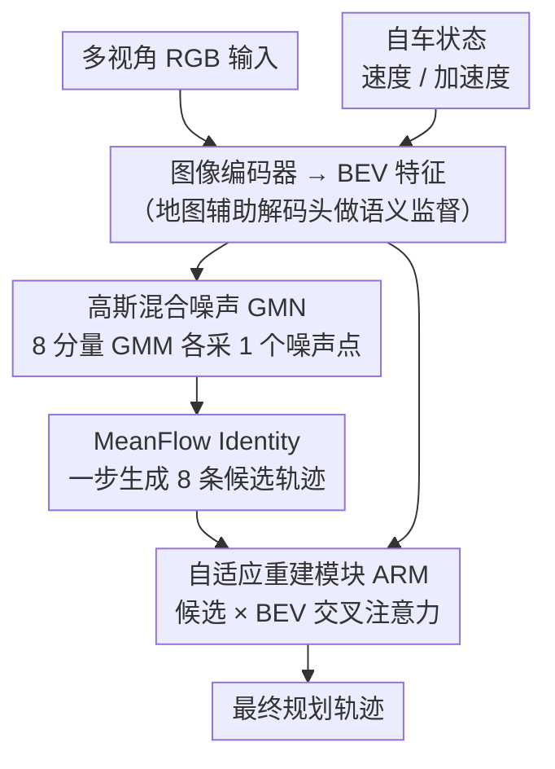

# MeanFuser: Fast One-Step Multi-Modal Trajectory Generation and Adaptive Reconstruction via MeanFlow for End-to-End Autonomous Driving

**会议**: CVPR 2026  
**arXiv**: [2602.20060](https://arxiv.org/abs/2602.20060)  
**代码**: [https://github.com/wjl2244/MeanFuser](https://github.com/wjl2244/MeanFuser)  
**领域**: 自动驾驶  
**关键词**: 端到端规划, MeanFlow, 高斯混合噪声, 一步采样, 自适应轨迹重建

## 一句话总结
提出MeanFuser端到端自动驾驶框架，用高斯混合噪声替代离散轨迹词汇表实现连续多模态轨迹建模，通过MeanFlow Identity实现一步采样消除ODE数值误差，并设计ARM模块隐式判断是选择现有proposal还是重构新轨迹，在NAVSIM上以仅RGB输入+ResNet-34骨干达到89.0 PDMS且59 FPS。

## 研究背景与动机

**领域现状**：端到端自动驾驶直接从传感器输入学习到规划轨迹。TransFuser、UniAD、VAD等学习单模态轨迹效果好但无法捕获驾驶行为的多模态本质。VADv2、Hydra-MDP引入轨迹词汇表预测概率分布，但固定词汇表在效率和鲁棒性间存在权衡。DiffusionDrive和GoalFlow将生成模型引入轨迹规划，但前者需要多步采样，后者依赖离散anchor。

**现有痛点**：(1) **离散锚点词汇表的固有限制**——词汇表必须足够大才能覆盖测试时的轨迹分布，但大词汇表拖慢推理速度。当测试场景超出预定义锚点分布时，所有proposal都偏离最优轨迹；(2) **多步采样的计算开销**——flow matching需要多次ODE solver步骤（如GoalFlow需5步）才能达到最优性能，且ODE solver引入数值误差导致采样路径弯曲；(3) **标准高斯噪声的模式坍塌**——vanilla方法从标准高斯采样导致轨迹多样性不足。

**核心矛盾**：如何在不依赖固定离散词汇表的前提下，有效建模多模态驾驶行为，同时保持高推理效率？

**本文目标** (1) 消除对离散轨迹词汇表的依赖；(2) 实现one-step高质量采样；(3) 处理所有采样proposal都不够好的情况。

**切入角度**：将MeanFlow Identity引入端到端规划——MeanFlow直接建模噪声分布和轨迹分布之间的平均速度场而非瞬时速度场，使得单步采样精确无误差。同时用高斯混合模型作为先验分布，每个高斯成分捕获一种驾驶模式。

**核心 idea**：用高斯混合噪声替代锚点、MeanFlow替代多步ODE、自适应重建模块替代评分选择，三管齐下实现快速鲁棒的多模态轨迹规划。

## 方法详解

### 整体框架
MeanFuser要回答的问题是：不用离散轨迹词汇表、也不靠多步采样，怎么又快又稳地生成多模态驾驶轨迹。它把这件事拆成一条三段流水线。先是场景编码——图像编码器把多视角RGB压成BEV特征，车辆状态编码器提取自车速度/加速度等信息，中间还挂一个地图辅助解码头做语义监督帮助收敛。接着是轨迹采样——不再从标准高斯里抽噪声，而是从一个预先用专家轨迹聚类出来的8分量高斯混合分布里，每个成分各采一个噪声点，喂给一张轻量MeanFlow网络**一步**生成8条候选轨迹。最后是自适应重建模块(ARM)，把这8条候选连同BEV特征一起做交叉注意力，输出最终那条规划轨迹。整条链路里真正的新意集中在后两段：噪声从哪来（GMN）、怎么一步把噪声变成轨迹（MeanFlow）、8条候选最后怎么收成1条（ARM）。

### 关键设计

**1. 高斯混合噪声 GMN：用一族连续分布替代离散轨迹词汇表**

VADv2、Hydra-MDP这类方法靠一张固定的轨迹词汇表来表达多模态——词汇表小了覆盖不住测试场景，大了又拖慢推理，而一旦真实轨迹落在所有锚点之外，每条proposal都偏。GMN的做法是把"先验"从离散锚点换成连续分布，但又不丢掉锚点编码的驾驶模式信息。具体地，先对训练集所有专家轨迹做归一化（计算逐步差分 $\Delta\tau_j$，再按全局均值/最大值缩放），然后用K-means聚成 $K=8$ 组，每组的均值和标准差直接参数化一个高斯成分，合起来就是采样先验

$$p_0 = \sum_{k=1}^{K} \pi_k\, \mathcal{N}(\mu_k,\, \sigma_k^2 I).$$

推理时从每个成分各采一个点、并行出8条轨迹；训练时只挑离ground truth最近的那个成分算loss。这样聚类中心保留了"典型驾驶模式"这个先验，而每个高斯的方差又允许在模式内连续探索，正好补上离散锚点覆盖不全的窟窿。一个有意思的副产品是，不同成分天然对应不同驾驶风格（速度从保守的3.45 m/s到激进的9.11 m/s），等于零成本地给个性化驾驶留了接口。

**2. MeanFlow Identity 适配端到端规划：让一步采样就精确到位**

flow-based规划慢，根子在于传统flow matching学的是瞬时速度场 $v_\theta(z_t,t)$——即便把概率路径构造成线性的，学出来的速度场也不保证采样轨迹是直线，于是必须多步ODE求解（GoalFlow要5步），而ODE solver每一步都在引入数值误差、把采样路径越解越弯。MeanFlow换了个学习对象：直接学时间区间上的**平均速度场**

$$u(z_t, r, t) = \frac{1}{t-r}\int_r^t v(z_\tau, \tau)\, d\tau.$$

它的训练目标由MeanFlow Identity推出 $u_{\text{tgt}} = v(z_t,t) - (t-r)\big(v(z_t,t)\partial_z u_\theta + \partial_t u_\theta\big)$（对右边用stop-gradient），实现上靠 `torch.autograd.functional.jvp` 高效算这个Jacobian-vector product。一旦学到平均速度场，推理就退化成一行加法 $x_1 = x_0 + 1\cdot u_\theta(x_0, 0, 1)$，一步从噪声跳到轨迹、没有任何数值误差。代价是把"采样要走几步"的难度转嫁到了训练，但换来的是规划模块从GoalFlow的11 FPS提到434 FPS（约39.45×加速），让flow-based方法第一次在实时性上能跟MLP直接回归掰手腕。

**3. 自适应重建模块 ARM：当所有候选都不够好时，重构而不仅是挑选**

前两步给了8条多模态候选，但若这一帧场景比较刁钻、8条全都不理想怎么办？Hydra-MDP、WoTE的思路是给每条候选打分选最优，问题是打分依赖benchmark的子指标规则，而且"矮子里拔将军"仍可能整体都差。ARM干脆不打分：把候选集 $\{\hat{\tau}_k\}_{k=1}^{K}$ 编码后与BEV场景特征 $c_{\text{bev}}$ 做交叉注意力，再过一个Projector输出最终轨迹 $\hat{\tau}$，全程只用专家轨迹的L1监督 $\mathcal{L}_\tau = \|\tau - \hat{\tau}\|_1$。注意力权重把"选还是重构"这件事隐式学了出来——某条候选够好时注意力会集中到它（等价于选择），都不够好时注意力分散开、综合多条候选的优点重构一条新轨迹。消融里"简单平均8条候选"会让PDMS暴跌17.8分，反过来说明这8条确实分属不同模式而非坍塌，ARM这种带选择性的融合是必需的，不能粗暴取平均。

### 损失函数 / 训练策略
$\mathcal{L} = \lambda_1 \mathcal{L}_\tau + \lambda_2 \mathcal{L}_{\text{flow}} + \lambda_3 \mathcal{L}_{\text{map}}$，其中flow loss使用L1损失，ARM重建loss也是L1，辅以地图解码语义监督加速收敛。使用AdamW优化器，weight decay 0.1，余弦退火学习率 $2\times10^{-4}$，3 epoch warmup。隐藏维度128（参数量仅54.6M），8个GMN成分各采样1条，共8条轨迹。

## 实验关键数据

### 主实验

| 方法 | 输入 | PDMS↑(v1) | EPDMS↑(v2) | Plan FPS↑ | FPS↑ |
|--------|------|------|----------|------|------|
| TransFuser | C&L | 84.0 | 76.7 | 3934 | 63 |
| GoalFlow | C&L | 85.7 | - | 11 | 10 |
| Hydra-MDP | C&L | 86.5 | 81.4 | 25 | 20 |
| DiffusionDrive | C&L | 88.1 | 88.3 | 75 | 39 |
| WoTE | C&L | 88.3 | - | - | - |
| **MeanFuser** | **C only** | **89.0** | **89.5** | **434** | **59** |

注：MeanFuser仅用RGB相机输入(无LiDAR)就超过所有多模态(C&L)方法。参数量54.6M在所有方法中最小。

### 消融实验

| 配置 | PDMS↑ | N_proposals | P_{L2>0.5}↓ | N_{DAC=0}↓ |
|------|---------|------|------|------|
| DiffusionDrive | 88.1 | 20 | 20.0% | 84 |
| TransFuser(base) | 84.0 | - | - | - |
| + vanilla MeanFlow(ℳ₀) | 87.3(+3.3) | 16 | 40.6% | 143 |
| + GMN(ℳ₁) | 88.2(+0.9) | 16 | 18.5% | 58 |
| + ARM(ℳ₂=MeanFuser) | **89.0(+0.8)** | 17 | 16.9% | 48 |
| + 简单平均(ℳ₃) | 71.2(-17.8) | 17 | 18.0% | 57 |

### 关键发现
- **MeanFlow本身贡献最大(+3.3 PDMS)**：将MLP替换为条件化MeanFlow解码器就有显著提升，验证了flow-based建模轨迹分布的有效性
- **GMN大幅减少DAC=0案例**：ℳ₀有143个场景所有proposal都离开可行驶区域，加GMN后降到58个（比DiffusionDrive的84还少），说明GMN的覆盖能力远超标准高斯和离散锚点
- **简单平均proposal导致灾难性下降(-17.8 PDMS)**：证明采样的轨迹确实捕获了不同模式而非坍塌为单一模式，ARM的"隐式选择/重构"非常必要
- **ARM进一步减少DAC=0从58到48**：说明ARM能在所有proposal都不好时重构出更优轨迹
- **纯视觉超越多模态**：无LiDAR的MeanFuser超过所有Camera+LiDAR方法，说明感知信息不是瓶颈，规划策略才是
- **不同高斯成分自然对应不同驾驶风格**：速度从3.45m/s到9.11m/s，从保守到激进，为个性化驾驶提供了零成本控制接口

## 亮点与洞察
- **GMN的设计非常精妙**——用K-means聚类训练集轨迹然后拟合高斯混合模型，既保留了锚点方法的"模式先验"优势（每个高斯中心是一种典型驾驶模式），又克服了离散锚点"覆盖不全"的致命缺陷（高斯的方差允许连续探索）。这个思路可迁移到机器人操控等任何需要多模态动作生成的场景
- **MeanFlow Identity在规划中的首次应用**消除了flow matching的两大痛点：多步采样慢和数值误差。Plan FPS从GoalFlow的11提升到434（39x加速），使flow-based方法首次在实时性上与MLP直接回归竞争
- **ARM的"不选则构"设计**解决了一个长期被忽视的问题：如果所有候选都不好怎么办？传统选择器只能选最不差的，ARM能综合所有proposal重构新轨迹。这个设计可迁移到任何多候选选择场景

## 局限与展望
- GMN的高斯成分数K=8和混合系数$\pi_k=1$是预定义的，自适应确定K和利用场景上下文预测自适应混合系数可能进一步提升
- ARM通过交叉注意力隐式完成选择/重构，缺乏可解释性——不知道模型是"选了哪个"还是"重构了什么"
- 仅在NAVSIM上评测（非反应式模拟），在更真实的反应式模拟（如nuPlan）和实车上的效果有待验证
- 轨迹规划仅4秒（8个路点），长时域规划场景的适用性需进一步探索
- MeanFlow训练需计算JVP，训练成本与标准flow matching的对比未详细讨论

## 相关工作与启发
- **vs GoalFlow**: GoalFlow用flow matching+目标点引导但需5步采样且依赖离散目标点预测；MeanFuser用MeanFlow一步采样+GMN连续先验，PDMS高3.3且Plan FPS快39.45x
- **vs DiffusionDrive**: DiffusionDrive用扩散+聚类轨迹原型迭代精炼；MeanFuser用MeanFlow+GMN一步生成，PDMS高0.9且快1.55x
- **vs Hydra-MDP**: Hydra-MDP用离散轨迹词汇表+概率预测；MeanFuser用连续GMN替代，性能更好(+2.5 PDMS)且更快(2.65x)
- **vs WoTE**: WoTE引入世界模型评估候选轨迹（依赖benchmark子指标）；MeanFuser用ARM替代评估，不依赖benchmark规则

## 评分
- 新颖性: ⭐⭐⭐⭐⭐ 首个将MeanFlow引入端到端规划+GMN连续先验+ARM重构，三个设计都有创新
- 实验充分度: ⭐⭐⭐⭐ NAVSIMv1/v2全面评估，消融充分，但缺少nuPlan等更复杂基准
- 写作质量: ⭐⭐⭐⭐ 技术细节清晰，预备知识充分，图示直观
- 价值: ⭐⭐⭐⭐⭐ 解决了flow-based规划的关键效率瓶颈，GMN和ARM设计可广泛迁移

<!-- RELATED:START -->

## 相关论文

- [\[CVPR 2026\] ResAD: Normalized Residual Trajectory Modeling for End-to-End Autonomous Driving](resad_normalized_residual_trajectory_modeling_for_end-to-end_autonomous_driving.md)
- [\[CVPR 2026\] Scaling-Aware Data Selection for End-to-End Autonomous Driving Systems](scaling-aware_data_selection_for_end-to-end_autonomous_driving_systems.md)
- [\[CVPR 2026\] ActiveAD: Planning-Oriented Active Learning for End-to-End Autonomous Driving](activead_planning-oriented_active_learning_for_end-to-end_autonomous_driving.md)
- [\[CVPR 2026\] GuideFlow: Constraint-Guided Flow Matching for Planning in End-to-End Autonomous Driving](guideflow_constraint-guided_flow_matching_for_planning_in_end-to-end_autonomous_.md)
- [\[CVPR 2026\] DriveMoE: Mixture-of-Experts for Vision-Language-Action Model in End-to-End Autonomous Driving](drivemoe_mixture-of-experts_for_vision-language-action_model_in_end-to-end_auton.md)

<!-- RELATED:END -->
