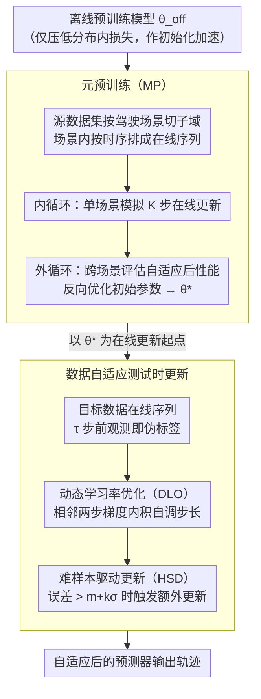

# MetaDAT: Generalizable Trajectory Prediction via Meta Pre-training and Data-Adaptive Test-Time Updating

**会议**: CVPR 2026  
**arXiv**: [2603.09419](https://arxiv.org/abs/2603.09419)  
**代码**: 无  
**领域**: 自动驾驶  
**关键词**: 轨迹预测, 测试时训练, 元学习, 分布偏移, 在线自适应

## 一句话总结

提出 MetaDAT 框架，通过元预训练获得适合在线自适应的模型初始化，并在测试时利用动态学习率优化和难样本驱动更新实现数据自适应的模型调整，在 nuScenes/Lyft/Waymo 跨数据集分布偏移场景下超越所有 TTT 方法。

## 研究背景与动机

**领域现状**：数据驱动的轨迹预测方法（ForecastMAE 等）在预收集数据集上表现优秀，但在测试时面临分布偏移（道路结构变化、交互模式差异、驾驶风格不同）时性能显著下降，构成安全隐患。

**测试时训练 (TTT) 的独特优势**：轨迹预测具有天然的"自标注"特性——当前时刻的观测即为过去预测的真实标签，因此可在测试时用真实观测在线更新模型，无需额外标注。

**现有 TTT 方法的两大瓶颈**：
   - **离线-在线目标不对齐**：现有离线预训练目标只优化分布内预测精度，忽略了模型的在线自适应能力。预训练得到的模型并非最优的在线更新起点，导致自适应速度慢、表征快速退化。
   - **固定在线更新策略**：传统方法使用固定学习率和更新频率，无法根据测试数据的特性（分布偏移程度、样本难度等）进行自适应调整。

**与已有元学习方法 AML 的区别**：AML 仅对解码器最后的贝叶斯线性回归层做元学习适配，限制了深层表征的自适应能力；MetaDAT 对全模型参数进行元预训练，释放完整自适应潜力。

## 方法详解

### 整体框架

MetaDAT 分为两个阶段：(1) **元预训练 (Meta Pre-training, MP)**：在源数据集上模拟 TTT 任务，通过双层优化获得适合在线自适应的模型初始化 $\theta^*$；(2) **数据自适应测试时更新**：在目标数据上通过动态学习率优化 (DLO) 和难样本驱动更新 (HSD) 实现自适应模型调整。预测器采用 ForecastMAE 架构（embedding + encoder + decoder + MAE 重建分支）。

### 关键设计

**1. 元预训练（Meta Pre-training, MP）：让预训练终点就是在线更新的好起点**

现有 TTT 方法的隐患在于离线预训练和在线自适应优化的根本不是一回事——标准预训练只管把训练损失压到最低，而 TTT 真正需要的是"经过几步梯度更新后能快速降到低损失"的参数，二者目标错位，于是预训练出来的模型一上线就自适应慢、表征还会快速退化。MP 用 MAML 风格的双层优化直接把这个目标显式写进训练里。它先把源数据集按驾驶场景切成子域（每个场景有自己独特的行为模式和道路结构），场景内按时间顺序排成在线序列 $\mathbf{S} = \{\mathbf{X}_0, \mathbf{X}_1, \ldots, \mathbf{X}_{t_s}\}$，这样就在训练阶段模拟出了真实的 TTT 任务。内循环在单个场景上模拟 $K$ 步在线更新 $\theta'_{i,\tau} = \theta'_{i,t-\tau} - \alpha_{in} \nabla \mathcal{L}^{i,t-\tau}_{mae}$，外循环再跨多个场景评估"自适应之后"的性能，反过来优化初始参数：

$$\theta \leftarrow \theta - \beta \nabla_\theta \sum_i \mathcal{L}^{i,K\tau}_{mae}$$

因此优化目标天然对准了"几步更新后表现好"。为压住开销，它用一阶近似绕开 Hessian 计算，并从离线预训练模型 $\theta_{off}$ 初始化来加速收敛。这也是和已有元学习方法 AML 的关键区别：AML 只对解码器最后一层做元适配，深层表征动不了；MP 对全模型参数元预训练，把完整的自适应潜力释放出来——消融里 MP 单独就贡献了最大幅提升，印证"目标对齐"才是核心瓶颈。

**2. 动态学习率优化（Dynamic Learning Rate Optimization, DLO）：让步长自己感知分布偏移有多大**

测试时的分布偏移程度是未知的，固定学习率注定两头不讨好：太大则训练不稳定，太小则适应太慢。DLO 的做法是把学习率本身也当成可优化变量。它假设最优学习率在相邻两步之间变化不大，于是用链式法则直接算出损失对学习率的偏导，本质上是相邻两步梯度方向的内积：

$$\frac{\partial \mathcal{L}_{mae}(\theta_{p-1})}{\partial \alpha} = -\nabla_\theta \mathcal{L}_{mae}(\theta_{p-1}) \cdot \nabla_\theta \mathcal{L}_{mae}(\theta_{p-2})$$

再据此对学习率做梯度上升 $\alpha_p = \alpha_{p-1} + \gamma \nabla_\theta \mathcal{L}_{mae}(\theta_{p-1}) \cdot \nabla_\theta \mathcal{L}_{mae}(\theta_{p-2})$，并在间隔 $\tau_\alpha$ 上对梯度做平均以稳住训练，每层网络各用一套独立学习率。它之所以有效，是因为两步梯度方向的一致性恰好编码了"数据是不是在朝同一个方向持续变化"——方向一致就说明该往这边多走、可以放大步长，方向反复则自动收住，省去了对学习率超参的手工调试。实验里 DLO 让模型在次优学习率下也能大幅回血（$\alpha=0.01$ 时把 T4P 的 mADE₆ 从 0.518 拉到 0.452）。

**3. 难样本驱动更新（Hard-Sample-Driven Model Updates, HSD）：把更新预算花在最该学的样本上**

自动驾驶数据是典型的长尾分布，那些涉及密集交互、严重依赖道路地图的场景占比很小，却恰恰是安全攸关、也最能代表当前目标域需要补课的内容。如果对每个样本一视同仁地更新，这些关键场景的信号会被淹没。HSD 用一个简单的统计准则把它们挑出来：维护预测误差的运行均值 $m$ 和标准差 $\sigma$，当某个样本的当前误差 $e$ 满足 $e > m + k\sigma$（$k=3$）时，就判定为难样本并触发一次额外更新。这样把有限的更新预算集中投到信息量最高的尾部样本上，在不拖累整体效率的前提下进一步抬高精度。

### 损失函数 / 训练策略

- **预训练损失**：$\mathcal{L}_{mae} = \mathcal{L}_{reg}(\mathbf{X}, \mathbf{Y}) + \mathcal{L}_{recon}(\mathbf{X}, \mathbf{Y})$，即预测回归损失 + MAE 重建损失联合训练
- **TTT 损失**：同上，利用 $\tau$ 时间间隔前的观测作为伪标签在线更新
- **训练流程**：离线预训练 → 元预训练（8 epochs，batch=4，内循环 $K=4$ 步，AdamW+cosine decay） → 测试时在线 DLO+HSD 自适应更新
- 使用 actor-specific tokens $a_n$ 在 TTT 阶段学习个体驾驶习惯

## 实验关键数据

### 主实验

| 设置 | 指标 | MetaDAT | T4P (前SOTA) | 提升 |
|------|------|---------|-------------|------|
| 短期预测 (1/3/0.1) 三场景均值 | mADE₆/mFDE₆ | **0.301/0.648** | 0.339/0.744 | 11.2%/12.9% |
| Lyft→nuScenes 短期 | mADE₆/mFDE₆ | **0.332/0.683** | 0.357/0.770 | 7.0%/11.3% |
| nuScenes→Waymo 短期 | mADE₆/mFDE₆ | **0.305/0.712** | 0.336/0.807 | 9.2%/11.8% |
| Waymo→nuScenes 短期 | mADE₆/mFDE₆ | **0.266/0.548** | 0.323/0.656 | 17.6%/16.5% |
| 长期预测 (2/6/0.5) 均值 | mADE₆/mFDE₆ | **0.912/2.011** | 1.014/2.311 | 10.1%/13.0% |

### 消融实验

| 配置 | 短期 mADE₆/mFDE₆ (Lyft→nuS) | 长期 mADE₆/mFDE₆ (nuS→Lyft) | 说明 |
|------|------------------------------|-------------------------------|------|
| Baseline (T4P*) | 0.408/0.847 | 0.711/1.578 | 无任何改进 |
| +MP | 0.355/0.734 | 0.672/1.491 | 元预训练带来最大提升 |
| +DLO | 0.376/0.776 | 0.684/1.538 | 动态学习率有效 |
| +HSD | 0.400/0.836 | 0.707/1.552 | 难样本更新轻微提升 |
| +MP+DLO | 0.347/0.702 | 0.650/1.468 | 两模块互补 |
| +MP+DLO+HSD (Full) | **0.332/0.683** | **0.648/1.472** | 三模块联合最优 |

### 关键发现

1. **元预训练是最大贡献者**：单独使用 MP 在短期/长期均带来最大幅提升（短期 mADE₆ 降低 13%），验证了"离线-在线目标对齐"是核心瓶颈
2. **学习率鲁棒性**：DLO 使 T4P 在次优学习率下性能大幅改善（α=0.01 时 mADE₆ 从 0.518 降至 0.452），MetaDAT 进一步降至 0.407
3. **效率优势**：在相同 FPS 约束下，MetaDAT 在精度-效率 Pareto 前沿上始终优于 T4P
4. **少样本适应**：仅用 2000 个样本即可达到 T4P 用 10000 样本的性能水平（0.327 vs 0.343 mADE₆）
5. **多模态预测**：在 mADE₁ 和 MR₆ 指标上也全面胜出，水平和垂直方向预测多样性均有提升

## 亮点与洞察

1. **问题定义精准**：将 TTT 的失败归因为"离线-在线目标不对齐"，并用 MAML 框架优雅解决——这是轨迹预测 TTT 领域的关键洞察
2. **自标注特性的充分利用**：轨迹预测的"观测即标签"天然适合 TTT，本文通过元学习将这一特性的潜力发挥到极致
3. **DLO 的理论推导简洁实用**：利用相邻步梯度方向一致性自动调节学习率，避免了超参数敏感性问题，且计算开销极小
4. **三模块互补性好**：MP 管初始化、DLO 管学习率、HSD 管样本选择，分别针对不同层面的问题，组合后持续提升

## 局限与展望

1. **依赖精确的在线检测/跟踪**：TTT 需要用观测到的轨迹作为训练标签，但实际感知系统存在噪声——噪声标签可能导致在线适应退化
2. **一阶 MAML 近似**：使用一阶近似虽然降低了计算成本，但可能牺牲了元学习的精确性
3. **仅考虑跨数据集偏移**：未评估同数据集内的天气/光照等 domain shift，实用性需进一步验证
4. **未考虑多预测器协同**：在多智能体系统中，单个预测器的在线更新可能不够

## 相关工作与启发

- **T4P** [AAAI'24]：当前 SOTA TTT 轨迹预测方法，引入 MAE 损失和 actor-specific tokens — MetaDAT 的直接竞争对手和 baseline
- **AML**：另一元学习方法，仅适配解码器最后层 — MetaDAT 证明全模型元训练更有效
- **MAML** [Finn et al.]：经典元学习框架 — MetaDAT 将其应用于 TTT 场景，创新点在 TTT 任务模拟和数据自适应更新
- **启发**：DLO 的"用偏导数优化超参"思路可推广到其他在线学习场景（如在线检测、在线建图）

## 评分

- 新颖性: ⭐⭐⭐⭐ 元预训练解决离线-在线不对齐是清晰的创新，DLO 理论推导简洁
- 实验充分度: ⭐⭐⭐⭐ 三个大规模数据集、多种偏移配置、完善的消融和鲁棒性分析
- 写作质量: ⭐⭐⭐⭐ 问题动机清晰，框架图直观，但部分数学推导可更精简
- 价值: ⭐⭐⭐⭐ 实用性强（鲁棒性、效率、少样本），对自动驾驶在线部署有直接参考价值
- 价值: 待评

<!-- RELATED:START -->

## 相关论文

- [\[CVPR 2026\] Den-TP: A Density-Balanced Data Curation and Evaluation Framework for Trajectory Prediction](den_tp_a_density_balanced_data_curation_and_evaluation_framework_for_trajectory.md)
- [\[CVPR 2026\] TT-Occ: Test-Time 3D Occupancy Prediction](test-time_3d_occupancy_prediction.md)
- [\[CVPR 2026\] DLWM: Dual Latent World Models enable Holistic Gaussian-centric Pre-training in Autonomous Driving](dlwm_dual_latent_world_models_enable_holistic_gaussian-centric_pre-training_in_a.md)
- [\[ECCV 2024\] Adaptive Human Trajectory Prediction via Latent Corridors](../../ECCV2024/autonomous_driving/adaptive_human_trajectory_prediction_via_latent_corridors.md)
- [\[AAAI 2026\] Meta Dynamic Graph for Traffic Flow Prediction](../../AAAI2026/autonomous_driving/meta_dynamic_graph_for_traffic_flow_prediction.md)

<!-- RELATED:END -->
