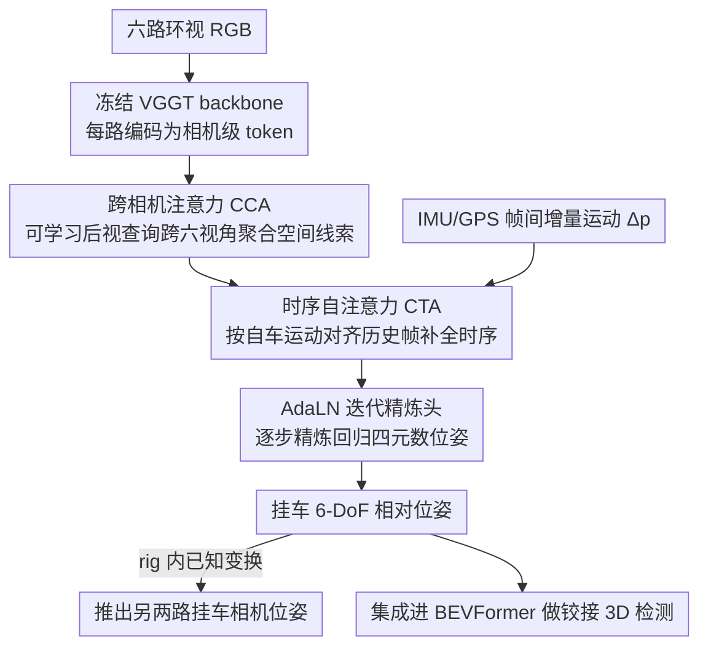

# Mind the Hitch: Dynamic Calibration and Articulated Perception for Autonomous Trucks

**会议**: CVPR 2026  
**arXiv**: [2603.23711](https://arxiv.org/abs/2603.23711)  
**代码**: 即将开源（论文声明将公开数据集、开发工具包和源代码）  
**领域**: 3D视觉 / 自动驾驶  
**关键词**: 自动驾驶卡车, 动态标定, 铰接感知, 挂车位姿估计, BEV检测

## 一句话总结

提出 dCAP 框架，通过基于 Transformer 的跨视角和时序注意力机制，实现拖挂式自动驾驶卡车中拖头与挂车之间的实时 6-DoF 相对位姿估计，并集成到 BEVFormer 中提升铰接运动下的 3D 目标检测性能（平移误差 0.452m，旋转误差 0.042 rad）。

## 研究背景与动机

1. **领域现状**：自动驾驶主要针对刚性车辆设计（如轿车、SUV），传感器标定假设固定不变的外参。nuScenes、Waymo 等数据集和 BEVFormer 等感知模型都基于刚性车体假设。

2. **现有痛点**：拖挂式卡车的拖头和挂车通过第五轮连接（fifth-wheel coupling），形成铰接结构。这导致：(a) 传感器外参随时间变化；(b) 悬挂运动、载重变化、刹车俯仰导致标定持续漂移；(c) 拖头和挂车可能属于不同公司，一个拖头可能连接多个挂车。

3. **核心矛盾**：现有多视角感知系统（BEVFormer 等）假设固定基线，当铰接角变化时极线几何漂移，静态标定在毫秒级就可能过时。传统 SfM 方法（如 COLMAP）在弱视差、重复纹理、滚动快门等条件下失效。

4. **本文目标** (a) 连续在线估计挂车相对于拖头的 6-DoF 位姿；(b) 在大角度铰接和遮挡场景下保持鲁棒；(c) 将动态标定集成到下游 3D 检测中。

5. **切入角度**：利用拖挂卡车的结构先验——拖头和挂车各自内部是刚性的，只有rig间变换随时间变化。这大幅简化了问题：只需预测一个挂车后部相机的位姿，其余两个挂车相机位姿通过已知 rig 内变换推导。

6. **核心 idea**：端到端 Transformer 直接回归挂车动态位姿，结合跨视角空间注意力和时序自注意力实现铰接感知的在线标定。

## 方法详解

### 整体框架

dCAP 要解决的是一个被刚性车体假设掩盖的问题：拖头与挂车通过第五轮铰接，挂车后部相机的外参随转向、悬挂、载重不停漂移，必须逐帧在线估计它相对拖头的 6-DoF 位姿。整条管线这样转：先用一个**冻结的 VGGT backbone** 把六路环视 RGB 各编码成一个相机级 token；这些 token 进入一个轻量解码器，先经**跨相机注意力 (CCA)** 在六个视角间聚合空间线索，再经**时序自注意力 (CTA)** 借自车运动对齐历史帧补全时序信息；最后由一个 **AdaLN 调制的迭代精炼头**把聚合特征逐步精炼成四元数表示的位姿。这里关键的简化来自结构先验——拖头和挂车各自内部刚性，只有 rig 间变换会变，所以模型只需预测一个后视相机的位姿，另两个挂车相机靠已知 rig 内变换推出来。配套的 STT4AT 数据集（基于 CARLA）用于训练与评估。

### 关键设计

**1. 跨相机注意力 CCA：让挂车的位姿线索从最有信息量的那个视角浮出来**

挂车的位姿证据并不集中在某一路相机里——前视相机看得见挂车顶部、侧视相机能瞥到铰接区域、后视相机才正对挂车主体，单看一路都不够。CCA 的做法是引入一个**可学习的后视相机查询** $Q$，让它通过多头交叉注意力主动去六路相机 token 里挑相关信息：$Q' = \text{MHA}(Q, \{T_i\}_{i=1}^6, \{T_i\}_{i=1}^6)$；为了不丢掉"哪个 token 来自哪路相机"的空间身份，给每个 token 加了相机索引位置编码，最后再把交叉注意的结果与原始后视 token 残差融合。这样模型不是被动接收六路特征的拼接，而是按当前铰接姿态自适应地从最能看清挂车的视角取证，因此在低铰接角、几何对应清晰的场景里旋转误差最优（RRA 0.048）。

**2. 时序自注意力 CTA：用自车运动把上一帧的线索搬到当前帧补盲**

急转弯、U 型转弯这类高铰接角场景里，挂车常被自身或环境遮挡，单帧空间信息根本不足以定位。CTA 的思路是把历史帧的线索"搬正"再用：先由 IMU/GPS 算出帧间自车增量运动 $\Delta p_t = (\Delta x, \Delta y, \Delta \psi)$，经一个线性变换投到特征空间去对齐上一帧的 token

$$\tilde{T}_{t-1} = T_{t-1} + W_\Delta \Delta p_t + b_\Delta$$

再让当前全局 token 对这份对齐过的历史 token 做时序自注意力 $G'_t = G_t + \text{MHA}(G_t, \tilde{T}_{t-1}, \tilde{T}_{t-1})$（队列长度设为 3）。关键在于"位姿感知"的对齐——直接拿原始历史特征会因自车已经移动而错位漂移，先按 $\Delta p_t$ 补偿后再融合才不会引入漂移，这让 CTA 在 U 型转弯下把平移误差降了 36.8%，正好补上 CCA 在大角度下的短板。

**3. AdaLN 调制的迭代精炼头：把位姿回归当成逐步优化而非一次性预测**

位姿估计本质上更像迭代优化而非单次回归，一步到位往往欠拟合大角度情况。精炼头用 $L$ 个堆叠 Transformer 块反复修正当前估计，每块都用当前位姿嵌入预测出一组调制参数 $(\alpha, \beta, \gamma)$，去做 AdaLN + 仿射调制 + 门控残差

$$\hat{x} = \gamma \odot \big(\text{AdaLN}(x) \odot (1+\beta) + \alpha\big) + x$$

末端 MLP 头输出四元数形式的 6-DoF 位姿，整个过程迭代 3 步。这样每一步精炼都能"看着"当前估计去调整特征处理方式，思路与 RAFT 的迭代更新一脉相承，比单次回归更稳地收敛到大铰接角下的正确位姿。

### 损失函数 / 训练策略

- 组合损失：$L = w_{\text{trans}} L_{\text{trans}} + w_{\text{rot}} L_{\text{rot}}$，权重均为 1.0
- 平移和旋转损失均使用 $\ell_1$ 形式
- Adam 优化器，学习率 $1 \times 10^{-4}$，batch size 4，训练 24 epochs
- 编码器完全冻结，仅训练解码器组件（CCA、CTA、精炼头）
- 单卡 NVIDIA RTX A6000 即可完成训练

## 实验关键数据

### 主实验

**STT4AT 挂车位姿估计结果：**

| 方法 | $\Delta_T$↓ | $\Delta_x$↓ | $\Delta_y$↓ | $\Delta_z$↓ | RRA↓ |
|------|------------|------------|------------|------------|------|
| 静态标定 | 1.284 | 0.210 | 1.120 | 0.356 | 0.148 |
| VGGT | 6.040 | 2.761 | 3.082 | 3.634 | 0.309 |
| DUSt3R | 8.625 | 4.664 | 5.080 | 2.953 | 0.578 |
| GNSS-IMU KF | 1.379 | 0.309 | 1.116 | 0.431 | 0.129 |
| **dCAP (完整)** | **0.452** | **0.061** | **0.421** | **0.085** | **0.042** |

**BEVFormer 3D 目标检测结果：**

| 方法 | AP↑ | NDS↑ | ATE↓ | AOE↓ |
|------|-----|------|------|------|
| 静态标定 | 0.058 | 0.033 | 0.734 | 0.153 |
| VGGT | 0.033 | 0.031 | 0.671 | 0.202 |
| dCAP (完整) | **0.103** | **0.036** | **0.675** | **0.116** |
| GT (上界) | 0.129 | 0.039 | 0.513 | 0.105 |

### 消融实验

| 配置 | $\Delta_T$↓ | RRA↓ | 说明 |
|------|------------|------|------|
| w/o CCA, w/o CTA | 0.632 | 0.073 | 基线 |
| w/ CCA only | 0.505 | 0.048 | 旋转误差最优（空间） |
| w/ CTA only | 0.452 | 0.058 | 平移误差最优（时序） |
| w/ CCA + CTA | 0.452 | 0.042 | 两项均最优 |

**场景分析（CCA vs CTA）：**

| 场景 | CCA $\Delta_T$ | CTA $\Delta_T$ | CTA 相对优势 |
|------|----------------|----------------|-------------|
| 直行 | 0.517 | 0.459 | -11.2% |
| 环岛 | 0.675 | 0.475 | -29.6% |
| U型转弯 | 1.117 | 0.706 | -36.8% |
| 多转弯 | 0.361 | 0.423 | +17.2% (CCA更优) |

### 关键发现

- **CCA 和 CTA 互补**：CCA 擅长低铰接角场景（空间几何对应主导），CTA 在高铰接角场景表现突出（U型转弯下平移误差减少 36.8%）
- **VGGT/DUSt3R 在卡车场景完全失效**：平移误差 6-8m，远差于静态标定（1.28m）。原因是弱视差、重复纹理、近距离遮挡
- **COLMAP 无法初始化**：缺乏有效初始图像对，直接失败
- **dCAP 接近 GT 上界**：AP 0.103 vs GT 0.129（差距 20%），说明动态标定是解决铰接感知的关键
- **整体 AP 仍然较低**：这是预期的，因为 BEVFormer 为刚性车辆设计，高架摄像头和移动挂车相机的组合超出其设计假设

## 亮点与洞察

- **问题定义的价值**：首次系统性地研究自动驾驶卡车中的铰接感知问题，提出了完整的问题形式化+数据集+方法+评估框架。这是一个工业界急需但学术界忽视的问题
- **结构先验的利用**：利用"rig 内刚性，rig 间可变"的约束将问题简化——只需估计一个相机位姿，其余通过已知变换推导。这比通用 SfM 高效得多
- **CCA/CTA 的互补分析**：详尽的场景分析揭示了空间注意力和时序注意力在不同机动条件下的互补特性，为自动驾驶中的多模块设计提供了有价值的设计指导

## 局限与展望

- **仿真数据局限**：STT4AT 基于 CARLA 仿真器，真实世界中的光照变化、天气条件、传感器噪声等可能带来额外挑战
- **BEVFormer 架构限制**：当前 AP 仍低（0.103），部分原因是 BEVFormer 不是为铰接车辆设计的。需要开发专门的铰接感知检测架构
- **传感器依赖**：需要 GPS-IMU 提供自车运动信息，在 GPS 信号弱的场景（隧道、城市峡谷）可能受影响
- **可改进方向**：(a) 收集真实卡车数据验证 sim-to-real 迁移；(b) 设计专门的铰接 BEV 检测器替代 BEVFormer；(c) 探索纯视觉的自车运动估计替代 GPS-IMU

## 相关工作与启发

- **vs TruckV2X**: TruckV2X 假设已知 oracle 相对位姿，不切实际；dCAP 提供了实际可用的在线位姿估计
- **vs VGGT/DUSt3R**: 这些通用 3D 重建方法在铰接卡车场景失效（误差 6-8m），说明通用方法无法替代领域特定的设计
- **vs UniCal/CaLiV**: 这些标定方法假设固定传感器几何，不适用于铰接系统的动态标定

## 评分

- 新颖性: ⭐⭐⭐⭐ 问题定义很新（首个铰接卡车动态标定方法），但方法组件（Transformer + 注意力）较为标准
- 实验充分度: ⭐⭐⭐⭐ 基准对比全面，消融实验详尽（含场景级分析），但缺少真实数据验证
- 写作质量: ⭐⭐⭐⭐ 问题定义清晰，数据集描述详尽，方法表述条理分明
- 价值: ⭐⭐⭐⭐ 填补了自动驾驶卡车铰接感知的空白，STT4AT 数据集对社区有独立价值

<!-- RELATED:START -->

## 相关论文

- [\[CVPR 2026\] LiDAS: Lighting-driven Dynamic Active Sensing for Nighttime Perception](lidas_lighting-driven_dynamic_active_sensing_for_nighttime_perception.md)
- [\[CVPR 2026\] Perception Characteristics Distance: Measuring Stability and Robustness of Perception System in Dynamic Conditions under a Certain Decision Rule](perception_characteristics_distance_measuring_stability_and_robustness_of_percep.md)
- [\[CVPR 2026\] DynamicVGGT: Learning Dynamic Point Maps for 4D Scene Reconstruction in Autonomous Driving](dynamicvggt_learning_dynamic_point_maps_for_4d_scene_reconstruction_in_autonomou.md)
- [\[CVPR 2026\] LiREC-Net: A Target-Free and Learning-Based Network for LiDAR, RGB, and Event Calibration](lirec-net_a_target-free_and_learning-based_network_for_lidar_rgb_and_event_calib.md)
- [\[CVPR 2026\] Query2Uncertainty: Robust Uncertainty Quantification and Calibration for 3D Object Detection under Distribution Shift](query2uncertainty_robust_uncertainty_quantification_and_calibration_for_3d_objec.md)

<!-- RELATED:END -->
