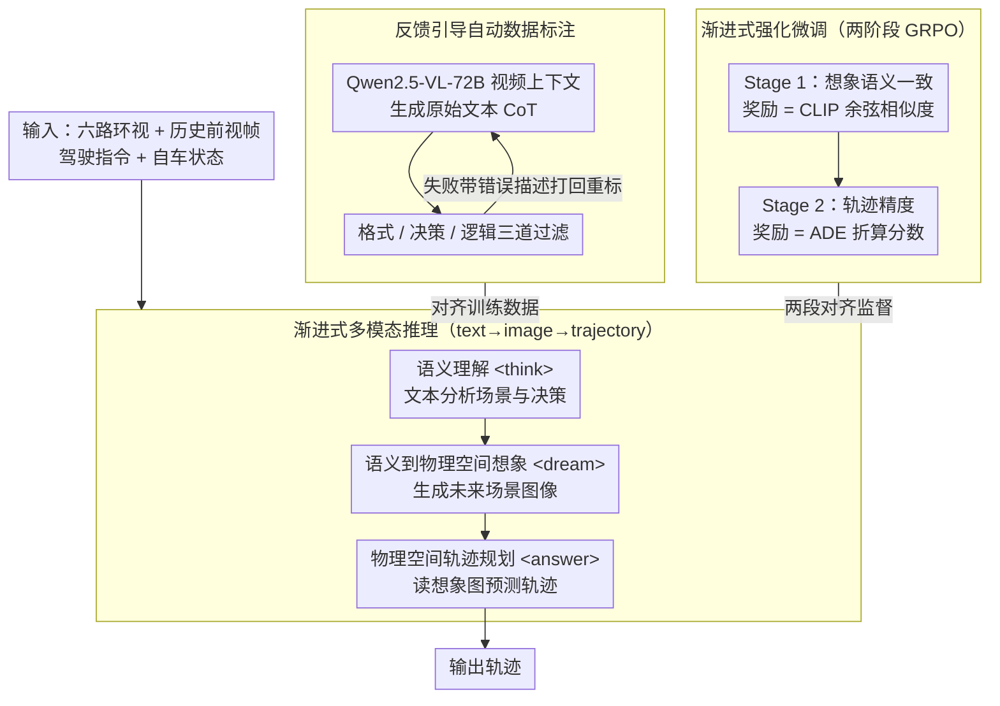

# MindDriver: Introducing Progressive Multimodal Reasoning for Autonomous Driving

**会议**: CVPR 2026  
**arXiv**: [2602.21952](https://arxiv.org/abs/2602.21952)  
**代码**: [https://github.com/hotdogcheesewhite/MindDriver](https://github.com/hotdogcheesewhite/MindDriver)  
**领域**: 自动驾驶  
**关键词**: 多模态推理, Chain-of-Thought, VLM自动驾驶, 渐进式推理, 强化微调

## 一句话总结
提出渐进式多模态推理框架 MindDriver，模仿人类"感知→想象→行动"机制——先文本语义理解，再想象未来场景图像（桥接语义和物理空间），最后预测轨迹，配合反馈引导数据标注和渐进式强化微调，在 nuScenes 开环和 Bench2Drive 闭环评估上均取得最优表现。

## 研究背景与动机

**领域现状**：VLM 正被用于端到端自动驾驶——直接从原始传感器预测轨迹。Chain-of-Thought 推理被引入以增强场景推理和可解释性。

**现有痛点**：(a) 文本 CoT 在语义空间推理后直接预测物理空间轨迹，存在**空间不对齐**——语义空间和轨迹物理空间之间跨度太大，导致决策错位；(b) 近期用未来图像替代文本做 CoT（如 FSDrive），但缺乏以规划为导向的目标指引，模型不清楚该关注哪些物体，且未能利用 LLM 大规模预训练的驾驶知识。

**核心矛盾**：语义空间的推理能力（来自 LLM 预训练）和物理空间的轨迹预测之间需要一个**对齐的桥梁**——既能利用语义知识又能连接物理空间。

**本文目标** 设计从语义到物理的渐进式平滑推理路径；解决多模态推理训练数据缺乏和对齐不充分的问题。

**切入角度**：人类驾驶的"感知-想象-行动"心理模型——先理解场景（语义），再想象未来变化（图像），再基于想象规划行动（轨迹）。

**核心 idea**：用文字推理引导未来场景图像生成，再用想象的图像引导轨迹预测，实现 text→image→trajectory 的渐进对齐。

## 方法详解

### 整体框架
MindDriver 以六路环视相机图像、历史前视帧、驾驶指令和自车状态为输入，通过统一的文本推理+视觉生成模型执行三阶段渐进推理：(1) 语义理解（Semantic Understanding，文本分析场景和决策）→ (2) 语义到物理空间想象（Semantic-to-Physical Imagination，基于文本生成未来场景图像）→ (3) 物理空间轨迹规划（Physical-Space Trajectory Planning，基于想象图像预测轨迹）。配套反馈引导自动数据标注流水线和渐进式强化微调来生成对齐训练数据、分段优化跨模态对齐。

### 关键设计

**1. 渐进式多模态推理：用图像把语义推理和物理轨迹缝起来**

直接让模型从文本推理一步跳到轨迹，跨度太大——LLM 擅长在语义空间讲清"前方有行人、该减速"，但把这套语义直接翻译成米级坐标时缺乏中间落点，于是决策容易错位。MindDriver 把这一跳拆成 text→image→trajectory 三步，并用三种特殊 token 在同一段自回归序列里划出阶段边界：`<think>` 包裹文本场景分析，`<dream>` 包裹想象出的未来场景图像，`<answer>` 包裹最终轨迹。图像之所以是理想的中间载体，是因为它本身就同时携带语义（认出了什么物体）和物理（物体在画面里的位置），正好把语义推理和物理预测两端接上。要让一个模型既能吐文本 token 又能吐视觉 token，作者把 VQ-VAE 的 visual codebook 直接并进 LLM 的 vocabulary，文本和视觉共享同一个预测头、走同一个自回归目标 $\mathcal{L} = -\sum_i \log P_\theta(y_i \mid y_{<i})$，于是"想象一张图"就退化成"多生成一段视觉 token"，无需额外的扩散分支。

**2. 反馈引导自动数据标注：让标注链自己挑错、带反馈重写**

这条 text→image→trajectory 的推理链没有现成训练数据，手动标注又不现实——没人能逐帧写出对齐良好的多模态推理过程。作者于是搭了一条自动标注流水线：先用 Qwen2.5-VL-72B 基于**视频上下文**（多帧，而非单帧）生成原始文本 CoT，多帧输入能捕捉物体的运动趋势，让场景分析和潜在风险评估不只看一张静态图。生成的 CoT 再过三道过滤——格式过滤用规则检查结构是否完整，决策过滤把推理得出的决策和从 GT 轨迹反推的 GT 决策比对，逻辑过滤则换一个更强的纯文本 LLM（Qwen3-235B）评估推理是否合理，刻意不让标注模型自己当裁判以避免自检偏差。关键在于失败样本不是直接丢弃，而是带着具体错误描述（格式哪里坏、决策偏了多少、逻辑哪步不通）打回重标注，这个反馈闭环让数据质量逐轮收敛，而不是一次性生成、一次性筛掉。

**3. 渐进式强化微调：分两阶段、各管一段对齐**

标准 SFT 对序列里每个 token 等权重监督，结果模型倾向于把流畅的文本写好，而牺牲掉文本→图像、图像→轨迹这两处真正要紧的跨模态对齐。MindDriver 改用 GRPO 做两阶段强化微调，每阶段只盯一段对齐。Stage 1（Dream Semantically Consistent Image）优化"文本推理→未来场景图像"这一跳，奖励直接量化想象图和真值图的语义一致性：

$$r_{Img} = \text{CosSim}\big(E_{CLIP}(I_{dream}),\, E_{CLIP}(I_{GT})\big)$$

Stage 2（Predict Precise Trajectory）再优化"想象图像→轨迹"这一跳，奖励换成几何精度，用平均位移误差 ADE 折算成分数：

$$r_{L2} = (\lambda - ADE) / \alpha$$

先把语义对齐练稳、再练轨迹精度，这种分段奖励比端到端 SFT 更有的放矢——每个阶段的优化目标和它要修的那处对齐严格对应，不会让一个笼统的 loss 同时去管两件不同性质的事。

### 一个完整示例：一次路口减速的三段推理

以一帧"前方路口有行人横穿"的环视输入走一遍。**Semantic Understanding** 阶段，模型在 `<think>` 里基于多帧视频读出场景：右前方行人正从人行道走向车道、运动趋势是横穿，结合驾驶指令"直行"判断当前决策应为减速让行——这一步纯文本，调用的是 LLM 预训练里的驾驶常识。**Semantic-to-Physical Imagination** 阶段，模型在 `<dream>` 里把这段语义落成一张未来场景图像：行人已走到车道中央、自车视角下其位置明显前移，图像同时编码了"是谁"（行人）和"在哪"（车道内某像素位置），把语义判断锚定到了物理画面上。**Trajectory Planning** 阶段，模型在 `<answer>` 里读这张想象图，预测出一条先减速、横向微让的轨迹。三步在同一段自回归序列里连续生成，前一步的 token 直接作为后一步的上文条件，所以语义判断、空间想象、轨迹输出是层层递进而非各自为政。

### 损失函数 / 训练策略
- SFT 阶段：学习率 1e-4，batch 32，nuScenes 12 epochs / Bench2Drive 6 epochs
- RFT 阶段：学习率 3e-6，batch 16，Stage 1: 700 steps + Stage 2: 500 steps（nuScenes）
- 基座模型：Qwen2.5-VL-3B + MoVQGAN detokenizer
- 16 张 Nvidia H20 训练

## 实验关键数据

### 主实验（nuScenes 开环，有 ego status）

| 方法 | L2 Avg↓ (ST-P3) | CR Avg↓ (ST-P3) | L2 Avg↓ (UniAD) | CR Avg↓ (UniAD) |
|------|-----------------|-----------------|-----------------|-----------------|
| VAD (ICCV23) | 0.37 | 0.33 | - | - |
| BEV-Planner (CVPR24) | 0.35 | 0.34 | - | - |
| FSDrive (NeurIPS25) | 0.35 | 0.14 | 0.67 | 0.32 |
| AutoVLA (NeurIPS25) | 0.48 | 0.13 | 0.86 | 0.35 |
| **MindDriver** | **0.33** | **0.12** | **0.65** | **0.20** |

### Bench2Drive 闭环

| 方法 | DS↑ | SR(%)↑ | Effi↑ | Comf↑ |
|------|-----|--------|-------|-------|
| UniAD-Base (CVPR23) | 45.81 | 16.36 | 129.21 | 43.58 |
| ReasonPlan (CoRL25) | 64.01 | 34.55 | 180.64 | 25.63 |
| AutoVLA (NeurIPS25) | 78.84 | 57.73 | 146.93 | 39.33 |
| **MindDriver** | **65.48** | **39.55** | **143.21** | **34.63** |

### 未来帧生成

| 方法 | FID↓ |
|------|------|
| Drive-WM (CVPR24) | 15.8 |
| GEM (CVPR25) | 10.5 |
| FSDrive (NeurIPS25) | 10.1 |
| **MindDriver** | **9.4** |

### 关键发现
- **开环显著领先**：MindDriver 在 UniAD 计算方式下碰撞率仅 0.20%，较 FSDrive（0.32%）和 AutoVLA（0.35%）大幅降低，说明渐进推理确实改善了轨迹安全性
- **闭环有竞争力但非最优**：DS 65.48 vs AutoVLA 78.84，注意 AutoVLA 不在 Bench2Drive 训练集上训练（用‡标记），条件不同
- **图像生成质量最佳**：FID 9.4 vs FSDrive 10.1，说明文本引导确实提升了未来场景生成的质量
- **无 ego status 时提升更大**：不使用车辆状态时，MindDriver L2 0.53 vs FSDrive 0.55，对齐的渐进推理在信息受限时优势更明显

## 亮点与洞察
- **"感知-想象-行动"认知启发设计**：将人类驾驶心理模型形式化为可训练的多模态推理链，text→image→trajectory 的渐进路径比直接跳跃更自然
- **图像作为语义到物理的桥梁**：图像天然融合语义信息（场景理解）和物理信息（空间位置），是 CoT 中间步骤的理想载体
- **渐进式 RFT 的分阶段奖励设计**：Stage 1 用 CLIP 语义奖励优化想象对齐，Stage 2 用 L2 几何奖励优化轨迹——比端到端 SFT 更有针对性
- **视频上下文 CoT 而非单帧**：多帧输入捕获物体运动趋势，比静态帧推理更准确

## 局限与展望
- **闭环表现与 AutoVLA 有差距**：DS 65.48 vs 78.84，可能因为渐进推理增加了推理延迟影响实时决策
- **图像生成增加推理开销**：生成未来场景图像需要额外计算，影响实时性
- **依赖图像生成质量**：如果想象的图像不准确会误导轨迹预测（error cascading）
- **仅 3B 模型**：更大的 VLM 是否能进一步提升渐进推理效果未探索
- 改进方向：轻量化图像生成（如仅生成关键区域的语义图而非完整图像）；多步想象扩展

## 相关工作与启发
- **vs FSDrive (NeurIPS25)**：FSDrive 用图像替代文本做 CoT，但缺乏文本引导——MindDriver 先文本推理再引导图像生成，FID 从 10.1 降到 9.4
- **vs AutoVLA (NeurIPS25)**：AutoVLA 采用自适应推理长度+视频 CoT，闭环更强（78.84 vs 65.48），但开环碰撞率更高（0.35 vs 0.20）
- **vs EMMA (Waymo)**：EMMA 用层次化文本 CoT，仍面临语义-物理空间不对齐问题；MindDriver 引入图像桥梁解决这一根本问题

## 评分
- 新颖性: ⭐⭐⭐⭐⭐ 渐进式多模态推理是自动驾驶 CoT 方向的重要范式创新
- 实验充分度: ⭐⭐⭐⭐ 开环+闭环+未来帧生成+消融，但闭环对比条件不完全公平
- 写作质量: ⭐⭐⭐⭐ 动机清晰，认知类比直观，pipeline 图示详尽
- 价值: ⭐⭐⭐⭐⭐ 为 VLM 驱动的自动驾驶提供了新范式，数据标注流水线有复用价值

<!-- RELATED:START -->

## 相关论文

- [\[CVPR 2026\] DriveCombo: Benchmarking Compositional Traffic Rule Reasoning in Autonomous Driving](drivecombo_benchmarking_compositional_traffic_rule_reasoning_in_autonomous_drivi.md)
- [\[CVPR 2026\] PanDA: Unsupervised Domain Adaptation for Multimodal 3D Panoptic Segmentation in Autonomous Driving](panda_unsupervised_domain_adaptation_for_multimodal_3d_panoptic_segmentation_in_.md)
- [\[CVPR 2026\] ColaVLA: Leveraging Cognitive Latent Reasoning for Hierarchical Parallel Trajectory Planning in Autonomous Driving](colavla_leveraging_cognitive_latent_reasoning_for_hierarchical_parallel_trajecto.md)
- [\[CVPR 2026\] Perceiving the Near, Reasoning the Distant: Coherent Long-Horizon Trajectory Prediction for Autonomous Driving](perceiving_the_near_reasoning_the_distant_coherent_long-horizon_trajectory_predi.md)
- [\[CVPR 2026\] HybridDriveVLA: Vision-Language-Action Model with Visual CoT reasoning and ToT Evaluation for Autonomous Driving](hybriddrivevla_vision-language-action_model_with_visual_cot_reasoning.md)

<!-- RELATED:END -->
