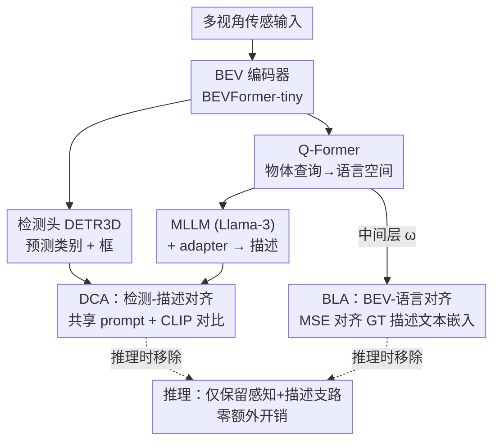

# MTA: Multimodal Task Alignment for BEV Perception and Captioning

**会议**: CVPR 2026  
**论文**: [CVF Open Access](https://openaccess.thecvf.com/content/CVPR2026/html/Ma_MTA_Multimodal_Task_Alignment_for_BEV_Perception_and_Captioning_CVPR_2026_paper.html)  
**代码**: 无（论文未提供）  
**领域**: 自动驾驶 / 多模态VLM / BEV感知  
**关键词**: BEV 感知, 3D 稠密描述, 多模态对齐, 跨模态 prompting, 训练时对齐  

## 一句话总结
MTA 给「BEV 3D 检测 + 3D 稠密描述」这对一向各做各的任务搭了两座对齐桥——BLA 用 GT 描述的文本表示监督 Q-Former 的 BEV 物体查询、DCA 用可学习 prompt 把检测输出和描述输出拉进共享空间做对比对齐——两个模块只在训练时生效、推理零额外开销，却让检测 mAP 涨 4.9%、描述 CIDEr 涨 9.2%。

## 研究背景与动机
**领域现状**：自动驾驶里 BEV（鸟瞰图）3D 感知已是主流——多视角相机/LiDAR 信息融成统一俯视表示，再喂给检测头做 3D 检测。随着多模态大模型（MLLM）兴起，又冒出 BEV 3D 稠密描述任务：从 BEV 特征 + 检测输出里抽信息、用 MLLM 生成描述物体位置/行为的自然语言（代表作 TOD3Cap）。

**现有痛点**：现有工作把感知和描述当成**两条互不相干的线**——一派只做 BEV 检测、不报描述性能（如 BEVFormer）；另一派只做描述、不报检测性能（如 TOD3Cap 原文连检测数都没给）。即便像 TOD3Cap 这种「同时训两个任务」的多任务框架，两个任务头也是各自独立优化，检测损失和语言建模损失之间没有任何对齐约束。

**核心矛盾**：检测和描述其实**不是互斥而是互补**——准确的检测框/类别能让描述更准（少幻觉），而语言层面的场景理解反过来也能强化 BEV 表示的判别力。但 MLLM 从没在预训练里见过 BEV 特征，BEV 视觉空间与 MLLM 语言空间之间存在比普通视觉 token 更大的对齐鸿沟；同时检测输出（类别标签 + 框坐标）与描述输出（语言 token logits）模态差异巨大，直接对齐两者反而会两边都掉点。

**本文目标**：在不改架构、不加推理开销的前提下，引入对齐机制让两个任务**互相促进**，把对齐拆成「BEV↔语言」和「检测↔描述」两个子问题分别攻克。

**切入角度**：对齐不必在最终输出层硬碰硬。BEV↔语言对齐放在 Q-Former 中间层、用 GT 描述的文本表示做监督；检测↔描述对齐则借一组可学习 prompt 把异构输出投到共享空间再做对比。

**核心 idea**：用两个仅训练时生效的对齐损失（BLA + DCA），把感知与描述这两条并行支路在表示层与输出层各缝一针。

## 方法详解

### 整体框架
MTA 沿用 TOD3Cap 的双支路架构：**感知支路**（BEV 编码器如 BEVFormer-tiny → 检测头 DETR3D，出类别和框）与**描述支路**（Q-Former 把每个检测物体的 BEV 特征映到语言空间 → MLLM 如 Llama-3 + adapter 生成描述）。MTA 在此之上插入两个对齐模块：**BLA（BEV-Language Alignment）** 把 Q-Former 中间层的物体查询对齐到 GT 描述的文本嵌入；**DCA（Detection-Captioning Alignment）** 把检测输出和描述输出投到共享 prompt 空间做跨模态对比对齐。整个框架端到端训练，总损失 = 检测损失 + 语言建模损失 + BLA 损失 + DCA 损失。关键在于：**两个对齐模块都只在训练时活跃，推理时直接拿掉**，所以参数量、FPS 与 baseline 完全一致。

### 关键设计

**1. BLA（BEV-Language Alignment）：用 GT 描述的文本表示给 Q-Former 中间层加表示级监督**

痛点是 MLLM 没见过 BEV 特征、BEV 视觉空间到语言空间的鸿沟比普通视觉 token 更大，光靠语言建模损失（只在输出端给监督）不足以教会模型读懂 BEV。BLA 的做法是在表示层直接补一刀监督：给定 GT 描述 $o$，用冻结的 CLIP 文本编码器 $T$ 算出文本嵌入 $T(o)$；再取 Q-Former 第 $\omega$ 层的隐状态 $q_\omega$，经可训练投影头 $\Phi_Q$（MLP）映射后，用 MSE 把两者拉齐（公式 3）：

$$\mathcal{L}_{BLA}(\Phi_Q, Q_{1:\omega})=\|\Phi_Q(q_\omega)-T(o)\|_2^2$$

这相当于把 Q-Former 切成两段：第 $\omega$ 层之前专注于通过注意 BEV 特征学到**语境感知的物体查询表示**（直接拿文本表示当监督信号），第 $\omega$ 层之后再把查询映到 MLLM 对齐空间。为什么对齐放中间层而不是首/尾？消融（Tab. 5，总层数 $L=8$）显示：放第 1 层会逼着检测嵌入在还没和 BEV 充分交互前就去模仿文本嵌入，损害检测；放最后一层又给不出足够层数把查询映到 MLLM 空间，损害描述；放中间层（第 4 层）两边兼顾、最优。有意思的是 BLA 对**检测**提升尤为明显（NDS/mAP 显著涨），说明用语言表示对齐 BEV 特征反过来增强了定位与分类能力。

**2. DCA（Detection-Captioning Alignment）：用共享 prompt 空间 + CLIP 对比对齐异构的检测与描述输出**

痛点是检测输出（类别标签 $\hat{c}$ + 框坐标 $\hat{b}$）和描述输出（语言 token logits $\hat{o}$）模态差异极大，直接对齐两边都会掉点。DCA 用**跨模态 prompting** 化解：定义一组 $N$ 个可学习 prompt token $P=\{p_1,\dots,p_N\}\in\mathbb{R}^{N\times D}$ 当共享嵌入空间。先把拼接后的检测输出经投影头 + 注意力池化投到该空间（公式 4-5）：

$$x_{det}=[\Phi_{cls}(\hat{c}), \Phi_{box}(\hat{b})], \quad p_{det}=\sum_{i=1}^N \frac{\exp(x_{det}^\top p_i)}{\sum_j \exp(x_{det}^\top p_j)} p_i$$

描述 logits 同理投到同一空间得 $p_{cap}$（公式 6），最后用 **CLIP 对比损失**拉齐两者 $\mathcal{L}_{DCA}=\mathcal{L}_{CLIP}(p_{det}, p_{cap})$（公式 7）。为什么 DCA 用 CLIP 对比而非 MSE？因为 DCA 要建立的是两模态间「信息对应关系」（如「7 米外左后方」的框位置 ↔ 描述里的空间短语、类别标签 ↔ 描述里的物体类别），对比学习的拉近正对/推远负对天然契合这种对应建模——消融（Tab. 7）显示 DCA 用 CLIP 稳超 MSE 和余弦相似度；而 BLA 是直接表示对齐、用 MSE 反而最优（Tab. 6）。DCA 对**描述**提升尤为明显，且能减少把 bus 描述成 trash can 这类幻觉。

### 损失函数 / 训练策略
总损失为四项加权（公式 8）：$\mathcal{L}_{MTA}=\alpha\mathcal{L}_{DET}+\beta\mathcal{L}_{LM}+\gamma_1\mathcal{L}_{BLA}+\gamma_2\mathcal{L}_{DCA}$，默认 $(\alpha,\beta)=(10,1)$ 沿用 TOD3Cap、$(\gamma_1,\gamma_2)=(1,10^{-2})$ 以平衡量级。BEV 用预训练 BEVFormer-tiny，MLLM 用 Llama-3.2-1B 或 InternLM2（全程冻结、只训 adapter），训 10 epoch、lr $2\times10^{-4}$；BLA 默认对齐 Q-Former 前半层。

## 实验关键数据

数据集为 **nuScenes**（700 训练/150 验证场景、1.4M 框、10 类）与 **TOD3Cap**（在 nuScenes 上扩约 2.3M 语言描述）。检测用 nuScenes 标准指标（mAP、NDS 等），描述用 m@IoU=k（在 IoU 阈值 $k$ 下统计 CIDEr/BLEU-4/METEOR/ROUGE，简称 C/B-4/M/R）。

### 主实验

3D 稠密描述（TOD3Cap，Llama 3.2 设置）：

| 方法 | C@0.25↑ | C@0.5↑ | B-4@0.5↑ | M@0.5↑ |
|------|---------|--------|----------|--------|
| Vote2Cap-DETR | 110.1 | 98.4 | 46.1 | 41.3 |
| TOD3Cap | 113.1 | 108.7 | 46.7 | 47.8 |
| **MTA（本文）** | **122.8** | **118.7** | **47.6** | **48.4** |

C@0.5 涨 10.0 分（+9.2%），InternLM2 设置下也有一致提升（C@0.5 105.1→113.0），说明增益与具体 LLM 无关。

3D 检测（nuScenes 验证集，Llama 3.2 设置）：

| 方法 | NDS↑ | mAP↑ | mAVE↓ | 推理 FPS |
|------|------|------|-------|---------|
| BEVFormer（纯视觉） | 37.4 | 26.8 | 0.573 | 4.1 |
| TOD3Cap（朴素多任务） | 37.7 | 26.6 | 0.570 | 4.1 |
| **MTA（对齐多任务）** | **38.9** | **27.9** | **0.541** | 4.1 |

相比 TOD3Cap，mAP 涨 4.9%、NDS 涨 3.2%，且**推理参数量/FPS 与 baseline 完全相同**（33.6M、4.1 FPS）——对齐模块只在训练时活跃。

### 消融实验

BLA / DCA 模块拆解（TOD3Cap + Llama 3.2 为基线）：

| 配置 | C@0.5↑ | B-4@0.5↑ | NDS↑ | mAP↑ |
|------|--------|----------|------|------|
| TOD3Cap | 108.7 | 46.7 | 37.7 | 26.6 |
| + BLA | 111.9 | 46.4 | 38.9 | 27.7 |
| + DCA | 113.6 | 46.4 | 38.7 | 27.5 |
| + MTA（BLA+DCA） | 118.7 | 47.6 | 38.9 | 27.9 |

BLA 对齐层 $\omega$（$L=8$）：第 1 层 NDS 38.4，第 4 层（中间）NDS 38.9/C 111.9 最优，第 8 层 NDS 37.9 反而掉。

### 关键发现
- **两模块分工互补**：BLA 对**检测**提升更明显（用语言表示对齐 BEV 增强定位/分类），DCA 对**描述**提升更明显（输出层一致性减少幻觉），合起来才同时拿下两个任务的最优。
- **长尾/恶劣场景增益最大**：稀有物体（<2% 频率）mAP 较 TOD3Cap 涨 **10.7%**、夜间涨 **5.7%**，说明对齐机制对难样本的判别力提升尤其有效。
- **对齐目标须按任务选**：BLA 用 MSE（直接表示对齐）、DCA 用 CLIP 对比（建立跨模态对应）——用错目标会掉点，体现两种对齐本质不同。
- **零推理开销**：BLA/DCA 仅训练时生效，部署时参数/速度不变，对自动驾驶这类延迟敏感场景很关键。

## 亮点与洞察
- **「训练时对齐、推理时移除」是最实用的卖点**：很多对齐/蒸馏方法要在推理保留额外分支，MTA 把对齐完全压进训练，部署成本为零——这套思路可复用到任何「多任务但推理要轻」的场景。
- **中间层对齐的洞察**：把表示级监督放在 Q-Former 中间而非首尾，平衡了「让查询先和 BEV 交互」与「留足层数映到 MLLM 空间」，是个可迁移的 adapter/桥接层放置经验。
- **异构输出用共享可学习 prompt 对齐**：检测框/类别 vs 语言 logits 本来没法直接比，借一组 prompt token 当中介投到共享空间再做对比，绕开了直接 MSE 对齐两边掉点的坑。

## 局限与展望
- **依赖 GT 描述做监督**：BLA 需要配对的 GT 描述文本嵌入，强依赖 TOD3Cap 这类带稠密描述标注的数据集，迁移到无描述标注的纯检测数据集时 BLA 无法用。
- **只在单一 BEV 框架验证**：实验基于 BEVFormer-tiny + TOD3Cap，是否在更大 BEV 主干 / 其它描述框架上同样有效未充分验证。⚠️ 论文未公开代码，prompt token 数 $N$、注意力池化等细节以原文为准。
- **增益对超参敏感**：$(\gamma_1,\gamma_2)$ 与 BLA 对齐层 $\omega$ 都需调，换数据集/LLM 可能要重调。
- **可改进方向**：探索无 GT 描述时用伪标签/自蒸馏驱动 BLA；把对齐推广到规划等更多下游任务。

## 相关工作与启发
- **vs TOD3Cap（朴素多任务）**：架构相同，但 TOD3Cap 两个任务头独立优化、无对齐，检测甚至略逊 BEVFormer；MTA 加 BLA+DCA 两座对齐桥，两任务同时显著提升且推理零开销。
- **vs BEVFormer（纯视觉检测）**：BEVFormer 只优化检测、不做描述；MTA 在其上接描述支路并用语言表示反哺检测，mAP 反超 BEVFormer 4.1%。
- **vs CLIP/ALIGN 等 VLM 对齐**：经典 VLM 在图文对上对齐通用表示；MTA 把对齐思想专门用到「BEV 视觉 ↔ 语言」「检测输出 ↔ 描述输出」这两组特定异构模态，且强调训练时对齐、推理移除。

## 评分
- 新颖性: ⭐⭐⭐⭐ 首次把 BEV 感知与描述用双对齐机制联合优化，BLA 中间层对齐 + DCA 共享 prompt 对比设计巧妙，但底层是已有对齐思想的组合。
- 实验充分度: ⭐⭐⭐⭐ nuScenes+TOD3Cap 双任务、双 LLM、长尾/天气/对齐层/目标多维消融齐全。
- 写作质量: ⭐⭐⭐⭐⭐ 动机层层递进、两模块分工讲得清楚，消融直接回答「为什么这样设计」。
- 价值: ⭐⭐⭐⭐ 训练时对齐、推理零开销，对自动驾驶 BEV 感知+描述落地很实用，长尾场景增益突出。

<!-- RELATED:START -->

## 相关论文

- [\[CVPR 2026\] CATNet: Collaborative Alignment and Transformation Network for Cooperative Perception](catnet_collaborative_alignment_and_transformation_network_for_cooperative_percep.md)
- [\[AAAI 2026\] Rethinking the Spatio-Temporal Alignment of End-to-End 3D Perception](../../AAAI2026/autonomous_driving/rethinking_the_spatio-temporal_alignment_of_end-to-end_3d_perception.md)
- [\[ICLR 2026\] SiMO: Single-Modality-Operable Multimodal Collaborative Perception](../../ICLR2026/autonomous_driving/simo_single-modality-operable_multimodal_collaborative_perceptio.md)
- [\[ICCV 2025\] MAESTRO: Task-Relevant Optimization via Adaptive Feature Enhancement and Suppression for Multi-task 3D Perception](../../ICCV2025/autonomous_driving/maestro_task-relevant_optimization_via_adaptive_feature_enhancement_and_suppress.md)
- [\[ECCV 2024\] Navigation Instruction Generation with BEV Perception and Large Language Models](../../ECCV2024/autonomous_driving/navigation_instruction_generation_with_bev_perception_and_large_language_models.md)

<!-- RELATED:END -->
