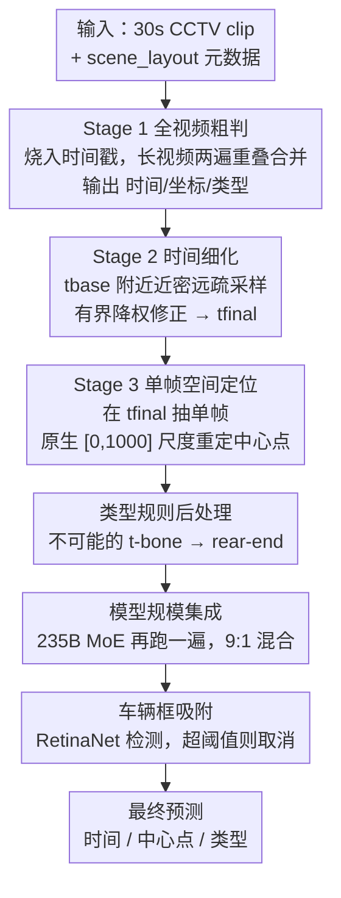

# Multi-Stage VLM Pipeline for Zero-Shot Traffic Accident Understanding

**会议**: CVPR 2026 (AUTOPILOT Workshop, ACCIDENT Challenge 第一名)  
**arXiv**: [2605.29325](https://arxiv.org/abs/2605.29325)  
**代码**: https://github.com/fuumin621/cvpr2026-accident-1st-place-solution (有)  
**领域**: 自动驾驶 / 多模态VLM  
**关键词**: 交通事故理解, 零样本, VLM pipeline, CCTV, 任务分解

## 一句话总结
在一个**完全冻结、无需训练**的 Qwen3-VL-32B 上，把"判定事故发生时间 / 碰撞中心点 / 碰撞类型"这个联合任务拆成三次专门化的 VLM 调用（全视频粗判 → 时间细化 → 单帧空间定位），再叠加一个 235B MoE 兄弟模型的 9:1 集成和一步"吸附到最近车辆框"的后处理，把统一分数从最强基线 Molmo-7B 的 0.358 拉到私榜 0.5708，拿下 CVPR 2026 ACCIDENT 挑战赛冠军。

## 研究背景与动机
**领域现状**：从 CCTV 监控视频里自动理解交通事故，对快速事故响应和交通安全分析很关键。CVPR 2026 AUTOPILOT Workshop 的 ACCIDENT 挑战赛把它定义成一个 30 秒 clip 要同时回答三个问题——**什么时候**撞（事故时间，秒）、**撞在画面哪里**（碰撞中心点的归一化坐标）、**怎么撞的**（5 类碰撞类型：head-on / rear-end / t-bone / sideswipe / single-vehicle）。

**现有痛点**：这是个**零样本**协议——没有任何真实标注视频可训练，只给 CARLA 合成 clip（2,211 段合成 vs 2,027 段真实测试）。合成与真实 CCTV 外观差距巨大，作者实测发现这个 **sim-to-real gap 是误差的主导来源**：所有想从合成数据里学信号再迁移到测试集的做法（CARLA 上训 CNN 分类器、光流+检测器混合、帧偏移集成）都在合成验证集上涨点、却在真实榜单上掉分。所以"训练"这条路基本被堵死，只能靠现成的大 VLM 做零样本推理。

**核心矛盾**：天真做法是让一个 VLM 调用一次性吐出时间、地点、类型三件事。但评测的统一分数是**调和平均**

$$ACC^{S} = \frac{3}{1/T + 1/S + 1/C} \in [0,1]$$

调和平均会被 $T,S,C$ 里**最小的那个**狠狠拽下来——抬高一个却牺牲另一个几乎不会让 $ACC^S$ 变好。而联合查询恰恰逼模型在三个互相竞争的目标间分配注意力，**空间精度尤其被拖累**（坐标会聚集到一个粗糙网格上）。

**本文目标**：在不训练、不碰合成数据迁移的前提下，把三个目标解耦，让每次调用只专注一件事，从而把调和平均里最弱的那一项补起来。

**核心 idea**：**把联合预测拆成三次专门化的 VLM 调用**，再用模型规模集成 + 基于检测的吸附做小幅修补——全程冻结权重、贪心解码、零训练。

## 方法详解

### 整体框架
整套系统建立在一个冻结的 Qwen3-VL-32B-Instruct-FP8 上（通过 vLLM 服务，无训练、贪心解码）。核心是**对同一个 VLM 连续做三次调用**，每次解决联合任务里的一个子问题，后一阶段只替换前一阶段对应的那一项输出、其余照搬：

- **Stage 1（全视频粗判）**：吃整段 clip + 场景元数据，一次性给出时间、坐标、类型的初始联合估计——本身就是一个完整预测。
- **Stage 2（时间细化）**：只针对 Stage-1 的时间，在其附近重采样一组"近密远疏"的帧，做一个**有界、降权**的时间修正。
- **Stage 3（空间定位）**：在细化后的时刻抽**单帧**，重新定位碰撞中心点，替换掉 Stage-1 的粗坐标。

三个 VLM 阶段之后跟三步轻量修补：对物理上不可能的类型做**规则替换**、把同一套 pipeline 在 235B MoE 上再跑一遍做 **9:1 集成**、把预测点**吸附到最近的车辆检测框**。

### 关键设计

**1. 三阶段任务解耦：让每次调用只专注一个子目标**

这是整套方法的灵魂，也是消融里贡献最大的一刀。痛点在于联合查询逼模型同时权衡时间、空间、类型，调和平均又对最弱项极度敏感，于是空间坐标会塌缩到粗网格上。作者把它拆成三次串行调用：Stage 1 从全片拿一个粗的联合估计；Stage 2 在 Stage-1 时间 $t_{\text{base}}$ 周围用更密的帧窗细化时间；Stage 3 在细化后的时刻抽**单帧**、只回答"撞在这一帧的哪里"。关键在于这是**有依赖的流水**——只有当 Stage 2 把时间钉死，Stage 3 才不用再背"选哪个时刻"的包袱，单帧定位就能largely 化解 Stage-1 坐标的量化聚集问题。消融里"单帧 pointing grounding"单步带来 +0.09356 的涨幅（全程最大单项），正是这个解耦思路的直接体现。

**2. Stage 1 的两个 prompt 侧小动作：烧入时间戳 + 场景提示**

Stage 1 解码 4 fps、最多 128 帧、长边 resize 到 960 px；超过 32 s 的 clip 拆成两遍重叠推理再用规则合并（重叠区外保留各自输出，重叠区内对时间和坐标取平均、类型保留第一遍）。真正起作用的是两个 prompt 侧选择：其一，在**每一帧上烧一个黑色小标签 `t=xx.xx s`**，让 VLM 直接"抄"画面里的时间戳进答案，而不是靠视觉上下文去猜时间，从根上提升时间可读性；其二，把 `scene_layout` 元数据塞进 prompt（作者称为 **scene hint**），让模型偏向在该场景几何上**可能发生**的碰撞类型。scene hint 在消融里贡献 +0.00216，虽小但稳。

**3. Stage 2 有界降权的时间修正：不直接替换，而是小步收敛**

因为 4 fps 采样把 Stage-1 时间分辨率限制在约 $\pm0.25$ s，需要再细化。Stage 2 在 $t_{\text{base}}$ 附近构造一个**混合帧集**：局部密窗（$\pm2$ s @ 4 fps，最多 12 帧）+ 外围稀疏锚点（$-8$ 到 $+4$ s @ 0.5 fps，最多 4 帧），让模型既看清事故瞬间又保留进出运动的上下文。得到新估计 $t_{\text{refined}}$ 后**不直接替换**，而是

$$t_{\text{final}} = t_{\text{base}} + \alpha \cdot \mathrm{clip}\!\left(t_{\text{refined}} - t_{\text{base}},\ -\delta_{\max},\ +\delta_{\max}\right)$$

其中 $\alpha=0.35$ 降权修正、$\delta_{\max}=1.5$ s 封顶幅度。这样设计的理由直接来自评测特性：$ACC^S$ 是调和平均，会被大误差重罚，所以与其冒险全盘接受一个可能离谱的 Stage-2 修正，不如**降权 + 紧夹**，把罕见 outlier 的伤害限制住。作者在公榜上验证了这套组合优于直接替换（$\alpha=1$、不夹）。

**4. 类型规则后处理 + 模型规模集成 + 车辆框吸附：三步保守修补**

三个 VLM 阶段后是三步小修补，共同点是"**只在确定有益时才动**"。①**类型后处理**只保留一条物理规则：若预测为 `t-bone` 但 `scene_layout` 是高速、隧道或立交（两车不可能垂直相撞），就改判 `rear-end`；更激进的规则（按 bbox 长宽比重分类、把高速上所有 single-vehicle 改写）都没涨点，因此不用。②**模型规模集成**：把同一套三阶段 pipeline 在 Qwen3-VL-235B-A22B（MoE，每 token 激活 22B）上再跑一遍，时间和空间输出按 $x_{\text{ens}} = \lambda x_{\text{32B}} + (1-\lambda) x_{\text{235B}}$、$\lambda=0.9$ 混合；**类型只取 32B** 的（235B 在同 prompt 下选的类型更差）。235B 单跑反而低于 32B，但 9:1 混合在时间和空间上给出小而稳的增益。③**车辆框吸附**：VLM 的点常落在事故区附近但不在车上，用 RetinaNet 在 $\pm10$ 帧内检出车辆类（COCO 的 car/motorcycle/bus/truck，窗口内无车则倍增窗口重试），取中心最近的框并把点夹进去；但若吸附导致的位移超过阈值 $\delta_{\text{snap}}=0.2$（归一化坐标）则**取消吸附**，避免被无关车辆带偏。

### 损失函数 / 训练策略
**无训练**。所有 backbone 均为冻结预训练权重、通过 vLLM 服务、贪心解码。关键超参：Stage 1 用 4 fps / ≤128 帧 / 960 px；Stage 2 用 $\alpha=0.35$、$\delta_{\max}=1.5$ s；集成 $\lambda=0.9$；吸附 $\delta_{\text{snap}}=0.2$、帧窗 $\pm10$。算力上 32B 这条腿在单张 RTX PRO 6000 上处理全部 2,027 段测试 clip 约 13 小时；235B 这条腿在 8× RTX PRO 6000 上约 10 小时。

## 实验关键数据

### 主实验
统一分数 $ACC^S$ 为调和平均，C=分类 top-1 准确率，T=时间高斯相似度（三档容差 $\sigma_t\in\{0.5,1,2\}$ s 平均），S=各向异性高斯空间相似度（$\sigma_x,\sigma_y$ 取标注 bbox 的平均宽高）。

| 系统 | $ACC^S$ | C | T | S | 私榜 |
|------|---------|------|------|------|------|
| Molmo-7B baseline（最强主办方基线） | 0.3580 | 0.2930 | 0.3430 | 0.4880 | - |
| Ours 32B（三阶段） | 0.5637 | 0.5994 | 0.5603 | 0.5350 | 0.56740 |
| Ours 235B（三阶段） | 0.5504 | 0.5703 | 0.5388 | 0.5430 | 0.55670 |
| Ours 9:1 集成（类型取 32B） | 0.5657 | 0.5994 | 0.5600 | 0.5410 | 0.56948 |
| **Ours + bbox snap（最终）** | **0.5669** | 0.5994 | 0.5600 | 0.5441 | **0.57080** |

单是 32B 三阶段 pipeline 就已大幅超过最强基线（0.5637 vs 0.358）；235B 集成在两个 split 上各加约 +0.002；bbox snap 再加 +0.00054（公榜）/ +0.00132（私榜）。最终私榜 0.57080，约 **+0.21** 于最强基线。

### 消融实验
开发路径上的公榜累计分数（每行在上一行基础上叠加一个组件）：

| 配置 | 公榜 | Δ | 说明 |
|------|------|------|------|
| Single-call VLM (768px, 2fps) | 0.42238 | — | 单次联合查询基线 |
| + Stage-3 单帧 pointing grounding | 0.51594 | **+0.09356** | 全程最大单项增益 |
| + Stage-1 scene hint | 0.51810 | +0.00216 | 场景元数据进 prompt |
| + t-bone 类型后处理 | 0.52276 | +0.00466 | 物理不可能的 t-bone→rear-end |
| + Stage-2 时间细化 | 0.53246 | +0.00970 | 有界降权修正 |
| + 4fps/128f/960px | 0.55215 | +0.01969 | Stage-1 采样设置升级 |
| + 9:1 集成 235B | 0.55415 | +0.00200 | 模型规模集成 |
| + bbox snap（最终） | 0.55469 | +0.00054 | 吸附到车辆框 |

backbone 规模扫描（单次调用基线 @ 512px，无 Stage-2/3、无集成）：Qwen3-VL 4B=0.285、8B=0.365、32B=0.387——**模型规模独立于 pipeline 结构地带来增益**。

### 关键发现
- **Stage-3 单帧空间定位是贡献最大的单步**（+0.09356），远超其他所有组件之和量级。原因：Stage 1 在联合查询下坐标会聚集到粗网格，一旦 Stage 2 钉死时间，Stage 3 只需在单帧里答"撞在哪"，量化问题基本消解。
- **更密的帧率反而掉点**：4→10 fps 使分数 −0.009；三帧 grounding（坐标平均）、把 grounding 帧渲到 1024/1280 px 都降低空间分数——过密/过高分辨率反而降低阶段级精度。
- **CoT（thinking 模式）灾难性失败**：类型准确率崩盘、时间分从 0.42 掉到 0.06；self-consistency（3× 温度 0.1–0.6）和 flip TTA 在 2,027 段上只改动 <10 个预测，等于噪声。
- **sim-to-real 迁移全军覆没**：CARLA 上训 CNN、光流+检测混合、帧偏移集成都在合成验证集涨点却在榜单掉分，印证零样本下合成迁移不可靠。
- **非 VL 专精模型选不对类型**：Cosmos-Reason2 完全漏掉 t-bone 类，InternVL3.5-8B / Gemma 3-27B 把大多预测映射成 rear-end，纯文本向 MoE（Qwen3.5-35B-A3B）时间分尚可但类型和空间崩。

## 亮点与洞察
- **用"任务解耦 + 阶段依赖"对抗调和平均的木桶效应**：方法没有一个新模块，全靠把联合查询拆成三次专门调用，恰好补强调和平均里最弱的空间项。这是把"评测指标特性"反向写进"推理流水设计"的范例——值得迁移到任何被调和平均/最小项主导的多目标零样本任务。
- **降权+夹断的时间修正是个朴素但高 ROI 的鲁棒性 trick**：$t_{\text{final}}=t_{\text{base}}+\alpha\cdot\mathrm{clip}(\cdot)$ 用两个标量（$\alpha=0.35$、$\delta_{\max}=1.5$）把"接受细化"与"防 outlier 重罚"调和起来，比"直接替换"更稳，可复用于任何"粗估 + 细化"的两阶段预测。
- **大量诚实的负结果**：作者系统报告了 CoT 崩盘、密帧掉点、合成迁移失败、激进后处理掉分等一长串"做了没用"的实验，对实践者比 +0.0005 的微调更有参考价值——零样本竞赛里"少做错的事"往往比"多做对的事"更重要。
- **"训练-free + 单卡 13 小时夺冠"**：在合成-真实 gap 主导误差的设定下，放弃训练、押注现成大 VLM 的工程组合拳反而是更优解。

## 局限与展望
- **本质是竞赛工程方案，不是新模型**：核心增益来自任务拆分和 prompt 工程，没有方法论上的新组件；许多超参（$\alpha,\delta_{\max},\lambda,\delta_{\text{snap}}$）是在公榜上调出来的，存在对该 benchmark 过拟合的风险，换数据集需重调。
- **强依赖单一 backbone**：整套方案绑定 Qwen3-VL（其原生 $[0,1000]$ 坐标尺度、烧时间戳的可读性都被利用），换别的 VLM 多半要重新设计 prompt 与流程；作者也实测其他 VLM 都更差。
- **三次调用 + 双模型集成成本不低**：32B+235B 两条腿合计需可观算力（235B 用 8 卡 ~10h），对实时事故响应场景偏重。
- **类型后处理只有一条规则**：更复杂的物理/几何约束没能涨点，说明类型分类的提升空间仍受限于 VLM 本身对碰撞语义的理解，而非后处理。
- **改进思路**：可探索把 scene_layout 等元数据更结构化地融进 Stage-3 的空间先验、用轻量校准代替全盘吸附、或在保持零训练的前提下做 test-time 自适应来缩小 sim-to-real gap。

## 相关工作与启发
- **vs 单次联合查询（Single-call VLM 基线，0.42238）**：基线让一个 VLM 一次答时间/地点/类型，本文把它拆成三次专门调用，区别在于用"阶段依赖 + 单帧定位"破解联合查询下空间坐标的量化聚集，统一分提升约 +0.13，证明解耦 >> 单查询。
- **vs 主办方最强基线 Molmo-7B（0.358）**：Molmo-7B 端到端 T=0.343/S=0.488/C=0.293，三项都被调和平均压低；本文在不训练的前提下把三项都抬到 0.54–0.60 区间，最终 +0.21。
- **vs 合成数据迁移路线（CARLA 训练）**：典型思路是用 CARLA 合成数据训分类器/光流模型再迁移，本文实测这类方法在合成验证集涨点却在真实榜单掉分，转而完全放弃训练、押注大 VLM 的零样本能力，揭示了零样本协议下 sim-to-real gap 的主导性。
- **vs 测试时增广/采样技巧（CoT、self-consistency、TTA）**：常规涨点 trick 在此任务上要么灾难（CoT 把时间分从 0.42 砸到 0.06）、要么等于噪声，提醒在强约束的多目标评测里盲套通用 trick 可能适得其反。

## 评分
- 新颖性: ⭐⭐⭐ 无新模型，但"任务解耦对抗调和平均木桶效应"的视角和阶段依赖设计有巧思
- 实验充分度: ⭐⭐⭐⭐⭐ 主结果 + 增量消融 + backbone 扫描 + 一长串诚实负结果，竞赛报告里少见的完整
- 写作质量: ⭐⭐⭐⭐ 逻辑清晰、动机紧扣评测指标，负结果章节尤其有价值
- 价值: ⭐⭐⭐⭐ 零样本事故理解的强实战基线，"少做错的事"的工程经验对同类竞赛高度可复用

<!-- RELATED:START -->

## 相关论文

- [\[CVPR 2025\] Zero-Shot 4D Lidar Panoptic Segmentation](../../CVPR2025/autonomous_driving/zero-shot_4d_lidar_panoptic_segmentation.md)
- [\[CVPR 2026\] SpaceDrive: Infusing Spatial Awareness into VLM-based Autonomous Driving](spacedrive_infusing_spatial_awareness_into_vlm-based_autonomous_driving.md)
- [\[CVPR 2026\] GaussianDWM: 3D Gaussian Driving World Model for Unified Scene Understanding and Multi-Modal Generation](gaussiandwm_3d_gaussian_driving_world_model_for_unified_scene_understanding_and_.md)
- [\[CVPR 2026\] RLFTSim: Realistic and Controllable Multi-Agent Traffic Simulation via Reinforcement Learning Fine-Tuning](rlftsim_realistic_and_controllable_multi-agent_traffic_simulation_via_reinforcem.md)
- [\[CVPR 2026\] Unifying Language-Action Understanding and Generation for Autonomous Driving](unifying_language-action_understanding_and_generation_for_autonomous_driving.md)

<!-- RELATED:END -->
