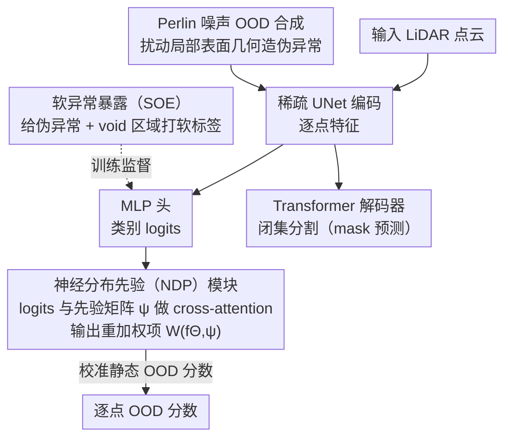

# Neural Distribution Prior for LiDAR Out-of-Distribution Detection

**会议**: CVPR 2026  
**arXiv**: [2604.09232](https://arxiv.org/abs/2604.09232)  
**代码**: [https://cs-lzz.github.io/ndp-demo](https://cs-lzz.github.io/ndp-demo)  
**领域**: 自动驾驶/安全感知  
**关键词**: OOD检测, LiDAR感知, 类别不平衡, Perlin噪声, 分布先验

## 一句话总结

NDP提出了可学习的神经分布先验模块来建模网络预测的分布结构，结合Perlin噪声生成的伪OOD样本和软异常暴露策略，在STU基准上实现61.31% AP，超越之前最佳结果10倍以上。

## 研究背景与动机

**领域现状**：LiDAR感知在自动驾驶中至关重要，但当前模型基于闭集假设，无法识别意外的OOD对象（如路上的树枝、施工机械、路面碎片），可能导致严重安全后果。

**现有痛点**：LiDAR数据存在严重的类别不平衡——道路和建筑物包含大部分点云，而自行车等交通参与者非常稀疏。现有OOD评分函数假设均匀类别分布，在不平衡数据上失效。

**核心矛盾**：静态OOD评分会过拟合频繁类别而在尾部类别上失败；数据集级别的类别先验不足以纠正LiDAR数据中类别不平衡引入的偏差。

**本文目标**：设计能适应类别不平衡的可学习OOD评分机制，并生成多样化的辅助OOD样本进行鲁棒训练。

**切入角度**：学习网络预测的分布模式而非使用静态评分，同时利用Perlin噪声直接从训练数据中生成OOD样本。

**核心idea**：NDP通过注意力机制动态捕捉训练数据的logit分布模式，并纠正类别依赖的置信度偏差。

## 方法详解

### 整体框架

这篇论文要解决的是 LiDAR 闭集分割模型遇到未见物体时不会报警的问题，核心难点在于 LiDAR 点云的类别极度不平衡——道路、建筑物占了绝大多数点，自行车等参与者却很稀疏，导致传统 OOD 评分天然偏向常见类。NDP 整套流程接在 Mask4Former-3D 之上：稀疏 UNet 先把每个点编码成特征，一支 MLP 头吐出用于异常判断的 logits，另一支 Transformer 解码器照常做闭集分割。关键改动在于不再用一个固定公式把 logits 转成 OOD 分数，而是让 logits 先进入 NDP 模块，与一组可学习的先验做交互后输出校准过的分数。训练时再用 Perlin 噪声合成的伪异常和带软标签的 void 区域一起提供负样本监督。

### 关键设计

**1. 神经分布先验（NDP）模块：让 OOD 评分跟着网络的预测分布走，而非套固定公式**

传统 OOD 评分（如 max-logit、energy）默认各类别在数据里大致均匀，但 LiDAR 里常见类的 logit 普遍偏高、尾部类偏低，固定阈值因此会把稀疏类的正常点误当异常、又放过常见类附近的真异常。NDP 的做法是把每个样本的 logits 投影到一个潜在嵌入空间，与一组可学习的先验矩阵 $\psi$ 做 cross-attention，由此捕捉训练数据里典型的类间分布关系，生成一个重加权项 $W(f_\Theta, \psi)$ 去调整原本的静态 OOD 分数。可以把 $\psi$ 理解成"网络在干净数据上通常长什么样"的参考分布：当某个点的 logit 模式偏离这个学到的常态时，重加权项就放大它的异常分。因为校准信号来自数据本身学到的分布而非人为假设，NDP 能自适应地补偿类别不平衡带来的偏置，也因此可以挂在多种现成评分函数上通用。

**2. Perlin 噪声 OOD 合成：不借外部数据集，直接从训练点云造出几何一致的伪异常**

要训练模型识别异常，得有异常样本，但引入外部数据集会带来域差异，而场景里现成的 void 点（未标注区域）多样性有限、很多还不是真异常。NDP 改用 Perlin 噪声——一种平滑、空间相干的噪声函数——去扰动内分布点云的局部表面几何，让形状和轮廓产生真实可信的变化，同时保持全局语义布局不乱。这样合成出来的"异常"在几何上是连续自洽的，而不是随机散点，更接近真实未见物体的样子。Perlin 噪声在工业异常检测里已被验证有效，迁到 3D 点云上既省去外部数据的域适配麻烦，又能批量产出多样且几何合理的负样本。

**3. 软异常暴露（SOE）策略：给暧昧的 void 区域打软标签，避免模型把它们学死**

场景里的 void 点身份很尴尬——它们既可能是"有语义但没人标注"的正常物体，也可能是"真正的异常"。如果直接把 void 当成确定的 OOD 硬标签去监督，模型会过拟合到这些特定区域的外观，把"未标注"误学成"异常"。SOE 不给硬标签，而是赋予反映其不确定性的软 OOD 标签，让模型在歧义区域里学到"这里可能异常"的弱信号，既利用了这部分免费监督，又不会被它带偏。

### 损失函数 / 训练策略

闭集分割与 OOD 检测联合训练：Perlin 合成的伪异常和带软标签的 void 区域共同充当负监督，分割分支照常学习已知类别。NDP 模块的重加权项在推理阶段对最终 OOD 分数做校准调整。⚠️ 具体损失权重与训练超参以原文为准。

## 实验关键数据

### 主实验

| 数据集 | 指标 | NDP | 之前SOTA | 提升 |
|--------|------|------|----------|------|
| STU测试集 | 点级AP | 61.31% | ~6% | 10×以上 |
| SemanticKITTI | OOD AP | SOTA | - | 显著 |

### 消融实验

| 配置 | 关键指标 | 说明 |
|------|---------|------|
| 无NDP模块 | AP大幅下降 | 静态评分无法处理不平衡 |
| 无Perlin合成 | AP下降 | 辅助OOD样本不足 |
| 无SOE（硬标签） | AP下降 | void点过拟合 |
| 完整NDP框架 | 61.31% AP | 三个组件协同 |

### 关键发现

- NDP模块对不同OOD评分函数兼容，说明分布先验的校准能力是通用的
- Perlin噪声合成策略生成的OOD样本比void类点和外部数据集都更有效
- 61.31% AP vs 之前~6% AP的巨大提升说明类别不平衡是LiDAR OOD检测的核心瓶颈

## 亮点与洞察

- **10倍以上的性能飞跃**：从~6% AP到61.31% AP，说明之前方法在LiDAR OOD上几乎没有工作，而问题的关键是类别不平衡
- **Perlin噪声的创造性应用**：从计算机图形学借鉴的噪声函数在生成几何一致的3D异常样本上非常有效
- **NDP作为通用校准模块**：可与多种现有OOD评分函数组合使用，具有很强的扩展性

## 局限与展望

- 主要在SemanticKITTI和STU上验证，未在更大规模数据集（如nuScenes）上测试
- Perlin噪声合成仍然是基于几何扰动，生成的OOD样本可能缺乏语义多样性
- NDP的cross-attention机制引入额外计算开销，实时性有待评估

## 相关工作与启发

- **vs LiON**: LiON从ShapeNet合成异常形状需要外部数据集，NDP直接从训练数据中生成
- **vs REAL**: REAL通过缩放点云生成伪OOD表示，多样性有限

## 评分

- 新颖性: ⭐⭐⭐⭐ 可学习分布先验和Perlin噪声合成都是新颖的设计
- 实验充分度: ⭐⭐⭐⭐ 10×提升令人信服
- 写作质量: ⭐⭐⭐⭐ 问题分析透彻
- 价值: ⭐⭐⭐⭐⭐ 为LiDAR OOD检测开辟了新的性能水平

<!-- RELATED:START -->

## 相关论文

- [\[CVPR 2026\] Learning to Identify Out-of-Distribution Objects for 3D LiDAR Anomaly Segmentation](learning_to_identify_out-of-distribution_objects_for_3d_lidar_anomaly_segmentati.md)
- [\[CVPR 2026\] ProOOD: Prototype-Guided Out-of-Distribution 3D Occupancy Prediction](proood_prototype-guided_out-of-distribution_3d_occupancy_prediction.md)
- [\[NeurIPS 2025\] Extremely Simple Multimodal Outlier Synthesis for Out-of-Distribution Detection and Segmentation](../../NeurIPS2025/autonomous_driving/extremely_simple_multimodal_outlier_synthesis_for_out-of-distribution_detection_.md)
- [\[CVPR 2026\] Query2Uncertainty: Robust Uncertainty Quantification and Calibration for 3D Object Detection under Distribution Shift](query2uncertainty_robust_uncertainty_quantification_and_calibration_for_3d_objec.md)
- [\[AAAI 2026\] Out-of-Distribution Generalization with a SPARC: Racing 100 Unseen Vehicles with a Single Policy](../../AAAI2026/autonomous_driving/out-of-distribution_generalization_with_a_sparc_racing_100_u.md)

<!-- RELATED:END -->
