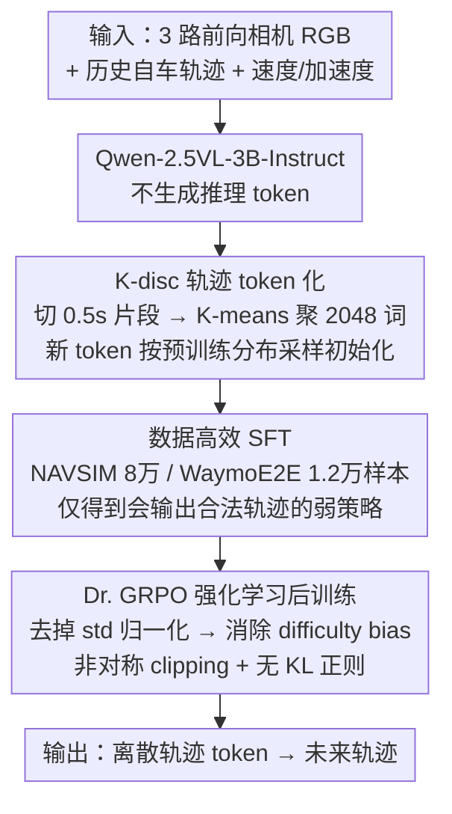

# NoRD: A Data-Efficient Vision-Language-Action Model that Drives without Reasoning

**会议**: CVPR 2026  
**arXiv**: [2602.21172](https://arxiv.org/abs/2602.21172)  
**代码**: 无  
**领域**: 自动驾驶  
**关键词**: VLA模型, 无推理驾驶, 数据高效, Dr.GRPO, 强化学习后训练

## 一句话总结

NoRD 证明自动驾驶 VLA 不需要大规模推理标注和海量数据：通过识别 GRPO 在弱 SFT 策略上失败的根因是 **difficulty bias**（高方差 rollout 组的学习信号被压制），采用 Dr. GRPO 替代标准 GRPO 做 RL 后训练，仅用 <60% 数据、无推理标注、3× 更少 token，在 NAVSIM（85.6 PDMS）和 WaymoE2E（7.709 RFS）上达到与推理型 VLA 竞争的性能。

## 研究背景与动机

**VLA 主流范式的三重成本**：当前自动驾驶 VLA 的标准训练管线是"大规模 SFT + CoT 推理标注 + GRPO 后训练"。AutoVLA 等模型虽然性能强，但需要 21.2 万+ 样本、密集推理标注（annotation cost）、推理时生成推理 token 增加延迟。这三重成本（数据、标注、计算）不可扩展。

**推理是否必要？** 已有理论和实证工作质疑推理的必要性：(a) "Reasoning-Planning Decoupling Hypothesis" 表明文本先验就能匹配完整多模态推理的性能；(b) RL 不创造新的推理能力，只在 SFT 模型已有分布上优化。

**初始尝试失败**：用 8 万样本（无推理标注）训练 NoRD-base（Qwen-2.5VL-3B），然后 GRPO 后训练仅提升 +0.67%（76.66→77.18），而 AutoVLA 的 GRPO 提升了 +9%。这似乎证明"推理数据不可或缺"。

**核心发现——Difficulty Bias**：GRPO 失败不是因为弱 SFT 策略本身不行，而是 GRPO 的 advantage 归一化机制有系统性缺陷。组内标准差 $\text{std}$ 做分母时，低方差组（简单/极难场景）的 advantage 被放大，高方差组（中等难度、占多数）的 advantage 被压制。弱 SFT 模型恰好产生大量高方差 rollout，导致 GRPO 无法从主体样本中学习。

## 方法详解

### 整体框架

NoRD 想验证一件反直觉的事：自动驾驶 VLA 能不能既不喂大规模数据、也不标注 CoT 推理，就把性能做到和推理型模型一个水平。它的做法是把"会不会驾驶"完全压到强化学习阶段去学，而不是靠堆 SFT 数据。

整条管线很短。三个前向相机（前、前左、前右）的 RGB 图像、历史自车轨迹和当前速度/加速度一起喂进 Qwen-2.5VL-3B-Instruct，模型不生成任何推理 token，直接吐出代表未来轨迹的离散 token。训练先用一小批数据做 SFT（NAVSIM 8 万样本、WaymoE2E 1.2 万样本）得到一个"弱策略"，再用 Dr. GRPO 做强化学习后训练，把这个弱策略一路顶上去。真正的关键不在框架本身，而在于"为什么标准 GRPO 顶不动、Dr. GRPO 却能顶上去"。

### 关键设计

**1. K-disc 轨迹 token 化：把连续轨迹塞进 VLM 的自回归词表**

轨迹是连续值，VLM 却只会做 next-token prediction，两者天然对不上。NoRD 的做法是把训练集里所有轨迹插值到 10Hz、切成 0.5s 的片段，再用 K-means 聚成 2048 个 cluster，每个 cluster 中心就是一个离散的"轨迹词"。这样一来，预测未来轨迹就退化成"在 2048 个 token 里自回归地挑下一个"，和模型本来就擅长的语言建模范式完全一致；codebook 取 2048 是在轨迹精度和泛化性之间折中——太小拟合不了细节，太大又容易过拟合稀有轨迹。

新增的轨迹 token 不能凭空插进词表，否则它们的嵌入和预训练分布对不齐、训练初期会乱跳。NoRD 用 Qwen 原有 token 嵌入估出一个多元正态分布（均值 + 协方差），再从这个分布里采样初始化新 token，让新词汇一开始就落在预训练嵌入的"合理区域"里。

**2. Difficulty Bias 分析与 Dr. GRPO：弱策略的学习信号不能被方差抹掉**

这是全文的核心。最初用 8 万无推理样本训出 NoRD-base 后，标准 GRPO 后训练只带来 +0.67% 的提升（76.66→77.18），几乎等于没训——这看起来像是在印证"没有推理数据 RL 就学不动"。但作者把锅追到了 GRPO 的 advantage 归一化上。GRPO 对一组 rollout 的 advantage 是

$$\hat{A}_{i,t}^{\text{GRPO}} = \frac{r(o_i|x) - \frac{1}{G}\sum_{j=1}^G r(o_j|x)}{\text{std}_{j=1,\dots,G}(r(o_j|x))}$$

问题出在分母的组内标准差 $\text{std}$。弱 SFT 模型的 reward 分布是两极化的：简单场景几乎总能拿高分（均值 ≥0.8）、极难场景几乎总是失败（≤0.15），这两类组内方差都很小；而占了大多数的中等难度场景（reward 在 0.2–0.65）方差很大。$\text{std}$ 当分母意味着——低方差的简单/极难组 advantage 被放大、梯度被重复强化，高方差的中等难度组 advantage 被压扁、几乎贡献不了信号。于是 GRPO 只在反复打磨那些"模型早就会"的简单行为，真正该学的主体样本被系统性忽略。这就是 difficulty bias，弱策略恰好把这个偏置放到了最大。

Dr. GRPO 的修正干脆利落：直接去掉标准差归一化，advantage 就是 reward 减组均值，

$$\hat{A}_{i,t}^{\text{DrGRPO}} = r(o_i|x) - \frac{1}{G}\sum_{j=1}^G r(o_j|x)$$

> ⚠️ 第二个求和项中的 reward 下标以原文为准。

少了分母这个放大器，高方差组里的"难"样本就能按真实优势贡献梯度，模型才有机会从主体场景中学到急转弯、变道这类复杂操作。实证上这一改动把后训练提升从 +0.67% 直接拉到 +11.68%（76.66→85.62）。配套还做了两个稳定措施：用 DAPO 风格的非对称 clipping（下界 $1-\epsilon_l$、上界 $1+\epsilon_h$）防止熵塌缩，并且不加 KL 散度正则，让弱策略有足够探索空间。

**3. 数据高效 SFT：把学习负担故意从 SFT 推给 RL**

既然 Dr. GRPO 能把弱策略顶上去，SFT 阶段就没必要堆数据。NoRD 在 NAVSIM 上只用 8 万样本（AutoVLA 用 21.2 万+），在 WaymoE2E 上更激进，只用 1.2 万样本做 SFT、再加 450 个样本做 RL 后训练。这不是因为数据不够，而是有意为之：让 SFT 只负责把模型带到一个"会输出合法轨迹"的起点，剩下"怎么开好"的活全交给 RL。这条设计正好把前两点串起来——token 化让轨迹能进自回归框架，Dr. GRPO 保证弱起点也能被有效优化，于是少量 SFT 数据 + 强 RL 就足以追平大数据 + 推理标注的范式。

### 损失函数 / 训练策略

- **SFT 阶段**：标准 next-token prediction 交叉熵损失
- **RL 阶段**：Dr. GRPO 目标函数，reward 来自 PDM score（NAVSIM）或 RFS（WaymoE2E），加上轨迹长度和输出格式的辅助 reward（权重 0.25），归一化到 $[0,1]$
- **训练细节**：SFT 用 16×A100，lr=5e-5，batch=128；RLFT 用 30×A100（NAVSIM）或 32 GPU（WaymoE2E），lr=5e-6/1e-6，group size=8，采样温度 1.0
- **推理**：温度 0.01 的确定性采样，无推理 token 开销

## 实验关键数据

### 主实验

| 方法 | 推理? | 数据量 | NAVSIM PDMS↑ | WaymoE2E RFS↑ | WaymoE2E ADE↓ |
|------|-------|--------|-------------|---------------|---------------|
| UniAD | N/A | - | 83.4 | - | - |
| DiffusionDrive | N/A | - | 88.1 | - | - |
| AutoVLA | 有 | 212K+ | 89.1 | 7.556 | 1.3507 |
| RecogDrive | 有 | 2.7M+ | 89.6 | - | - |
| Poutine | 有 | 212K+ | - | **7.986** | 1.2055 |
| **NoRD** | **无** | **<90K** | **85.6** | **7.709** | **1.2504** |

- NAVSIM 上 NoRD-BoN（最佳 6 选 1）达 92.4，超越 AutoVLA-BoN（92.1）
- WaymoE2E 上 NoRD 是 RFS 第三名，但是唯一无推理+无 ensemble 的顶级模型
- ADE 指标上 NoRD 超越所有竞争者（包括 Poutine），证明轨迹精度高

### 消融实验

| 配置 | NAVSIM PDMS↑ | 说明 |
|------|-------------|------|
| NoRD-base（仅 SFT） | 76.66 | 弱 SFT 策略基线 |
| NoRD-base + GRPO | 77.18 (+0.67%) | GRPO 几乎无效 |
| NoRD-base + Dr. GRPO | **85.62 (+11.68%)** | Dr. GRPO 成功优化弱策略 |

### 关键发现

- **GRPO 对弱策略失效是 difficulty bias 导致**：训练过程中，GRPO 仅优化了少量低方差样本（已知简单行为），高方差样本的 group-mean 分布几乎不变化
- **Dr. GRPO 解锁中等难度样本的学习**：训练过程中，[0.2, 0.65] 范围的 group-mean 分布显著右移，模型学会了复杂操作（急转弯、变道）
- **NoRD 是最 token 高效和推理最快的 VLA**：无推理 token 意味着 3× token 减少和显著更低的推理延迟
- **数据效率极高**：WaymoE2E 上仅用 1.2 万样本（Poutine 用 20 万+），RFS 仅差 0.277，ADE 反而更优

## 亮点与洞察

- **首次将 difficulty bias 概念引入自动驾驶 VLA 训练**：从 LLM 推理领域借鉴 Dr. GRPO 到自动驾驶，跨领域迁移非常有效
- **挑战"推理必要性"假设**：用实证结果反驳"VLA 必须有 CoT 推理才能达到高性能"的流行观点，为轻量化 VLA 提供依据
- **训练失败的诊断方法论**：通过分析 rollout 的 reward 分布特征（均值-方差关系）来诊断 RL 优化失败的原因，这一方法论具有通用价值
- **Pareto 前沿分析**：在效率-性能二维图上，NoRD 占据了高效率+高性能的独特位置

## 局限与展望

- **绝对性能仍有差距**：NAVSIM 上 NoRD（85.6）vs AutoVLA（89.1），-3.5 分。推理数据在某些场景下可能确实有帮助
- **Dr. GRPO 并非完美**：论文承认 Dr. GRPO 只是缓解而非消除 difficulty bias，仍有改进空间
- **模型规模固定为 3B**：未探索更大/更小模型的表现，缺乏 scaling 分析
- **仅用前方 3 相机**：未利用后方和侧后方视图，可能限制在复杂交通场景中的表现
- **改进方向**：(a) 设计更好的 reward shaping 缓解两极化分布；(b) 结合少量推理标注做混合训练；(c) 扩展到闭环评估

## 相关工作与启发

- **vs AutoVLA**：AutoVLA 是推理型 VLA 的代表（212K 数据 + CoT + GRPO），NoRD 以 <40% 数据、无推理达到竞争性能，证明推理不是必需品
- **vs EMMA/SimLingo**：同为无推理 VLA，但此前仅在简单 benchmark（nuScenes）上验证；NoRD 首次在 NAVSIM + WaymoE2E 等复杂 benchmark 上证明可行
- **vs LLM 推理领域**：Dr. GRPO 最初为解决 LLM 数学推理中的 difficulty bias 设计；本文是首次验证其在自动驾驶密集 reward 场景中的有效性
- **启发**：RL 后训练的潜力被 SFT 规模的假设严重低估；正确的优化算法可以替代大量数据。弱策略+好优化器可能是更经济的范式

## 评分

- 新颖性: ⭐⭐⭐⭐⭐ 首次识别 GRPO difficulty bias 在自动驾驶中的影响，跨领域创新
- 实验充分度: ⭐⭐⭐⭐ NAVSIM + WaymoE2E 双 benchmark，详细的 reward 分布分析和训练动态
- 写作质量: ⭐⭐⭐⭐⭐ 问题分析深刻，可视化优秀（Figure 2/3 的 reward 分布演化图非常有说服力）
- 价值: ⭐⭐⭐⭐⭐ 挑战了主流范式假设，为数据高效和推理高效的 VLA 开辟新路径

<!-- RELATED:START -->

## 相关论文

- [\[CVPR 2026\] HybridDriveVLA: Vision-Language-Action Model with Visual CoT reasoning and ToT Evaluation for Autonomous Driving](hybriddrivevla_vision-language-action_model_with_visual_cot_reasoning.md)
- [\[CVPR 2026\] Drive My Way: Preference Alignment of Vision-Language-Action Model for Personalized Driving](drive_my_way_preference_alignment_of_vision-language-action_model_for_personaliz.md)
- [\[CVPR 2026\] Learning Vision-Language-Action World Models for Autonomous Driving](vla_world_learning_vision_language_action_world_models_for_autonomous_driving.md)
- [\[CVPR 2026\] DriveMoE: Mixture-of-Experts for Vision-Language-Action Model in End-to-End Autonomous Driving](drivemoe_mixture-of-experts_for_vision-language-action_model_in_end-to-end_auton.md)
- [\[CVPR 2026\] Unifying Language-Action Understanding and Generation for Autonomous Driving](unifying_language-action_understanding_and_generation_for_autonomous_driving.md)

<!-- RELATED:END -->
