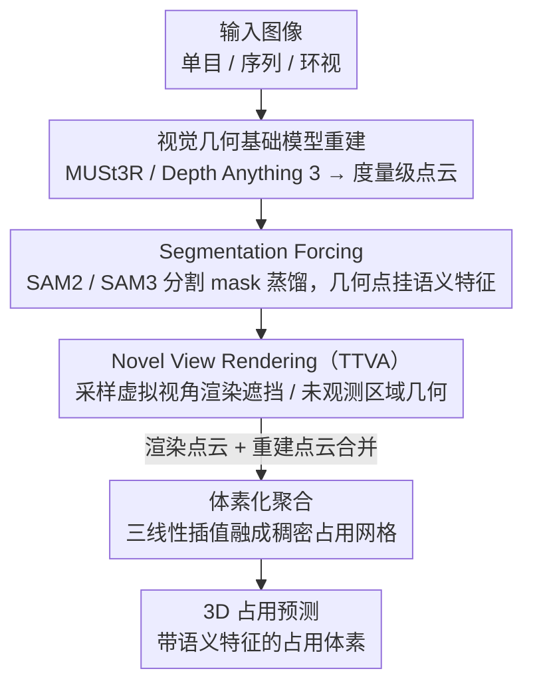

# OccAny: Generalized Unconstrained Urban 3D Occupancy

**会议**: CVPR 2026  
**arXiv**: [2603.23502](https://arxiv.org/abs/2603.23502)  
**代码**: [https://github.com/valeoai/OccAny](https://github.com/valeoai/OccAny)  
**领域**: 自动驾驶  
**关键词**: 3D占用预测, 泛化, 无约束场景, 视觉几何基础模型, 语义分割

## 一句话总结

OccAny 提出了首个泛化无约束城市 3D 占用预测框架，能在无标定、域外场景中从单目/序列/环视图像预测度量级占用体素，通过 Segmentation Forcing 和 Novel View Rendering 两项关键设计，在 KITTI 和 nuScenes 上超越所有视觉几何基线。

## 研究背景与动机

**领域现状**：3D 占用预测（Occupancy Prediction）是自动驾驶场景中的核心感知任务，旨在联合估计密集体素的占用状态和语义标签。现有方法如 SurroundOcc、OccFormer 等已在 nuScenes-Occ 和 SemanticKITTI 上取得不错效果。

**现有痛点**：(1) 现有方法严重依赖域内标注数据和精确的传感器标定参数（内外参），无法泛化到新场景；(2) 视觉几何基础模型（如 DUSt3R、Depth Anything）虽然泛化性强，但缺乏城市场景的几何补全能力（被遮挡区域）和度量级预测精度；(3) 没有统一框架能同时支持序列输入、单目输入和环视输入三种模式。

**核心矛盾**：高精度占用预测需要专有数据和标定，但实际应用中往往无法获取这些先验。视觉基础模型的通用性与占用预测所需的城市场景特化之间存在 gap。

**本文目标**：构建首个"无约束"3D 占用预测框架，能在完全未标定的域外场景中，从任意配置的相机输入生成度量级占用预测和分割特征。

**切入角度**：作者观察到，可以将视觉几何基础模型（MUSt3R/Depth Anything 3）的强泛化重建能力与大规模分割模型（SAM2/SAM3）的语义能力结合，通过专门的训练策略弥补城市场景的 gap。

**核心 idea**：提出 Segmentation Forcing 来强制模型学习与分割一致的占用表征，以及 Novel View Rendering 来通过虚拟视角渲染实现几何补全，从而构建一个既保持泛化能力又适配城市场景的统一框架。

## 方法详解

### 整体框架

OccAny 想解决的是一个很现实的矛盾：占用预测要在城市场景里做到度量级、能补全遮挡，但传统方法靠的是域内 3D 标注 + 精确标定，换个城市、换套相机就废了；而视觉几何基础模型（MUSt3R、Depth Anything 3）泛化性极强却不会城市场景的几何补全、也不输出语义。OccAny 的思路是把这两类模型缝起来，让重建走基础模型、语义走分割大模型，中间用专门的训练和推理策略补上城市场景的 gap。

整篇 pipeline 分两步走。先是**重建**：用视觉几何基础模型从输入图像（单目 / 序列 / 环视都行）恢复场景的度量级 3D 点云，同时让分割大模型（SAM2 / SAM3）给每个点挂上语义特征。再是**补全与体素化**：通过 Novel View Rendering 在一批虚拟相机视角下渲染、推断被遮挡和未观测区域的几何，把这些"想象"出来的点和原始重建点合并，最后用三线性插值（trilinear interpolation）把整团点云聚合、体素化成占用网格。框架有两个变体——OccAny（MUSt3R + SAM2）和升级版 OccAny+（Depth Anything 3 + SAM3），换 backbone 就能整体升级，是这套缝合设计的直接好处。

### 关键设计

**1. Segmentation Forcing：让几何重建顺带学会城市场景的语义**

直接拿基础模型的原始重建点云用，问题是它只有几何、没有细粒度语义区分，占用体素分不清这块是路面还是车。Segmentation Forcing 在训练时把 SAM2 / SAM3 产出的分割 mask 当监督信号：对每个 mask，把它覆盖区域内所有 3D 点的特征蒸馏（distill）成一致的语义向量，强制重建输出和分割 mask 在特征空间里对齐。这样几何与语义是在同一个空间里联合学的，重建出的每个点不只有坐标，还带着一份和 SAM 对齐的语义特征，占用体素因此既有形状又有 mask 级别的实例区分。它本质是把知识蒸馏用在了几何-语义对齐上，而不是常见的师生压缩。

**2. Novel View Rendering：在推理时"想象"出被挡住的几何**

单个或少数真实视角拍出来的场景，背面和远处天然有遮挡盲区，占用的 recall 上不去。Novel View Rendering 是一个 test-time augmentation：拿训练好的几何模型，从已有重建点云出发，通过旋转和平移随机采样一批虚拟相机视角，在这些新视角下渲染深度图和点云，再把渲染结果和原始重建合并成一团更完整的点云。它不需要任何额外训练，等于让模型在推理时自己绕到物体背后再看几眼，把观测不到的区域补出来——消融里它是几何 IoU 提升的最大贡献者（约 3-4 个绝对点）。代价是视角数量可以堆到很高（部分设置渲染 150-180 个虚拟视角），推理因此偏慢。

**3. 体素化聚合：三线性插值把多视角点云融成占用网格**

重建阶段和 Novel View Rendering 阶段会产出两批点云（各自带坐标和语义特征），最终要落成一个稠密的占用体素网格。OccAny 的推理末端把两批 pointmap 合并成一团，再用三线性插值（trilinear interpolation）聚合进统一体素网格——每个点的语义特征按它到周围体素中心的距离做加权分配，而不是硬投到最近格子。这样多视角覆盖密的区域体素值更平滑可靠，稀疏区域也能靠插值填出连续的占用估计。这一步本身是标准聚合操作，但它是把"重建点 + 渲染补全点"两路结果真正融成统一占用输出的收口环节。

### 一个完整示例：一段 KITTI 序列怎么变成占用网格

以 KITTI 的 5 帧序列输入走一遍：模型先用 MUSt3R（或 OccAny+ 的 Depth Anything 3）把这 5 帧重建成一团度量级 3D 点云，同时 SAM2 / SAM3 给每个点贴上分割特征——此时点云只覆盖相机直接看到的那一面，车的背面、被前车挡住的路面都是空的。接着 Novel View Rendering 启动，绕着这团点云采样几十到上百个虚拟视角逐个渲染，把每个新视角推断出的深度和点补进来，点云从"只有正面"逐步长成"前后左右都补齐"。最后所有点（原始 + 渲染）一起喂进体素网格，用三线性插值聚合定每个体素的占用与语义，得到带语义的占用网格。这一路下来，IoU 从单帧的 24.03 抬到 5 帧的 25.91，而 Novel View Rendering 那一步贡献了其中最大的一块（去掉它 IoU 掉到约 22）。

### 损失函数 / 训练策略

训练分两阶段：(1) 重建阶段使用度量深度的回归损失训练几何预测，同时使用 Segmentation Forcing 的特征蒸馏损失对齐语义；(2) 渲染阶段训练虚拟视角的深度预测能力。两阶段均使用多个驾驶数据集（Waymo、VKITTI、DDAD、PandaSet、ONCE）联合训练以增强泛化性。OccAny 使用 16 x A100 40G 训练。

## 实验关键数据

### 主实验

| 数据集/设置 | 指标 | OccAny | OccAny+ | 之前最佳基线 | 说明 |
|------------|------|--------|---------|-------------|------|
| KITTI 5帧 几何 | IoU | 25.91 | 27.33 | <25 | 超越所有视觉几何基线 |
| nuScenes 环视 几何 | IoU | 34.15 | 33.49 | <33 | 无需域内标注 |
| KITTI 5帧 语义(distill) | mIoU / mIoU^SC | 7.30/13.54 | 6.49/13.31 | - | Segmentation Forcing |
| nuScenes 环视 语义(distill) | mIoU / mIoU^SC | 6.65/10.31 | 7.20/11.51 | - | OccAny+更优 |
| KITTI 5帧 语义(pretrained) | mIoU / mIoU^SC | 7.62/13.75 | 8.03/13.17 | - | 使用预训练分割 |
| nuScenes 环视 语义(pretrained) | mIoU / mIoU^SC | 7.42/10.78 | 9.45/12.22 | - | OccAny+大幅领先 |

### 消融实验

| 配置 | KITTI IoU | 说明 |
|------|----------|------|
| OccAny Full (5帧) | 25.91 | 完整模型 |
| w/o Novel View Rendering | ~22 | 去掉虚拟视角渲染后大幅下降 |
| w/o Segmentation Forcing | ~24 | 语义质量显著降低 |
| OccAny+ Full (DA3+SAM3) | 27.33 | 更强基础模型带来进一步提升 |
| 1帧 vs 5帧 | 24.03 vs 25.91 | 多帧序列输入提供额外几何线索 |

### 关键发现

- Novel View Rendering 是几何 IoU 提升的最大贡献者，约贡献 3-4 个点的绝对 IoU 提升
- OccAny+ 使用 Depth Anything 3（1.1B）+ SAM3 的组合效果更好，但 OccAny（MUSt3R + SAM2）在某些设置下也具竞争力
- 框架在完全域外（未见过 KITTI/nuScenes）的情况下性能接近域内自监督方法，展示了极强的泛化能力
- 深度估计指标上，OccAny+ recon 1.1B 在 KITTI 上实现 AbsRel 仅 9.58%，远超 DA3 原始的 33.28%
- Ego 轨迹评估 ADE：OccAny+ recon 1.1B 达到 0.90，超越 DA3 1.1B 的 1.12

## 亮点与洞察

- **首个真正泛化的 3D 占用预测框架**：不需要目标域的标注、标定或微调，直接推理即可工作。这对实际部署极有价值
- **虚拟视角渲染的 test-time augmentation** 是一个优雅的设计：它不增加训练复杂度，仅在推理时通过"想象"未见视角来补全几何，思路可迁移到任何 3D 重建任务
- 框架的模块化设计值得学习：几何重建和语义分割分别由专门的基础模型承担，通过 Segmentation Forcing 桥接，升级基础模型即升级整个系统

## 局限与展望

- 推理速度偏慢：部分设置需要渲染 150-180 个虚拟视角，单 GPU 推理耗时较长
- 语义 mIoU 绝对值仍偏低（7-9%），与有监督方法差距较大，主要受限于 SAM 特征与具体语义类别的对齐质量
- 对遮挡严重的密集城市场景（如狭窄巷道），虚拟视角渲染的补全效果可能有限
- 目前仅支持静态场景，动态物体（行人、车辆）的时序一致性未建模

## 相关工作与启发

- **vs SurroundOcc / OccFormer**: 这些方法需要域内 3D 标注训练且依赖精确标定，泛化性差。OccAny 完全零样本泛化，虽然绝对精度略低，但通用性远超
- **vs DUSt3R / MASt3R**: 视觉几何基础模型提供强泛化重建，但缺乏占用补全和语义预测。OccAny 在其之上添加了分割融合和虚拟视角渲染
- **vs Depth Anything 3**: DA3 提供强单目深度，OccAny+ 用它替代 MUSt3R 作为几何 backbone，证明框架的灵活性
- 本文的 Segmentation Forcing 思路类似于知识蒸馏，但应用于几何-语义对齐，可迁移到其他 3D 感知任务

## 评分

- 新颖性: ⭐⭐⭐⭐⭐ 首个泛化无约束 3D 占用框架，两项核心设计均具新意
- 实验充分度: ⭐⭐⭐⭐⭐ 覆盖 KITTI 和 nuScenes，三种输入模式，含重建和轨迹评估
- 写作质量: ⭐⭐⭐⭐ 逻辑清晰，但方法细节部分略显复杂
- 价值: ⭐⭐⭐⭐⭐ 实际部署价值极高，解决了 3D 占用预测最核心的泛化瓶颈

<!-- RELATED:START -->

## 相关论文

- [\[CVPR 2026\] CCF: Complementary Collaborative Fusion for Domain Generalized Multi-Modal 3D Object Detection](ccf_complementary_collaborative_fusion_for_domain_generalized_multi-modal_3d_obj.md)
- [\[CVPR 2026\] ProOOD: Prototype-Guided Out-of-Distribution 3D Occupancy Prediction](proood_prototype-guided_out-of-distribution_3d_occupancy_prediction.md)
- [\[CVPR 2026\] Open-Vocabulary Domain Generalization in Urban-Scene Segmentation](open-vocabulary_domain_generalization_in_urban-scene_segmentation.md)
- [\[CVPR 2026\] ShelfOcc: Native 3D Supervision beyond LiDAR for Vision-Based Occupancy Estimation](shelfocc_native_3d_supervision_beyond_lidar_for_vision-based_occupancy_estimatio.md)
- [\[CVPR 2026\] M²-Occ: Resilient 3D Semantic Occupancy Prediction for Autonomous Driving with Incomplete Camera Inputs](m2-occ_resilient_3d_semantic_occupancy_prediction_for_autonomous_driving_with_in.md)

<!-- RELATED:END -->
