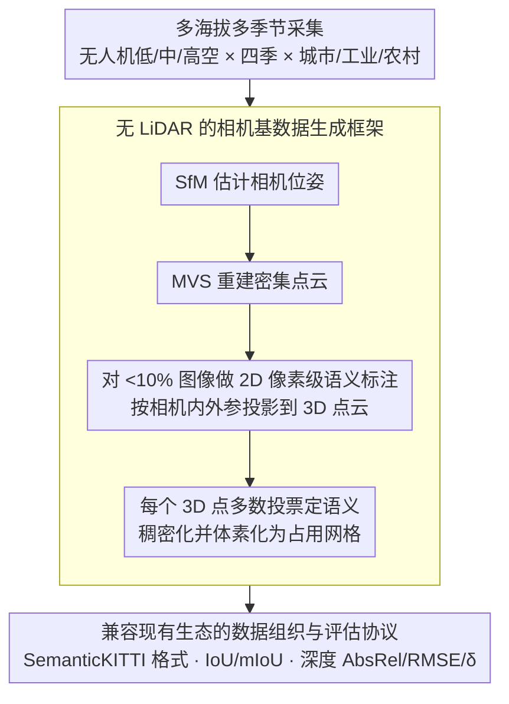

# OccuFly: A 3D Vision Benchmark for Semantic Scene Completion from the Aerial Perspective

**会议**: CVPR 2026 (Oral)  
**arXiv**: [2512.20770](https://arxiv.org/abs/2512.20770)  
**代码**: [https://github.com/markus-42/occufly](https://github.com/markus-42/occufly) (有，代码即将释放)  
**领域**: 自动驾驶 / 3D视觉  
**关键词**: 语义场景补全, 航拍视角, 无人机, 基准数据集, 深度估计

## 一句话总结

OccuFly 提出了首个真实世界航拍视角的相机基语义场景补全（SSC）基准数据集，包含 2 万+ 样本、21 个语义类别，覆盖多季节多海拔的城市/工业/农村场景，并揭示了当前视觉基础模型在航拍场景下的根本局限。

## 研究背景与动机

**领域现状**：语义场景补全（Semantic Scene Completion, SSC）是 3D 感知的关键任务，旨在从部分观测联合估计密集体素的占用状态和语义类别。SSC 已在地面自动驾驶领域得到广泛研究，SemanticKITTI、nuScenes-Occ 等基准推动了大量方法发展。

**现有痛点**：(1) SSC 研究几乎完全聚焦于地面车辆视角，航拍（无人机）场景几乎未被探索，限制了无人机下游任务（避障、路径规划、3D 建图）的发展；(2) 航拍 SSC 数据的获取面临特殊挑战：多数无人机因飞行法规和载荷限制无法搭载 LiDAR，且高空 LiDAR 点云极度稀疏；(3) 现有 SSC 数据集的生成严重依赖 LiDAR 传感器，无法直接迁移到纯相机的航拍场景。

**核心矛盾**：航拍无人机需要 3D 场景理解能力来实现自主飞行，但缺乏适配的 SSC 基准和方法。地面视角的 SSC 数据和模型由于视角差异巨大（俯视 vs 平视），无法直接迁移。

**本文目标**：(1) 设计一个无需 LiDAR 的纯相机数据生成框架，自动化航拍 SSC 数据构建；(2) 基于该框架发布首个航拍 SSC 基准 OccuFly；(3) 在 OccuFly 上基准测试现有 SSC 和深度估计方法，揭示航拍场景的独特挑战。

**切入角度**：作者提出利用经典 3D 重建（SfM + MVS）从航拍图像序列中获取密集点云，然后将少量标注图像（<10%）的语义标签通过投影提升（lift）到 3D 点云中，从而自动生成语义体素标注。这绕开了 LiDAR 的依赖。

**核心 idea**：用纯相机的 3D 重建替代 LiDAR 进行 SSC 标注数据生成，结合稀疏标注传播策略，构建首个航拍 SSC 基准，并系统评估现有方法在航拍场景下的性能。

## 方法详解

### 整体框架

OccuFly 的构建流程分为三步：(1) 数据采集——使用无人机在不同海拔（低/中/高）、不同季节（春夏秋冬）拍摄城市、工业、农村环境的图像序列；(2) 3D 重建与标注——利用 SfM 和 MVS 从图像序列重建密集点云，对不到 10% 的图像进行像素级语义标注，通过投影将 2D 标注提升到 3D 点云，再稠密化、体素化为语义占用网格；(3) 基准测试——在 OccuFly 上评估多种 SSC 方法和单目深度估计方法。

### 关键设计

**1. 多海拔多季节采集：把"航拍专属的难"显式写进数据分布里**

航拍和地面视角最本质的差别，是观测距离和覆盖范围会随飞行高度剧烈变化——同一个目标在低空和高空里占的像素、能看到的几何细节完全不是一回事。如果只在单一高度采，benchmark 测不出模型对俯视尺度变化的适应能力。OccuFly 因此在低、中、高三种海拔分别采集，让视角范围和地面分辨率拉开梯度；又横跨春夏秋冬四季，把植被、光照、积雪这些外观剧变也纳进来；场景上覆盖城市、工业、农村三类典型环境。最终汇成 2 万+ 样本、21 个语义类别的数据集，多样性本身就是它衡量鲁棒性的抓手。

**2. 无 LiDAR 的相机基数据生成框架：用 3D 重建 + 标注传播替代昂贵的激光雷达标注**

航拍 SSC 的第一道坎是没法像地面那样靠 LiDAR 拿密集点云——多数无人机受飞行法规和载荷限制根本带不了激光雷达，高空打下来的点云也极度稀疏。OccuFly 干脆绕开 LiDAR：先用 Structure-from-Motion（SfM）从图像序列估计相机位姿，再用多视图立体匹配（MVS）重建出密集点云，几何信息完全来自相机本身。真正省钱的地方在语义标注怎么上：完整标注 3D 点云成本极高，而成熟的 2D 分割工具又快又便宜，于是作者只对不到 10% 的图像做像素级语义标注，利用已知的相机内外参把这些 2D 标签反投影到 3D 点云上，每个 3D 点取所有命中它的投影标签做多数投票定语义，最后把语义点云稠密化并体素化成标准占用网格。这样用不到 1/10 的标注量就撑起了完整的 3D 语义，把建库成本压了下来。

**3. 兼容现有生态的数据组织与评估协议：让人能直接拿旧代码上手**

一个新 benchmark 要被用起来，门槛越低越好。OccuFly 采用与 SemanticKITTI 兼容的数据组织格式，提供标准化的图像-体素-深度三元组，并固定 train/val/test 划分。评估指标也对齐社区习惯：SSC 用几何 IoU 和语义 mIoU，深度估计用 AbsRel、RMSE 和 $\delta$ 阈值精度。这样研究者几乎不用改数据加载和评测代码，就能把已有的 SSC / 深度模型直接搬到航拍场景上跑，迁移成本几乎为零。

### 损失函数 / 训练策略

OccuFly 本身是一个基准数据集，不提出新的训练方法。在基准实验中，使用了跨体素交叉熵损失（CE Loss）训练 SSC 模型，使用标准的深度回归损失（Scale-Invariant Log Loss）训练深度估计模型。

## 实验关键数据

### 主实验（SSC 基准测试）

| 方法 | 类型 | 几何 IoU | 语义 mIoU | 说明 |
|------|------|---------|----------|------|
| MonoScene | 单目SSC | ~15 | ~5 | 地面方法直迁航空大幅下降 |
| VoxFormer | 单目SSC | ~18 | ~6 | 略优于 MonoScene |
| TPVFormer | 多视图SSC | ~20 | ~7 | 多视图有一定帮助 |
| OccFormer | 多视图SSC | ~22 | ~8 | 当前航拍上最佳 |

### 深度估计基准测试

| 方法 | AbsRel ↓ | RMSE ↓ | δ<1.25 ↑ | 说明 |
|------|---------|------|---------|------|
| Depth Anything v2 | ~0.25 | ~8.5 | ~65% | 视觉基础模型在航拍上显著退化 |
| Metric3D v2 | ~0.22 | ~7.8 | ~70% | 度量深度模型稍优 |
| ZoeDepth | ~0.28 | ~9.2 | ~60% | 室内预训练迁移效果差 |
| Ground-truth 上界 | 0 | 0 | 100% | 参考 |

### 关键发现

- 所有在地面数据上表现优异的 SSC 方法在航拍场景上性能大幅下降，mIoU 普遍低于 10%
- 当前视觉基础模型（Depth Anything v2 等）在航拍深度估计上表现远不及地面场景，AbsRel 增加约 2-3 倍
- 高海拔采集的数据比低海拔更难，因为地面目标更小、深度范围更大
- 季节变化（尤其是冬季积雪）对 SSC 和深度估计方法的影响显著
- OccuFly 揭示了一个重要 gap：现有方法对俯视几何的建模能力严重不足

## 亮点与洞察

- **填补了航拍 3D 感知的数据空白**：OccuFly 是首个航拍 SSC 基准，对无人机自主飞行、城市测绘等应用意义重大。数据集的构建方法本身也是贡献——无 LiDAR 纯相机生成 SSC 标注
- **稀疏标注传播策略**非常实用：仅标注 <10% 的图像即可获得完整 3D 标注，这个思路可推广到任何新领域的 3D 标注数据集构建
- 通过系统基准测试揭示了当前方法的根本局限，为航拍 3D 感知指明了研究方向。CVPR 2026 Oral 认可了其在推动新领域上的价值

## 局限与展望

- 目前代码和数据尚未完全公开，社区验证和扩展受限
- 基于 SfM+MVS 的标注生成依赖高质量的多视图重建，在纹理贫乏或重复纹理区域（如农田、水面）可能产生标注噪声
- 21 个语义类别可能不够细粒度，例如不同类型的建筑物或车辆未细分
- 数据集仅覆盖了区域有限的场景，不同气候带和城市形态的泛化性有待验证
- 动态目标（行人、车辆）的标注质量可能受运动模糊和重建失败影响

## 相关工作与启发

- **vs SemanticKITTI**: SemanticKITTI 是地面 SSC 的标杆基准，但完全是 LiDAR 驱动的地面视角。OccuFly 将 SSC 扩展到航拍视角且无需 LiDAR
- **vs nuScenes-Occ**: 同样是地面视角，环视相机配置。OccuFly 的相机架设于无人机，视角和场景完全不同
- **vs ScanNet / Matterport3D**: 室内 3D 重建基准，使用 RGB-D。OccuFly 的纯 RGB 重建在室外大场景中面临更大挑战
- 本文的无 LiDAR 数据生成框架对卫星遥感 3D 重建、机器人探索等领域同样具有参考价值

## 评分

- 新颖性: ⭐⭐⭐⭐⭐ 首个航拍 SSC 基准，研究方向的开创性工作（Oral）
- 实验充分度: ⭐⭐⭐⭐ 覆盖 SSC 和深度估计两类任务的基准测试，多方法对比
- 写作质量: ⭐⭐⭐⭐ 数据集构建流程清晰，挑战分析到位
- 价值: ⭐⭐⭐⭐⭐ 为航拍 3D 感知开辟了基准，对无人机研究社区价值极高

<!-- RELATED:START -->

## 相关论文

- [\[CVPR 2026\] Sparsity-Aware Voxel Attention and Foreground Modulation for 3D Semantic Scene Completion](sparsity-aware_voxel_attention_and_foreground_modulation_for_3d_semantic_scene_c.md)
- [\[AAAI 2026\] Towards 3D Object-Centric Feature Learning for Semantic Scene Completion](../../AAAI2026/autonomous_driving/towards_3d_object-centric_feature_learning_for_semantic_scene_completion.md)
- [\[AAAI 2026\] Unleashing Semantic and Geometric Priors for 3D Scene Completion](../../AAAI2026/autonomous_driving/unleashing_semantic_and_geometric_priors_for_3d_scene_completion.md)
- [\[ECCV 2024\] Hierarchical Temporal Context Learning for Camera-based Semantic Scene Completion](../../ECCV2024/autonomous_driving/hierarchical_temporal_context_learning_for_camera-based_semantic_scene_completio.md)
- [\[ECCV 2024\] GaussianFormer: Scene as Gaussians for Vision-Based 3D Semantic Occupancy Prediction](../../ECCV2024/autonomous_driving/gaussianformer_scene_as_gaussians_for_vision-based_3d_semantic_occupancy_predict.md)

<!-- RELATED:END -->
