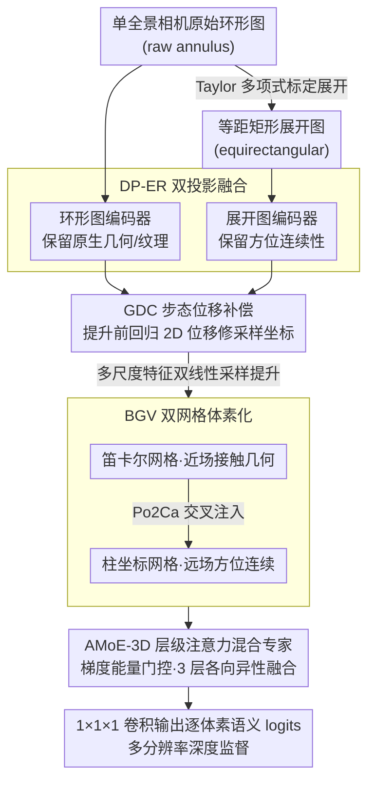

# OneOcc: Semantic Occupancy Prediction for Legged Robots with a Single Panoramic Camera

**会议**: CVPR 2026  
**arXiv**: [2511.03571](https://arxiv.org/abs/2511.03571)  
**代码**: 有  
**领域**: 自动驾驶  
**关键词**: 语义场景补全, 全景相机, 足式机器人, 体素占用预测, 步态补偿  

## 一句话总结

提出 OneOcc，一个面向足式/人形机器人的纯视觉全景语义占用预测框架，通过双投影融合、双网格体素化、步态位移补偿和层级混合专家解码器，仅用单个全景相机即可实现 360° 语义场景补全，在真实四足和仿真人形数据集上超越 LiDAR 基线。

## 研究背景与动机

### 1. 领域现状

语义场景补全（SSC）旨在从部分观测预测完整的 3D 体素语义，已成为自动驾驶核心任务。从 LiDAR 方法（SSCNet → LMSCNet → SCPNet）到视觉方法（MonoScene → VoxFormer → OccFormer），SSC 在**轮式平台**上取得了长足进步。然而，所有主流 SSC 方法均假设前向针孔/鱼眼传感器 + 稳定的轮式底盘运动，难以迁移到足式机器人场景。

### 2. 痛点

足式/人形机器人面临三大挑战：**(1)** 步态抖动（gait jitter）——敏捷步态引起的冲击性脚着地和微小 roll/pitch 破坏特征到体素的映射和时序一致性；**(2)** 360° 全向感知需求——在崎岖复杂地形中需要全方位态势感知，而非仅前向视野；**(3)** 载荷/功耗限制——足式平台对传感器数量和计算资源的预算远低于自动驾驶车辆。

### 3. 核心矛盾

现有 SSC 系统为轮式平台设计，依赖前向针孔传感器和稳定运动假设。但足式平台需要**单传感器全景**解决方案，且必须应对全景图像特有的**环状畸变和接缝伪影**，以及步态运动导致的**特征-体素映射相位误差**。

### 4. 要解决什么

为足式/人形机器人设计一个轻量、纯视觉、抗步态抖动的 360° 语义占用预测框架，同时构建该场景的评测基准。

### 5. 切入角度

从全景相机的**双投影特性**（环形原始图 vs 等距矩形展开图）和**双坐标系体素化**（笛卡尔 vs 柱坐标）入手，利用二者的互补性解决全景畸变和远近场不平衡问题，并在特征提升前通过可学习的位移补偿消除步态误差。

### 6. 核心 idea

四个即插即用模块协同：DP-ER（双投影编码器融合）保留环形连续性与网格对齐；BGV（双网格体素化）平衡近场精度和远场方位连续性；GDC（步态位移补偿）在特征提升前修正相位误差；AMoE-3D（层级注意力混合专家）实现尺度自适应的各向异性 3D 融合。

## 方法详解

### 整体框架

OneOcc 要解决的是：一台足式/人形机器人只挂了一个全景相机，怎么在剧烈抖动的步态下把头顶 360° 的世界补全成带语义的 3D 体素。整条流水线是一次前向：先把全景相机拍到的原始环形图（raw annulus）用 Taylor 多项式模型标定展开成一张等距矩形图（equirectangular），让"原始几何"和"方位展开"两套表征同时在手；接着双投影编码器 DP-ER 用两路 2D backbone 分别吃这两张图，各自吐出 {1/4, 1/8, 1/16} 三个尺度的特征；在把 2D 特征提升到 3D 之前，GDC 先回归一个 2D 位移把步态相位误差按住；然后 BGV 在笛卡尔和柱坐标两套体素网格里各自双线性采样、互相交叉注入，得到平衡了远近场的 3D 体素特征；最后三层 depthwise-separable 的 AMoE-3D UNet 逐层用注意力-MoE 聚合多尺度证据，1×1×1 卷积输出逐体素语义 logits，配合多分辨率深度监督。四个模块（DP-ER / GDC / BGV / AMoE-3D）都是即插即用的，针对的正是足式全景这一场景里"畸变、抖动、远近场不平衡、各向异性"四个具体麻烦。

### 关键设计

**1. DP-ER 双投影融合：用两种投影同时喂网络，化解全景"展开就丢几何、不展开就难卷积"的两难**

全景相机的难处在于它一张图里同时混着两类信号：赤道带分辨率高、主导运动先验，极区却被严重畸变拉花。如果只用展开后的等距矩形图，方位连续性是保住了、卷积也好做，但展开本身扭曲了原生几何与精细纹理；如果只用原始环形图，几何和纹理是原汁原味，但环状排布让标准卷积很难对齐。DP-ER 干脆两路都要——一路 2D 编码器处理原始环形图保留局部纹理和原生光学结构，另一路处理 Taylor 展开后的等距矩形图保留方位（环形）连续性，两者在多尺度上互补了赤道-极点之间分辨率与感受野的权衡。关键是这里的展开尊重了 PAL（全景环带透镜）的光学特性，而不是粗暴拉平，因此给后续体素提升喂的是更稳的线索。

**2. GDC 步态位移补偿：在体素量化之前把步态相位误差按住，避免误差被离散化"焊死"**

足式步态的冲击性脚着地和微小 roll/pitch 会让特征到体素的映射产生相位误差。一个自然的想法是提升成体素后再去矫正，但那时误差已经被体素量化污染、抹不干净了。GDC 选择更靠前的位置下手：在每个尺度、每条投影路径上用 GAP 加一个零初始化线性层回归出 2D 位移 $\Delta_s = (dx, dy)$，直接修正提升前的 2D 采样坐标。这么做一来避开了量化损失，二来 2D 上补偿计算开销更低。零初始化是点睛之笔——训练初期 $\Delta_s \approx 0$，模块等效于恒等变换，无抖动时不会干扰基线性能（这一思路借自 ControlNet 的 zero-conv）；同时它把原本的整数索引聚集升级成双线性采样，顺带压低了投影走样。

**3. BGV 双网格体素化：让笛卡尔管落脚、柱坐标管环顾，两套网格各取所长再融合**

足式机器人的安全决策天然分两摊：落脚安不安全要看近场的接触几何（脚下障碍、可踏点），而走向哪、绕不绕得开要看远场的场景布局（环路、整体结构）。单一网格做不好这件事——笛卡尔网格 $(x, y, z)$ 在近场刻画接触几何很精确，但远场角分辨率衰减、容易走样；柱坐标网格 $(r, \varphi, z)$ 的方位角 $\varphi$ 恰好与全景图的水平轴线性对应，天然保住环形连续性、远场方位不糊。BGV 因此同时在两套网格里定义体素质心，各自从 DP-ER 的双投影特征里双线性采样提升成 3D 特征，再用预计算好的交叉网格索引把柱坐标侧的极坐标上下文重采样到笛卡尔网格上级联（Po2Ca 交叉映射）。这样近场精度和远场方位连续性被显式地缝在了一起，而不是逼一种网格去兼顾它本来就不擅长的那一头。

**4. AMoE-3D 层级注意力混合专家：用梯度能量当路由信号，让网络在边界处用"精细专家"、在平地处走"省事路径"**

全景场景是高度各向异性的：方位维变化剧烈而垂直结构相对单薄，远近场尺度差异又大，用一套各向同性的 3D 卷积去融合并不合适。AMoE-3D 在 3D UNet 的三个层级上各放一个融合模块，先用双路体积显著性筛信息——通道门 $A_c$ 做通道筛选、空间门 $A_s$ 做空间筛选，再由 GradEnergy3D 计算各轴 3D 梯度的能量、经 softmax 门控从 $K$ 个 1×1×1 Conv-GELU-Conv 专家里挑选并加权融合。梯度能量当路由信号的物理意义很直白：车辆、杆子这类类别边界处梯度高，就激活精细专家强化高对比度结构；大片地面（道路）梯度低，就走简单专家、抑制过拟合，从而让落脚区域的判断更稳。

### 损失函数 / 训练策略

总损失沿用 MonoScene 框架：$\mathcal{L}_{total} = \mathcal{L}_{CE} + \mathcal{L}_{SCAL}^{sem} + \mathcal{L}_{SCAL}^{geo} + \mathcal{L}_{FP}$

- **交叉熵 $\mathcal{L}_{CE}$**：在有效体素上计算，配合类别再加权
- **场景-类别亲和损失 SCAL**：分语义和几何两版本，约束场景级统计
- **视锥比例损失 $\mathcal{L}_{FP}$**：约束不同视锥内的类别比例
- 刻意**未使用关系损失**（relation loss），因为在全景足式设置下其共现先验会过度平滑方位边界、抑制小型近场类别
- 在三个分辨率步长 {1, 2, 4} 处施加深度监督

## 实验关键数据

### 主实验

**表1：QuadOcc 验证集语义场景补全结果**（真实四足机器人校园场景，6 类语义，64×64×8 网格）

| 方法 | 输入 | vehicle | pedestrian | road | building | vegetation | terrain | mIoU |
|------|------|---------|-----------|------|----------|-----------|---------|------|
| SSCNet | LiDAR | 0.00 | 0.04 | 44.34 | 16.06 | 22.41 | 4.77 | 14.60 |
| LMSCNet | LiDAR | 0.88 | 0.20 | 57.02 | 16.45 | 24.39 | 11.70 | **18.44** |
| OccFormer | 全景 | 0.29 | 0.37 | 49.46 | 10.36 | 15.00 | 2.64 | 13.02 |
| MonoScene | 全景 | 8.15 | 1.59 | 55.66 | 12.88 | 26.10 | 10.78 | 19.19 |
| SGN† | 全景+LiDAR | 11.62 | 2.47 | 53.06 | 15.60 | 25.67 | 9.91 | 19.72 |
| **OneOcc** | **全景** | **12.16** | **2.86** | **54.41** | **16.03** | **24.91** | **13.01** | **20.56** |

**表2：Human360Occ (H3O) 语义场景补全结果**（CARLA 仿真人形 360°，10 类语义）

| 方法 | 输入 | 域内 mIoU | 跨域 mIoU |
|------|------|-----------|-----------|
| VoxFormer-S | 全景+深度预测 | 11.09 | 10.63 |
| VoxFormer-S | 全景+GT深度 | 15.44 | 14.82 |
| SGN-T | 全景+深度预测 | 28.64 | 20.02 |
| OccFormer | 全景 | 24.88 | 20.87 |
| MonoScene | 全景 | 33.46 | 24.15 |
| **OneOcc** | **全景** | **37.29 (+3.83)** | **32.23 (+8.08)** |

### 消融实验

**表3：QuadOcc 上逐模块消融**

| 变体 | GDC | DP-ER | BGV | AMoE-3D | mIoU | 增量 |
|------|-----|-------|-----|---------|------|------|
| Q0 baseline | ✗ | ✗ | ✗ | ✗ | 19.19 | — |
| Q1 +GDC | ✓ | ✗ | ✗ | ✗ | 19.58 | +0.39 |
| Q2 +DP-ER | ✓ | ✓ | ✗ | ✗ | 19.89 | +0.31 |
| Q3 +BGV | ✓ | ✓ | ✓ | ✗ | 20.30 | +0.41 |
| Q4 +AMoE-3D (full) | ✓ | ✓ | ✓ | ✓ | **20.56** | +0.26 |

四个模块增益可叠加：GDC 稳定采样 → DP-ER 补充互补线索 → BGV 减少离散化偏差 → AMoE-3D 锐化边界/接触区域。

**光照鲁棒性**（QuadOcc day/dusk/night mIoU）：

| 方法 | Day | Dusk | Night |
|------|-----|------|-------|
| LMSCNet (LiDAR) | 17.33 | 18.91 | 13.40 |
| MonoScene (Vision) | 18.58 | 15.14 | 14.20 |
| **OneOcc** | **21.15** | **19.86** | 13.50 |

### 关键发现

1. **纯视觉超越 LiDAR**：OneOcc 仅用单个全景相机（20.56 mIoU）即超越最佳 LiDAR 方法 LMSCNet（18.44），提升 +11.5%，证明任务对齐的全景融合设计可弥补模态差距
2. **跨域泛化能力突出**：在 H3O 跨城市设置下，OneOcc（32.23）大幅领先 MonoScene（24.15）达 +8.08 mIoU（+33.5% 相对提升），表明 DP-ER 和 AMoE-3D 的畸变感知先验有效缓解分布偏移
3. **车辆/行人等稀有类别显著提升**：在 QuadOcc 上 vehicle 从 8.15 提升至 12.16，pedestrian 从 1.59 提升至 2.86，反映 BGV 的远近场平衡和 AMoE-3D 的边界锐化效果
4. **效率适中可部署**：101.76M 参数，RTX4090 上 FP32 推理 69.93ms（14.3 FPS），混合精度下 52.84ms（18.9 FPS），峰值显存 1.49GB

## 亮点与洞察

1. **问题定义精准**：首次系统化定义"足式机器人全景语义占用预测"，清晰分析轮式→足式迁移的三大不匹配（运动模式、视野覆盖、载荷限制）
2. **GDC 的零初始化设计**：借鉴 ControlNet 的 zero-conv 策略，确保无抖动时模块退化为恒等映射，训练稳定且不伤基线性能
3. **梯度能量门控 MoE**：用 3D 梯度能量作为专家选择信号，物理意义直观——高梯度区域（类别边界）激活精细专家，低梯度区域（平坦地面）走简单路径
4. **双坐标系互补**：柱坐标的方位角与全景水平轴天然对齐，这一几何洞察使得 BGV 不仅是"多换一种网格"，而是真正利用了全景成像的内在结构
5. **完整的数据贡献**：同时发布真实（QuadOcc）和仿真（H3O）两个互补基准，支持域内/跨域评测

## 局限与展望

1. **标定依赖**：OneOcc 假设精确标定且漂移有界，实际部署中长时间运行的标定漂移可能累积误差。作者建议引入在线外参自标定
2. **夜间性能下降**：Night 场景 mIoU（13.50）低于 MonoScene（14.20），全景视觉在极低光照下受限于传感器动态范围
3. **GDC 简单化**：仅回归全局 2D 平移量，未建模旋转或空间变化的畸变；对复杂多自由度步态可能不足
4. **未探索时序信息**：当前为单帧方法，未利用帧间时序一致性，而足式机器人的步态有周期性规律可利用
5. **仿真到真实迁移**：H3O 基于 CARLA 仿真，域差距尚未系统评估

## 相关工作与启发

- **MonoScene** 是直接基线（Q0），OneOcc 在其基础上逐步加入四个模块实现 +1.37 mIoU 提升
- **Cylinder3D** 的柱坐标离散化思路被 BGV 继承并扩展为双网格融合
- **ControlNet** 的零初始化策略被 GDC 借鉴，用于保证插件式模块的无害初始化
- **MoE 在 3D 感知中的应用**（如 Point-MoE）启发了 AMoE-3D 的设计，但本文用梯度能量替代传统路由
- 对全景占用感知（Humanoid Occupancy、OmniHD-Scenes）形成有力补充，推动该新兴方向发展

## 评分

⭐⭐⭐⭐ 系统性强的工作，精准定义新问题+完整方法+双数据集贡献，四个模块设计动机清晰且增益可叠加，但每个模块的单独增益较小（0.26-0.41），夜间场景仍有短板。

<!-- RELATED:START -->

## 相关论文

- [\[CVPR 2026\] Panoramic Multimodal Semantic Occupancy Prediction for Quadruped Robots](panoramic_multimodal_semantic_occupancy_prediction.md)
- [\[CVPR 2026\] M²-Occ: Resilient 3D Semantic Occupancy Prediction for Autonomous Driving with Incomplete Camera Inputs](m2-occ_resilient_3d_semantic_occupancy_prediction_for_autonomous_driving_with_in.md)
- [\[CVPR 2026\] Sparsity-Aware Voxel Attention and Foreground Modulation for 3D Semantic Scene Completion](sparsity-aware_voxel_attention_and_foreground_modulation_for_3d_semantic_scene_c.md)
- [\[CVPR 2026\] O3N: Omnidirectional Open-Vocabulary Occupancy Prediction](o3n_omnidirectional_open-vocabulary_occupancy_prediction.md)
- [\[CVPR 2026\] Monocular Open Vocabulary Occupancy Prediction for Indoor Scenes (LegoOcc)](monocular_open_vocabulary_occupancy_prediction_for_indoor_scenes.md)

<!-- RELATED:END -->
