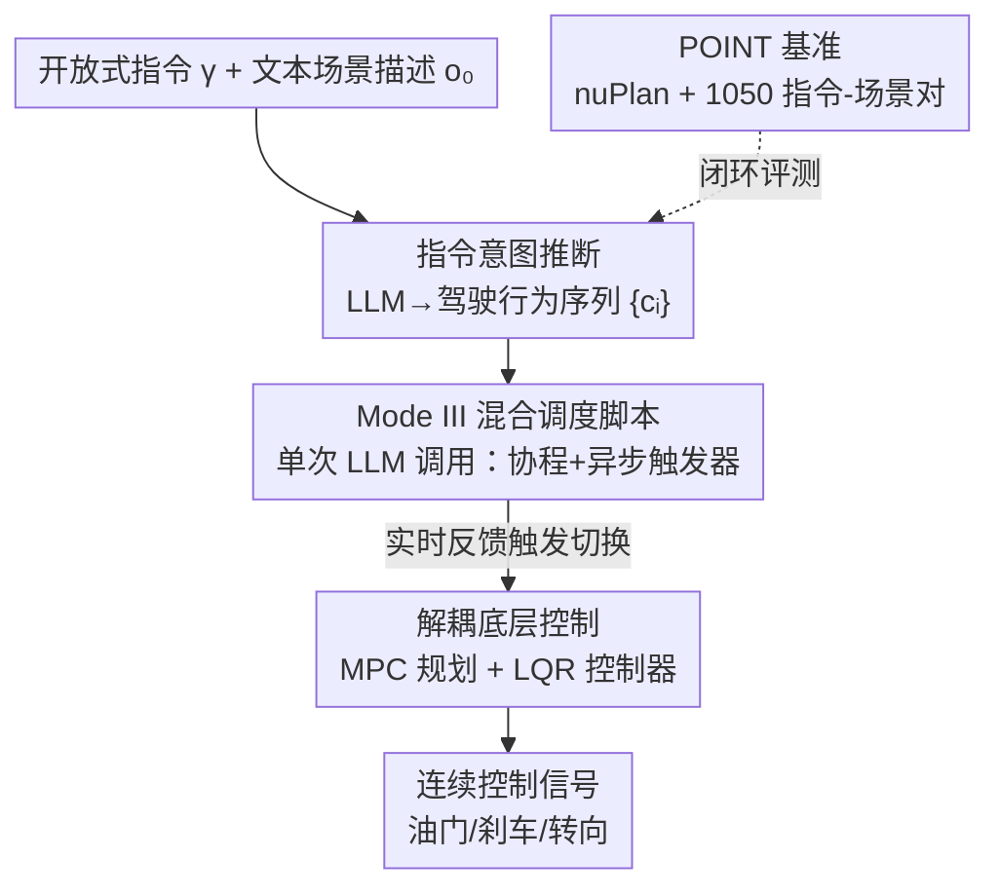

# Open-Ended Instruction Realization with LLM-Enabled Multi-Planner Scheduling in Autonomous Vehicles

**会议**: CVPR 2026  
**论文**: [CVF Open Access](https://openaccess.thecvf.com/content/CVPR2026/html/Liu_Open-Ended_Instruction_Realization_with_LLM-Enabled_Multi-Planner_Scheduling_in_Autonomous_Vehicles_CVPR_2026_paper.html)  
**代码**: 待确认  
**领域**: 自动驾驶 / LLM Agent  
**关键词**: 开放式指令、运动规划调度、LLM 驾驶、人机交互、闭环评测

## 一句话总结
针对 L4-L5 自动驾驶里"乘客用自然语言下达机动级指令"这一被忽视的需求，本文提出一套"以调度为中心"的框架：用 LLM 一次性把开放式指令解析成驾驶行为序列并生成调度脚本，再由多个 MPC 运动规划器在实时反馈下接力执行，从而在保持语言到控制全链路可追溯的同时，把指令实现成功率相对基线提升 64%–200%，且只需一次 LLM 查询。

## 研究背景与动机
**领域现状**：现有人机交互（HMI）系统主要面向 SAE L0-L3，预设"驾驶员随时可接管"，靠车道偏离告警、方向盘震动、接管提示这类面向司机的信号工作。但到了 Robotaxi 这类 L4-L5 场景，车里坐的是后排乘客而非司机，这些面向司机的线索全部失效，HMI 需要重新设计成"非驾驶用户也能直觉交互"的形态。LLM 的成熟让自然语言成为最自然的接口候选。

**现有痛点**：把乘客的开放式语言变成控制信号有三道坎。其一，现有车载 HMI 偏重信息娱乐、座舱控制、导航，**几乎不开放车道变更、超车、靠边停车这类机动级操作**；而真实乘客指令措辞千差万别（"我感觉不安全""前面有便利店想买点东西"），不遵循标准模板。其二，执行一条指令往往需要调度**一串**驾驶行为（如"我感觉不安全"→[左变道、加速、车道保持]），单个规划器管不过来，且行为切换必须随实时交通反馈并发进行、不阻塞其他模块。其三，多数 LLM 驾驶研究只在公开数据集或游戏式模拟器上做**开环**评测，缺乏基于真实交通数据的高保真闭环测试台。

**核心矛盾**：语言模型擅长高层语义推理但输出是概率性、不可靠的，直接让它产生数值化、安全攸关的控制信号既不安全也不可追溯；而传统模块化 AD 栈安全可控却听不懂开放式语言。两者的能力域和时间尺度根本不同。

**本文目标**：让 LLM 只在它擅长的"高层、低频语义推理"上发力，把"低层、高频、安全攸关的连续控制"交还给可验证的控制器，并在两者之间建立一条人类可读、可审计的决策链；同时补上缺失的闭环评测基准。

**切入角度**：借鉴控制论的分层解耦、时间尺度分离与事件触发调度思想——LLM 一次性产出"调度脚本"，脚本里用异步触发器在不同实时条件下切换多个专用运动规划器。

**核心 idea**：把 LLM 当成"调度器"而非"控制器"——用一次 LLM 调用生成调度脚本来协调多个显式 MPC 规划器，实现开放式机动级指令，同时维持语言到控制的透明链路。

## 方法详解

### 整体框架
框架把"乘客一句开放式指令 → 连续控制信号"拆成三个时间尺度递减的阶段。**阶段 1（做什么）**：LLM 作为解释器 $f_\phi$，输入指令 $\gamma$ 和文本化的交通场景描述 $o_0$，输出一个有序的原子驾驶行为序列 $\{c_i\}_{i=1}^{m(\gamma)}$，每个 $c_i$ 取自五种预定义原子行为（车道保持、左/右变道、加速、减速）。**阶段 2（怎么做）**：LLM 在**一次调用**里生成可执行调度脚本，脚本既按序调度多个运动规划器去落实行为序列，又设置异步触发器持续监控场景图、在满足实时条件时触发规划器切换（如"间距超过 20 米时从减速切到右变道"）。**阶段 3（闭环执行）**：被调度的行为专用 MPC 规划器在滚动时域内用 3D 检测和高精地图优化轨迹，再由 LQR 控制器转成油门、刹车、转向。整个安全攸关的"调度—规划—控制"快环直接跑在原始感知输入上，LLM 只在慢环里做语义决策，因此底层控制不会被 LLM 的幻觉直接污染。

问题被形式化为指令引导的 POMDP $\langle S, A, O, T, \mathcal{O}, \Gamma, R\rangle$，并用阶段式稀疏奖励 $R(\bar{s}_t, a_t, \bar{s}_{t+1})$ 在完成第 $k_t{+}1$ 个行为（即 $s_{t+1}\in\mathcal{C}_{k_t+1}$）时给 $r_{k_t+1}$，目标是在风险约束 $\mathbb{P}[\forall t: s_t\in S_{\text{safe}}]\geq 1-\varepsilon$ 下最大化累计奖励。

### 关键设计

**1. 指令意图推断：用文本场景描述把开放式指令锚定成原子行为序列**

第一道坎是"听懂"千变万化的乘客措辞。本文让 LLM 作为解释器 $f_\phi(\gamma, o_0)=\{c_i\}_{i=1}^{m(\gamma)}$，把指令映射成五种预定义原子行为的有序序列。关键在于喂给 LLM 的是**文本化**的场景描述 $o_0$ 而非视觉特征：一方面文本场景能提供环境约束（如最右车道禁止右变道）和情境线索（必要时变道靠边停车）来消歧；另一方面，作者发现即便是大体量商用 VLM 在开放式指令理解上仍会严重幻觉，而文本描述 + 把输出**约束**到结构化的预定义行为序列，能显著降低幻觉、增强可靠性。注意这种文本化只用于高层意图推断——安全攸关的轨迹规划仍直接吃原始感知（3D 检测、高精地图），避免把路面几何等细粒度信息压成文本时丢失细节。

**2. Mode III 混合调度脚本：一次 LLM 调用兼顾低开销与实时适应**

执行行为序列需要协调"何时从加速切到变道"这种离散决策与连续控制。本文把已有 LLM 驾驶方法归纳成三种模式：Mode I 启动时配一次参数后固定（静态、无法动态决策）；Mode II 让 LLM 持续参与每步决策（灵活但频繁查询、延迟与开销高，且难保持行为序列执行中的决策连贯）；**Mode III（本文）**则只用一次 LLM 调用生成可执行脚本，脚本（i）按序调度多个运动规划器落实 $\{c_i\}$，（ii）借助协程机制与异步触发器监控场景图、在实时条件满足时激活规划器切换。这样既拿到 Mode I 的低开销，又获得 Mode II 的情境响应性——脚本是预先生成的"带条件分支的执行计划"，运行期无需再问 LLM。

**3. 解耦的 MPC+LQR 底层控制：把数值安全控制留在可验证模块里，换取延迟鲁棒性**

高层决策定好后，级联的运动规划器与控制器把它落成连续信号：行为专用 MPC 在滚动时域内用显式车辆模型优化轨迹（可解释），再由 LQR 做连续控制。这种解耦带来三重好处：（i）**能力域对齐**——LLM 只做高层离散决策，数值化、安全攸关的控制交给可验证控制器，不让概率性 LLM 直接生成控制量；（ii）**可追溯性**——人类可读的脚本充当接口，把 LLM 文本推理到实际动作的映射透明化，便于开发者或外部审计检查调试；（iii）**对延迟的安全鲁棒性**——安全由高频"调度—规划—控制"快环保障，LLM 在慢环里低频查询，因此即使 LLM 推理有几秒延迟，安全指标（碰撞、TTC）几乎不受影响，只是指令实现率平缓下降。

**4. POINT 基准：高保真闭环的开放式指令实现测试台**

针对"缺乏闭环测试台"这道坎，本文构建 POINT 基准：基于真实驾驶数据重建城市交通的混合 nuPlan 模拟器，配 1,050 条指令-场景初始化对。指令先收集真实样本，再用商用 LLM（ChatGPT、Gemini）规模化扩写并经人工严格筛选；生成时强制对话式措辞并抑制显式意图陈述，约 70% 指令涉及变道、超车、靠边停车等高风险横向机动。基准还从"任务调度视角"对现有 LLM 驾驶方法分类，并引入若干有竞争力的基线（如本文提出的 Mode-II 扩展 DiLu+、DiLu++）。评测覆盖三类指标：任务类（意图识别率、指令实现率）、安全类（无碰撞率、最小 TTC）、合规类（可行驶区域占比、限速符合占比、行驶方向一致占比）。

### 一个例子：一句"我感觉不安全"如何落地
乘客说"我感觉后面那辆卡车让我不安全"。阶段 1 LLM 结合文本场景把它推断成意图"右变道"并展开成行为序列 [减速、右变道、车道保持]。阶段 2 LLM 一次性生成调度脚本：先调用减速控制器，同时定义触发器 1（右变道条件，如间距足够），用 `wait_until` 协程挂起直到条件满足再调用右变道控制器，并定义触发器 2 切到车道保持。阶段 3 各行为对应的 MPC 规划器逐段生成轨迹、LQR 转成控制量，整个过程在实时反馈下接力推进——LLM 只在最开始被问了一次。

## 实验关键数据

实验用商用 LLM 生成指令、用开源 LLM 家族（Qwen、DeepSeek）做评测以减小模型偏置，硬件为 Xeon Gold 5220 + A40。所有 LLM 基线共用 DeepSeek-V3 骨干并对同一意图-场景对使用相同行为序列以保证公平。

### 主实验
下表中**指令实现率（Realization）**指成功执行的指令占比，**Progress**（专家轨迹进度）指相对人类专家覆盖的行驶距离；所有指标归一化到 $[0,1]$。专用 AD 方法跟随专家全局路径、无 Realization 分；指令实现类方法优先执行乘客指令、常偏离全局路径。

| 方法 | 类别 | Realization ↑ | Collision ↑ | TTC ↑ | Drivable ↑ | Speed ↑ | Direction ↑ | Progress ↑ |
|------|------|------|------|------|------|------|------|------|
| PDM-Closed | 专用·MPC | — | 0.97 | 0.86 | 0.98 | 1.00 | 1.00 | 0.92 |
| Diffusion-ES | 指令·LLM+数据驱动 | 0.28 | 0.82 | 0.80 | 0.80 | 0.99 | 1.00 | 0.77 |
| DiLu++ | 指令·LLM+MPC（Mode II） | 0.51 | 0.92 | 0.73 | 0.96 | 0.97 | 1.00 | 0.87 |
| **本文** | 指令·LLM+MPC（Mode III） | **0.84** | **0.99** | **0.88** | 0.97 | 1.00 | 1.00 | 0.82 |

本文在指令实现类方法中拿到最高 0.84，相对最优基线 DiLu++（0.51）提升约 64%、相对 Diffusion-ES（0.28）提升约 200%，同时碰撞、TTC、合规指标与专用 AD 方法持平甚至更优；Progress 略低是因为执行乘客指令会偶尔偏离全局路径（属预期权衡）。意图识别上，只有 Qwen-2.5-72B、DeepSeek-V3、DeepSeek-R1 等大模型才能超过 85%，印证开放式指令理解本身非平凡。

### 消融实验
| 配置 | REC/REA ↑ | Collision ↑ | TTC ↑ | 说明 |
|------|------|------|------|------|
| Ours w/o Context | 0.78 | — | — | 去掉交通上下文，意图识别掉约 10% |
| Ours（完整意图识别） | 0.86 | — | — | 含上下文，意图识别更准 |
| 单一·车道保持规划器 | 0.17 | 0.97 | 0.86 | 只用一个规划器，指令实现率崩塌 |
| 单一·加速规划器 | 0.13 | 0.57 | 0.38 | 单规划器还伤安全 |
| PL 调度（本文） | **0.84** | 0.99 | 0.88 | LLM 调度多规划器协同 |

### 关键发现
- **交通上下文对意图识别贡献约 +10%**：文本场景描述提供环境约束，让 DeepSeek-V3 的解析更准。
- **多规划器调度是成败关键**：任何单一规划器的指令实现率都只有 0.12–0.18，而 LLM 协调下的调度直接拉到 0.84，且不牺牲安全——说明"接力多个专家"远胜"一个通才"。
- **对 LLM 延迟高度鲁棒**：人为注入 0→4 秒延迟，REA 从 0.84 平缓降到 0.39，但碰撞（0.98→0.99）和 TTC（约 0.87→0.88）基本不动，验证了快慢环解耦的设计——安全不依赖 LLM 实时性。

## 亮点与洞察
- **"LLM 当调度器不当控制器"是核心洞见**：把概率性语言模型限制在高层离散决策、用一次调用产出带异步触发器的脚本，既避免幻觉污染控制、又获得运行期零额外 LLM 查询的低开销，这个能力域划分非常干净。
- **Mode I/II/III 的调度视角分类**很有迁移价值：它给"LLM 何时、以何频率介入驾驶决策"提供了一个统一坐标系，可用来定位和比较各种 LLM 驾驶方法。
- **延迟鲁棒性来自架构而非工程优化**：快慢环时间尺度分离意味着安全攸关回路天然隔离了 LLM 延迟，这一点对所有"LLM-in-the-loop"系统都有借鉴意义。
- **POINT 基准填补闭环空白**：强制对话式、抑制显式意图的指令生成方式，让基准真正考的是"开放式理解"而非模板匹配。

## 局限与展望
- **原子行为集合受限**：只有五种预定义原子行为，更复杂或组合型机动（如复杂路口多步绕行）靠组合表达，表达力上限值得验证。⚠️ 行为序列的完备性以原文 POINT 设计为准。
- **依赖文本场景描述**：把交通场景编码成文本不可避免丢失细粒度几何信息；虽然底层控制吃原始感知规避了这点，但意图推断阶段的消歧能力仍受文本描述质量制约。
- **意图识别强依赖大模型**：只有 70B 级及以上模型才过 85% 识别率，部署到车端算力受限时如何蒸馏/压缩是个现实问题。
- **评测仍在模拟器内**：nuPlan 虽基于真实数据，但闭环仍是仿真，真实车路协同与乘客交互的复杂度未完全覆盖。

## 相关工作与启发
- **vs 传统两阶段指令处理（意图分类 + 关键参数抽取，如 AIME）**：传统规则法面对开放语言会组合爆炸、覆盖稀疏、维护成本高；数据驱动意图分类受限于固定标签和训练措辞，OOD 泛化差。本文不训练、不写规则，纯用 LLM 的预训练世界知识做类比与组合泛化，且指令只用于评测以避免数据泄漏。
- **vs 端到端 VLA 方法（LMDrive、AutoVLA、AdaThinkDrive）**：VLA 把感知-语言-控制统一，但偏好标准化导航指令、且端到端设计削弱了"文本推理 ↔ 实际动作"的一致性与可追溯性（VLA 说的和做的未必对齐）。本文用人类可读脚本作接口，显式维持语言到控制的透明链路，更契合 ISO 26262 等可追溯性安全标准。
- **vs Mode-II 类持续决策（DiLu++）**：DiLu++ 每步问 LLM，开销大且偶尔忽略历史动作导致冗余变道等不连贯决策；本文 Mode III 一次调用 + 异步触发器，既连贯又省查询。

## 评分
- 新颖性: ⭐⭐⭐⭐ 调度中心 + Mode III 的视角清晰且实用，但单个组件（LLM 解析、MPC、协程触发）均非首创，胜在组合与定位。
- 实验充分度: ⭐⭐⭐⭐ 主表 + 消融 + 延迟敏感性 + 意图识别 scaling 较完整，但仅限 nuPlan 仿真、缺真车验证。
- 写作质量: ⭐⭐⭐⭐ 三阶段叙事清晰、Mode 分类有助理解，公式与挑战对应明确。
- 价值: ⭐⭐⭐⭐ POINT 基准 + 可追溯框架对 Robotaxi 乘客交互这一现实需求有直接价值。

<!-- RELATED:START -->

## 相关论文

- [\[CVPR 2026\] Diffusion Forcing Planner: History-Annealed Planning with Time-Dependent Guidance for Autonomous Driving](diffusion_forcing_planner_history-annealed_planning_with_time-dependent_guidance.md)
- [\[CVPR 2026\] O3N: Omnidirectional Open-Vocabulary Occupancy Prediction](o3n_omnidirectional_open-vocabulary_occupancy_prediction.md)
- [\[CVPR 2026\] Unposed-to-3D: Learning Simulation-Ready Vehicles from Real-World Images](unposed-to-3d_learning_simulation-ready_vehicles_from_real-world_images.md)
- [\[CVPR 2026\] Open-Vocabulary Domain Generalization in Urban-Scene Segmentation](open-vocabulary_domain_generalization_in_urban-scene_segmentation.md)
- [\[ICCV 2025\] CoLMDriver: LLM-based Negotiation Benefits Cooperative Autonomous Driving](../../ICCV2025/autonomous_driving/colmdriver_llm-based_negotiation_benefits_cooperative_autonomous_driving.md)

<!-- RELATED:END -->
