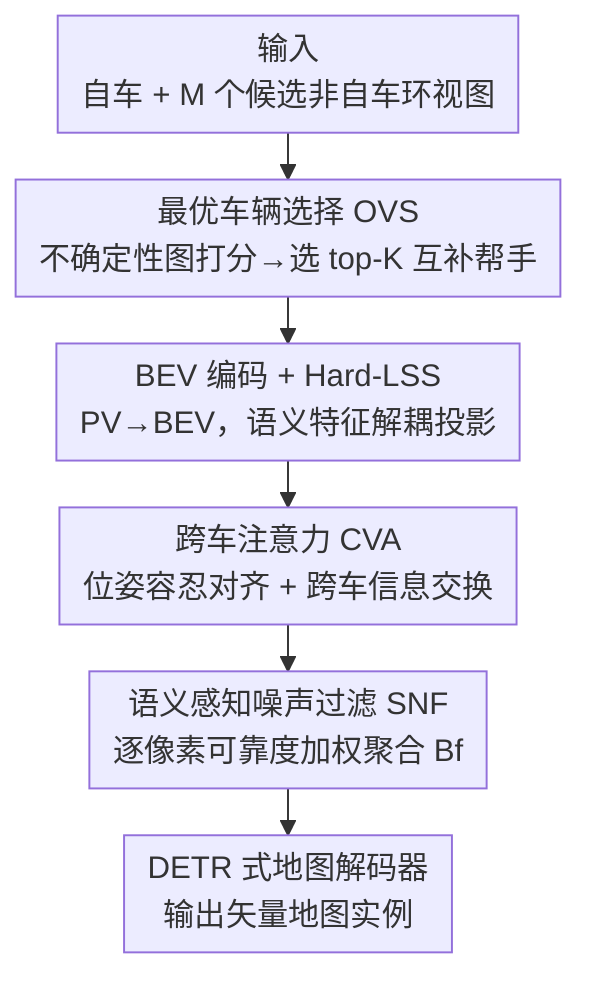

# OptiMVMap: Offline Vectorized Map Construction via Optimal Multi-vehicle Perspectives

**会议**: CVPR 2026  
**论文**: [CVF Open Access](https://openaccess.thecvf.com/content/CVPR2026/html/Dan_OptiMVMap_Offline_Vectorized_Map_Construction_via_Optimal_Multi-vehicle_Perspectives_CVPR_2026_paper.html)  
**代码**: https://github.com/DanZeDong/OptiMVMap  
**领域**: 自动驾驶 / 矢量地图构建  
**关键词**: 离线矢量地图、多车视角、车辆选择、BEV 融合、不确定性引导

## 一句话总结
OptiMVMap 把离线矢量化高精地图构建从"单车轨迹"扩展到"多车协同"，并提出一个"先选车、再融合"（select-then-fuse）的即插即用框架：用不确定性引导的 OVS 模块从邻车里挑出 2~5 个最互补的帮手，再经跨车注意力对齐和语义噪声过滤后在 BEV 层融合，在 nuScenes / Argoverse2 上把 MapTRv2 分别提升 +10.5 / +9.3 mAP。

## 研究背景与动机
**领域现状**：离线矢量地图（把车道线、边界、人行横道等还原成有序点序列）是高精驾驶和地图服务的基础设施。当前主流做法绝大多数基于**单车轨迹**，把建图当成目标检测，用 DETR 式架构从自车（ego）BEV 特征里解码出矢量元素。为了缓解单车视野不足，近期工作引入"记忆增强"：要么聚合同一条轨迹的相邻帧（时序记忆，如 StreamMapNet、MVMap），要么把附近的历史预测写进一张粗糙的栅格局部地图（地图级历史，如 HRMapNet）。

**现有痛点**：这些记忆增强本质上**仍然是单车**。多出来的观测都来自几乎共线（near-collinear）的视角，视差很小，对被遮挡或远距离区域几乎没有补充信息；而且没有质量控制，早期的错误会被一直保留并传播污染后续预测。换句话说，时序记忆只是"延长了观测时间"，并没有真正解决**视角不足（viewpoint insufficiency）**这个根本瓶颈。

**核心矛盾**：要真正还原遮挡/远处的结构，需要的是**空间多样性**——而这只有来自其他车辆的互补视角才能提供。作者统计发现这并非奢望：nuScenes 有 84.6%、AV2 有 70.2% 的场景在 60m 内存在其他轨迹，自车周围通常有 10+ 个非自车视角，所以多车融合既可行又有潜力。但天真地把附近所有车一股脑融进来会引入三个新问题：①候选车池大且异构，穷举融合计算开销过高；②空间近 ≠ 信息互补，邻车可能给的是冗余的近共线视角；③不加区分的融合会**放大**位姿误差和遮挡伪影带来的噪声。

**核心 idea**：把多车建图重新表述成一个 **select-then-fuse** 问题——先用不确定性作为信号，挑出一小撮能最大程度降低自车遮挡区不确定性、且几何上互补的"帮手车"，再在融合前做位姿容忍的对齐与噪声抑制。用"选对少数几辆车"代替"融合所有车"，从源头同时治掉计算、冗余、噪声三个问题。

## 方法详解

### 整体框架
OptiMVMap 是一个**即插即用、与解码器无关**的两阶段离线管线，挂在 BEV 特征层、作为解码器前置模块，下游 DETR 式地图解码器（如 MapTRv2）无需改动。输入是自车的环视图像 $I_e$ 和 $M$ 个候选非自车的环视图像 $\{I_{v_j}\}_{j=1}^M$（跨轨迹、可异步，但能对齐到同一 BEV 坐标系）；输出是一组矢量地图元素 $\{(c, P)\}$，其中 $c$ 是语义类别、$P=\{(x_i,y_i)\}_{i=1}^L$ 是 BEV 坐标系下的有序点序列。

整条管线分两步走：**(1) 最优车辆选择（OVS）**——OVS 先为每辆车算一张 BEV 不确定性图，再按空间相关性、可见性、基线互补性给候选非自车打分，选出紧凑的 top-K（预算 $K$ 很小，通常 1~3）；**(2) 轻量融合**——被选中的视角进入双步 BEV 特征通路：跨车注意力（CVA）做位姿容忍的跨轨迹对齐与信息交换，语义感知噪声过滤器（SNF）再用学到的语义权重压制遮挡/动态伪影并把对齐后的特征聚合成一张统一 BEV 表示 $B_f$，最后交给标准地图解码器解出矢量实例。由于 CVA/SNF 只作用在 OVS 选出的少量帮手上，融合代价在小 $K$ 下接近线性。

### 关键设计

**1. OVS 最优车辆选择：用不确定性把"选哪几辆车"变成一道可学习的决策题**

这一步直击痛点①②——候选车池大、且空间近不代表信息互补。OVS 分两阶段：先做**单车不确定性估计**，再做**多车选择**。第一阶段，把每辆车的视角单独喂进建图模型，得到每个折线点 $P$ 的逐点分类不确定性 $U_P$，再在半径 $d$ 邻域内平均，转成逐像素的 BEV 不确定性图：$U_{i,j}=\frac{1}{|\Omega_{i,j}|}\sum_{P\in\Omega_{i,j}}U_P$，其中 $\Omega_{i,j}$ 是离像素 $(i,j)$ 距离 $d$ 内的点集——这张图高亮了"没有外援就搞不定"的区域。第二阶段先做候选集构造：把自车 BEV 空间划成 $N_h\times N_w$ 个等大方格，每个方格中心选最近的非自车作候选（论文用 8 个 BEV 区域，保证 8 个候选互不相同、消除歧义）。然后用一个小卷积网络 $G_\theta$ 把自车和候选的不确定性图编码成紧凑特征 $U_e=G_\theta(U_e)$、$U_v=G_\theta(U_v)$，用一层 CVA 把候选特征与自车空间对齐得到 $\hat{U}_v=F(U_e,U_v)$，再以每个非自车的位置嵌入 $E_v$ 作 query、对 $\hat{U}_v$ 做交叉注意力、过 MLP 得到适配性分数 $s_v=\mathrm{MLP}(\mathrm{CA}(E_v,\hat{U}_v))$，最后取 top-K。其妙处在于：评分直接对齐"能把自车难区的不确定性降多少"，而不是简单的空间距离，因此挑出来的是**几何互补**的高价值帮手，既绑住了计算预算又避开了近共线冗余。消融显示在已有对齐和去噪之上再加 OVS 还能涨 +4.8 mAP，超过对齐+去噪的合计增益，证明"选对车"才是主导因子。

**2. CVA 跨车注意力：位姿对不准时，靠可学习采样硬把邻车 BEV 拉回自车坐标系**

即便选对了车，跨车标定误差和时间漂移会让 BEV 错位（论文 Fig.1 底部展示了"车道应该在的位置"和"邻车里实际在的位置"对不齐），单纯的 BEV warping（按相机外参做坐标变换）补不掉旋转和平移残差。CVA 用**特征条件化的可学习采样**来对齐并交换跨车信息。一个 CVA 层记作 $F(Q_{in},V)$，改编自可变形注意力：$Q_{out}=Q_{in}+\sum_{i=1}^{N_{off}}W_i\cdot \mathrm{DA}(Q_{in},R+O_i,W_vV)$，采样偏移 $O_i$ 和权重 $W_i$ 都由 $[Q_{in},V]$ 投影产生，让网络自己学"该去哪里采、采到的信息信多少"。每个被选非自车特征 $B_v$ 先与自车 $B_e$ 融合、再与原始 $B_v$ 二次细化：$B_v^{fused}=F(F(B_e,B_v),B_v)$；自车自身也做自增强 $B_e^{enhanced}=F(F(B_e,B_e),B_e)$ 以保持一致性。论文只用两层浅 CVA、$N_{off}$ 取小值，在小 $K$ 下计算量对 $HW$ 和 $K$ 近线性。消融里 CVA 带来 +2.6 mAP，是可靠融合的前提。

**3. SNF 语义感知噪声过滤：把融合当成"质量闸门"，逐像素决定每辆车的特征信多少**

CVA 对齐后仍会残留动态物体、遮挡引起的伪影。SNF 借助语义和不确定性先验，为自车增强特征和每个融合后的非自车特征算逐像素可靠度权重，相当于在每个像素上对"自车 + 选中非自车"的贡献做归一化：$S_e,S_{v_1},\dots,S_{v_K}=\mathrm{Softmax}(\mathrm{NS}(B_e^{enhanced},B_e^{sem}),\dots,\mathrm{NS}(B_{v_K}^{fused},B_{v_K}^{sem}))$，其中 $\mathrm{NS}$ 是噪声打分卷积网络。最终 BEV 表示按可靠度加权组合：$B_f=S_e\odot B_e^{enhanced}+\sum_{j=1}^K S_{v_j}\odot B_{v_j}^{fused}$（$\odot$ 为逐元素乘）。这种语义门控会压制噪声/冲突证据、稳定跨源融合，消融里再贡献 +2.0 mAP。值得一提的是 BEV 编码里还用了 **Hard-LSS**：标准 LSS 把深度加权的 PV 特征 soft 求和进 BEV 网格，对语义特征会造成语义模糊；Hard-LSS 改为把 PV 语义特征直接按"深度概率最大"的 grid 做 max pooling 硬分配、用深度概率当置信度，避免语义被糊掉，消融里贡献 +0.9 mAP。

### 损失函数 / 训练策略
采用两阶段训练。**(i) 融合主干预训练**：随机采样非自车（关掉 OVS），训练 CVA + SNF + 解码器。**(ii) OVS 训练**：冻结预训练好的融合主干，单独学 OVS。推理时只融合 OVS 选出的 top-K 视角，保持轻量。建图损失沿用 MapTRv2 的一对一集合预测损失（分类 + 点对点 + 边方向），插到 MapTRv2 类方法时还加一对多损失 $L_{one2many}$，并用稠密预测损失 $L_{dense}$（深度 + BEV 语义/实例分割 + PV 分割）作用在 $B_e^{enhanced}$、$\{B_{v_j}\}$、$B_f$ 上，总损失 $L_{map}=\beta_o L_{one2one}+\beta_m L_{one2many}+\beta_d L_{dense}$。OVS 的监督：为每个 $K$ 构造唯一最优子集（8 个 BEV 区域各选出的车互不相同），用 mAP 穷举评估所有车辆组合、取最高分组合作为 ground truth，再用 sigmoid BCE 训练：$L_{OVS}=-\frac{1}{|V|}\sum_{v\in V}[y_v\log\sigma(s_v)+(1-y_v)\log(1-\sigma(s_v))]$。

## 实验关键数据

### 主实验
数据集：作者把 nuScenes / Argoverse2 扩展为 nuScenes-MV / AV2-MV——为每个自车帧关联 60m 半径内、时间间隔 ≥30min 的其他轨迹帮手视角（间隔大是为了避免近共线、利用遮挡变化），无帮手时回退到同轨迹帧。评测用 Chamfer 距离的 AP（阈值 0.5/1.0/1.5m 平均），评测三类元素：人行横道、车道分隔线、道路边界。默认 $K=2$。

| 数据集 | 配置 | 本文 mAP | 对照基线 | 提升 |
|--------|------|---------|----------|------|
| nuScenes | MapTRv2 + OptiMVMap + QI | 72.0 | MapTRv2 (61.5) | +10.5 |
| nuScenes | VectorMapNet + OptiMVMap | 55.1 | +MVMap (48.9) | +6.2 |
| nuScenes | MapTRv2 + OptiMVMap | 71.0 | +HRMapNet (67.2) | +3.8 |
| nuScenes | MapTRv2 + OptiMVMap (K=7, 110ep) | 78.1 | MapExpert (76.5) | +1.6（新 SOTA） |
| AV2 | MapTRv2 + OptiMVMap | 73.6 | MapTRv2 (64.3) | +9.3 |
| AV2 | MapTRv2 + OptiMVMap | 73.6 | +HRMapNet (68.5) | +5.1 |

即插即用性：挂到自回归的 VectorMapNet 上涨 +14.2 mAP（40.9→55.1），挂到 MGMap 复现版上涨 +6.1 mAP（63.2→69.3），证明"不确定性选车 + 位姿容忍对齐 + 语义去噪"能跨解码范式迁移。

### 消融实验
组件逐步累加（nuScenes 1/4 子集，24 epoch）：

| 配置 | mAP | 说明 |
|------|-----|------|
| MapTRv2 baseline | 37.7 | 单车基线 |
| + Naive Fusion | 39.5 | 直接 concat + 浅 MLP 融合，仅 +1.8 |
| + CVA | 42.1 | 位姿容忍对齐，+2.6 |
| + SNF | 44.1 | 语义去噪压伪影，+2.0 |
| + Hard-LSS (Max Pooling) | 45.0 | 避免语义模糊，+0.9 |
| + OVS | 49.8 | 选互补帮手，+4.8（最大贡献） |

选车策略对比（同预算 $K$）：

| 选车方法 | mAP | 说明 |
|----------|-----|------|
| Random | 65.1 | 60m 池内随机采样（10 次平均） |
| Closest | 67.6 | 选空间最近的 K 辆（近似时序堆叠，近共线冗余） |
| OVS | 72.0 | 选互补视角，比 Random +6.9、比 Closest +4.4 |

### 关键发现
- **OVS（选车）是性能的主导因子**：在对齐+去噪之上再加 OVS 涨 +4.8 mAP，超过 CVA+SNF 的合计增益，印证"先选一小撮互补帮手再融合"比"融合所有车"更关键。
- **小 $K$ 拐点明显**：$K$ 从 1→2 涨 +4.8 mAP；3/4/5 每步只涨约 +1 mAP（71.0→72.1→72.9→73.9）；5→6 仅 +0.3、6→7 仅 +0.1。说明 2~5 个 OVS 选出的互补帮手就能拿到绝大部分可得收益，盲目堆帧边际递减还引入冗余/位姿-异步噪声。
- **"近 ≠ 互补"**：Closest 模仿近共线时序堆叠，视差小、冗余高，明显逊于 OVS，证明真正驱动增益的是互补视角而非空间邻近。
- **融合 BEV 特征而非输出栅格**：相比 HRMapNet 把粗糙输出累进栅格，OptiMVMap 在解码前保留更丰富的 BEV 信息，遮挡和远距离下拓扑更干净。

## 亮点与洞察
- **把"选样本"问题化成"降不确定性"的可学习打分**：OVS 不靠距离启发式，而是直接对齐"这辆帮手能把自车难区的不确定性降多少"，这套"用任务不确定性做样本/视角选择"的思路可迁移到多视角重建、协同感知、主动学习等任何"候选多但预算紧"的场景。
- **select-then-fuse 的成本结构很聪明**：先把候选从 $M$ 压到小 $K$，再让昂贵的 CVA/SNF 只跑在 $K$ 个帮手上，于是融合代价对 $HW$ 和 $K$ 近线性——用"先筛后算"绕开多车融合的组合爆炸。
- **Hard-LSS 是个可复用的小 trick**：识别出标准 LSS 的 soft 求和会糊掉语义特征，改成按深度概率做硬 max 分配，单独贡献近 1 mAP，适用于任何需要把 PV 语义投到 BEV 的任务。
- **即插即用 + 解码器无关**：挂在 BEV 特征层、不动下游解码器，对 MapTRv2 / VectorMapNet / MGMap 都涨点，工程落地友好。

## 局限与展望
- 依赖**多车共现**：方法的前提是 60m 内存在其他轨迹（nuScenes 84.6%、AV2 70.2% 场景满足），无帮手时只能回退同轨迹帧，退化为单车——稀疏车流/偏远路段收益有限。⚠️ 论文未充分讨论这种回退场景的具体掉点。
- 是**离线**设定：用了 ≥30min 时间间隔的跨轨迹证据、"先采集后建图"，不适用于实时在线建图，跨车数据关联与同步在生产中也有额外成本。
- **OVS 监督代价**：构造 ground-truth 最优子集需要对所有车辆组合穷举评估 mAP，标注/训练侧开销随候选数增长，论文靠"8 区域各取唯一车"约束组合数，但大候选池下的可扩展性存疑 ⚠️。
- 位姿扰动鲁棒性、更多定量分析被放在补充材料，正文不可见，难以完整评估对标定误差的容忍边界。

## 相关工作与启发
- **vs 时序记忆（StreamMapNet / MVMap）**：它们聚合同轨迹相邻帧延长观测时间，但视角近共线、视差小，且无质量控制会传播早期错误；本文换成跨轨迹选**互补**非自车视角并带去噪门控，nuScenes 上比 MVMap 系 +6.2 mAP。
- **vs 地图级历史（HRMapNet）**：HRMapNet 把附近预测累进粗糙栅格地图，本文在 **BEV 特征层**融合保留更丰富信息、解码前拓扑更干净，比它 +3.8（nuScenes）/+5.1（AV2）mAP。
- **vs 离线生产系统（VMA / DuMapNet / LDMapNet-U）**：这些面向城市级生产，多为单车视角或先验注入；本文首次系统性地从**多车视角**研究离线矢量建图，指出"不加区分地聚合视角"因冗余和位姿/时序噪声而次优。
- **vs 协同感知**：多车协同思路相近，但本文聚焦"离线、跨轨迹异步、选车降不确定性"，并把它做成对现有矢量建图主干即插即用的前置模块。

## 评分
- 新颖性: ⭐⭐⭐⭐⭐ 首次把离线矢量建图从单车扩到多车，并用不确定性引导的 select-then-fuse 范式系统解决冗余/噪声/计算三难。
- 实验充分度: ⭐⭐⭐⭐ 两数据集 + 多主干即插即用 + 完整组件/选车/预算消融，但位姿鲁棒性与无帮手回退分析留在补充材料。
- 写作质量: ⭐⭐⭐⭐⭐ 动机层层递进、三难拆解清晰，方法与图表对应工整。
- 价值: ⭐⭐⭐⭐⭐ 即插即用 + 解码器无关，对高精地图生产管线落地价值高，选车思路可迁移到协同感知/主动学习。

<!-- RELATED:START -->

## 相关论文

- [\[CVPR 2026\] MapGCLR: Geospatial Contrastive Learning of Representations for Online Vectorized HD Map Construction](mapgclr_geospatial_contrastive_learning_of_represe.md)
- [\[ECCV 2024\] Stream Query Denoising for Vectorized HD-Map Construction](../../ECCV2024/autonomous_driving/stream_query_denoising_for_vectorized_hd-map_construction.md)
- [\[CVPR 2026\] AMap: Distilling Future Priors for Ahead-Aware Online HD Map Construction](amap_distilling_future_priors_for_ahead-aware_online_hd_map_construction.md)
- [\[CVPR 2026\] V2U4Real: A Real-world Large-scale Dataset for Vehicle-to-UAV Cooperative Perception](v2u4real_a_real-world_large-scale_dataset_for_vehicle-to-uav_cooperative_percept.md)
- [\[CVPR 2026\] RAG-TP: A General Framework for Vehicle Trajectory Prediction via Retrieval-Augmented Generation](rag-tp_a_general_framework_for_vehicle_trajectory_prediction_via_retrieval-augme.md)

<!-- RELATED:END -->
