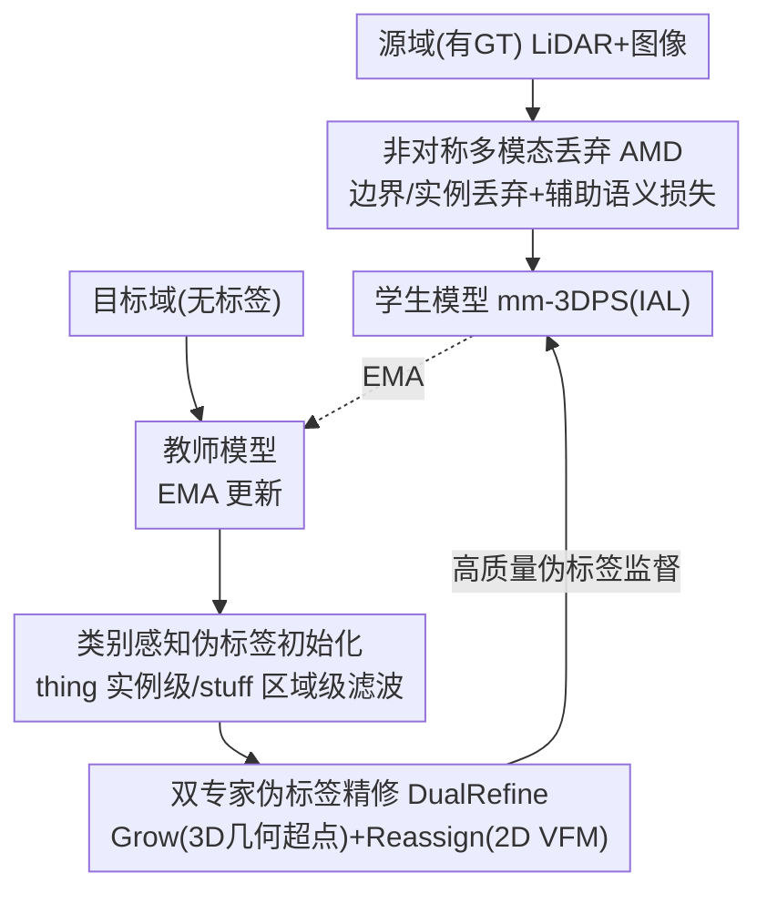

# PanDA: Unsupervised Domain Adaptation for Multimodal 3D Panoptic Segmentation in Autonomous Driving

**会议**: CVPR 2026  
**论文**: [CVF Open Access](https://openaccess.thecvf.com/content/CVPR2026/html/Pan_PanDA_Unsupervised_Domain_Adaptation_for_Multimodal_3D_Panoptic_Segmentation_in_CVPR_2026_paper.html)  
**代码**: 待确认  
**领域**: 自动驾驶 / 3D 视觉  
**关键词**: 无监督域适应、多模态、3D 全景分割、伪标签精修、教师-学生

## 一句话总结
本文首次研究"多模态 3D 全景分割（mm-3DPS）的无监督域适应"，提出 PanDA：在均值教师框架上用"非对称多模态丢弃（AMD）"在源域模拟单模态退化以学到域不变特征，并用"双专家伪标签精修（DualRefine）"借 3D 几何超点和 2D 视觉基础模型修补不完整、错分的目标域伪标签，在时间/天气/地点/传感器四类域偏移上大幅超过 3D 语义分割的 UDA 基线。

## 研究背景与动机
**领域现状**：3D 全景分割同时识别可数的 thing 实例与无定形的 stuff 区域，是自动驾驶感知的基础能力。近年主流是融合 LiDAR + 相机的多模态方法（如 IAL、LCPS）以提高精度。但模型一旦部署到地点、天气、时间变化的新环境就大幅掉点，而标注新数据昂贵，于是无需目标域标注的无监督域适应（UDA）很有吸引力。

**现有痛点**：UDA 在 2D 全景分割、3D 检测、多模态 3D **语义**分割上都研究得很充分，唯独 **mm-3DPS 上是空白**。直接把常见的"伪标签"策略套到 mm-3DPS 上效果很差（论文 Table 1 第 4 行印证），原因有二：① 现有 mm-3DPS 模型**假设 LiDAR 和 RGB 强互补且都可靠**，可现实里雨天 LiDAR 稀疏、夜间图像质量差，一旦某一模态退化，跨模态融合就崩、场景理解随之恶化；② 没有目标域标签时伪标签变得关键，但传统**置信度阈值**只保留高置信区域，会产生碎裂的实例掩码和模糊边界——这对要求实例完整、thing/stuff 边界清晰的全景分割尤其致命。

**核心矛盾**：多模态融合的优势（互补）恰恰是它在域偏移下的软肋（依赖两模态同时可靠）；而保守的高置信伪标签为了"干净"牺牲了全景分割最需要的"完整性"。

**本文目标**：① 让模型对单传感器退化鲁棒，即使一个模态变差也能靠另一个补全；② 让伪标签既完整又可靠，恢复被截断的 stuff 区域、纠正被错分的 thing 实例。

**切入角度**：在源域**主动制造**模态不平衡逼模型学跨模态补全；在目标域引入两类**域不变**先验（3D 几何 + 2D 视觉基础模型）来修伪标签，而非单纯卡阈值。

**核心 idea**：用"非对称丢弃造退化 + 双专家先验修伪标签"两招，在均值教师 UDA 框架里同时解决"模态失衡"和"伪标签碎裂"两大病根。

## 方法详解

### 整体框架
PanDA 建立在均值教师（mean-teacher）范式上：学生和教师共享同一个 mm-3DPS 架构（用 SOTA 的 transformer 式 IAL 做骨干），教师由学生权重的指数滑动平均（EMA, 动量 0.99）更新。每个训练迭代里，源样本 $x_S$ 和目标样本 $x_T$ 都喂给学生：**源域**（有 GT）的输入先经 AMD 制造单模态退化、用 GT 监督并加辅助语义损失；**目标域**（无标签）由教师预测出初始伪标签，经"类别感知滤波"去噪后再用 DualRefine 修补，得到的高质量伪标签反过来监督学生。总损失 $\mathcal{L}=\mathcal{L}^{\mathcal{S}}_{\text{seg}}+\mathcal{L}^{\mathcal{S}}_{\text{aux}}+\mathcal{L}^{\mathcal{T}}_{\text{seg}}+\mathcal{L}^{\mathcal{T}}_{\text{con}}$，其中一致性损失 $\mathcal{L}^{\mathcal{T}}_{\text{con}}=\sum_{\ell}\|f_\ell^{(Stu)}-f_\ell^{(Tea)}\|_2^2$ 在每个解码层对齐师生 query 特征。

### 关键设计

**1. 非对称多模态丢弃 AMD：在源域主动制造单模态退化，逼出跨模态补全能力**

针对"模型假设两模态都可靠、退化即崩"的病根，AMD 只在源域显式地把**一个**模态的关键区域丢掉，制造人为的模态不平衡，逼模型学会用另一模态补全。与以往随机、内容无关的掩码不同，AMD 针对全景分割的特性做**结构化丢弃**，分两种：**边界丢弃**——图像分块后用 Canny 检测边界 patch、按比例 $r^{2D}_{bd}$ 丢弃（填 0），LiDAR 端检查相邻体素标签不一致来定位几何不连续区、按 $r^{3D}_{bd}$ 丢弃体素特征但保留坐标以维持空间结构；**实例丢弃**——在 thing 实例内部按比例 $r^{2D}_{ins}$ 随机遮盖 patch / 点特征（同样保留坐标），逼模型在只有部分信息时也能恢复完整物体表示。每帧以 $p=0.5$ 随机选一个模态施加两种丢弃，超参统一为 $r^{2D}_{bd}=r^{3D}_{ins}=r^{2D}_{ins}=0.5$、$r^{3D}_{bd}=0.7$、patch $32\times32$。关键是 AMD **只用在源域**，形成"由易到难"的课程：模型先在有 GT 监督下处理可控的合成退化，再去面对目标域的真实噪声。为配合这种掩码建模，还给学生的 LiDAR/图像编码器各挂一个辅助语义头，用投影后的 3D GT 监督，辅助损失 $\mathcal{L}^{\mathcal{S}}_{\text{aux}}$ 为两个分支的交叉熵之和。值得强调：同一套 AMD 超参在所有域偏移上通用，无需针对域定制。

**2. 类别感知的伪标签初始化：按 thing/stuff 区别滤波，少破坏结构**

传统语义 UDA 只留高置信区域，会破坏物体完整性、糊掉掩码边界，对全景分割伤害极大。本文按全景的 thing/stuff 差异分别滤波：先把每个点的语义置信与实例置信相乘得到联合置信 $\mathbf{S}$。对 **thing**（紧凑可数物体）做**实例级**滤波——算每个实例的平均置信 $\bar{\mathbf{S}}(k)=\frac{1}{|\mathcal{P}_k|}\sum_{p\in\mathcal{P}_k}\mathbf{S}(p)$，整实例若 $\bar{\mathbf{S}}(k)<\tau_{th}$（$\tau_{th}=0.63$）就整体移除，避免误检沿点扩散；对 **stuff**（连续不可数区域如路面、植被）做**点级**滤波，按自适应阈值 $\tau_{st}$ 保留，未被任何掩码覆盖的点把损失权重置 0 排除出训练以防错误梯度。这一步降了噪，但仍残留三个问题：stuff 掩码有洞/断边、边界不清伤识别、剩余实例可能错分——正是 DualRefine 要修的。

**3. 双专家伪标签精修 DualRefine：用 3D 几何超点补全、2D 视觉先验纠错**

DualRefine 引入两类**域不变**专家先验：**几何超点** $\mathcal{G}$ 直接从 LiDAR 提取（RANSAC 分地面/非地面，再对非地面点 HDBSCAN 聚类），反映形状一致的 3D 区域、在严重域偏移下仍稳定；**视觉超点** $\mathcal{Q}$ 由 2D VFM（Grounding DINO + SAM）的分割掩码提升到 3D 得到，带来语义鲁棒线索。两者分两步用：**Grow（补全 stuff）**——对每个被滤波截断的 stuff 掩码 $\mathbf{M}_k$，找满足重叠约束 $\text{IoU}(g^\star,\mathbf{M}_k')\geq 0.5$ 的最佳几何超点 $g^\star$ 合并 $\hat{\mathbf{M}}_k=\mathbf{M}_k'\cup g^\star$ 来恢复连续性（与 thing 冲突时保 stuff、从 thing 删冲突区）；**Reassign（纠正 thing 类别）**——对每个 thing 实例找同样满足 IoU 约束的视觉超点 $q^\star$，当实例置信低（$\bar{\mathbf{S}}(k)<\min(\mathbf{S}_{\mathcal{Q}}(q^\star), t_{\text{cls}})$，$t_{\text{cls}}=0.2$）时用 VFM 的语义标签 $\mathbf{C}_{\mathcal{Q}}(q^\star)$ 改写模型预测，否则保留原标签。两步配合产出既完整又类别可靠的伪标签去监督学生。

### 一个例子：一辆被错分的"公交车"如何被修正
教师在夜间目标域把一辆公交车的部分点错分成"卡车"，且 stuff 路面掩码被高置信滤波切出几个洞。类别感知滤波先去掉低置信噪声。DualRefine 的 Grow 用 RANSAC+HDBSCAN 得到的几何超点（形状一致、对夜间稳定）与截断路面掩码 IoU 匹配并合并，把洞补上、边界接回。Reassign 用 Grounding DINO+SAM 提的视觉超点匹配那辆车实例，发现实例置信低于阈值，于是用 VFM 给出的"bus"语义改写错误的"truck"——最终伪标签既补全了 stuff 又纠正了 thing 类别。

### 损失函数 / 训练策略
总损失见整体框架式。骨干 IAL，LiDAR 体素 $480\times360\times32$、六视角图像 resize 到 $640\times360$；师生均用源域预训练模型初始化。AdamW（weight decay 0.01）、初始学习率 0.0004 并在 1/3、1/2、2/3 处折半，EMA 动量 0.99，batch size 2，4 张 A40/H100。总迭代数 $D\times\text{epoch\_len}$，Day→Night 与 Sunny→Rainy 取 $D=30$，USA→Singapore 与 SemanticKITTI→nuScenes 取 $D=15$。

## 实验关键数据

主指标是全景质量 PQ，定义为分割质量与识别质量之积 $\text{PQ}=\underbrace{\frac{\sum_{\text{TP}}\text{IoU}}{|\text{TP}|}}_{\text{SQ}}\times\underbrace{\frac{|\text{TP}|}{|\text{TP}|+\frac12|\text{FP}|+\frac12|\text{FN}|}}_{\text{RQ}}$，并细分为 thing 的 $\text{PQ}^{th}$ 与 stuff 的 $\text{PQ}^{st}$。域偏移含 nuScenes 内的三类（USA↔SG 地点、Sunny↔Rainy 天气、Day↔Night 时间）与跨数据集 SemanticKITTI→nuScenes（传感器+场景差异最大）。Baseline = 仅源域训练（下界），Oracle-Target / Oracle-Joint 为上界参考。

### 主实验（PQ，对比 + 消融合并自原文 Table 1）
| 方法 | USA/SG | Sunny/Rainy | Day/Night | Sem.KITTI/nuSc. |
|------|------|------|------|------|
| Baseline（仅源域） | 64.1 | 63.5 | 64.7 | 1.2 |
| Pano-xMUDA（适配语义 UDA） | 67.2 | 62.2 | 69.7 | 49.1 |
| Pano-UniDSeg（适配语义 UDA） | 72.9 | 65.5 | 70.5 | 54.0 |
| Ours-base（仅均值教师） | 73.7 | 70.3 | 68.6 | 51.6 |
| **Ours-Final** | **77.3** | **72.4** | **73.1** | **66.4** |

相对 Baseline，PanDA 在四个设定上 PQ 分别提升 **+13.2 / +8.9 / +8.4 / +53.3**（USA→SG、Sunny→Rainy、Day→Night、SemanticKITTI→nuScenes）。在 Day→Night 上甚至**超过 Oracle-Target 上界**（53.5%，因夜间域仅 602 帧太小），说明 AMD + DualRefine 一起弥合了严重退化下的监督缺口。对两个适配来的语义 UDA 方法全面领先，且 thing 类增益尤为突出，印证设计对实例级感知的有效性。

### 消融实验（PQ）
| 配置 | USA/SG | Sunny/Rainy | Day/Night | 说明 |
|------|------|------|------|------|
| Ours-base | 73.7 | 70.3 | 68.6 | 仅均值教师 |
| + DualRefine | 75.6 | 71.6 | 71.2 | 伪标签精修单独贡献 |
| + AMD | 76.8 | 71.8 | 70.9 | 非对称丢弃单独贡献 |
| Ours-Final | 77.3 | 72.4 | 73.1 | 两者协同最优 |

DualRefine 内部进一步拆解（原文 Table 3）：drop（类别感知滤波）→ grow（几何超点补全）→ class（VFM 纠类）逐步叠加，PQ 在 USA/SG 上从 73.7 升到 75.4 附近；AMD 内部（原文 Table 2）显示**实例丢弃 + 边界丢弃 + 辅助损失**三者全开才在 Day/Night 拿到最高 PQ 73.1（仅加辅助损失在挑战条件下反而会让 thing 掉点，需配合两类丢弃）。

### 关键发现
- **越难的域偏移增益越大**：Day→Night、Sunny→Rainy 这类严重模态退化场景提升最明显，验证 AMD 模拟退化 + DualRefine 修复的针对性。
- **两模块互补**：AMD 强化源域域不变特征学习，DualRefine 恢复目标域可靠实例结构，单独都有效、协同最优。
- **辅助语义损失需搭配丢弃**：单独加辅助损失会在挑战条件下伤 thing 类（最多掉 6.8% $\text{PQ}^{th}$），必须与实例/边界丢弃一起用才稳。

## 亮点与洞察
- **"主动制造退化"反直觉但有效**：AMD 不是去对抗噪声，而是在源域**故意**丢一个模态制造不平衡，把"跨模态补全"变成训练目标，思路可迁移到任何依赖多模态互补的鲁棒性任务。
- **非对称是关键**：每帧只丢一个模态、且针对边界/实例这类全景关键区，而非随机内容无关掩码，这种结构化设计直接对应全景分割对边界和实例完整性的需求。
- **双专家分工清晰**：3D 几何超点管"补全空间连续性"（对外观变化不敏感），2D VFM 管"纠正语义类别"（语义鲁棒），各取所长修不同类型的伪标签错误。
- **超参全域通用**：同一套 AMD/阈值跨四类域偏移不调，说明方法稳健、易部署。

## 局限与展望
- **依赖外部 VFM**：Reassign 靠 Grounding DINO + SAM，若 VFM 本身在某些类别/场景失准，纠类反而可能引入错误；且 VFM 推理带来额外开销。
- **超点提取的几何假设**：RANSAC+HDBSCAN 对地面/非地面分离与聚类的质量依赖点云密度，极稀疏 LiDAR（如雨天）下几何超点可能不可靠。⚠️ 超点稳定性的边界条件以原文为准。
- **基线对比受限**：因 mm-3DPS UDA 是首个工作，只能把语义 UDA（xMUDA、UniDSeg）适配过来对比，缺同任务的强基线。
- **Oracle 反常需注意**：Day→Night 的 Oracle-Target 因夜间域样本太少反低于 Baseline，说明该设定的上界参考本身不稳，跨设定比绝对增益要带 caveat。

## 相关工作与启发
- **vs xMUDA（多模态 3D 语义 UDA 范式）**：xMUDA 用跨模态蒸馏让可靠模态指导弱模态，但停留在语义级对齐、缺实例级结构建模，难直接用于全景分割。PanDA 显式补全实例与 stuff 结构，thing 类增益明显。
- **vs 传统置信度阈值伪标签（Mm-TTA、SUMMIT）**：它们靠高置信或跨模态一致性选标签，必然碎裂物体；PanDA 用类别感知滤波 + 双专家先验补全，针对全景"完整性"需求。
- **vs 用 VFM 修伪标签的工作（Xu et al. 用 SEEM 投票、Yang/Zhao et al. 用 SAM 分组）**：以往多只用 2D 或只用单一先验；PanDA **联合** 2D 视觉与 3D 几何双先验，同时提升实例掩码与语义标签可靠性。
- **vs AdaLPS（早期 LiDAR UDA）**：AdaLPS 手工对齐地平面与点密度，case-specific、对天气/地理偏移泛化差；PanDA 是多模态、通用域不变设计。

## 评分
- 新颖性: ⭐⭐⭐⭐ 首个 mm-3DPS UDA，AMD 的"主动造退化"与双专家伪标签精修均有新意，但建立在均值教师与已有先验之上。
- 实验充分度: ⭐⭐⭐⭐ 覆盖时间/天气/地点/传感器四类偏移、含 AMD 与 DualRefine 双重细粒度消融，但缺同任务强基线（领域首篇所限）。
- 写作质量: ⭐⭐⭐⭐ 病根→对策对应清晰，Grow/Reassign 流程与公式完整。
- 价值: ⭐⭐⭐⭐ 为自动驾驶多模态全景感知的跨域部署提供了首个可用 UDA 框架，实用性强。

<!-- RELATED:START -->

## 相关论文

- [\[CVPR 2026\] An Instance-Centric Panoptic Occupancy Prediction Benchmark for Autonomous Driving](an_instance-centric_panoptic_occupancy_prediction_benchmark_for_autonomous_drivi.md)
- [\[CVPR 2026\] Open-Vocabulary Domain Generalization in Urban-Scene Segmentation](open-vocabulary_domain_generalization_in_urban-scene_segmentation.md)
- [\[ECCV 2024\] Train Till You Drop: Towards Stable and Robust Source-free Unsupervised 3D Domain Adaptation](../../ECCV2024/autonomous_driving/train_till_you_drop_towards_stable_and_robust_source-free_unsupervised_3d_domain.md)
- [\[CVPR 2026\] MindDriver: Introducing Progressive Multimodal Reasoning for Autonomous Driving](minddriver_introducing_progressive_multimodal_reasoning_for_autonomous_driving.md)
- [\[CVPR 2026\] The Blind Spot of Adaptation: Quantifying and Mitigating Forgetting in Fine-tuned Driving Models](blind_spot_of_adaptation_quantifying_and_mitigating_forgetting_in_fine_tuned_driving_models.md)

<!-- RELATED:END -->
