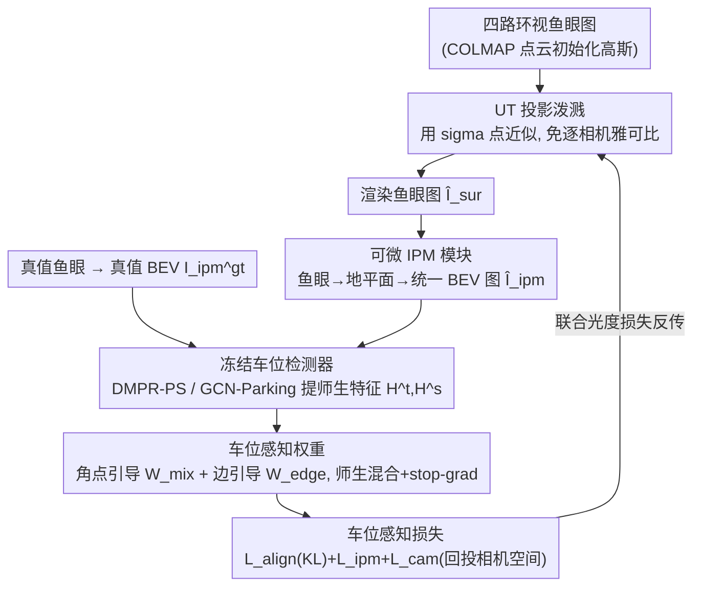

# ParkGaussian: Surround-view 3D Gaussian Splatting for Autonomous Parking

**会议**: CVPR 2026  
**论文**: [CVF Open Access](https://openaccess.thecvf.com/content/CVPR2026/html/Wei_ParkGaussian_Surround-view_3D_Gaussian_Splatting_for_Autonomous_Parking_CVPR_2026_paper.html)  
**代码**: https://github.com/wm-research/ParkGaussian  
**领域**: 自动驾驶  
**关键词**: 自动泊车, 3D高斯泼溅, 环视鱼眼, 车位检测, 可微 IPM

## 一句话总结
针对地下车库这种「拥挤、无 GPS、弱光」的泊车场景，本文先做出首个面向泊车三维重建的基准 ParkRecon3D（四路环视鱼眼 + 6 万车位标注），再提出 ParkGaussian——把 3DGS 适配到鱼眼相机（UT 投影）、用可微 IPM 把渲染结果转成鸟瞰图、并用冻结的车位检测器作师生引导做「车位感知重建」，让重建不只画面好看，还能在下游车位检测上保持感知一致。

## 研究背景与动机

**领域现状**：自动泊车是自动驾驶系统的关键一环，但它和结构化、有 GPS 的道路驾驶很不一样——常发生在狭窄地下、拥挤车位、弱光环境。现有泊车研究主要停在二维：用逆透视映射（IPM）把多路鱼眼图转成鸟瞰图（BEV）做车位检测，或在此基础上做 SLAM，或在 CARLA 仿真里端到端学感知-规划-控制。驾驶场景的真实仿真这几年靠 NeRF / 3DGS 做 4D 重建已经做得很好（OmniRe、各类街景高斯），但几乎都聚焦道路。

**现有痛点**：（1）泊车场景的三维重建几乎是空白，没有专门基准；（2）现有驾驶重建方法重度依赖密集 LiDAR、标定好的 GPS/IMU，而地下车库恰恰光照差、纹理重复、无 GPS，外参标定都困难，这些方法直接搬过来不适用；（3）更根本的是，以往重建只追求视觉保真度（PSNR/SSIM 好看），却忽略了仿真的真正目的——生成「感知对齐」的合成数据来忠实评估下游模型。对自动泊车而言，系统入口是**车位检测模块**，所以单纯把场景画得清楚并不直接有用，必须让车位相关区域的视觉保真和下游感知模型对齐。

**核心矛盾**：重建模型的优化目标（光度保真）和感知模型的优化目标（车位结构）不一致——二者特征分布差很多，导致「画得清楚」的重建几何未必是检测器需要的几何。同时，鱼眼相机的强畸变让 vanilla 3DGS 的一阶雅可比近似失效。

**本文目标**：（1）造一个真实地下车库的泊车重建基准；（2）让 3DGS 能直接在环视鱼眼上稳定训练；（3）把下游车位检测的监督信号引回重建优化，使重建在车位关键区域结构忠实。

**切入角度**：既然泊车的入口是 BEV 上的车位检测，那就让重建管线「渲染鱼眼 → 可微 IPM 转 BEV → 过检测器」整条可导，再用检测器在「真值 BEV」和「渲染 BEV」上的结构特征差作为师生引导，把梯度一路回传到高斯。

**核心 idea**：用可微 IPM 打通「3DGS 重建」与「车位检测器」，让冻结的检测器充当老师，把车位结构先验注入高斯优化——重建既好看又「对检测器友好」。

## 方法详解

### 整体框架
ParkGaussian 的输入是四路环视鱼眼图（前/后/左/右），输出是地下车库的 3DGS 表示。整条管线分四段：① 高斯用 **UT 投影**稳定泼溅出四路鱼眼渲染图（绕开鱼眼畸变下失效的雅可比近似）；② 渲染图过**可微 IPM** 模块融合成统一 BEV 图；③ 同一套 IPM 也把真值鱼眼转成真值 BEV，二者分别送进一个**冻结的车位检测器**（DMPR-PS 或 GCN-Parking），得到师生结构特征；④ 由师生特征构造**车位感知权重**，在 IPM 空间和反投影回的相机空间同时加权监督重建。训练分两阶段：先用 vanilla 3DGS 光度损失训 20000 步，再加对齐损失与车位感知损失训 10000 步。

### 关键设计

**1. ParkRecon3D 基准：首个面向泊车三维重建的环视鱼眼数据集**

针对「泊车重建无基准」的空白，作者在 AVM-SLAM 开源数据基础上重组扩展，造了 ParkRecon3D。数据采自约 220 m × 110 m、430+ 车位的地下车库，自车装四路鱼眼（前后左右），10 Hz、1280×960，并合成 1354×1632 的 IPM 图；含 4 个代表性场景、4 万+ 同步多鱼眼帧、6 万+ 人工核验车位标注。关键工程点：地下 IMU/轮速里程计噪声大，作者改用 COLMAP 标定四路鱼眼外参作为几何参考，车位标注遵循 DMPR-PS 协议在 BEV 域标角点。这个基准的意义在于它把「重建」和「车位感知」两类标注绑在同一套真实地下数据上，让「感知对齐的重建」第一次可训练、可评测。

**2. UT 投影适配鱼眼：用无迹变换替掉失效的一阶雅可比**

vanilla 3DGS 的 EWA 泼溅用一阶雅可比线性化相机投影 $v=g(x)$，但鱼眼强畸变下这个近似不准，且每种鱼眼模型都要单独推雅可比，对多相机环视系统很不友好。作者把 3DGUT 的**无迹变换（UT）投影**作为即插即用替换：不线性化非线性投影，而是用一小组 sigma 点 $x_i=\mu$ 或 $\mu\pm\sqrt{(n+\lambda)\Sigma}_{[i]}$ 精确地过 $g(\cdot)$，再由 $\mu_v=\sum_i w_i^\mu g(x_i)$、$\Sigma_v=\sum_i w_i^\Sigma(g(x_i)-\mu_v)(g(x_i)-\mu_v)^\top$ 算出二维高斯足迹。这样既免去逐鱼眼模型的雅可比推导，又在强畸变下给出更稳定的足迹，让 3DGS 能直接在环视鱼眼上训练，显著提升地下场景的几何稳定性。

**3. 可微环视 IPM：打通「鱼眼渲染」与「BEV 车位检测器」的可导桥梁**

车位检测器大多在 BEV 上工作，直接拿 3DGS 渲染的鱼眼图喂不进去。作者把鱼眼→BEV 的逆透视映射写成全闭式、全可微的模块：每个鱼眼像素 $u$ 先用逆鱼眼模型 $\pi_c^{-1}$ 反投成相机系射线，再与车体系地平面 $z=0$ 相交得地面点 $[x_v,y_v]^\top$；四路相机的地面点用 IPM 内参 $K_{ipm}$ 重投到统一 BEV 像素，得 $\hat{I}_{ipm}=\Phi_{IPM}(\hat{I}_{sur})$。由于全程闭式且可导，下游检测器的梯度能一路回传到三维高斯——这正是「让重建朝车位感知目标优化」能成立的前提，没有这座可微桥，师生引导就无从回传。

**4. 车位感知重建：用冻结检测器作师生引导，把车位结构先验注入高斯**

这是把「感知对齐」落地的核心。冻结一个在 ParkRecon3D 上微调过的检测器，对真值 BEV 与渲染 BEV 分别提特征 $H^t$（老师）、$H^s$（学生），每个含角点置信度、方向场、偏移。以 DMPR-PS 为例：取角点置信通道经塑形函数 $W=\sigma((H_{conf}-\tau)/T)^\gamma$（$T=0.5,\tau=0.25,\gamma=1$）得软掩码 $W^t,W^s$，再混成 $W_{mix}=\alpha W^t+(1-\alpha)\,\mathrm{sg}(W^s)$（$\alpha=0.8$，stop-grad 防止学生权重被直接更新而退化成均匀低置信）。GCN-Parking 进一步预测车位边：取 top-$K_e$ 条边（$K_e=8$），沿角点连线 $\ell_{ij}(t)$ 用高斯管（$\sigma=1.5$）光栅化成边图，混成 $W_{edge}$，最终 $W'_{mix}=W_{mix}+\lambda_{edge}W_{edge}$，同时强调角点与车位边界。损失上：对齐损失 $\mathcal{L}_{align}=\mathrm{KL}(\pi^s\|\pi^t)$ 在老师 top-K 区域对齐师生分布；$\mathcal{L}_{ipm}$、$\mathcal{L}_{cam}$ 用 $W_{mix}$ 在 IPM 空间和回投的相机空间加权 L1，总损失 $\mathcal{L}=\mathcal{L}_{rgb}+\lambda_{align}\mathcal{L}_{align}+\lambda_{ipm}\mathcal{L}_{ipm}+\lambda_{cam}\mathcal{L}_{cam}$（$\lambda_{align}=0.001,\lambda_{ipm}=\lambda_{cam}=0.1$）。师生混合既要老师的稳定、又要学生对当前渲染的自适应，是消融里效果最好的配置。

### 损失函数 / 训练策略
两阶段：前 20000 步只用光度损失 $\mathcal{L}_{rgb}=(1-\lambda)\|\hat{I}_{sur}-I_{sur}\|_1+\lambda\mathcal{L}_{D\text{-}SSIM}$（$\lambda=0.2$）；后 10000 步加对齐与车位感知损失。高斯由 ParkRecon3D 的 COLMAP 稀疏点云初始化，用 GSplat 里的 MCMC 优化策略提升收敛稳定，单张 RTX 4090、Adam、共 30000 步。

## 实验关键数据

数据为 ParkRecon3D 四场景（每场景采 100 帧四路环视，每 10 帧评一次）。重建基线选明确在鱼眼/泊车场景验证过的 Self-Cali-GS、3DGUT、OmniRe；车位检测用 DMPR-PS 与 GCN-Parking（都在本基准微调）。⚠️ 论文 Precision/Recall 阈值（距离 distance、角度 angle）可调，具体数值以原文为准。

### 主实验：新视角合成质量（节选 Scene1 / Scene3）

| 场景 | 方法 | PSNR↑ | SSIM↑ | LPIPS↓ |
|------|------|-------|-------|--------|
| Scene1 | Self-Cali-GS | 23.78 | 0.82 | 0.31 |
| Scene1 | 3DGUT | 28.70 | 0.92 | 0.21 |
| Scene1 | OmniRe | 25.12 | 0.84 | 0.37 |
| Scene1 | **Ours (w/ GCN-Parking)** | **30.09** | **0.93** | **0.20** |
| Scene3 | 3DGUT | 27.80 | 0.92 | 0.20 |
| Scene3 | OmniRe | 21.58 | 0.78 | 0.50 |
| Scene3 | **Ours (w/ GCN-Parking)** | **30.27** | **0.93** | **0.20** |

> 解读：在两场景上均取得最优重建质量。OmniRe 这类街景方法在地下车库严重模糊、结构丢失（依赖密集 LiDAR/GPS 的假设在地库不成立）；3DGUT/Self-Cali-GS 能搭出整体拓扑但细节鲁棒性差。本文靠车位感知策略在关键车位区涨质量。

### 下游车位检测一致性（Precision / Recall）

| 检测器 | 配置 | Scene1 Prec↑ | Scene1 Rec↑ | Scene3 Prec↑ | Scene3 Rec↑ |
|--------|------|--------------|-------------|--------------|-------------|
| DMPR-PS | GT 真图 | 0.86 | 0.22 | 0.49 | 0.21 |
| DMPR-PS | Ours w/o 感知 | 0.71 | 0.08 | 0.48 | 0.18 |
| DMPR-PS | Ours w/ 感知 | 0.74 | 0.10 | 0.47 | 0.19 |
| GCN | GT 真图 | 0.99 | 0.49 | 0.98 | 0.50 |
| GCN | Ours w/o 感知 | 0.95 | 0.40 | 0.94 | 0.48 |
| GCN | Ours w/ 感知 | 0.97 | 0.43 | 0.95 | 0.48 |

> 解读：在重建渲染图上跑检测器，加入车位感知重建后 Precision/Recall 一致提升，且 GCN 上接近真图水平（如 Scene1 GCN 0.95/0.40→0.97/0.43，逼近真图 0.99/0.49），说明重建确实更贴合下游感知所需结构。

### 消融：车位感知策略各组件（Scene1，PSNR / Prec / Rec）

| 变体 | PSNR↑ | Prec↑ | Rec↑ | 说明 |
|------|-------|-------|------|------|
| 直接 IPM L1 监督 | 24.94 | 0.62 | 0.06 | 无车位线索，多视投影在视界边界冲突、给 IPM 注噪 |
| 仅特征级监督 | 27.43 | 0.64 | 0.05 | 画面提升但车位几何不可靠，感知/重建目标未对齐 |
| 仅老师权重 | 29.56 | 0.90 | 0.41 | 稳定但不自适应 |
| 仅学生权重 | 28.62 | 0.81 | 0.40 | 自适应渲染预测但易受噪声 |
| **完整车位感知(本文)** | **30.09** | **0.97** | **0.43** | 师生混合 + 分布对齐，画面与下游 Prec/Rec 均最佳 |

### 关键发现
- **朴素 IPM L1 监督几乎不可用**：Rec 仅 0.06，因多视投影在视界边界冲突、往 BEV 注入额外噪声；仅特征级监督也救不回车位几何，印证「感知与重建目标不对齐」这一核心矛盾。
- **师生互补**：仅老师稳定但不自适应，仅学生自适应但怕噪声；二者混合 + 分布对齐才同时拿到最高画质与最高下游 Prec/Rec，说明「结构先验 + 预测一致性」缺一不可。

## 亮点与洞察
- **把仿真目标从「画得像」纠到「对感知有用」**：核心洞察是泊车系统入口是车位检测，于是重建必须对齐检测器，而非盲目堆 PSNR——这个问题重定义本身比方法更值钱。
- **可微 IPM 是关键桥**：用全闭式可导 IPM 把「鱼眼渲染→BEV→检测器」串成一条可回传的链，下游感知梯度才能进高斯，是「任务驱动重建」能成立的工程支点。
- **冻结检测器作师生 + stop-grad 防退化**：用 $\mathrm{sg}(W^s)$ 阻断学生权重直接更新，避免「全图低置信」的平凡解，是个可复用的小技巧。
- **UT 投影即插即用上鱼眼**：免逐相机雅可比、强畸变下更稳，给多相机环视 3DGS 提供了一个干净的工程方案。

## 局限与展望
- **地下场景固有难点未解**：作者承认镜面反射、高度重复纹理、弱光长曝光的运动模糊都难以准确建模，留待未来。
- **绝对检测精度仍偏低**：DMPR-PS 上 Recall 普遍很低（真图也只有 0.08~0.22），加感知后提升有限，说明在重建图上的车位检测离实用还有距离。
- **依赖检测器与 IPM 假设**：师生引导绑定特定检测器（DMPR-PS/GCN），IPM 假设地平面 $z=0$，对非平整地面/坡道可能失真——这是自己看到的适用范围限制。
- **改进方向（自己看）**：把镜面/弱光显式建模（如反射分解、曝光建模）并入高斯属性，或用更强的多检测器集成作老师，可能进一步抬高下游 Recall。

## 相关工作与启发
- **vs OmniRe / 街景高斯**：它们为道路驾驶设计、重度依赖密集 LiDAR + GPS/IMU，搬到无 GPS、弱光、纹理重复的地下车库会严重模糊/丢结构；本文专门面向地库、用 COLMAP 标外参 + UT 鱼眼投影 + 车位感知，重建质量与下游一致性都更好。
- **vs 3DGUT / Self-Cali-GS（鱼眼基线）**：它们能搭出整体拓扑但车位细节鲁棒性差；本文把 3DGUT 的 UT 投影当组件，再叠加可微 IPM 与车位感知监督，在车位关键区显著更优。
- **vs 传统泊车感知（DMPR-PS / GCN-Parking / AVP-SLAM）**：以往是二维 BEV 上的车位检测/SLAM，受限于无法感知整个三维空间；本文反过来用这些检测器当老师来约束三维重建，是「把感知先验注入重建」的新关系，并产出可评估下游模型的真实仿真器。

## 评分
- 新颖性: ⭐⭐⭐⭐ 首个泊车三维重建基准 + 首个把车位检测器师生引导注入 3DGS 的框架，问题重定义（感知对齐重建）很有价值；单组件多为已有技术拼装。
- 实验充分度: ⭐⭐⭐ 自建基准上有 NVS、下游检测、组件消融三类实验且结论清晰；但只有 4 个场景、检测绝对精度低、未与更多重建/感知方法横向比。
- 写作质量: ⭐⭐⭐⭐ 动机链（仿真目标→车位入口→感知对齐）讲得清楚，公式与流程图到位；部分超参选择只说「依实现经验」缺敏感性分析。
- 价值: ⭐⭐⭐⭐ 填补泊车三维重建空白、提供感知对齐的仿真评估范式，对自动泊车系统开发与评测有实用意义。

<!-- RELATED:START -->

## 相关论文

- [\[CVPR 2026\] Dr.Occ: Depth- and Region-Guided 3D Occupancy from Surround-View Cameras for Autonomous Driving](drocc_depth_region_guided_3d_occupancy.md)
- [\[CVPR 2026\] RaGS: Unleashing 3D Gaussian Splatting from 4D Radar and Monocular Cue for 3D Object Detection](rags_unleashing_3d_gaussian_splatting_from_4d_radar_and_monocular_cue_for_3d_obj.md)
- [\[CVPR 2026\] F3DGS: Federated 3D Gaussian Splatting for Decentralized Multi-Agent World Modeling](f3dgs_federated_3d_gaussian_splatting_for_decentralized_multi-agent_world_modeli.md)
- [\[AAAI 2026\] Exploring Surround-View Fisheye Camera 3D Object Detection](../../AAAI2026/autonomous_driving/exploring_surround-view_fisheye_camera_3d_object_detection.md)
- [\[CVPR 2025\] EVolSplat: Efficient Volume-based Gaussian Splatting for Urban View Synthesis](../../CVPR2025/autonomous_driving/evolsplat_efficient_volume-based_gaussian_splatting_for_urban_view_synthesis.md)

<!-- RELATED:END -->
