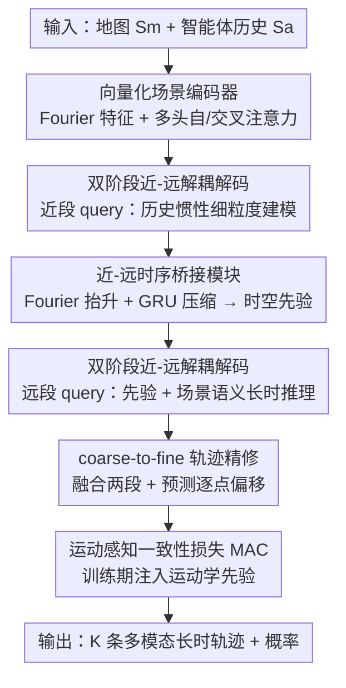

# Perceiving the Near, Reasoning the Distant: Coherent Long-Horizon Trajectory Prediction for Autonomous Driving

**会议**: CVPR 2026  
**论文**: [CVF Open Access](https://openaccess.thecvf.com/content/CVPR2026/html/Hu_Perceiving_the_Near_Reasoning_the_Distant_Coherent_Long-Horizon_Trajectory_Prediction_CVPR_2026_paper.html)  
**代码**: https://github.com/HuaHu-yizhou/NDPNet.git  
**领域**: 自动驾驶 / 轨迹预测  
**关键词**: 长时轨迹预测, 双阶段解码, 运动学一致性, 多模态预测, Waymo/Argoverse

## 一句话总结
NDPNet 把长时轨迹预测拆成"近处靠惯性、远处靠语义"两条专门的解码通路，用一个时序桥接模块把两段平滑接上，再叠加一个把运动学先验写进训练目标的一致性损失，在 Argoverse 2 与 WOMD 上拿到 SOTA，并首次在 8 秒预测把 minFDE6 压进 1.75 以下。

## 研究背景与动机

**领域现状**：自动驾驶的运动预测目前主流是"向量化场景表示 + 多智能体注意力"，再用一个共享解码器一次性（one-shot）吐出整条未来轨迹，主流榜单（Argoverse 2、Waymo）的头部方法几乎都是非自回归的一次性预测器。

**现有痛点**：作者指出两个被忽视的结构性缺陷。第一，**近未来（0–3s）和远未来（3–8s）服从完全不同的动力学**——近处由运动惯性主导、可由历史轨迹精确外推，远处则是随机的、被车道拓扑和多智能体交互这类高层语义塑造；可一次性解码器对所有时间步施加同质的注意力，让"运动惯性信号"和"语义信号"在有限的表征容量里互相挤占，导致时序推理被模糊、长时精度下滑。第二，多数方法把轨迹当成**逐点回归**、只监督位置，朝向（heading）靠对预测点做插值反推，结果产生突变的航向、运动学上不可行的轨迹；少数方法用独立的头单独预测朝向，又造成位置与朝向解耦、每一帧位姿不一致；还有的用事后的运动学滤波筛掉不可行候选，但这是不可微、回溯式的，可能把真正贴合动力学的预测也丢掉。

**核心矛盾**：自回归预测器（patch-by-patch）虽然能让建模重心随时间自适应，却引入误差累积，长时反而更差；而一次性预测器没有误差累积，却无法按时间段动态地专门化建模容量。两者各有所长却无法兼得——缺一个"既能按时间段分工、又不牺牲长时稳定性"的框架。同时训练阶段缺一个显式强制运动学一致性的目标。

**本文目标**：(1) 让近、远未来各有专门的建模通路且能平滑衔接；(2) 在训练时把运动学约束变成可微目标，而不是事后过滤。

**切入角度**：从"感知近处、推理远处"这一观察出发——既然近处易预测且主要由历史决定，就先把近处建准，再把近处的时空线索作为先验去引导远处的语义推理。

**核心 idea**：用**双阶段近-远解耦解码 + 时序桥接 + 运动感知一致性损失**，把"分工建模"和"运动学可行"同时做到。

## 方法详解

### 整体框架
NDPNet 沿用编码器-解码器范式：向量化编码器把地图元素 $S_m$ 与各智能体历史状态 $S_a$ 编码成 $[E_m, E_a]$（用 Fourier 特征 + MLP 提取低频时序特征，再用多头自/交叉注意力聚合交互）。核心创新在解码器：它把每条未来轨迹 $\hat{X}^k_i$ 显式拆成近段 $\hat{X}^k_{t_n}$（前 $t_n$ 帧）与远段 $\hat{X}^k_{t_d}$（其余帧）两条独立的 DETR-style query 通路。近段 query 直接从历史与地图编码里抓取上下文做细粒度建模；近-远时序桥接模块把已经预测好的近段轨迹抬升到高维、用 GRU 压缩时间维，作为时空先验喂给远段 query；远段 query 先吸收这份近未来先验、再吸收场景交互，做语义驱动的长时推理。两段 query 沿时间维融合得到粗轨迹，经一个常规的 coarse-to-fine refinement 模块预测逐点偏移后叠加，得到最终轨迹。训练时除回归/分类损失外，叠加一个把运动学先验写进位置回归的运动感知一致性（MAC）损失。

### 关键设计

**1. 双阶段近-远解耦解码：让惯性信号与语义信号各占一条通路**

针对"一次性共享解码器让近/远信号互相挤占"的痛点，NDPNet 把目标轨迹显式拆成 $[\hat{X}^k_{t_n}, \hat{X}^k_{t_d}]$，分别用两组 DETR-like query $Q_n, Q_d \in \mathbb{R}^{N_a\times K\times D}$ 解码。近段解码先在时间维上与智能体编码做交叉注意力、再与地图编码交叉、再用自注意力捕捉智能体间空间依赖，最后对 $K$ 条 query 做 MHSA 增强多模态多样性、MLP 出近段轨迹 $\hat{X}^k_{t_n}=\mathrm{MLP}(\mathrm{MHSA}(Q'_n))$。远段解码走相似路径，但额外先与近未来潜特征交叉注意力以吸收"更准的近处"。这样近段专注运动惯性、远段专注高层语义，两条通路不再争夺注意力资源；同时远段能从历史与近未来双重来源捕捉长期依赖。消融显示，把一次性变体改成双阶段后，AV2 上 minFDE6 从 1.264 降到 1.165，而三阶段变体（1.193）反而不如双阶段——说明"近/远二分"是与数据动力学最匹配的粒度。

**2. 近-远时序桥接模块：把近处的时空线索蒸成一个先验向量去喂远处**

光把近、远拆开还不够，远段若拿不到近段信息就会失去时序连贯性。但近段 query 是 $[N_a, K, t_n, D]$ 的时空张量，直接做跨时空注意力开销巨大。桥接模块用**时空分解**策略：先把低维近段轨迹 $\hat{X}^k_{t_n}$ 经 Fourier embedding 抬到高维，再用一个 GRU 沿时间维把 $[N_a, K, t_n, D]$ 压缩成 $[N_a, K, 1, D]$ 的单向量，于是远段 query 只需沿 $N_a\cdot K$ 维与这个压缩后的近未来潜特征做交叉注意力（$Q'_d=\mathrm{MHCA}(\mathrm{GRU}(\mathrm{Fourier}(\hat{X}^k_{t_n})), Q_d)$），既高效又把近处的时空先验注入了远处。消融里在双阶段之上加桥接模块，各项指标一致提升（minFDE6 1.203→1.173），印证它对跨时间段连贯性的作用。

**3. 运动感知一致性（MAC）损失：把运动学约束变成可微训练目标，而不是事后过滤**

针对"只监督位置导致航向突变"的痛点，MAC 损失假设智能体满足运动学约束 $[\dot{x},\dot{y}]=[\cos\theta,\sin\theta]\cdot V$，用真值速度 $V^{gt}$ 与角速度 $\dot{\theta}^{gt}$ 在离散空间里通过前向欧拉积分递推出一串"运动学虚拟目标点"，再让预测点向它们靠拢。位置项 $\ell_{pos}=\mathcal{M}\cdot\|\hat{X}^k_{1\to T_s}-\overline{X}^k_{1\to T_s}\|^2$，其中 $\overline{X}^k=\hat{X}^k_{0\to T_s-1}+V^{gt}\cdot\mathcal{R}\cdot\Delta T$，$\mathcal{R}$ 为旋转矩阵；方向项 $\ell_{dir}=\mathcal{M}\cdot\|\hat{\theta}^k_{1\to T_s}-\overline{\theta}^k_{1\to T_s}\|^2$。关键是一个**智能体类型掩码** $\mathcal{M}$，只对遵守非完整约束（nonholonomic，如车辆）的目标施加约束，行人/骑行者这类不严格满足运动学的类别则放开，避免错误约束。总损失 $\ell=\ell_{reg}+\ell_{cls}+\alpha_1\ell_{pos}+\alpha_2\ell_{dir}$。它是即插即用的：接到 HiVT、SceneTransformer、QCNet 三种不同坐标系的强基线上都能同时降 FDE 和航向误差（见实验）。⚠️ 原文将该掩码同时称作"Motion-Aware Constraint"与"Motion-Agnostic Constraint"，疑为笔误，以原文公式语义（只对车辆等施加运动学约束）为准。

## 实验关键数据

### 主实验
在 Argoverse 2（6s 预测，5s 历史）单智能体测试集上，按 b-minFDE6 排序，NDPNet 在无集成时即超越所有非集成方法，集成后进一步领先：

| 数据集 | 配置 | minFDE6↓ | minADE6↓ | b-minFDE6↓ | 对比 |
|--------|------|----------|----------|------------|------|
| AV2 test | QCNet（前SOTA，无集成） | 1.29 | 0.65 | 1.91 | 基线 |
| AV2 test | **NDPNet（无集成）** | **1.17** | **0.61** | **1.83** | 全面领先 |
| AV2 test | DeMo（集成） | 1.11 | 0.60 | 1.73 | 强集成基线 |
| AV2 test | **NDPNet（集成）** | **1.09** | **0.58** | **1.71** | SOTA |

WOMD（8s 预测，1.1s 历史）是更难的长时任务。在 8 秒单一视野上，NDPNet 单模型即超越多个集成方法，All 类 minFDE6=1.7481、首次进入 sub-1.75 区间：

| 数据集/视野 | 方法 | All minADE6↓ | All minFDE6↓ | 说明 |
|-------------|------|--------------|--------------|------|
| WOMD 8s | MTR_v3（集成） | 0.8959 | 1.8500 | 集成强基线 |
| WOMD 8s | **NDPNet（无集成）** | **0.8394** | **1.7481** | 首破 sub-1.75 |
| WOMD 平均(3/5/8s) | Wayformer（Dense+NMS） | 0.5454 | 1.1280 | 需 NMS 选模 |
| WOMD 平均(3/5/8s) | **NDPNet（无 NMS/无集成）** | **0.5160** | **1.0319** | minFDE6/minADE6 均第 1，mAP6=0.4335 |

注：NDPNet 直接输出恰好 6 个模态，无需 dense 候选 + NMS 后处理，也无需模型集成（WOMD 上）。minADE/minFDE 为对 $K$ 条模态取最优者的平均/终点位移误差；b-minFDE 在 minFDE 上加 Brier 概率惩罚；mAP 衡量多模态多样性。

### 消融实验

| 配置 | minFDE6↓ | minADE6↓ | minAHE6↓ | 说明 |
|------|----------|----------|----------|------|
| Baseline（one-shot 变体） | 1.264 | 0.724 | 0.083 | 共享解码 |
| + 双阶段解耦 | 1.203 | 0.702 | 0.085 | 位置大幅改善 |
| + 时序桥接模块 | 1.173 | 0.693 | 0.079 | 各项一致提升 |
| + MAC 损失（完整） | 1.165 | 0.687 | **0.047** | 航向误差骤降 |

MAC 损失即插即用到三种基线（minFHE6 = 最终航向误差）：

| 方法 | minFDE6↓ | minAHE6↓ | minFHE6↓ |
|------|----------|----------|----------|
| SceneT | 2.49 | 0.15 | 0.21 |
| SceneT w/ MAC | 2.39 | 0.11 | 0.17 |
| HiVT | 1.98 | 0.14 | 0.18 |
| HiVT w/ MAC | 1.94 | 0.07 | 0.12 |
| QCNet | 1.43 | 0.10 | 0.07 |
| QCNet w/ MAC | 1.40 | 0.04 | 0.06 |

### 关键发现
- **MAC 损失对航向贡献最大**：组件消融里加 MAC 让 minAHE6 从 0.079 骤降到 0.047，远超它对位置的小幅改善，说明运动学约束主要修的是航向一致性，并间接提升长时位置精度。
- **近未来窗口 2s 是甜点**：无论 AV2（总 6s）还是 WOMD（总 8s），近段时长 $t_n$ 取 2s 都最优。作者解释 2 秒足以吃下惯性主导的快变运动，超过 2s 后越来越依赖复杂交互，需要远段的专门建模——这也解释了为何"双阶段"恰好优于"三阶段"。
- **效率达成最优权衡**：完整模型 13.1 FPS、优于 one-shot 与三阶段变体的 minFDE6，参数与算力可控（one-shot 变体 8.0M / 10.3 GFLOPs / 15.0 FPS 作参照）。

## 亮点与洞察
- **把"时间段"当成建模分工的第一性原则**：不是简单堆模块，而是观察到近/远服从不同动力学，进而让架构按时间段专门化——这种"按物理直觉切分容量"的思路可迁移到任何长时序预测（如行人、无人机、金融时序）。
- **MAC 损失即插即用且无推理开销**：它只在训练期把运动学先验注入位置回归，推理时零成本，却能同时降位移与航向误差，是个高性价比的"白送增益"trick，可直接嫁接到现有预测器上。
- **类型掩码体现了对物理约束适用边界的清醒认识**：只对车辆等非完整约束目标施加运动学损失，行人放开——避免了"一刀切物理约束"误伤柔性目标，这个细节很容易被忽略却很关键。
- **无需 NMS/集成即拿 SOTA**：说明双阶段解耦本身就提供了足够的多模态质量，省掉了 dense 候选 + NMS 的工程负担。

## 局限与展望
- 双阶段的"近/远"切分点（2s）是经验调出的固定超参，对不同传感器频率、不同总视野是否仍最优需要重新搜索，缺乏自适应机制。
- MAC 损失依赖真值速度/角速度做监督，对标注质量敏感；在真值运动学噪声较大的数据上效果可能打折。⚠️ 原文未给出对标注噪声的鲁棒性分析。
- 仅在车辆为主的城市驾驶数据（AV2、WOMD）验证，对密集人群、复杂非机动场景的泛化未充分考察。
- 架构上仍是两段离散通路，若未来视野进一步拉长（>8s），二分是否够用、是否需要连续的时间感知建模值得探索。

## 相关工作与启发
- **vs 一次性预测器（QCNet/DeMo 等）**：它们用共享解码通路一次出整条轨迹，全局上下文强但近/远信号互相挤占；NDPNet 把通路按时间段拆开，避免信号竞争，长时精度更高。
- **vs 自回归/迭代预测器**：它们 patch-by-patch 解码、能自适应建模重心，但有误差累积；NDPNet 只分两段且非自回归，桥接模块单向把近处先验喂给远处，既保留分工又避免误差沿步累积。
- **vs 事后运动学滤波（如候选筛选）**：滤波不可微、回溯式、可能丢掉贴合动力学的真预测；MAC 损失把运动学约束做成可微训练目标，端到端学习运动感知表征。
- **vs 独立航向头方法**：它们用独立分布单独预测朝向，导致位置-航向解耦、逐帧位姿不一致；MAC 损失把位置回归直接耦合到真值运动动力学，保证位姿一致演化。

## 评分
- 新颖性: ⭐⭐⭐⭐ "近惯性远语义"的双阶段解耦视角清晰且有物理依据，MAC 损失即插即用，但组件多为已有注意力模块的重组。
- 实验充分度: ⭐⭐⭐⭐⭐ AV2 + WOMD 双榜 SOTA，架构/组件/时长/效率消融完整，MAC 损失跨三基线验证泛化。
- 写作质量: ⭐⭐⭐⭐ 动机与图示清晰，公式推导到位；个别记号（MAC 掩码命名）前后不一致略影响阅读。
- 价值: ⭐⭐⭐⭐ 首破 8s sub-1.75 minFDE6 且无需 NMS/集成，MAC 损失可直接嫁接现有预测器，对自动驾驶长时预测有实用意义。

<!-- RELATED:START -->

## 相关论文

- [\[CVPR 2026\] FoSS: Modeling Long-Range Dependencies and Multimodal Uncertainty in Trajectory Prediction via Fourier–State Space Integration](foss_modeling_long_range_dependencies_and_multimodal_uncertainty_in_trajectory_p.md)
- [\[CVPR 2026\] ColaVLA: Leveraging Cognitive Latent Reasoning for Hierarchical Parallel Trajectory Planning in Autonomous Driving](colavla_leveraging_cognitive_latent_reasoning_for_hierarchical_parallel_trajecto.md)
- [\[ICML 2026\] DeepSight: Long-Horizon World Modeling via Latent States Prediction for End-to-End Autonomous Driving](../../ICML2026/autonomous_driving/deepsight_long-horizon_world_modeling_via_latent_states_prediction_for_end-to-en.md)
- [\[CVPR 2026\] CogDriver: Integrating Cognitive Inertia for Temporally Coherent Planning in Autonomous Driving](cogdriver_integrating_cognitive_inertia_for_temporally_coherent_planning_in_auto.md)
- [\[CVPR 2026\] MindDriver: Introducing Progressive Multimodal Reasoning for Autonomous Driving](minddriver_introducing_progressive_multimodal_reasoning_for_autonomous_driving.md)

<!-- RELATED:END -->
