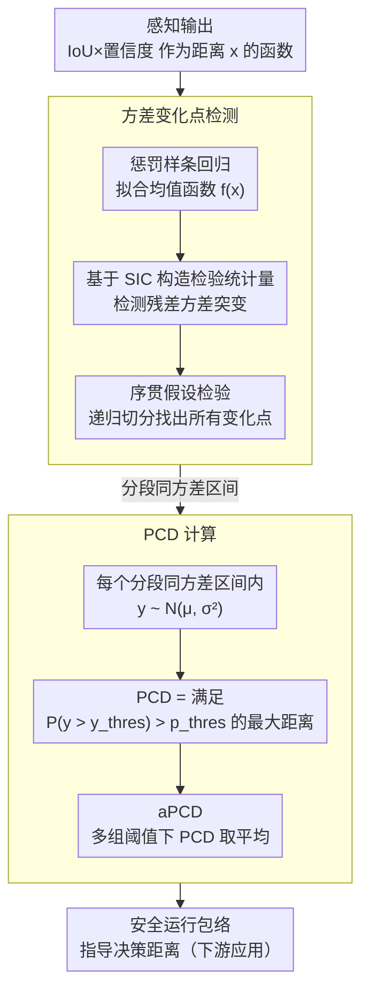

<!-- 由 src/gen_stubs.py 自动生成 -->
# Perception Characteristics Distance: Measuring Stability and Robustness of Perception System in Dynamic Conditions under a Certain Decision Rule

**会议**: CVPR2026  
**arXiv**: [2506.09217](https://arxiv.org/abs/2506.09217)  
**代码**: [datadrivenwheels/PCD_Python](https://github.com/datadrivenwheels/PCD_Python)  
**领域**: 自动驾驶 / 感知评估  
**关键词**: 感知评估指标, 距离可靠性, 不确定性建模, 方差变化点检测, 自动驾驶安全

## 一句话总结

提出 Perception Characteristics Distance (PCD)，一种量化感知系统在不同距离下可靠检测能力的新指标，通过统计建模检测置信度随距离的均值和方差变化，定义感知系统的最大可靠检测距离，弥补传统 AP/IoU 等静态指标无法反映距离依赖性和随机性的不足。

## 背景与动机

1. **传统指标的局限**：AP、IoU、F1 等经典感知评估指标基于静态逐帧评估，忽略了真实驾驶场景中时间和空间的连续性，无法反映感知系统在不同距离下的稳定性差异
2. **远距离检测不稳定**：YOLOX 等检测器在近距离（<30m）时置信度稳定 ≥0.90，但远距离（≥70m）时置信度剧烈波动（可低至 0.24），固定阈值判别存在严重误判风险
3. **阈值化决策的脆弱性**：ADAS/ADS 中的控制逻辑通常依赖置信度阈值做二值化判断（检测/未检测），这种方式无法捕捉感知输出的随机性和距离相关变异性
4. **安全性需求**：自动驾驶安全依赖于对最大可靠检测距离的准确估计，决策系统需要知道在多远的距离内可以信任感知结果
5. **缺乏受控基准数据集**：现有的驾驶数据集（nuScenes、KITTI、BDD100K）均在自然环境中采集，缺乏受控环境下用于系统性评估感知鲁棒性的数据
6. **现有指标不区分条件差异**：传统 AP 等指标在不同天气/光照条件下的变化不敏感，无法有效揭示感知系统在恶劣条件下的退化特征

## 方法详解

### 整体框架

PCD 想回答的是一个传统指标答不了的问题：这套感知系统在多远的距离内还值得信任。它把感知输出（IoU×置信度）看成距离 $x$ 的函数，先统计估计它的均值和方差随距离怎么变，再在给定检测质量阈值 $y^{thres}$ 和概率阈值 $p^{thres}$ 下，反推出仍满足可靠性要求的最大距离。之所以用 IoU×置信度 而不是单看置信度，是因为置信度只反映模型有多确信、IoU 只反映定位准不准，二者相乘才能同时把"检得到"和"检得准"压进一个量里。整个计算分两步走：先做方差变化点检测把异方差曲线切成分段同方差区间，再在每段上建模分布、反推出最大可靠距离。

### 关键设计

**1. 方差变化点检测：先找出可靠性"断档"在哪个距离**

感知质量随距离衰减不是匀速的，往往在某些距离上方差突然变大（远处置信度从稳定的 ≥0.90 跌到 0.24 那种），固定阈值判别正是栽在这种突变上。这里不假设方差恒定，而是显式地把这些断点找出来：先用惩罚样条回归（Penalized B-spline, $K=10$, 三阶）拟合 IoU×置信度 随距离的均值函数 $f(x)$，再基于 Schwarz 信息准则（SIC）构造检验统计量去检测残差方差的显著变化点；检测用序贯假设检验——先在全数据上找第一个变化点 $x_{\tau_1}$，再在切出来的分段子集上递归找后续变化点。

这些变化点把距离范围切成若干区间，每个区间内方差近似恒定，从而把一条异方差曲线化简成"分段同方差"，后面的概率计算才站得住脚。

**2. PCD 计算：把可靠性翻译成一个可读的最大距离**

有了分段同方差结构，每个区间内 IoU×置信度 就可建模为正态分布 $y_i \sim \mathcal{N}(\mu_i, \sigma_i^2)$，于是 PCD 直接定义为满足 $P_Y(y_i > y^{thres}) > p^{thres}$ 的最大距离 $x_i$——即"在多远以内，检测质量超过 $y^{thres}$ 的概率还高于 $p^{thres}$"。单一阈值组合只给一个切片，综合指标 aPCD 则对多组 $(p^{thres}, y^{thres})$ 取平均，像 AUC 概括 PR 曲线那样概括整体感知能力，避免被某个阈值偶然带偏。

### 损失函数 / 训练策略

本文是评估指标论文，不涉及训练损失。计算中唯一的优化是惩罚样条回归的正则化项 $\sum_{i=1}^n [y_i - \sum_j \beta_j B_j(x_i)]^2 + \lambda \sum_{j=3}^K (\Delta^2 \beta_j)^2$（$\lambda=0.6$），变化点假设检验则基于对数似然比和 SIC 准则。

## 实验关键数据

### SensorRainFall 数据集

- Virginia Smart Road 设施采集，可控降雨强度 64 mm/h
- 4 种环境条件：晴天白天、雨天白天、雨天夜晚、雨天路灯夜晚
- 1,231 张 1920×1080 前视图像，距离 4m–250m
- 两种目标：红色轿车 + 假人行人，提供 GT bounding box + 分割掩码 + 精确距离

### 基准结果（16组实验中的代表性结果）

**实例分割 - 车辆 - 晴天白天**：

| 模型 | aPCD (m) | AP50:95 | AP50 | AR | F1_50 |
|------|----------|---------|------|------|-------|
| Mask2Former | **107.1** | **0.423** | **0.633** | **0.427** | **0.778** |
| Mask R-CNN | 89.8 | 0.376 | 0.579 | 0.381 | 0.736 |
| ConvNeXt-V2 | 89.5 | 0.395 | 0.553 | 0.399 | 0.715 |
| RTMDet | 43.5 | 0.349 | 0.593 | 0.353 | 0.747 |
| SOLOv2 | 36.6 | 0.233 | 0.276 | 0.237 | 0.438 |

**目标检测 - 车辆 - 雨天夜晚**（aPCD 与传统指标排序不一致的典型案例）：

| 模型 | aPCD (m) | AP50:95 | AP50 | AR | F1_50 |
|------|----------|---------|------|------|-------|
| GLIP | **37.3** | 0.133 | 0.288 | 0.136 | 0.451 |
| Grounding DINO | 29.6 | 0.125 | 0.297 | 0.128 | 0.461 |
| YOLOX | 23.8 | 0.106 | 0.212 | 0.109 | 0.353 |
| DyHead | 21.5 | **0.144** | **0.362** | **0.146** | **0.534** |
| Deformable DETR | 3.8 | 0.056 | 0.133 | 0.058 | 0.239 |

### 消融分析

- **样本量影响**：当变化点数量 <4 时，检测准确度和稳定性良好；样本量越大，方差变化点检测越精确
- **效应量影响**：在 50-50 样本分割下，方差变化约 3× 即可被显著检测
- **阈值敏感性**：晴天/雨天白天条件下 PCD 随阈值变化平滑；雨天夜晚条件下 PCD 出现剧烈波动，表明系统对阈值更敏感

## 亮点

1. **填补指标空白**：首次提出距离感知的概率性感知评估指标，将检测可靠性与物理距离直接关联
2. **揭示传统指标的盲区**：在雨天夜晚场景，GLIP 的 aPCD 最高但 AP 不是最高，说明 AP 排序无法反映距离维度的稳定性（DyHead 在远距离波动更大）
3. **安全包络定义**：PCD 可直接用于定义 ADS 的安全运行包络（safety envelope），指导不同环境条件下的决策距离
4. **受控数据集**：SensorRainFall 是唯一在高度受控环境下采集的公开感知评估数据集，排除了混淆变量
5. **统计方法扎实**：采用惩罚样条 + 序贯方差变化点检测，有理论支撑的异方差建模

## 局限与展望

1. **数据集规模有限**：SensorRainFall 仅 1,231 张图像、2 个目标类别，场景多样性不足
2. **仅在自有数据集验证**：未在 nuScenes、KITTI 等主流数据集上验证 PCD 的泛化性
3. **任务范围窄**：仅覆盖目标检测和实例分割，未扩展到 3D 检测、深度估计、语义分割等任务
4. **正态分布假设**：IoU×Confidence 在各区间内服从正态分布的假设可能在极端条件下不成立
5. **静态目标评估**：目标物体是静止的，缺乏对运动目标（变化速度、姿态）的评估
6. **单传感器**：实验仅基于相机图像，未涉及 LiDAR、Radar 的 PCD 评估或多传感器融合

## 与相关工作的对比

| 方法 | 特点 | 局限 |
|------|------|------|
| AP / mAP | 基于 IoU 阈值的精确率-召回率汇总 | 忽略距离维度和检测稳定性 |
| PDQ (Hall et al.) | 联合空间和语义不确定性 | 不考虑距离依赖性 |
| LRP (Oksuz et al.) | 同时考虑定位、FP、FN | 仍为静态帧级指标 |
| AD (Mao et al.) | 引入时间延迟评估 | 未建模距离-可靠性关系 |
| GIoU (Rezatofighi et al.) | 解决不重叠框的 IoU 问题 | 与距离和稳定性无关 |
| **PCD (本文)** | **距离依赖 + 不确定性感知 + 双阈值可调** | **数据集和任务范围有限** |

## 评分

- 新颖性: ⭐⭐⭐⭐ — 从全新的距离-不确定性角度定义感知评估指标，视角独特
- 实验充分度: ⭐⭐⭐ — 多模型多条件系统评估，但仅限自有数据集，缺乏在主流 benchmark 上的验证
- 写作质量: ⭐⭐⭐⭐ — 数学表述清晰，示例直观，图表设计良好
- 价值: ⭐⭐⭐⭐ — 对 ADS 安全评估有实际意义，可补充现有评估体系，但需更广泛的实证验证

<!-- RELATED:START -->

## 相关论文

- [\[CVPR 2026\] Mind the Hitch: Dynamic Calibration and Articulated Perception for Autonomous Trucks](mind_the_hitch_dynamic_calibration_and_articulated_perception_for_autonomous_tru.md)
- [\[AAAI 2026\] RoadSceneVQA: Benchmarking Visual Question Answering in Roadside Perception Systems for Intelligent Transportation System](../../AAAI2026/autonomous_driving/roadscenevqa_benchmarking_visual_question_answering_in_roadside_perception_syste.md)
- [\[AAAI 2026\] TSBOW: Traffic Surveillance Benchmark for Occluded Vehicles Under Various Weather Conditions](../../AAAI2026/autonomous_driving/tsbow_traffic_surveillance_benchmark_for_occluded_vehicles_under_various_weather.md)
- [\[CVPR 2026\] AdaRadar: Rate Adaptive Spectral Compression for Radar-based Perception](adaradar_rate_adaptive_spectral_compression_for_radar-based_perception.md)
- [\[AAAI 2026\] Walking Further: Semantic-aware Multimodal Gait Recognition Under Long-Range Conditions](../../AAAI2026/autonomous_driving/walking_further_semantic-aware_multimodal_gait_recognition_under_long-range_cond.md)

<!-- RELATED:END -->
