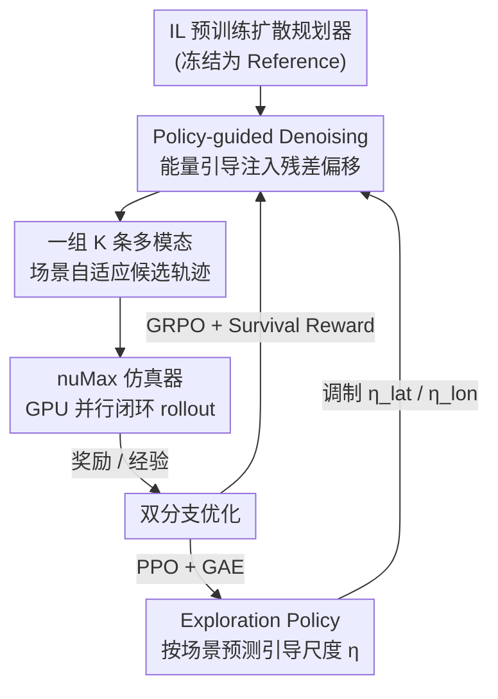

# PlannerRFT: Reinforcing Diffusion Planners through Closed-Loop and Sample-Efficient Fine-Tuning

**会议**: CVPR 2026  
**论文**: [CVF Open Access](https://openaccess.thecvf.com/content/CVPR2026/html/Li_PlannerRFT_Reinforcing_Diffusion_Planners_through_Closed-Loop_and_Sample-Efficient_Fine-Tuning_CVPR_2026_paper.html)  
**代码**: 无  
**领域**: 自动驾驶 / 扩散模型 / 强化学习  
**关键词**: 扩散规划器, 强化微调, 闭环仿真, 探索策略, GRPO

## 一句话总结
针对扩散规划器在强化微调时"模态坍缩、探索无效"的痛点，PlannerRFT 用一个可学习的探索策略调制 classifier guidance 的引导尺度，让去噪过程既多模态又随场景自适应，配合 GPU 并行仿真器 nuMax，在 nuPlan 闭环基准上做到 SOTA，尤其在困难交互场景上大幅提升安全性。

## 研究背景与动机
**领域现状**：基于扩散模型的规划器（Diffusion Planner、DiffusionDrive 等）能从大规模人类驾驶演示里学到拟人、概率化的轨迹分布，是目前自动驾驶轨迹生成的热门范式。它们大多靠模仿学习（IL）训练。

**现有痛点**：IL 训出来的规划器有分布偏移和目标错配问题——它只会复刻演示数据，遇到 OOD 场景就失效。于是有人引入"生成-评估"式的强化微调（RFT）：规划器作为 actor 生成一组候选轨迹，在仿真里打分，再用 group-wise 的 RL（如 GRPO）迭代优化。这套范式的上限完全取决于候选轨迹的**探索能力**。

**核心矛盾**：扩散规划器在这里恰恰探索不动。香草扩散规划器有**模态坍缩**——从不同高斯噪声出发去噪，最后几乎收敛到同一条轨迹（图 1a），一组候选长得都一样，RL 拿不到有效梯度。后来的 anchor-based 方法（图 1b）用固定锚点初始化高斯分布来制造多样性，但这些锚点是**场景无关**的：一部分锚点生成合理机动，另一部分却产出与场景冲突的轨迹，给 RL 注入噪声梯度，训练不稳。

**本文目标**：让扩散规划器在 RFT 阶段既能生成**多模态**（同一场景下多种机动假设）、又能**自适应**（探索分布随场景上下文自我调整）的候选轨迹，从而高效利用奖励信号。

**切入角度**：不去改扩散规划器本身的推理结构，而是在去噪过程里插入一个由 RL 学出来的"探索策略"，动态调制 classifier guidance 的引导强度——多样性来自能量引导，自适应来自这个策略。

**核心 idea**：用 policy-guided denoising 代替固定锚点，让一个可学习的探索策略按场景预测引导尺度，把多模态和场景自适应同时塞进去噪过程，且部署时整套引导模块可拔掉、不改原始推理 pipeline。

## 方法详解

### 整体框架
PlannerRFT 接收一个 IL 预训练好的扩散规划器（共享场景编码器 + Diffusion Transformer 解码器），在生成-评估范式下用 GRPO 做闭环强化微调。预训练规划器被复制并冻结成一个全局 reference，提供稳定的 IL 先验。核心改造是在原结构上插入一个**探索策略（Exploration Policy）**：它读场景上下文和 reference 轨迹，预测引导尺度，调制 classifier guidance 注入的残差偏移，使去噪生成既多样又贴合场景。这些候选轨迹在 nuMax 仿真器里做闭环 rollout、打分，最后由一个**双分支优化**框架同时优化轨迹分布（GRPO 微调 DiT 去噪）和探索策略（PPO 优化引导尺度）。部署时探索策略和 reference 分支全部移除，规划器回到原始扩散结构。

### 关键设计

**1. Policy-guided 去噪：用能量引导造多样性、用可学策略调自适应**

这是全文的核心，直接打在"模态坍缩 + 锚点场景无关"两个痛点上。多样性靠**能量型 classifier guidance**：在每个去噪步把引导拆成横向、纵向两个正交分量，往去噪过程注入残差偏移，让轨迹在 reference 附近散开。横向能量函数定义为 $\Psi_{\text{lat}} = \frac{1}{T}\sum_{\tau=1}^{T}\big(n_\perp^\tau(x_\tau - x_\tau^{\text{ref}}) - \lambda_{\text{lat}}\eta_{\text{lat}}\big)^2$，其中 $n_\perp$ 是单位法向量、$\lambda_{\text{lat}}$ 是最大横向偏移（米）、$\eta_{\text{lat}}\in[-1,1]$ 是横向引导尺度；纵向能量 $\Psi_{\text{lon}}$ 同理调制规划速度 $v$ 相对 reference 速度的偏差。两个能量给出解耦正交的梯度，靠不同的 $(\eta_{\text{lat}}, \eta_{\text{lon}})$ 组合就能生成多模态轨迹。去噪梯度近似为 $\nabla_x \log p(\eta|x) \approx -\nabla_x\big(\Psi_{\text{lat}}(x;\eta_{\text{lat}}) + \Psi_{\text{lon}}(x;\eta_{\text{lon}})\big)$。这里**故意不加显式碰撞约束**，让不可行样本充当 RL 的负反馈。

自适应靠**可学习的探索策略** $\eta \sim \pi_\phi(\cdot \mid s, x^{\text{ref}})$：它不是给固定锚点，而是按驾驶上下文 $s$ 和 reference 轨迹预测引导尺度。reference 轨迹经 MLP-Mixer 编成紧凑 token，再跟场景嵌入做 cross-attention 融合，捕捉参考运动与环境的交互；Guidance Head 据此预测两个 Beta 分布的参数（分别管横向、纵向引导尺度），Value Head 估计状态价值辅助优化。RFT 时反复从这两个 Beta 分布采 $K$ 次引导尺度，每次确定一种驾驶模态、调制出一条轨迹 $\hat{x}^{(k)}$，得到一组多样候选 $X = \{\hat{x}^{(k)}, (\eta_{\text{lat}}^{(k)}, \eta_{\text{lon}}^{(k)})\}_{k=1}^{K}$。和 anchor-based 的区别在于：锚点是死的、场景无关；这个策略是活的、随场景自调，所以候选既多样又场景一致，RL 梯度才干净。

**2. 闭环 rollout + Survival Reward：在仿真里收集 on-policy 经验并稳住困难场景的梯度**

RL 不像 IL 吃离线数据，它需要训练中实时仿真采样，所以吞吐至关重要。每个仿真步规划器生成 $K$ 条候选，随机选一条 $x'$ 及其引导尺度 $(\eta'_{\text{lat}}, \eta'_{\text{lon}})$，**只执行第一个动作**把环境从 $s_t$ 推到 $s_{t+1}$、拿即时奖励，再把 $(s_t, \eta'_{\text{lat}}, \eta'_{\text{lon}}, r_{t+1}, V(s_t))$ 存进 replay buffer。

轨迹优化按预测时域 $T_r$ 内的 PDMS（Predictive Driver Model Score）开环评估。但困难场景里直接用终止奖励（碰撞、出界）会**优化停滞**：一旦失败，组内所有候选奖励全归零，GRPO 拿不到组内梯度。为此引入 **survival reward**，只累积有效、非终止段的奖励：$R_{\text{surv}} = \frac{1}{L}\sum_{\tau=1}^{T} R_{\text{term}}^\tau \cdot \mathbb{I}[R_{\text{term}}^\tau = 0]$ ⚠️ 公式细节以原文为准。它鼓励规划器尽量推迟失败事件、改善长时域可行性，让 hard case 里也有非零梯度可优化。消融里 survival 比 terminal reward 在 Test14-hard-R 上从 71.59 提到 72.21。

**3. 双分支优化：GRPO 调轨迹分布、PPO 调探索策略**

PlannerRFT 把两件事拆成两条优化分支，互不打架。**轨迹优化分支**用 GRPO 微调 DiT 去噪：沿用 DPPO / ReCogDrive 的思路，把扩散去噪过程建成马尔可夫决策过程，每个去噪步是一次高斯转移，RFT 时更新高斯参数让规划器对齐奖励目标。**探索策略分支**用 PPO 优化 $\pi_\phi$：未来奖励通过 GAE 反向传播，让策略根据闭环 rollout 里观察到的长时域轨迹表现来修正当前的探索决策，迭代学出随场景自适应设置 $(\eta_{\text{lat}}, \eta_{\text{lon}})$ 的 Beta 分布参数。两分支一个管"轨迹长什么样"、一个管"往哪个方向探索"，配合起来才能稳定高效地微调。此外有几个工程上的 best practice：用 5 步 DDIM 去噪（比 ODE 引入随机性利于探索、比 DDPM 省步数）、探索策略零初始化（保证早期围绕 reference 无偏探索、避免微调初期掉点）、加入适量困难场景做 hard-case 微调（太多反而掉点）。

**4. nuMax 仿真器：GPU 并行让大规模闭环 RL 训得起**

闭环 RL 的瓶颈在仿真吞吐。nuMax 基于 Waymax 和 V-Max 实现，是一个 GPU 并行仿真器，对齐 nuPlan 基准做了运动学和奖励的标定，rollout 速度比原生 nuPlan 仿真器快约 **10 倍**。它包含场景缓存（预处理缓存供大规模 rollout）、LQR tracker 与 scorer（运动学与奖励校准到 nuPlan）、以及把 PyTorch DDP worker 与 JAX 仿真器桥接的分布式训练 pipeline。没有它，144k 场景、40M 环境步的训练规模在有限算力下根本跑不动。

## 实验关键数据

### 主实验
nuPlan 闭环仿真，分非反应式（NR，背景车放录制轨迹）和反应式（R，背景车用 IDM 动态响应），评测 Val14（常规驾驶）和 Test14-hard（复杂交互场景），分数 0–100 越高越好。

| 设置 | 指标 | Diffusion Planner | Flow Planner | PlannerRFT | 提升(vs Diffusion) |
|------|------|-------------------|--------------|------------|--------------------|
| Val14-NR | 闭环分 | 89.87 | 90.43 | 89.96 | +0.09 |
| Val14-R | 闭环分 | 82.80 | 83.31 | **84.46** | +1.66 |
| Test14-hard-NR | 闭环分 | 75.99 | 76.47 | **77.16** | +1.17 |
| Test14-hard-R | 闭环分 | 69.22 | 70.42 | **72.21** | +2.99 |

四个基准里三个拿到最佳。反应式、困难交互场景提升最明显（Test14-hard-R +2.99），说明闭环 rollout 让规划器见识到更广的交互模式、缓解了分布偏移；常规非反应场景（Val14-NR）提升边际，作者归因于非反应环境本身的分布偏置。

### 消融实验
探索策略消融（Test14-hard-R，D 是采样轨迹组的多样性分数，$\bar{r}$、$s_r$ 是组内奖励均值/标准差）：

| 探索策略 | R-score↑ | NR-score↑ | D(%) | $\bar{r}$↑ | $s_r$ |
|----------|----------|-----------|------|-----------|-------|
| IL Pretrain (DDIM) | 68.18 | 76.01 | - | - | - |
| w/o Guidance | 68.83 | 76.34 | 5.65 | 69.06 | 0.02 |
| w/ Uniform Dist. | 65.82 | 75.19 | 39.78 | 60.44 | 0.12 |
| w/ Fixed Beta Dist. | 70.65 | 76.61 | 27.73 | 71.50 | 0.07 |
| PlannerRFT (Ours) | **72.21** | **77.16** | 25.34 | **73.88** | 0.06 |

其他消融：survival reward + 4s 时域优于 terminal reward（72.21 vs 71.59）；微调数据用 Lt90（低分场景）比 All 或纯 Fail 更好；最大引导偏移 $\lambda_{\text{lat}}=2.5$m、$\lambda_{\text{lon}}=25\%$ 时综合最优。

### 关键发现
- **多样性不是越高越好**：Uniform 分布多样性最高（D=39.78%）但表现最差（R=65.82），因为场景无关的采样制造了过大的奖励方差，训练不稳、反复 reward collapse；Fixed Beta 限制探索范围稳住了训练但天花板受限；只有可学策略在多样性（25.34%）和组内奖励（$\bar{r}$=73.88、$s_r$ 低至 0.06）之间找到平衡。
- **行为随训练步数演化**：同一 OOD 变道场景，IL 预训练在 12s 被卡两车道间撞车；微调 10M 步学会保守地保持车道避撞（安全但低效）；25M 步学会果断变道，安全和效率兼得——说明 RFT 真的在学新的驾驶策略而非复刻演示。
- **困难场景增益最大**：相比常规场景，PlannerRFT 在碰撞、出界等失败场景上的安全性提升最显著。

## 亮点与洞察
- **把"探索"本身做成可学策略**：传统 RFT 靠固定锚点或固定引导强度制造多样性，本文让一个 PPO 策略按场景动态调引导尺度，多样性和场景一致性同时拿到——这个"用 RL 学怎么探索"的思路可以迁移到任何 guidance-based 的扩散生成 RL。
- **能量引导横纵解耦**：把引导拆成正交的横向/纵向两个能量函数，组合出可控的多模态，比单一各向同性噪声更可解释、梯度更干净。
- **Survival reward 解决稀疏奖励停滞**：困难场景里"全员归零无梯度"是 group-wise RL 的通病，用累积非终止段奖励鼓励"推迟失败"是个轻量好用的 trick，可迁到其他高失败率的 RL 微调任务。
- **即插即用**：引导模块只在训练时挂载，部署时整体移除、回到原始扩散结构，不增加推理成本——对落地友好。

## 局限与展望
- **常规非反应场景几乎没提升**（Val14-NR +0.09），作者归因于非反应环境分布偏置，但也说明该方法主要在交互密集场景受益。
- **依赖自研仿真器 nuMax**：10× 加速是大规模 RL 的前提，但 nuMax 基于 Waymax/V-Max 重写、对齐 nuPlan，复现门槛和仿真保真度（与真实分布的 gap）都需谨慎，文中实现细节放在补充材料。⚠️
- 训练成本不低（8×H100、40M 环境步），survival reward 的具体公式和部分超参以原文/补充材料为准。
- **无显式碰撞约束**靠不可行样本当负反馈，这在仿真里 work，但对安全关键部署是否足够、是否需要硬约束兜底，值得进一步验证。

## 相关工作与启发
- **vs Diffusion Planner（IL 基线）**: 它用 IL 联合建模周车与自车轨迹，本文以它为预训练起点，再用闭环 RFT 微调去噪分布，解决其分布偏移问题，困难交互场景闭环分提升明显。
- **vs anchor-based 扩散规划器（如 DiffusionDrive）**: 它们用固定、场景无关的锚点初始化高斯分布造多样性，本文换成可学习的、场景自适应的探索策略，候选既多样又场景一致，RL 梯度更稳。
- **vs token 词表式 / 自回归式 RFT 范式**: 词表式离散化限制表达力、词表越大维度越高；自回归式有误差累积和时序不稳；扩散去噪天然适合连续动作空间和时序一致决策，本文论证了这一优势但补上了它探索不动的短板。
- **vs AlphaGo 的 MCTS 自适应探索**: 本文借用"自适应探索"这一思想，但把搜索换成了由 PPO 学出的引导尺度调制，适配连续轨迹生成。

## 评分
- 新颖性: ⭐⭐⭐⭐ 把"可学探索策略调制 classifier guidance"引入扩散规划器 RFT，针对模态坍缩和场景无关锚点对症下药，角度清晰。
- 实验充分度: ⭐⭐⭐⭐ nuPlan 四基准 + 多组消融（探索策略/奖励/数据/引导偏移）覆盖到位，行为演化的定性分析也有说服力。
- 写作质量: ⭐⭐⭐⭐ 痛点-方法-实验逻辑顺畅，图 1 三种范式对比很直观；部分公式 OCR 后需对照原文。
- 价值: ⭐⭐⭐⭐ 给扩散规划器的强化微调提供了样本高效的范式，nuMax 仿真器和 survival reward 对社区有实用价值。

<!-- RELATED:START -->

## 相关论文

- [\[CVPR 2025\] Closed-Loop Supervised Fine-Tuning of Tokenized Traffic Models](../../CVPR2025/autonomous_driving/closed-loop_supervised_fine-tuning_of_tokenized_traffic_models.md)
- [\[CVPR 2026\] WAM-Flow: Parallel Coarse-to-Fine Motion Planning via Discrete Flow Matching for Autonomous Driving](wam-flow_parallel_coarse-to-fine_motion_planning_via_discrete_flow_matching_for_.md)
- [\[ICLR 2026\] BridgeDrive: Diffusion Bridge Policy for Closed-Loop Trajectory Planning in Autonomous Driving](../../ICLR2026/autonomous_driving/bridgedrive_diffusion_bridge_policy_for_closed-loop_trajectory_planning_in_auton.md)
- [\[ECCV 2024\] Safe-Sim: Safety-Critical Closed-Loop Traffic Simulation with Diffusion-Controllable Adversaries](../../ECCV2024/autonomous_driving/safe-sim_safety-critical_closed-loop_traffic_simulation_with_diffusion-cont.md)
- [\[CVPR 2026\] RLFTSim: Realistic and Controllable Multi-Agent Traffic Simulation via Reinforcement Learning Fine-Tuning](rlftsim_realistic_and_controllable_multi-agent_traffic_simulation_via_reinforcem.md)

<!-- RELATED:END -->
