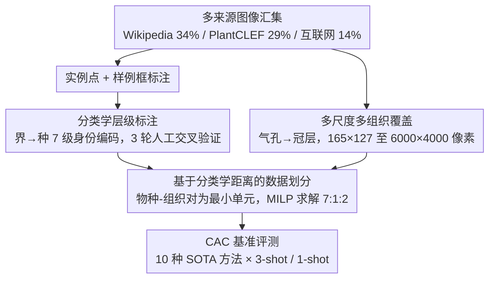

# Plant Taxonomy Meets Plant Counting: A Fine-Grained, Taxonomic Dataset for Counting Hundreds of Plant Species

**会议**: CVPR 2026  
**arXiv**: [2603.21229](https://arxiv.org/abs/2603.21229)  
**代码**: [https://github.com/tiny-smart/TPC-268](https://github.com/tiny-smart/TPC-268)  
**领域**: 自动驾驶  
**关键词**: 植物计数, 类无关计数, 分类学层次结构, 细粒度数据集, 密度估计

## 一句话总结

本文构建了首个融合植物分类学的大规模计数数据集 TPC-268，包含 10,000 张图、678,050 个点标注和 268 个可计数类别（覆盖 242 个物种），按林奈分类体系标注完整层级信息，并在类无关计数（CAC）范式下进行了全面基准测试。

## 研究背景与动机

**领域现状**：视觉计数领域在过去十年中发展迅速，但主要集中在人群计数和车辆计数等刚性物体上。类无关计数（CAC）的出现使得模型可以泛化到未见类别，但现有 CAC 数据集（如 FSC-147）缺乏细粒度的类别复杂性。

**现有痛点**：植物计数与通用物体计数存在根本性差异——植物具有非刚性形态、生长周期中剧烈的形态变化、表型可塑性，以及按分类学层次组织的巨大物种多样性。人群计数模型只需区分"人"和"背景"，但植物计数系统需要学会区分数百个物种的微妙纹理差异。现有的植物计数数据集（来自植物科学领域）规模小、物种单一，且缺乏分类学信息。

**核心矛盾**：植物的分类学层次结构提供了天然的视觉相似性先验（如同科植物的叶型相似），但现有计数方法完全忽略了这一结构化信息。此外，"一模型一物种"的范式在植物王国的巨大物种空间下根本不可扩展。

**本文目标** 构建首个融合分类学层次结构的大规模植物计数基准数据集，为 CAC 在植物领域的研究提供生物学基础的测试平台。

**切入角度**：将植物分类学的层次分类信息（界→种）与实例级点标注结合，利用分类学距离定义数据划分，确保模型在真正的跨物种间隙上进行泛化评估。

**核心 idea**：通过构建带有完整林奈分类层级标注的大规模植物计数数据集，将 CAC 的泛化评估从简单的"未见类别"提升到生物学意义上的"跨分类学间隙"。

## 方法详解

### 整体框架

TPC-268 不是一个新模型，而是一套数据集 + 基准。它要回答的问题是：当计数对象从"人/车"换成"数百个亲缘关系交错的植物物种"时，现有类无关计数（CAC）方法还剩多少本事。围绕这个问题，作者把数据集构建拆成四步：先从多个来源汇集图像（Wikipedia 34%、PlantCLEF 29%、互联网 14% 等），再为每张图打上"实例点 + 样例框 + 完整分类学层级 + 生物组织类别"的标注，接着用一个带约束的优化器切出训练/验证/测试集——切的依据不是随机，而是分类学距离，最后把十种 SOTA 方法放进同一套 CAC 协议里横向评测。前两步决定数据本身长什么样，第三步决定"泛化"这个词在这个基准里到底意味着什么。

### 关键设计

**1. 分类学层级标注：把"是什么物种"变成结构化的先验，而不是一个扁平标签**

传统 CAC 把每个类别当成互不相干的独立 token，模型学会"数这一类"却不知道这一类和别的类有没有亲缘。植物恰恰相反——同属植物常常共享叶形、果型这类形态特征，这是天然的视觉相似性先验，但过去的计数数据集完全没把它记下来。本文给每个实例标上从界到种的 7 级完整身份，编码成一个 7 维向量，比如苹果（*Malus domestica*）就是 $[1,1,1,14,39,113,136]$。标注流程是先用 Pl@ntNet 做初步属种鉴定，再用 World Flora Online 数据库补全缺失层级，全部标签经过 3 轮人工交叉验证。这一步的意义在于，它把单纯的"数个数"问题升级成"联合计数 + 层次推理"——模型若能利用这层结构，就有机会借同科近亲的形态知识去泛化到没见过的物种。

**2. 基于分类学距离的数据划分：让测试集里的物种和训练集真正"沾不上亲"**

如果按类别随机切数据，训练集里很可能混进测试物种的近亲，模型只要记住"叶子长这样的就数一下"就能蒙混过关，测出来的泛化是虚高的。本文把切分的最小不可分单元定义为"物种-组织对"（例如水稻-花和水稻-气孔算两个单元），保证每个单元整体只落进一个子集，从源头杜绝近亲泄漏。具体怎么分则交给一个混合整数线性规划（MILP）求解，约束有三条：每个子集都要覆盖全部观测尺度、各子集平均密度要平衡（约 67.81 实例/图）、整体比例逼近 7:1:2。这样切出来的测试集逼着模型面对真正的跨属、跨科泛化，评测因此更严苛也更贴近真实部署场景。

**3. 多尺度多组织覆盖：从气孔到冠层，让数据跨越显微镜到无人机的尺度鸿沟**

真实的植物计数任务尺度差异极大——农学家可能要数显微图里的气孔，也可能要数无人机航拍里的整片冠层，模型必须在这种极端尺度跳变下保持鲁棒。为此数据集刻意铺满四个生物组织层级：组织级（气孔 1,096、树脂 228）、器官级（果实 4,422、花 2,994、种子 602 等）、个体级（整株 214）和群体级（冠层 56），图像分辨率从 $165 \times 127$ 一直拉到 $6,000 \times 4,000$ 像素。这种刻意的尺度跨度让 TPC-268 不只是"物种多"，更是"观测方式多"，直接逼出了后面实验里全局注意力模型在跨尺度时泛化崩盘的现象。

### 损失函数 / 训练策略

数据集论文本身不引入新训练目标。基准里各方法沿用自己的训练策略，统一在标准的 3-shot 和 1-shot CAC 设置下评估。

## 实验关键数据

### 主实验（3-shot）

| 方法 | 会议 | 类型 | Val MAE↓ | Val RMSE↓ | Test MAE↓ | Test RMSE↓ | Test R²↑ |
|------|------|------|----------|-----------|-----------|-----------|----------|
| FamNet | CVPR'21 | 回归 | 28.87 | 52.51 | 30.43 | 65.62 | 0.62 |
| C-DETR | ECCV'22 | 检测 | 22.66 | 77.51 | 22.68 | 57.97 | 0.74 |
| LOCA | ICCV'23 | 回归 | 17.26 | 53.19 | **17.51** | **38.37** | **0.78** |
| DAVE | CVPR'24 | 回归 | 16.47 | 52.87 | 17.61 | 40.06 | 0.75 |
| CACViT | AAAI'24 | 回归 | 16.63 | 42.49 | 22.04 | 41.79 | 0.73 |
| CountGD | NeurIPS'24 | 检测 | 18.32 | 54.55 | 19.52 | 50.51 | 0.61 |
| TasselNetV4 | ISPRS'26 | 回归 | **13.20** | **43.93** | 22.95 | 51.36 | 0.60 |

### 跨数据集迁移

| 方向 | CountTR MAE | CACViT MAE | LOCA MAE |
|------|------------|------------|----------|
| FSC-147→FSC-147 | 11.90 | 10.83 | 10.72 |
| FSC-147→TPC-268 | 38.62 (+225%) | 26.73 (+147%) | 24.70 (+130%) |
| TPC-268→TPC-268 | 25.19 | 22.04 | 17.51 |
| TPC-268→FSC-147 | 26.53 (+5%) | 17.88 (-19%) | 15.16 (-13%) |

### 关键发现

- **回归方法一致优于检测方法**：植物的紧密空间排列和结构纠缠使得显式的实例定位极为困难，整体密度估计更适合
- **Val-Test 泛化差距**：CACViT 和 TasselNetV4 等全局注意力模型在验证集表现最佳但测试集退化严重（TasselNetV4: val 13.20 → test 22.95），说明局部结构一致性对跨物种泛化至关重要。LOCA 凭借局部+全局结合在测试集上最稳健
- **跨数据集迁移的不对称性**：从 FSC-147（通用物体）迁移到 TPC-268（植物）时性能暴跌 130-225%，但反过来从 TPC-268 迁移到 FSC-147 几乎无退化甚至提升，证明植物计数是比通用计数更难的任务
- **分类学信息的价值**：在 CountGD 中加入物种名 MAE 从 19.52 降至 17.53，加入完整分类层级进一步降至 16.90，证实分类学先验可以作为有效的归纳偏置

## 亮点与洞察

- **将分类学层级与视觉计数结合的思路**非常有创意。传统 CAC 将类别视为扁平的独立标签，而本文利用生物学的层级结构提供跨类别泛化的先验知识。这一思路可以迁移到任何具有层级分类的领域（如工业零件的型号层级、动物分类等）
- **MILP优化的数据划分方法**确保了评估的严格性——训练集中不出现测试物种的任何近亲。这种分类学距离定义的划分方式值得其他细粒度数据集借鉴
- **跨数据集迁移的不对称性**揭示了一个深刻洞察：在"难"领域训练的模型更容易泛化到"易"领域，但反过来不行。这对"通用"计数模型的设计有启发意义

## 局限与展望

- 数据集的分类学覆盖仍有局限，集中在被子植物和少量真菌，缺少裸子植物、苔藓等其他大类
- 当前密度很不均衡——72.1% 的图片实例数不到 50，极高密度（>500）的样本仅 3%
- 所有基准方法的绝对性能仍然不高（最优 MAE 17.51），说明植物计数离实用还有很大距离
- t-SNE 分析显示 SOTA 方法（LOCA）的特征缺乏清晰的类别级区分，表明当前模型不足以捕捉深层生物特征。显式建模分类学亲缘关系的视觉相似性是一个值得深入的方向
- BioCLIP 直接替换 backbone 效果不好（MAE 34.75），说明需要专门设计的适配策略

## 相关工作与启发

- **vs FSC-147**：FSC-147 是 CAC 领域最常用的基准（6,135 图, 147 类），但类别间缺乏结构化关系。TPC-268 通过分类学层级提供了更严格的泛化评估框架，且植物的形态复杂度远超 FSC-147 中的刚性物体
- **vs ShanghaiTech/NWPU**：传统人群计数数据集只有单一类别，密度高但类别简单。TPC-268 将计数扩展到 268 个细粒度类别，带来了"计数+识别"的联合挑战
- **vs CountGD**：CountGD 支持文本引导的开放词汇计数，加入分类学文本后性能提升明显（MAE 19.52→16.90），但仍不及纯视觉方法 LOCA（17.51），说明文本编码不能完全替代视觉样例

## 评分

- 新颖性: ⭐⭐⭐⭐ 首次将植物分类学引入计数数据集设计，分类学距离定义的评估协议有创新
- 实验充分度: ⭐⭐⭐⭐⭐ 10 种 CAC 方法的全面对比 + 跨数据集迁移 + 分类学信息消融 + 细粒度误差分析 + t-SNE 可视化
- 写作质量: ⭐⭐⭐⭐ 数据集构建原则清晰，分析详实，但部分统计描述略显冗长
- 价值: ⭐⭐⭐⭐ 为 CAC 研究提供了新的挑战性基准，对精准农业和生态监测有切实应用价值

<!-- RELATED:START -->

## 相关论文

- [\[ICCV 2025\] Counting Stacked Objects](../../ICCV2025/autonomous_driving/counting_stacked_objects.md)
- [\[CVPR 2026\] HOLO: Homography-Guided Pose Estimator Network for Fine-Grained Visual Localization on SD Maps](holo_homography-guided_pose_estimator_network_for_fine-grained_visual_localizati.md)
- [\[AAAI 2026\] Fine-Grained Representation for Lane Topology Reasoning](../../AAAI2026/autonomous_driving/fine-grained_representation_for_lane_topology_reasoning.md)
- [\[CVPR 2026\] LA-Pose: Latent Action Pretraining Meets Pose Estimation](la-pose_latent_action_pretraining_meets_pose_estimation.md)
- [\[CVPR 2025\] Point-to-Region Loss for Semi-Supervised Point-Based Crowd Counting](../../CVPR2025/autonomous_driving/point-to-region_loss_for_semi-supervised_point-based_crowd_counting.md)

<!-- RELATED:END -->
