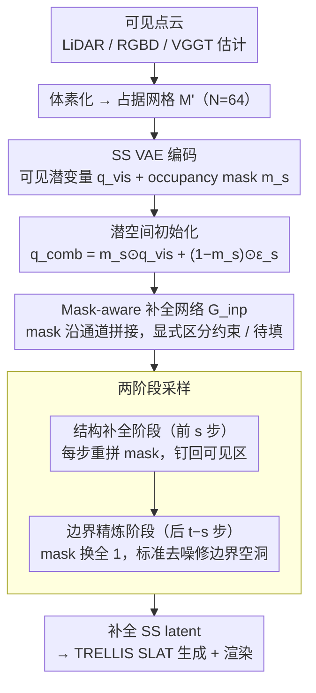

# Points-to-3D: Structure-Aware 3D Generation with Point Cloud Priors

**会议**: CVPR 2026  
**arXiv**: [2603.18782](https://arxiv.org/abs/2603.18782)  
**代码**: [项目页面](https://jiatongxia.github.io/points2-3D/)  
**领域**: 自动驾驶 / 3D生成  
**关键词**: 点云先验, 3D生成, 扩散模型, 结构补全, 几何可控

## 一句话总结

提出 Points-to-3D，将可见区域点云编码为 TRELLIS 的稀疏结构潜变量（SS latent）并用 mask-aware inpainting 网络补全不可见区域，结合结构补全+边界精炼两阶段采样策略，实现几何可控的高保真 3D 资产/场景生成，在 Toys4K 上 F-Score 达 0.964（可见区域 0.998）。

## 研究背景与动机

**领域现状**：3D 生成模型（TRELLIS、GaussianAnything 等）已能从图像或文本合成逼真 3D 资产，但都以 2D 图像/文本为条件，缺乏对真实 3D 几何的直接约束，生成结果在几何精度上不可控。

**被忽视的信息源**：在自动驾驶、机器人等场景中，可见区域点云极易获取——来自 LiDAR、结构光、甚至 VGGT 等前馈预测器。这些点云提供了显式的几何约束，但当前生成框架无法利用。

**技术限制**：TRELLIS 的结构生成从纯高斯噪声初始化 SS latent，仅受图像/文本 embedding 引导，无法锚定到真实 3D 观测。简单地将点云作为额外条件注入效果有限——需要将结构先验嵌入潜空间本身。

**核心思路**：将点云引导的 3D 生成重新定义为**潜空间补全（latent inpainting）**问题：可见区域编码为固定约束，不可见区域由补全网络合成。

## 方法详解

### 整体框架

这篇论文要解决的是：现有 3D 生成模型只吃图像/文本条件，对真实几何"看得见却用不上"。它的做法是把点云引导的生成整体当成一道**潜空间补全题**——可见区域是给定的答案，不可见区域才需要网络去填。具体一路转下来是这样：可见点云先体素化成 $N=64$ 的占据网格 $\mathbf{M}'$，过 TRELLIS 自己的 SS VAE 编码成部分观测的结构潜变量 $\mathbf{q}_{\text{vis}}=\mathcal{E}_s(\mathbf{M}')$；同时记下一张 occupancy mask $\mathbf{m}_s$ 标出哪里有观测、哪里是空白；空白处灌入噪声拼成组合输入 $\mathbf{q}_{\text{comb}}$，交给微调过的 Inpainting Flow Transformer，配合两阶段采样把整块 SS latent 补全，最后接回 TRELLIS 原本的 SLAT 生成与渲染。整个改动落在"结构潜变量"这一层，下游一字不改。

### 关键设计

**1. 点云先验驱动的潜空间初始化：把真实几何直接焊进生成起点**

痛点很直接——TRELLIS 从纯高斯噪声起步，再强的图像/文本 embedding 也只是隐式引导，生成出来的几何没法和手头的 LiDAR/RGBD 观测对齐。这里的做法是让可见区域的潜变量充当不可动的约束：

$$\mathbf{q}_{\text{comb}} = \mathbf{m}_s \odot \mathbf{q}_{\text{vis}} + (1 - \mathbf{m}_s) \odot \boldsymbol{\epsilon}_s$$

其中 $\mathbf{q}_{\text{vis}}=\mathcal{E}_s(\mathbf{M}')$ 是编码后的可见区域 latent，$\mathbf{m}_s$ 是下采样到 latent 分辨率（$r=16$）的 occupancy mask，空白处则用噪声 $\boldsymbol{\epsilon}_s$ 占位。这样一来，扩散过程从一开始就被真实 3D 观测"锚住"，而不是在全噪声里凭隐式条件猜几何——这是它能把可见区域 F-Score 顶到 0.998 的根本原因。

**2. Mask-aware 结构补全网络 $\mathcal{G}_{inp}$：让网络知道哪里该补、哪里别动**

只锚定可见区域还不够，网络得学会从"看得见的一半"推断"看不见的一半"，且不能把已知区域也一并改写。作者基于 TRELLIS 的 Structure Flow Transformer 微调，关键改动是把 mask $\mathbf{m}_s$ 沿通道维拼到 $\mathbf{q}_{\text{comb}}$ 上、替换原始输入层以适配新通道数 $(c_s+c_m)$，等于显式告诉网络每个体素是约束还是待填。训练数据则自构：对完整 3D 资产从 $T=24$ 个视角渲染深度图，经深度一致性检验（阈值 $\tau$）提取每视角的可见点云，凑成 $(\mathbf{q}_{\text{comb}}^t,\mathbf{m}_s^t,\mathbf{I}_t,\mathbf{q}_{\text{gt}})$ 训练对，用 Conditional Flow Matching 监督：

$$\mathcal{L}_{CFM} = \mathbb{E}_{t, \mathbf{q}_{\text{gt}}, \epsilon} \|\mathcal{G}_{inp}(\mathbf{x}_{\text{inp}}, t) - (\epsilon - \mathbf{q}_{\text{gt}})\|_2^2$$

让网络回归从噪声指向真值的流速场。对比 SAM3D 那种用 attention 把点云"间接"融进去的做法，这里 mask 通道是硬性区分，可见几何不会被稀释，几何控制因此是显式可控的。

**3. 两阶段采样策略（Staged Sampling）：先补结构、再修边界缝**

纯 inpainting 有个尴尬的副作用：在可见/不可见交界处，因为下采样丢了细节，补出来的边界常留几何"空洞"伪影。作者把总共 $t$ 步采样切成两段来治这个病。前 $s$ 步是**结构补全阶段**：每步重建出 $\mathbf{q}_{\text{pred}}$ 后立刻和 mask $\mathbf{m}_s$ 重新拼接，强行把可见区域钉回原值，循环 $s$ 步保证全局结构锚定不漂移。后 $t-s$ 步切到**边界精炼阶段**：把 mask 换成全 1 的 $\mathbf{m}_1$，退化成标准去噪，让模型在不重写全局结构的前提下把交界处的空洞抹平。实践里最佳配置是前后各 25 步（$s=25$、总 50 步）——消融显示这一拆分把法线指标 PSNR-N 从纯 inpainting 的 25.88 提到 27.10，正是空洞被填上的体现。

### 损失函数 / 训练策略

- **损失**：Conditional Flow Matching Loss，仅在 SS latent 空间上计算
- **训练**：在 3D-FUTURE + HSSD + ABO 三数据集上训练 20k 迭代，batch size 8，4×A100
- **每物体采样** $S=50{,}000$ 个点，$T=24$ 视角，构造可见/完整 latent 对
- 推理时支持两种输入：(a) 真实点云先验；(b) VGGT 从单张图像估计的点云

## 实验关键数据

### 主实验

**单物体生成（Toys4K）**：

| 方法 | PSNR↑ | SSIM(%)↑ | LPIPS↓ | CD↓ | F-Score↑ |
|---|---|---|---|---|---|
| TRELLIS | 21.94 | 91.46 | 0.105 | 0.034 | 0.832 |
| SAM3D | 22.42 | 91.45 | 0.111 | 0.033 | 0.835 |
| Points-to-3D (VGGT) | 22.55 | 92.09 | 0.088 | 0.024 | 0.881 |
| **Points-to-3D (P.C.)** | **22.91** | **92.83** | **0.070** | **0.013** | **0.964** |

**场景级生成（3D-FRONT）**：

| 方法 | PSNR↑ | LPIPS↓ | CD↓ | F-Score↑ |
|---|---|---|---|---|
| TRELLIS | 18.21 | 0.239 | 0.094 | 0.478 |
| MIDI | 19.23 | 0.166 | 0.075 | 0.513 |
| **Points-to-3D (P.C.)** | **21.63** | **0.124** | **0.025** | **0.886** |

### 消融实验

| 配置 (Inp./Ref. 步数) | CD↓ | F-Score↑ | PSNR-N↑ | 说明 |
|---|---|---|---|---|
| 50/0 (纯 inpainting) | 0.014 | 0.960 | 25.88 | 边界有空洞 |
| 25/25 (最佳) | **0.013** | **0.963** | **27.10** | 空洞消除 |
| 10/40 | 0.014 | 0.961 | 26.72 | inpainting 不足 |

### 关键发现

- 可见区域 F-Score 达 **0.998**，CD 仅 **0.007**，几乎完美保留输入先验
- 即使使用 VGGT 估计的（带噪声的）点云，仍显著优于所有基线，验证了框架的鲁棒性
- SAM3D 虽也用点云但通过 attention 间接融合，无法实现显式几何控制
- 场景级生成提升尤其显著（F-Score: 0.513 → 0.886），显示点云先验对复杂多物体场景的指导价值

## 亮点与洞察

1. **关键创新**：将点云条件生成重新定义为潜空间 inpainting 问题，是一个简洁优雅且有效的范式
2. **两阶段采样**：结构补全+边界精炼的分离采样策略巧妙解决了 inpainting 边界伪影
3. **灵活输入**：支持真实传感器点云和 VGGT 预测点云，覆盖有/无真实 3D 先验的场景
4. **即插即用**：基于 TRELLIS 框架，仅修改输入层和训练数据，架构改动最小

## 局限与展望

1. VGGT 预测点云与真实点云仍有差距（F-Score 0.881 vs 0.964），受限于前馈预测精度
2. 体素化分辨率 $N=64$ 可能限制细粒度几何表达
3. 仅在物体和室内场景评估，未验证大规模户外场景（如自动驾驶点云）

## 相关工作与启发

- **TRELLIS**：提供了 SS latent 框架，使点云注入成为可能
- **VGGT**：前馈 3D 预测器，为没有主动传感器的场景提供点云输入
- **VoxHammer**：同样使用 3D 先验但采用 3D 反演策略，在补全未知区域时效果不佳
- **启发**：这种"将先验编码为 latent 初始化 + inpainting 补全"的范式有望推广到其他条件生成任务

## 评分

- 新颖性: ⭐⭐⭐⭐ (潜空间 inpainting 视角新颖，范式清晰)
- 实验充分度: ⭐⭐⭐⭐ (物体+场景+真实图像+消融，比较全面)
- 写作质量: ⭐⭐⭐⭐ (结构清晰，问题-方案-结果逻辑线流畅)
- 价值: ⭐⭐⭐⭐⭐ (为3D生成引入显式3D先验的范式，LiDAR/RGBD+生成的应用前景广阔)

<!-- RELATED:START -->

## 相关论文

- [\[CVPR 2026\] IGASA: Integrated Geometry-Aware and Skip-Attention Modules for Enhanced Point Cloud Registration](igasa_integrated_geometry-aware_and_skip-attention_modules_for_enhanced_point_cl.md)
- [\[CVPR 2026\] BuildAnyPoint: 3D Building Structured Abstraction from Diverse Point Clouds](buildanypoint_3d_building_structured_abstraction_from_diverse_point_clouds.md)
- [\[ICCV 2025\] TrackAny3D: Transferring Pretrained 3D Models for Category-unified 3D Point Cloud Tracking](../../ICCV2025/autonomous_driving/trackany3d_transferring_pretrained_3d_models_for_category-unified_3d_point_cloud.md)
- [\[CVPR 2026\] Sparsity-Aware Voxel Attention and Foreground Modulation for 3D Semantic Scene Completion](sparsity-aware_voxel_attention_and_foreground_modulation_for_3d_semantic_scene_c.md)
- [\[AAAI 2026\] Unleashing Semantic and Geometric Priors for 3D Scene Completion](../../AAAI2026/autonomous_driving/unleashing_semantic_and_geometric_priors_for_3d_scene_completion.md)

<!-- RELATED:END -->
