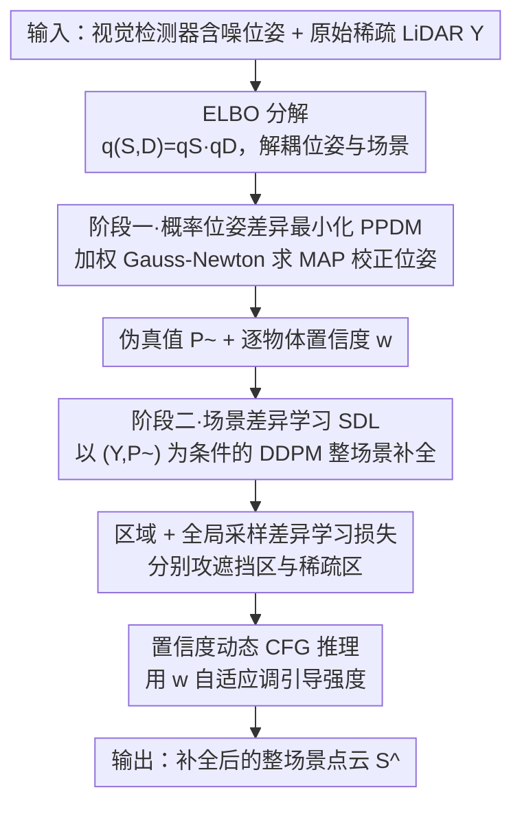

# Probabilistic Discrepancy Learning for Roadside LiDAR Scene Completion

**会议**: CVPR 2026  
**论文**: [CVF Open Access](https://openaccess.thecvf.com/content/CVPR2026/html/Wu_Probabilistic_Discrepancy_Learning_for_Roadside_LiDAR_Scene_Completion_CVPR_2026_paper.html)  
**代码**: 待确认  
**领域**: 自动驾驶 / 路侧感知 / 点云补全  
**关键词**: 路侧LiDAR, 场景补全, 扩散模型, 位姿校正, V2X协同感知

## 一句话总结
PDL 把"路侧 LiDAR 因固定视角导致严重遮挡"重构成一个概率推断问题：先用概率位姿差异最小化（PPDM）把视觉检测器的噪声位姿校正成高精度伪真值，再用以伪真值为条件的扩散模型（SDL）做整场景补全，并配区域/全局两路差异损失与置信度自适应的 CFG 推理，在 V2X-Seq 与 TUMTraf-V2X 上平均把 Chamfer 距离降 14.5%、3D JSD 降 6%。

## 研究背景与动机

**领域现状**：路侧 LiDAR 是智能交通做全局感知的关键，但点云的质量取决于其完整性。现有点云补全分两类——**物体级**补全（从大规模数据学形状先验、补单个孤立物体）和**自车视角的场景级**补全（跨观测聚合时空信息重建场景，如 LiDiff、LiDPM 这类扩散方法）。

**现有痛点**：路侧传感器视角固定、安装位置受限，会产生**长期或严重的遮挡**。物体级方法直接搬到路侧场景会因忽略场景上下文和物体级语义而大幅掉点；自车视角的场景级方法在遮挡下也无法准确恢复被遮挡物体的几何与语义——因为遮挡给被遮挡物体的位姿引入了不确定性。一个直接想法是引入路侧相机图像：被遮挡物体往往在图像里部分可见，可用现成的视觉 3D 检测器估其位姿当监督信号。但视觉检测器精度有限、LiDAR-相机外参标定也有误差，**直接拿这些含噪先验当监督，会把几何误差传播给下游补全模型**。

**核心矛盾**：要补全被遮挡区域就得知道被遮挡物体的真实位姿，但唯一能拿到位姿线索的视觉检测器本身是有噪的——"补全依赖位姿、位姿又不可靠"形成死结。传统做法对位姿 $D$ 和场景 $S$ 做交替优化，但二者强耦合会导致误差累积。

**本文目标**：(1) 把含噪视觉位姿校正成可信的监督信号；(2) 用校正后的信号稳健地引导扩散模型补全整场景；(3) 解耦位姿与场景优化以避免误差累积。

**切入角度**：把"被遮挡物体位姿不确定"形式化为概率推断——对联合概率模型最大化 ELBO，并引入可处理的近似，把原本难解的后验推断**分解成两个分阶段的"概率差异最小化"子问题**（位姿差异 + 场景差异），从而把 $S$ 与 $D$ 解耦、分阶段求解。

**核心 idea**：用 **PPDM（概率位姿差异最小化）+ SDL（场景差异学习）** 两阶段，把"校位姿"和"补场景"分开做，再用置信度把两阶段的可靠性贯穿到推理。

## 方法详解

### 整体框架
PDL 的输入是一个视觉 3D 检测器（用 BEVHeight）输出的含噪位姿 + 原始稀疏 LiDAR 点云 $Y$，输出是补全后的整场景点云。理论起点是对联合概率 $p(Y,C,S,D)$ 做生成式分解并最大化 ELBO；由于后验 $p(S,D\mid Y,C)$ 不可解，作者用变分近似 $q(S,D)=q_S(S)q_D(D)$ 把 $S$ 与 $D$ 拆开，并把"最大化 ELBO"重写成**两个差异的分阶段最小化**。**阶段一（PPDM）**：对每个物体，把"视觉先验 + LiDAR 几何似然 + 位姿先验"凑成一个能量函数，用加权 Gauss-Newton 迭代求 MAP 解，得到校正后的位姿 $\tilde{d}_i$，把对齐后的 ShapeNet 模板点作为伪真值监督 $\tilde{P}$，并算一个逐物体置信度 $w_i$。**阶段二（SDL）**：以 $(Y,\tilde{P})$ 为条件训练一个 DDPM（用 MinkUNet 预测噪声）做整场景补全，并叠加区域差异损失和全局采样差异损失分别应对严重遮挡区与稀疏区。**推理时**用 classifier-free guidance，并用 $w$ 动态调引导强度。

### 关键设计

**1. 概率位姿差异最小化 PPDM：把含噪视觉位姿"蒸"成高精度伪真值**

针对"直接用视觉检测器位姿当监督会传播几何误差"的痛点，PPDM 对每个物体做一次 MAP 估计：$\tilde{d}_i=\arg\max_{d_i}[\log p(C\mid d_i)+\log p(Y\mid d_i)+\log p(d_i)]$，等价于最小化一个逐物体能量函数

$$E_i(d_i)=\tfrac{1}{2}(d_i-\hat{d}_i)^\top\Sigma_{det}^{-1}(d_i-\hat{d}_i)+\tfrac{1}{2\sigma_\ell^2}\sum_{\ell}\omega_\ell\min_{y\in Y}\|T_{k_i}(d_i)p_\ell-y\|^2+R(d_i)$$

三项分别是：**视觉先验项**（罚 $d_i$ 偏离检测器估计 $\hat{d}_i$，强度由检测器协方差逆 $\Sigma_{det}^{-1}$ 控制）、**几何似然项**（按检测类别从 ShapeNet 选标准模板 $T_{k_i}$，把变换后的模板与高精度 LiDAR 观测 $Y$ 对齐，强度由传感器噪声方差 $\sigma_\ell^2$ 控制）、**位姿正则项** $R(d_i)$。其概率化的精髓是**按不确定性给残差加权**，让更可靠的线索主导优化，而非均匀惩罚。由于模板变换 $T_{k_i}(d_i)$ 对 $d_i$ 非线性、无闭式解，作者在 $\hat{d}_i$ 处做一阶 Taylor 线性化、用 Gauss-Newton 迭代求解。校正后用对齐模板点构成伪真值 $\tilde{P}_i=\{T_{k_i}(\tilde{d}_i)p_\ell\}$，并算逐物体置信度 $w_i=\sigma(\alpha\cdot\mathrm{conf}(\hat{d}_i)-\beta\cdot r_\ell-\kappa\cdot\mathrm{tr}(\Sigma_{d_i}))$——综合初始检测置信度、几何对齐残差、位姿后验不确定性三者。实验里 PPDM 把 BEVHeight 在 V2X-Seq 上 Car 3D AP（IoU=0.5）从 77.78/65.77/65.85% 拉到 90.32/86.78/84.26%，证明即便同数据集预训练的强检测器其原始位姿仍有大误差，而 PPDM 能用稀疏 LiDAR 的几何约束把它显著校准。

**2. 区域 + 全局采样差异学习损失：让扩散在"遮挡区"和"稀疏区"两类极端区域都学得稳**

SDL 阶段训练一个以 $(Y,\tilde{P})$ 为条件的 DDPM，标准噪声预测损失 $L_{gen}=\mathbb{E}\|\epsilon-\epsilon_\theta(x_t,t\mid Y,\tilde{P})\|^2$。但在两类极端区域 $L_{gen}$ 不够用，于是各配一个差异代理损失。**严重遮挡区** $R_{occl}$：观测似然项 $-\log p(Y\mid S)$ 失效，ELBO 全靠先验项 $\log p(S\mid\tilde{D})$，于是用**区域差异学习损失**作其可微代理——它计算生成的物体点 $\hat{S}_{\tilde{d}_i}$ 与伪真值 $\tilde{P}_i$ 之间的 Chamfer 距离、并按置信度 $w_i$ 加权（$L_{region}=\sum_i w_i(\cdots)$），让可信物体的几何约束更强。**稀疏区** $R_{sparse}$：采样密度 $\rho_Y(x)$ 高度不均，$L_{gen}$ 被近处密集点主导、梯度高方差，于是用**全局采样差异损失**做重要性加权估计——权重 $u(x)=C_{norm}/(\rho_Y(x)+\eta)$ 与密度成反比，$L_{global}=\sum_x u(x)\ell_{point}(x;\hat{S},S)$，从而抵消采样偏置、让稀疏区的观测似然也被有效优化。总目标 $L_{total}=L_{gen}+\lambda L_{region}+\mu L_{global}$。两个损失分别对症遮挡与稀疏，是把前面 ELBO 两项（先验项 vs 似然项）落到可微训练上的关键。

**3. 置信度动态 CFG 推理：让采样器"信任度"随位姿可靠性自适应**

推理时用 classifier-free guidance 增强 $\tilde{P}$ 条件的引导：$\hat{\epsilon}=(1+s)\epsilon_\theta(x_t,t\mid Y,\tilde{P})-s\,\epsilon_\theta(x_t,t\mid Y,\varnothing)$。与固定引导强度不同，PDL 用 PPDM 产出的置信度 $w$ **动态调** $s$：高置信区（高 $w$）增大 $s$、让模型更强地跟随 $\tilde{P}$ 条件；低置信区（低 $w$）减小 $s$、鼓励更多无条件生成以提升鲁棒性（$s$ 线性映射到 $[s_{min},s_{max}]=[0,3]$）。这把阶段一算出的可靠性一路贯穿到阶段二的采样，避免在位姿不可信处被错误伪真值带偏——是 PPDM 与 SDL 之间真正闭环的一环，而不只是把置信度用完即弃。

## 实验关键数据

### 主实验
在路侧数据集 V2X-Seq 与 TUMTraf-V2X 上对比 5 个 SOTA 补全方法。注意所有基线训练时用的是真值监督（优于 PDL 用的"校正后视觉检测输出"），PDL 仍胜出：

| 方法 | 数据集 | 3D JSD↓ | BEV JSD↓ | Vox.IoU@0.5↑ | Vox.IoU@0.2↑ | CD↓ |
|------|--------|---------|----------|--------------|--------------|-----|
| LiDiff | V2X-Seq | 0.53 | 0.47 | 52.1 | 38.1 | 0.37 |
| LiDPM（前SOTA） | V2X-Seq | 0.51 | 0.45 | 54.2 | 41.4 | 0.35 |
| **PDL** | V2X-Seq | **0.48** | **0.44** | **55.9** | **43.7** | **0.29** |
| LiDPM | TUMTraf-V2X | 0.50 | 0.46 | 54.9 | 42.7 | 0.34 |
| **PDL（零微调跨域）** | TUMTraf-V2X | **0.47** | **0.43** | **55.4** | **44.1** | **0.30** |

其中 CD（Chamfer 距离，越小几何越一致）相对 LiDPM 在 V2X-Seq 降 17.1%（0.35→0.29）、TUMTraf-V2X 跨域降 11.8%（0.34→0.30）；3D JSD（Jensen-Shannon 散度，衡量生成分布与真值分布相似度）降约 5.9%。Vox.IoU 是体素级 3D 占据交并比（0.5m/0.2m 两种分辨率）。TUMTraf-V2X 上 PDL **未训练也未微调**仍 SOTA，体现跨传感器配置/场景分布的泛化。

### 消融实验
自底向上从纯条件扩散基线 A 逐步加组件（V2X-Seq）：

| 配置 | PPDM | 区域损失 | 全局损失 | 3D JSD↓ | Vox.IoU@0.2↑ | CD↓ |
|------|:---:|:---:|:---:|---------|--------------|-----|
| A（基线，仅 $L_{gen}$） | ✗ | ✗ | ✗ | 0.56 | 37.9 | 0.39 |
| B | ✗ | ✗ | ✓ | 0.54 | 41.6 | 0.37 |
| C | ✗ | ✓ | ✓ | 0.53 | 43.1 | 0.34 |
| **PDL（完整）** | ✓ | ✓ | ✓ | **0.48** | **43.7** | **0.29** |

PPDM 位姿校正效果（BEVHeight vs PPDM，Car 3D AP @0.5）：

| 方法 | Easy | Moderate | Hard |
|------|------|----------|------|
| BEVHeight（原始） | 77.78 | 65.77 | 65.85 |
| **PPDM（校正后）** | **90.32** | **86.78** | **84.26** |

### 关键发现
- **PPDM 贡献最大**：消融里从 C 到完整 PDL（即加入 PPDM），CD 从 0.34 一步降到 0.29，是单个最大增益——说明"高质量位姿校正"才是 SOTA 补全的关键瓶颈，光靠两个损失项还不够。
- **两个差异损失稳定有效**：区域损失（攻遮挡）和全局采样损失（攻稀疏）各自加入都带来稳定提升（A→B→C：CD 0.39→0.37→0.34），印证把遮挡区与稀疏区分别建模的必要性。
- **零微调跨域仍 SOTA**：在完全没见过的 TUMTraf-V2X 上直接迁移仍超所有基线，说明 PDL 学到的是可泛化的几何先验与补全逻辑，而非过拟合某一数据集。

## 亮点与洞察
- **把"补全"重述成概率推断并优雅分阶段**：从 ELBO 出发把难解后验拆成"位姿差异 + 场景差异"两个最小化子问题，既有理论支撑、又自然解耦了位姿与场景的耦合优化——这种"用变分近似把交替优化拆成单向流水线"的思路可迁移到其他"估计-生成"耦合任务。
- **用 LiDAR 几何反过来校相机位姿**：通常是相机辅助 LiDAR，这里反着用——稀疏但精确的 LiDAR 几何似然把含噪的视觉位姿拉准，PPDM 让 BEVHeight 的 Hard 子集 AP 暴涨近 18 个点，是很漂亮的跨模态互补。
- **置信度贯穿训练与推理**：同一个 $w_i$ 既加权区域损失、又动态调 CFG 强度，把"哪个物体可信"的信息用到底，而非算完就丢——这是两阶段方法里少见的真正闭环设计。
- **跨域零微调即 SOTA**：对实际部署很有价值，说明方法学到的是几何/补全的普适规律。

## 局限与展望
- **依赖固定 ShapeNet 模板库**（1854 个车辆模板）：作者自己也指出对未见子类别（异形车、特殊工程车）会受限，未来计划用学习到的类别级形状表示替代固定模板。
- **几何似然项假设物体形状能被标准模板近似**：对非刚性目标（行人、骑行者）或形变物体，模板对齐的位姿校正可能失效。⚠️ 原文 PPDM 主要在车辆类（Car AP）上验证，对其他类别效果未充分报告。
- **PPDM 的 Gauss-Newton 是逐物体迭代优化**（maxiters=100），物体多时的推理/训练开销与实时性未给出分析。
- **超参较多**（检测器协方差、噪声方差、置信度三系数 $\alpha,\beta,\kappa$、两损失权重等），跨数据集是否需重新调参未充分讨论，尽管 TUMTraf-V2X 零微调结果给了一定信心。

## 相关工作与启发
- **vs LiDPM / LiDiff（自车视角扩散补全）**：它们用标准/局部 DDPM 在自车视角补全表现优异，但路侧固定视角的长期遮挡会让被遮挡物体位姿不确定、直接失效；PDL 引入视觉先验 + 位姿校正专门补这块短板，CD 相对 LiDPM 降 17.1%。
- **vs 物体级补全（PVD/PCCDiff 等，多在 ShapeNet 上评测）**：它们补单个孤立物体、不适应自动驾驶点云的大尺度/极稀疏/非均匀；PDL 直接做场景级补全且显式建模稀疏与遮挡。
- **vs 直接用视觉检测器位姿当监督**：朴素做法会把检测噪声和标定误差传播给补全；PPDM 用概率加权 + LiDAR 几何把含噪位姿校正成高精度伪真值，再做监督。
- **vs 传统交替优化（$S$、$D$ 交替）**：强耦合导致误差累积；PDL 用变分分解 $q(S,D)=q_S q_D$ 把位姿、场景分阶段单向求解，避免交替优化的误差传播。

## 评分
- 新颖性: ⭐⭐⭐⭐ 把路侧遮挡补全重构成 ELBO 分解下的两阶段概率差异最小化，并用 LiDAR 几何反校视觉位姿、置信度贯穿训推，组合新颖。
- 实验充分度: ⭐⭐⭐⭐ 双数据集 SOTA + 跨域零微调 + 完整组件消融 + PPDM 位姿精度单独验证；但缺少效率/实时性与非车辆类的系统分析。
- 写作质量: ⭐⭐⭐⭐ 概率推导清晰、变量表完备；部分公式排版与个别表述（如符号密集处）阅读门槛偏高。
- 价值: ⭐⭐⭐⭐ 路侧/V2X 协同感知是真实且未被充分研究的场景，方法对下游 3D 检测/跟踪/预测有直接增益，跨域泛化利于部署。

<!-- RELATED:START -->

## 相关论文

- [\[CVPR 2026\] CoLC: Communication-Efficient Collaborative Perception with LiDAR Completion](colc_communication-efficient_collaborative_perception_with_lidar_completion.md)
- [\[AAAI 2026\] Towards 3D Object-Centric Feature Learning for Semantic Scene Completion](../../AAAI2026/autonomous_driving/towards_3d_object-centric_feature_learning_for_semantic_scene_completion.md)
- [\[CVPR 2026\] Sparsity-Aware Voxel Attention and Foreground Modulation for 3D Semantic Scene Completion](sparsity-aware_voxel_attention_and_foreground_modulation_for_3d_semantic_scene_c.md)
- [\[CVPR 2026\] A Self-Conditioned Representation Guided Diffusion Model for Realistic Text-to-LiDAR Scene Generation](a_self-conditioned_representation_guided_diffusion_model_for_realistic_text-to-l.md)
- [\[ECCV 2024\] Hierarchical Temporal Context Learning for Camera-based Semantic Scene Completion](../../ECCV2024/autonomous_driving/hierarchical_temporal_context_learning_for_camera-based_semantic_scene_completio.md)

<!-- RELATED:END -->
