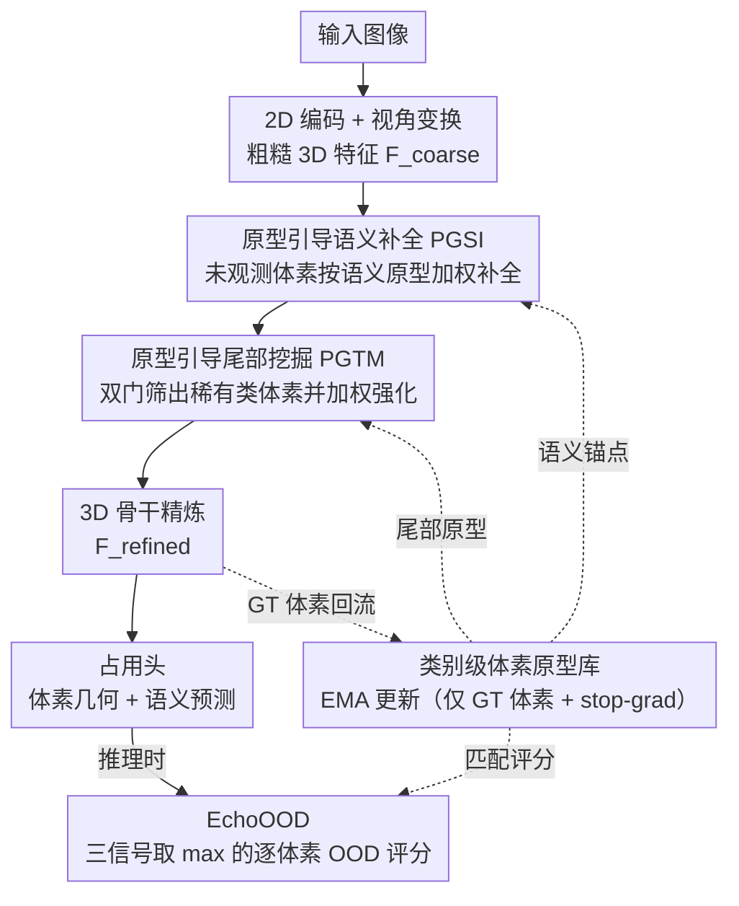

# ProOOD: Prototype-Guided Out-of-Distribution 3D Occupancy Prediction

**会议**: CVPR 2026  
**arXiv**: [2604.01081](https://arxiv.org/abs/2604.01081)  
**代码**: [https://github.com/7uHeng/ProOOD](https://github.com/7uHeng/ProOOD)  
**领域**: 自动驾驶 / 3D视觉  
**关键词**: 3D占用预测, 分布外检测, 原型学习, 长尾分布, 语义补全

## 一句话总结

本文提出ProOOD框架，首次从体素原型引导的视角统一处理3D占用预测中的长尾识别与分布外（OOD）检测，通过原型引导的语义补全（PGSI）、尾部类增强（PGTM）和无训练的EchoOOD评分机制，在SemanticKITTI上提升+3.57% mIoU（尾部类+24.80%），在VAA-KITTI上OOD检测AuPRCr提升+19.34。

## 研究背景与动机

1. **领域现状**：3D语义占用预测是自动驾驶的核心感知任务，旨在为每个体素生成几何+语义标签。近年来基于相机的方法（VoxFormer、CGFormer、SGN等）在分布内数据上取得了良好进展。
2. **现有痛点**：自动驾驶环境中不可避免地存在未知物体（施工路障、动物、极端天气等），现有模型对OOD输入往往过度自信，将异常目标强行分类到已知类别（尤其是稀有类别）。例如，一件衣服可能被误识别为骑行者。
3. **核心矛盾**：OOD检测与长尾学习内在耦合——在SemanticKITTI中，稀有类别仅占不到2%的样本，导致模型对稀有类别模糊且校准不良。现有OOD评分方法（maximum softmax、entropy、energy）专为逐类分类设计，在体素级预测中表现受限，缺乏捕获3D空间结构和语义上下文的机制。
4. **本文目标** 将长尾学习与OOD检测统一处理：更好的尾部类识别→减少预测过度自信→提升OOD敏感度。
5. **切入角度**：利用类别原型作为统一的语义锚点——既用于语义补全和尾部增强（训练时），又用于OOD评分（推理时），且作为即插即用模块不修改骨干网络。
6. **核心 idea**：通过类别级体素原型同时引导语义补全、强化尾部类表征和量化体素级不确定性，在不修改骨干的前提下统一提升占用预测和OOD检测。

## 方法详解

### 整体框架

ProOOD想回答一个问题：能不能用一套东西同时把"稀有类认得更准"和"未知物体检得出来"两件事一起做了？它的答案是**类别级体素原型**——为每个语义类别在特征空间维护一个 EMA 平滑的全局锚点，让这套锚点贯穿训练和推理。

整体上它不动骨干，作为即插即用模块挂在现有体素占用框架（如 SGN、VoxDet）上。一张图先经 2D 编码和视角变换，得到粗糙 3D 特征 $F_{coarse}^{3D}$；接着原型先后做两件事——PGSI 拿原型把被遮挡的体素按语义补全，PGTM 拿原型把疑似稀有类的体素挑出来增强；增强后的特征再过 3D 骨干精炼成 $F_{refined}^{3D}$，最后占用头出预测，推理时 EchoOOD 用同一套原型给每个体素打 OOD 分。原型本身在训练中只用 ground-truth 体素持续 EMA 更新，形成"补全更准→原型更准→补全更准"的正反馈。

### 关键设计

**1. 原型引导语义补全（PGSI）：用语义锚点而非几何相邻填补遮挡**

传统补全靠局部几何一致性把遮挡区域填满，但几何连续不等于语义合理——一块空白按邻域填成路面，实际可能是建筑墙体。PGSI 换了个依据：先用辅助占用头标出未观测体素集合 $\mathcal{U}$，再对其中每个体素计算它与所有成熟全局原型的注意力权重 $a_{ik} = \text{softmax}(-\|\mathbf{x}_i^{coarse} - \mathbf{p}_k^g\|^2 / \tau_{att})$，最后以原型加权和做残差更新 $\tilde{\mathbf{x}}_i = \mathbf{x}_i + \alpha_{pgsi} \sum_k a_{ik} \mathbf{p}_k^g$。等于让每个空洞去问"我最像哪个类别的原型"，再朝那个语义方向补。因为补出来的特征本身又会回流去更新原型，所以补得越准、原型越干净、下一轮语义推理越稳，整条链路自增强。

**2. 原型引导尾部挖掘（PGTM）：主动把稀有类体素挑出来加权**

长尾分布下模型有个坏习惯——遇到模糊区域就往占主导的大类上"强分类"，bicycle、motorcycle 这种只占 0.03% 体素的极稀有类很容易被吞掉。PGTM 在 PGSI 更新后的特征上反向操作：先算每个体素与全局原型的余弦相似度 $s_{ik}$，再用两道门把尾部候选筛出来——一是与某个尾部类原型的相似度要超过阈值 $\eta$，二是 top-1 与 top-2 相似度的 margin 要超过 $\delta$（避免把模棱两可的体素也算进来）。筛中的候选体素再用尾部类原型的加权和经一个轻量 MLP 加强：$\tilde{\mathbf{x}}_i \leftarrow \tilde{\mathbf{x}}_i + \psi(\sum_{k \in \mathcal{C}_{tail}} w_{ik} \mathbf{p}_k^g)$，并额外挂一个尾部分类头 $\phi$ 在精炼特征上用 CE 监督。它和 PGSI 共用同一套原型，区别只是补全针对"空"、挖掘针对"弱"。

**3. EchoOOD：无训练、三信号取最大的逐体素 OOD 评分**

补全和增强都是训练时的事，推理时怎么判断一个体素是不是未知物体？EchoOOD 不引入任何新参数，直接复用已有的 logit 和原型，融合三个互补信号：局部 logit 一致性 $s_i^{local-logit} = 1 - \cos(\mathbf{l}_i, \boldsymbol{\mu}_{\hat{y}_i})$ 看体素 logit 与同类平均 logit 偏不偏（捕分布偏移）；局部原型匹配 $s_i^{local-proto} = 1 - \cos(\mathbf{x}_i, \mathbf{p}_{\hat{y}_i}^\ell)$ 看它与当前场景内同类局部原型像不像（捕场景内异常）；全局原型匹配 $s_i^{global-proto} = 1 - \cos(\mathbf{x}_i, \mathbf{p}_{\hat{y}_i}^g)$ 看它与跨场景 EMA 全局原型像不像（捕跨场景异常）。三者归一化后取最大值：

$$s_i^{fused} = \max(s_i^{local-logit},\ s_i^{global-proto},\ s_i^{local-proto})$$

取 max 而非平均，是因为不同类型的 OOD 往往只在某一路信号上露馅——只要任意一路报警就该标为异常，平均反而会被另外两路正常信号稀释掉。

### 损失函数 / 训练策略

原型用 EMA 更新（动量 $\beta$），且只用 ground-truth 体素更新、配 stop-gradient 防止梯度回传污染特征。为了不让没学好的原型干扰下游，原型要同时过三道成熟门控才"上岗"：训练步数 $t \geq t_{warm}$（预热）、质量分数 $q_k > \theta_{max}$、累计计数 $|\Omega_k| \geq n_{min}$。训练目标在原始占用损失之外加两项——尾部分类损失 $\mathcal{L}_{tail}$ 监督 PGTM 的尾部头，原型对比损失（PBCL）$\mathcal{L}_{proto}$ 在精炼特征上促进类内紧凑、类间分离，让原型本身更可分。

## 实验关键数据

### 主实验（SemanticKITTI测试集，单帧）

| 方法 | IoU | mIoU | 尾部mIoU |
|------|-----|------|---------|
| CGFormer | 44.41 | 16.63 | 5.36 |
| SGN (baseline) | 41.88 | 14.01 | 3.48 |
| **ProOOD (+SGN)** | 43.14 | 14.51 | **4.35** (+25.0%) |
| VoxDet (baseline) | 46.69 | 17.77 | 6.17 |
| **ProOOD (+VoxDet)** | **46.75** | **18.12** (+3.57%) | **6.34** (+24.80%) |

### 消融实验（OOD检测，VAA-KITTI）

| 方法 | AuPRCr@0.8m | AuPRCr@1.0m | AuPRCr@1.2m | AuROC |
|------|-------------|-------------|-------------|-------|
| OccOoD (baseline) | 10.80 | 16.05 | 23.42 | 61.96 |
| ProOOD (+VoxDet) EchoOOD | 21.95 | 36.97 | 56.49 | 60.99 |
| ProOOD (+SGN) EchoOOD | **27.86** | **43.55** | **62.65** | **64.31** |

### 关键发现

- **尾部类提升极为显著**：ProOOD在SGN上将尾部类mIoU从3.48提升至4.35（+25.0%），在VoxDet上从6.17提升至6.34（+2.8%），表明原型引导确实有效增强了如bicycle、motorcycle等极稀有类（仅占0.03%体素）的表征。
- **OOD检测大幅提升**：在VAA-KITTI上AuPRCr@1.2m从23.42提升至62.65（+39.23点），说明长尾类的增强直接有助于OOD检测——更好的尾部校准减少了将OOD错误归为稀有类的倾向。
- **即插即用有效性**：ProOOD可无缝集成到SGN和VoxDet两种不同骨干上并持续带来提升，验证了其通用性。
- **三路OOD评分互补**：EchoOOD的三个信号（local logit、local proto、global proto）各自捕获不同类型异常，最大值聚合比单一评分更鲁棒。

## 亮点与洞察

- **长尾与OOD的统一视角**：本文最核心的贡献是揭示了3D占用预测中长尾学习与OOD检测的内在联系——长尾校准不良导致OOD误判，二者必须联合处理。原型学习巧妙地作为两个任务之间的"桥梁"。
- **原型的多重复用**：同一套类别原型被PGSI（语义补全）、PGTM（尾部增强）、PBCL（对比学习）和EchoOOD（OOD检测）四个模块共享使用，设计极为紧凑高效。
- **无训练OOD检测**：EchoOOD完全无需额外参数或训练，直接利用已有的原型和logit，是真正的零额外开销OOD检测方案。

## 局限与展望

- 尾部类的定义（$\mathcal{C}_{tail}$）需要预先指定，无法自动适应不同数据集的类别分布
- EMA原型的预热期和成熟门控阈值需要调参，对新类别的初始表示可能不稳定
- 实验主要在基于相机的方法上验证，对LiDAR-based或多模态融合方法的适用性未充分讨论
- OOD检测部分缺少与一些新兴方法（如VOS、NPOS等）的对比
- 在非城市场景（如越野、停车场等长尾严重的场景）的效果未验证

## 相关工作与启发

- **vs OccOoD**：OccOoD首创了3D占用OOD基准但缺乏特征级检测和长尾处理。ProOOD通过原型学习同时解决了这两个不足。
- **vs OCCUQ**：OCCUQ主要针对传感器故障类OOD（如损坏、噪声），而ProOOD关注语义级别的OOD（未知物体），两者互补。
- **vs SHTOcc/CGFormer**：这些最新骨干在分布内性能出色，但ProOOD的即插即用设计可直接增强它们的OOD鲁棒性。

## 评分

- 新颖性: ⭐⭐⭐⭐ 首次统一长尾学习和OOD检测做3D占用预测，原型多重复用设计紧凑
- 实验充分度: ⭐⭐⭐⭐ 5个数据集、多个骨干验证，但消融实验可更细致
- 写作质量: ⭐⭐⭐⭐ 框架图清晰，公式详实，但部分细节（如成熟门控参数选择）可更充分
- 价值: ⭐⭐⭐⭐⭐ 解决了自动驾驶中的关键安全问题，即插即用设计实用性强

<!-- RELATED:START -->

## 相关论文

- [\[CVPR 2026\] Learning to Identify Out-of-Distribution Objects for 3D LiDAR Anomaly Segmentation](learning_to_identify_out-of-distribution_objects_for_3d_lidar_anomaly_segmentati.md)
- [\[CVPR 2026\] Neural Distribution Prior for LiDAR Out-of-Distribution Detection](neural_distribution_prior_for_lidar_ood_detection.md)
- [\[CVPR 2026\] OccAny: Generalized Unconstrained Urban 3D Occupancy](occany_generalized_unconstrained_urban_3d_occupancy.md)
- [\[CVPR 2026\] Dr.Occ: Depth- and Region-Guided 3D Occupancy from Surround-View Cameras for Autonomous Driving](drocc_depth_region_guided_3d_occupancy.md)
- [\[CVPR 2025\] SDGOcc: Semantic and Depth-Guided BEV Transformation for 3D Multimodal Occupancy Prediction](../../CVPR2025/autonomous_driving/sdgocc_semantic_and_depth-guided_birds-eye_view_transformation_for_3d_multimodal.md)

<!-- RELATED:END -->
