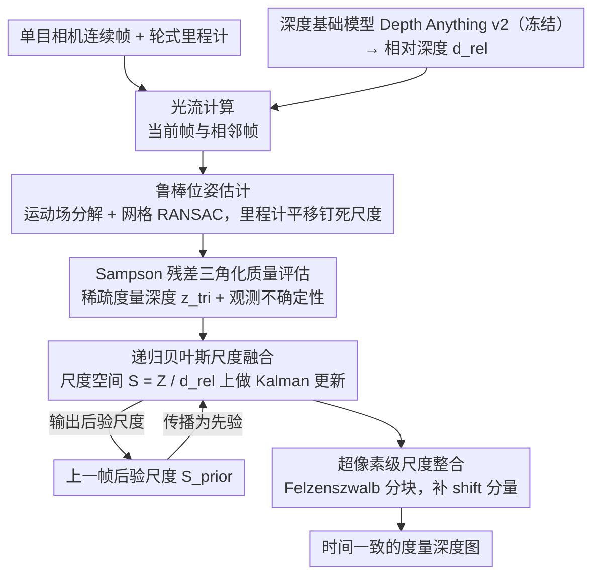

# PTC-Depth: Pose-Refined Monocular Depth Estimation with Temporal Consistency

**会议**: CVPR 2026  
**arXiv**: [2604.01791](https://arxiv.org/abs/2604.01791)  
**代码**: [https://ptc-depth.github.io](https://ptc-depth.github.io)  
**领域**: 自动驾驶 / 深度估计  
**关键词**: 单目深度估计, 时间一致性, 贝叶斯尺度融合, 光流三角化, 轮式里程计

## 一句话总结

本文提出PTC-Depth，一个结合光流三角化和轮式里程计的单目深度估计框架，通过递归贝叶斯更新追踪深度基础模型的度量尺度，实现时间一致的度量深度预测，在KITTI、TartanAir和热红外等多个数据集上展现强泛化能力。

## 研究背景与动机

1. **领域现状**：单目深度估计（MDE）已广泛应用于自动驾驶和移动机器人，深度基础模型（如Depth Anything v2）在零样本泛化上取得了巨大进展，但大多只能预测相对深度（缺乏绝对度量尺度）。

2. **现有痛点**：(a) 单帧深度估计在连续帧间存在严重的时间不一致性（抖动和突变）；(b) 视频深度模型（如VDA）改善了一致性但仍不提供度量深度；(c) 深度补全方法（如OGNI-DC）需要额外的LiDAR深度，不适用于仅有相机+里程计的场景。

3. **核心矛盾**：相对深度模型有好的结构保留和泛化能力，但缺乏度量尺度；度量深度模型有绝对尺度但泛化差（如UniDepth在out-of-distribution场景下大幅退化）。两者的优势难以简单结合。

4. **本文目标** 仅使用单目相机和轮式里程计（无需LiDAR/深度传感器），将深度基础模型的相对深度转换为时间一致的度量深度。

5. **切入角度**：观察到轮式里程计提供的度量基线和光流共同约束了深度的度量尺度，利用连续帧间的三角化获取稀疏度量深度，再通过递归贝叶斯框架跟踪全局/局部尺度因子。

6. **核心 idea**：将相对深度到度量深度的转换建模为尺度场$S$的贝叶斯递归估计问题，用超像素分割实现局部尺度适配。

## 方法详解

### 整体框架

这篇论文要解决的事很具体：深度基础模型（如 Depth Anything v2）能预测漂亮的相对深度，但没有绝对尺度，且逐帧跑会抖；本文想在只有单目相机和轮式里程计的条件下，把这种相对深度变成时间一致的**度量**深度。整体思路是把"恢复尺度"这件事拆给几何来做——里程计提供已知长度的度量基线，光流提供帧间对应，二者一三角化就能得到稀疏的度量深度，再用一个贝叶斯滤波把这些稀疏观测和上一帧的先验融合起来。

具体到一帧的处理流程：先算当前帧与相邻帧的光流；用光流和相对深度通过 RANSAC 估计相机相对位姿，再用里程计的平移长度把位姿的尺度钉死；拿位姿和光流做三角化得到稀疏度量深度；最后在尺度空间里做逐像素的递归贝叶斯更新，融合本帧三角化观测与上一帧传播来的先验，输出度量深度图。整套流程没有任何可学习参数，基础模型全程冻结。

### 关键设计

**1. 基于运动场的鲁棒位姿估计：在动态场景里把相机自身运动从光流里干净地剥出来**

位姿估计是整条链路的起点，难点在于光流里混着动态物体——它们的运动和相机无关，直接拿来解位姿会被带偏。本文借用 Longuet-Higgins 运动场公式把光流分解成旋转项 $\mathbf{B}\boldsymbol{\Omega}$ 和平移项 $\frac{1}{\alpha d^{rel}}\mathbf{A}\boldsymbol{T}$，其中相对深度 $d^{rel}$ 先假设由单一尺度因子 $\alpha$ 线性转成度量深度，于是恢复旋转 $\boldsymbol{\Omega}$ 和平移方向 $\hat{\boldsymbol{T}}$ 就变成一个超定线性系统。为了抗动态外点，RANSAC 采样时不是全图随机，而是把图像划成网格、每格等量采样，保证假设覆盖整个视场而不偏向某个区域；最后再用 IRLS 加 Huber 权重精炼。分区采样这一点很关键——动态物体往往聚在画面某处，均匀采样容易让 RANSAC 的内点集被局部主导，网格化采样把这种偏差摊平。

**2. 基于 Sampson 残差的三角化质量评估：用对极几何本身当置信度，不必另训一个网络**

三角化出来的稀疏深度并不可靠——光流误差、残留的动态物体、位姿不准都会让某些点的三角化结果失真，需要逐像素地知道哪些点能信。本文对每个光流对应点三角化得到度量深度 $z^{tri}$ 的同时，计算它的 Sampson 残差 $\rho$，也就是这对匹配满足对极约束的程度：残差小说明匹配干净、三角化准，残差大就该降权。这个分数不是拿去做硬阈值筛选，而是直接喂进后面贝叶斯融合的观测不确定性 $V^{obs} = \sigma^2 \frac{\rho}{f_x f_y}$。好处是省掉了专门训练一个置信度网络，几何约束的满足度天然就是逐像素可靠性，既轻量又和无训练框架的整体定位一致。

**3. 递归贝叶斯尺度融合：在尺度空间而非深度空间做滤波，保住基础模型的结构**

这是全文核心。最直白的做法是在深度空间直接把三角化深度和先验深度加权平均，但那样会把基础模型预测的清晰边界平滑掉、糊成一团。本文换了个空间：不融合深度 $Z$，而是融合潜在尺度场 $S$，约定 $Z = S \cdot d^{rel}$。先验尺度由上一帧传播 $S^{prior} = Z^{prior}/d^{rel}$，观测尺度由本帧三角化给出 $S^{obs} = Z^{tri}/d^{rel}$，然后逐像素做 Kalman 更新。更新里还有两道保险：先用归一化创新量 $\gamma$ 做卡方检验，把和先验明显冲突的观测当异常值剔除；再用一个受一致性约束的 Kalman 增益 $\kappa$ 控制更新幅度，避免先验和观测只是弱一致时就被观测大幅拉走。此外当整帧几何质量都差（中位 Sampson 残差大）时，会自适应地膨胀先验方差，让滤波在这帧更愿意相信新观测。在尺度空间操作的根本好处，是 $d^{rel}$ 的相对结构原封不动地被保留，融合只动那个缓慢变化的尺度场，因此输出既有度量尺度又没破坏边界。

**4. 超像素级别尺度整合：补上单一全局尺度补不掉的 shift 分量**

很多基础模型是仿射不变的，预测里除了一个全局缩放还藏着一个 shift，单一全局尺度因子没法把它完全抵消，会让远近不同的区域系统性地偏。本文用 Felzenszwalb 分割把图像切成超像素，分割边界跟着 $d^{rel}$ 的几何走，于是每个超像素 $\Lambda_\ell$ 内部深度大致同质。在每块内取后验尺度的中位数 $\bar{s}_\ell$ 作为该区域统一尺度，拟合误差低的块就用这个局部尺度，误差高的块退回全局尺度兜底，最终度量深度 $Z^{post} = S^{seg} \cdot d^{rel}$。让尺度随区域走，相当于用分块常数去逼近真实的 shift 补偿，比全局一个数能更好地贴合场景里深浅不一的区域。

### 损失函数 / 训练策略

本方法是**无需训练**的推理框架，不涉及神经网络训练或微调。深度基础模型（Depth Anything v2）以冻结方式使用，所有计算都是解析的（光流、RANSAC、贝叶斯更新）。

## 实验关键数据

### 主实验

全范围（0-80m）深度估计：

| 数据集 | 方法 | AbsRel ↓ | δ<1.25 ↑ | TAE ↓ |
|--------|------|----------|----------|-------|
| KITTI | UniDepth | **0.047** | **0.977** | 4.34 |
| KITTI | **Ours** | 0.137 | 0.877 | 5.35 |
| TartanAir | **Ours** | **0.427** | **0.688** | 5.42 |
| TartanAir | UniDepth | 0.503 | 0.176 | 11.11 |
| Roadside | **Ours** | **0.309** | **0.725** | 5.27 |
| Roadside | UniDepth | 0.465 | 0.201 | 11.92 |
| MS2 (热红外) | **Ours** | 0.247 | 0.700 | 5.29 |
| MS2 (热红外) | DA v2 metric | 0.405 | 0.187 | 4.87 |

近距离（0-20m）深度估计：

| 数据集 | 方法 | AbsRel ↓ | δ<1.25 ↑ |
|--------|------|----------|----------|
| TartanAir | **Ours** | **0.339** | **0.712** |
| TartanAir | UniDepth | 0.485 | 0.202 |
| Roadside | **Ours** | **0.165** | **0.860** |
| Roadside | UniDepth | 0.432 | 0.241 |

### 消融实验（三角化位姿来源对比）

| 方法 | 位姿来源 | KITTI AbsRel | TartanAir AbsRel | Roadside δ1 |
|------|----------|-------------|-------------------|-------------|
| MADPose | UniDepth度量深度 | 0.115 | 0.481 | 0.222 |
| **Ours** | 里程计+光流 | **0.115** | **0.239** | **0.649** |
| GT Pose | 真实位姿 | 0.130 | 0.168 | - |

### 关键发现

- 在KITTI（in-distribution）上UniDepth最强，但在所有out-of-distribution数据集上本文方法显著占优（TartanAir AbsRel 0.427 vs 0.503，Roadside 0.309 vs 0.465）
- MADPose依赖UniDepth的泛化能力，在OOD数据集上三角化精度大幅下降（TartanAir AbsRel 0.481），而本方法仅依赖里程计恢复尺度，保持一致的高精度
- 近距离（0-20m）三角化效果最好，因为基线足够大形成良好的三角化几何；远距离（20-80m）视差减小导致三角化退化，这是所有基于几何的方法的固有局限
- VDA达到了好的时间一致性（低TAE），但其度量精度在OOD场景大幅退化（Roadside AbsRel 2.198），说明一致地错也能有低TAE

## 亮点与洞察

- **无需训练的通用框架**：不依赖特定数据集训练，仅需一个冻结的相对深度模型+轮式里程计，即可在RGB和热红外上工作。这种即插即用的设计非常适合机器人部署场景
- **尺度空间融合而非深度空间**：在$S = Z/d^{rel}$空间做贝叶斯融合，保留了基础模型预测的边界清晰度和空间结构，这个insight可迁移到所有需要将相对预测转换为绝对预测的问题
- **Sampson残差作为逐像素可靠性度量**：不需要训练一个专门的置信度网络，直接用几何约束的满足程度作为权重，既优雅又高效

## 局限与展望

- 远距离（>20m）的三角化精度受限于短基线的视差消失问题，这是几何方法的固有限制
- 对轮式里程计精度有一定依赖——在不平坦地形或轮胎打滑时里程计误差会传播到尺度估计
- MS2数据集上的性能受限于热红外图像的光流质量和里程计同步精度
- 超像素分割的参数（Felzenszwalb的阈值）对不同场景可能需要调整
- 仅处理了仿射不变模型的尺度分量，对shift分量的局部补偿依赖超像素大小

## 相关工作与启发

- **vs UniDepth**: UniDepth在训练域内（KITTI）最强，但泛化差。本文方法利用几何约束避免了对特定度量深度训练的依赖，泛化性更好
- **vs VDA (Video Depth Anything)**: VDA是视频深度模型，时间一致性好但无度量尺度且OOD退化严重（Roadside AbsRel 2.198）。本方法在提供度量深度的同时保持合理的时间一致性
- **vs MADPose**: MADPose用UniDepth做度量位姿估计，本质上继承了UniDepth的泛化瓶颈。本文仅用里程计恢复尺度，彻底解耦了对度量深度模型的依赖

## 评分

- 新颖性: ⭐⭐⭐ 贝叶斯尺度融合框架是已知技术的精心组合，核心idea（用里程计约束尺度+Kalman融合）不算全新，但超像素局部尺度和Sampson残差加权是nice的设计
- 实验充分度: ⭐⭐⭐⭐ 覆盖RGB+热红外、真实+合成、多个OOD场景，三角化和深度估计分别评估，近/远距离分析深入
- 写作质量: ⭐⭐⭐⭐ 数学推导清晰完整，框架图直观，实验分析有层次
- 价值: ⭐⭐⭐⭐ 对机器人和自动驾驶的实际部署价值高——无需训练、无需额外深度传感器、跨模态工作

<!-- RELATED:START -->

## 相关论文

- [\[CVPR 2026\] LA-Pose: Latent Action Pretraining Meets Pose Estimation](la-pose_latent_action_pretraining_meets_pose_estimation.md)
- [\[CVPR 2025\] Prompting Depth Anything for 4K Resolution Accurate Metric Depth Estimation](../../CVPR2025/autonomous_driving/prompting_depth_anything_for_4k_resolution_accurate_metric_depth_estimation.md)
- [\[CVPR 2025\] Distilling Monocular Foundation Model for Fine-grained Depth Completion](../../CVPR2025/autonomous_driving/distilling_monocular_foundation_model_for_fine-grained_depth_completion.md)
- [\[CVPR 2026\] ELiC: Efficient LiDAR Geometry Compression via Cross-Bit-depth Feature Propagation and Bag-of-Encoders](elic_efficient_lidar_geometry_compression_via_cross-bit-depth_feature_propagatio.md)
- [\[CVPR 2026\] EMDUL: Expanding mmWave Datasets for Human Pose Estimation with Unlabeled Data and LiDAR Datasets](expanding_mmwave_datasets_for_human_pose_estimation_with_unlabeled_data_and_lida.md)

<!-- RELATED:END -->
