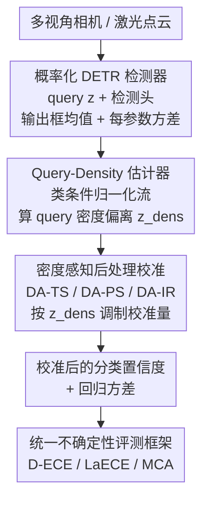

# Query2Uncertainty: Robust Uncertainty Quantification and Calibration for 3D Object Detection under Distribution Shift

**会议**: CVPR 2026  
**arXiv**: [2605.05328](https://arxiv.org/abs/2605.05328)  
**代码**: https://tillbeemelmanns.github.io/query2uncertainty/ (有)  
**领域**: 3D视觉 / 自动驾驶 / 不确定性估计  
**关键词**: 3D目标检测, 后处理校准, 分布偏移, 特征密度, 归一化流

## 一句话总结
针对 DETR 式 3D 检测器在雨雪等分布偏移下「过度自信、校准失效」的问题，本文用归一化流估计 object query 的特征密度，并把这个密度信号注入温度缩放 / Platt / Isotonic 等后处理校准器，让校准强度随「query 离训练分布多远」自适应调整，从而同时校准分类置信度与 3D 框回归方差，在 nuScenes（同分布）和 MultiCorrupt（分布偏移）上都优于标准后处理方法。

## 研究背景与动机

**领域现状**：自动驾驶感知栈把激光/多视角相机检测到的物体输出成带语义类别、中心、尺寸、朝向的 3D 框，并交给跟踪、碰撞规避、V2X 融合等下游模块。下游要把这些预测当作概率信号去融合，就要求检测器不仅给出框，还要给出「可信的不确定性」——即置信度真能反映检测对不对、方差真能反映框定位有多准。

**现有痛点**：现代深度检测器普遍**过度自信**（overconfident），置信度和真实精度严重错位。修这个问题最常用的是**后处理校准**（post-hoc calibration，如温度缩放 TS、Platt Scaling、Isotonic Regression）——训练后不动模型、只用一个标定集重新映射输出，便宜有效。但这些方法有个致命假设：测试数据和标定数据同分布。一旦遇到雨、雪、传感器退化这类**分布偏移（distribution shift）**，标定好的校准器会对所有输入「一视同仁地」套用同一个修正，结果直接崩回未校准水平。

**核心矛盾**：后处理校准器是「全局静态」的，它学的是同分布下的统计修正；而分布偏移恰恰意味着不同样本偏离训练分布的程度不同，需要的修正量也不同。静态修正 ↔ 样本级偏移自适应之间存在根本冲突。此前在图像分类里，已有工作用「特征密度」让校准变得对 OOD 敏感，但**还没有人把这套密度感知思路搬到概率化 3D 框检测、并同时校准分类和回归两路不确定性**。

**本文目标**：拆成三个子问题——(1) 缺一个能统一评测 3D 检测分类/回归不确定性质量的 benchmark；(2) 要找到一个能刻画「当前样本离训练分布多远」的紧凑特征；(3) 把这个偏移信号注入现有校准器，让它在同分布和分布偏移下都稳。

**切入角度**：作者观察到 DETR 式检测器的 **object query** 天然就是理想的密度估计载体——每个 query 是位置感知、类别感知的紧凑潜在向量（D=256），直接驱动了分类、定位、尺寸、朝向的预测。在 query 特征空间上估计密度，就能知道「这个检测假设有多像训练集里的真阳性」。

**核心 idea**：用归一化流在**真阳性 query 特征**上拟合类条件密度，把测试时 query 的密度偏离量 `z_dens` 作为一个调制信号，注入 TS/PS/IR 这些后处理校准器，让校准量「按需」随密度自适应——高密度（熟悉）区域保持锐利自信，低密度（偏移）区域自动变保守。

## 方法详解

### 整体框架
Query2Uncertainty 不改检测器主干，而是在标准 DETR 式 3D 检测器之上挂一个「密度感知校准」附件。整体分三块串起来：**概率化检测器**先从多视角相机（PETR 编码器）或激光点云（SECOND 编码器）抽特征当 token，喂进 decoder-only transformer 与一组可学习 object query 交互，最后一层 decoder 输出精炼后的 query `z`，由检测头预测类别分数、框均值参数和**每个参数的方差**（一个 16 维带不确定性的框 `b`）。与此并行，**Query-Density 估计器**事先在训练集上对每类真阳性 query 拟合了一个归一化流；测试时它对当前 query `z` 算出一个归一化密度，度量这个 query 离训练分布有多远。最后，**密度感知后处理校准模块**把这个密度信号同时注入分类置信度和回归方差的校准，输出校准后的不确定性。

为了能衡量「不确定性质量」，作者还额外搭了一套基于 nuScenes 的**统一评测框架**，分别给分类和回归定义了校准误差指标——这是方法落地的前提，所以下面把它当作第一个关键设计来讲。

### 关键设计

**1. 统一不确定性评测框架：先给 3D 检测的「不确定性好不好」立标尺**

3D 检测领域此前没有统一 benchmark 来评不确定性质量，作者在 nuScenes 检测基准上补了一套，分类和回归各一组指标。分类侧用 **D-ECE**（Detection Expected Calibration Error）和 **LaECE**（Location-Aware ECE）。D-ECE 把预测置信度离散成 $B=25$ 个 bin，每个 bin 算平均置信度 $\bar{s}_b$ 与精度 $\bar{\pi}_b=|T_b|/|D_b|$（$T_b$ 是按 nuScenes 欧氏中心距匹配规则判出的真阳性），加权求差 $\text{D-ECE}=\sum_b w_b|\bar{s}_b-\bar{\pi}_b|$。LaECE 在此基础上把「定位质量」也塞进来：匹配检测贡献 $lq_j=1-\min(d_j,\tau)/\tau$（$d_j$ 是中心距、$\tau=2\text{m}$ 是匹配阈值），假阳性 $lq_j=0$，于是置信度高但定位差的预测会被惩罚。回归侧用 **MCA**（Miscalibration Area）——对标准化残差 $r_i=(y_{i,\text{gt}}-\mu_i)/\sigma_i$，比较名义覆盖率 $p$ 与经验覆盖率 $\hat{c}(p)$，取两者差的积分 $\text{MCA}=\int_0^1|\hat{c}(p)-p|\,dp$，分别对中心 $\text{MCA}_{xyz}$ 和尺寸 $\text{MCA}_{lwh}$ 报告。由于 nuScenes 类别极度不平衡，所有指标都按**类别平均**，避免被高频类淹没。这套指标是后面所有对比的裁判，缺了它就没法量化「密度感知到底有没有让不确定性更可信」。

**2. 概率化 DETR 检测器 + KL 散度回归不确定性头：让每个框参数都带方差**

要校准回归不确定性，前提是检测器得先**输出**方差。作者把框参数化成 16 维 $b=(\hat{x},\hat{y},\hat{z},\hat{\ell},\hat{w},\hat{h},\hat{\theta},\hat{v}_x,\hat{v}_y,\sigma^2_x,\dots,\sigma^2_h,\kappa_\theta)$，用一个独立 MLP 头预测各参数的（对数）方差，并用**异方差 KL 散度损失**监督：对中心 $(x,y,z)$ 假设独立高斯，最小化预测高斯 $\mathcal{N}(\mu,\sigma^2)$ 与真值 Dirac 分布的 KL，得到

$$L_{xyz}=\frac{1}{2}\sum_{i\in\{x,y,z\}}\left[(\hat{x}_i-x_{0,i})^2 e^{-u_i}+u_i\right]$$

其中 $u_i=\log\sigma_i^2$。尺寸 $(\ell,w,h)$ 在对数空间预测、做指数后再算残差；朝向角用 von-Mises 分布建模，浓度 $\kappa=e^{-u_\theta}=1/\sigma_\theta^2$，损失含修正贝塞尔函数 $I_0$，并加一个 $\beta_V\,\text{ELU}(u_\theta-s_0)$ 项稳住小浓度时的梯度。这一步本质是给检测器装上「会说自己有多不确定」的嘴，但它给出的方差是未校准的，需要后续模块修正。

**3. Query-Density 估计器：用归一化流把「离训练分布多远」量化成一个标量**

这是方法的灵魂。训练阶段，作者在训练集上跑一遍前向，缓存**最后一层 decoder 中匹配到真阳性的 query 向量**（D=256），按语义类 $c$ 聚合、统计样本数 $N_c$ 并算经验先验 $\hat{\omega}_c=N_c/\sum_k N_k$，然后对**每个类**拟合一个 **RealNVP 归一化流**（32 个 affine coupling 块 + swap 置换，scale/shift 由两层 MLP 预测、输出零初始化），目标是最小化经验特征分布与流估计之间的前向 KL，即平均负对数似然 $L_{\text{flow}}=-\frac1M\sum_i\log q(z_i)$。训练 60 epoch 后，存下流参数、对数先验 $\log\hat{\omega}_c$ 以及对数密度的 $Q_{0.001}/Q_{0.999}$ 分位数。

推理时，给定 query $z$ 算各类条件对数密度 $\log q_c(z)$，按先验加权聚合成边际密度 $\log q(z)=\log\sum_c\exp(\log q_c(z)+\log\hat{\omega}_c)$（先验加权确保稀有类密度不被惩罚），再用缓存分位数归一化到 $[0,1]$：$\log q(z)'=\text{clip}\big((\log q(z)-Q_{0.001})/(Q_{0.999}-Q_{0.001})\big)$。这个归一化密度对同分布 query 接近 1、随 query 漂离特征流形而趋于 0——它就是「这个检测假设有多像训练集真阳性」的紧凑度量。选 query 特征而非原始输入，是因为 query 已经是位置/类别感知的低维潜变量，特别适合密度估计。

**4. 密度感知后处理校准：把密度偏离 z_dens 注入 TS/PS/IR，让校准量按需自适应**

有了密度，先把它转成相对标定集的**标准化偏离** $z_{\text{dens}}(z)=(\log q(z)'-\hat{\mu})/\hat{\sigma}$（$\hat\mu,\hat\sigma$ 是标定集归一化对数密度的均值方差）。然后把 $z_{\text{dens}}$ 注入三种校准器，得到密度感知版本：

- **DA-TS**（密度感知温度缩放）：温度随实例变化 $T(z)=T\cdot\Phi_\gamma(s_T z_{\text{dens}}(z))$，其中增益 $\Phi_\gamma(x)=1+\gamma\tanh(x)$ 把信号有界地映射到 $[1-\gamma,1+\gamma]$，避免强偏移下密度异常值导致温度爆炸；校准 logit 为 $\ell'=\ell/T(z)$。
- **DA-PS**（密度感知 Platt）：对 scale 和 shift 都注入 $\ell'(z)=\ell\cdot\Phi_\gamma(s_{\text{scale}}z_{\text{dens}})+b\cdot\Phi_\gamma(s_{\text{shift}}z_{\text{dens}})$。
- **DA-IR**（密度感知 Isotonic）：因为 IR 是非参的分段常数映射，直接改映射参数会不稳定，所以构造新特征 $u(z)=w_s\,p(z)+w_d\,z_{\text{dens}}(z)+b$（$p$ 是 sigmoid 置信度），再在 $u$ 上拟合 isotonic 回归。

回归侧则对每个预测方差先做仿射修正 $\hat\sigma^2=s\sigma^2+b$，再用密度做有界缩放 $\sigma'^2(z)=\hat\sigma^2\cdot\Phi_{\gamma_\sigma}(s_\sigma z_{\text{dens}}(z))$。所有系数通过在标定集上最小化 NLL（分类）或 MCA（回归）联合优化。直觉上：高密度区维持锐利自信，密度变稀时自动放大不确定性、变保守——这正是分布偏移下静态校准器缺的那块自适应能力。

### 损失函数 / 训练策略
检测器用上面的 KL 散度异方差损失训练框参数与方差；归一化流用负对数似然单独训练 60 epoch（Adam + 线性学习率衰减）。校准阶段冻结检测器，把 nuScenes 验证集按顺序切成标定集（40%）和测试集（60%），用**差分进化（Differential Evolution，20000 次迭代）**而非梯度优化来调校准参数（作者称更确定、更准）。两个检测器各用 900 个 query 训练 32 epoch。评测时不固定单一置信度阈值，而是在 $[0.05,0.60]$ 步长 0.05 扫一遍取均值，避免稀有类被高阈值漏掉。

## 实验关键数据

数据集：nuScenes（同分布 ID）+ MultiCorrupt（10 种相机/激光退化 ×3 严重度，分布偏移）。检测器：PETR（多视角相机）+ SECOND（激光）。所有指标越低越好（%）。

### 主实验

**同分布 — 分类校准（节选，PETR / SECOND）**

| 方法 | PETR D-ECE↓ | PETR LaECE↓ | SECOND D-ECE↓ | SECOND LaECE↓ |
|------|------|------|------|------|
| Uncal. | 8.556 | 27.211 | 15.509 | 17.378 |
| IR Cls.（最强 baseline） | 2.999 | 22.869 | 1.867 | 9.078 |
| **DA-IR Cls.（Ours）** | **2.955** | 22.550 | **1.839** | 8.877 |
| DA-IR Glb.（Ours） | 7.209 | 24.015 | 5.217 | 10.982 |

密度感知版几乎在所有配置都优于对应朴素后处理（表中 +/- 标记，绝大多数为 +）；SECOND 上全局校准 DA-IR Glb. 把 D-ECE 从 IR 的 9.900 降到 5.217，提升尤其明显。

**同分布 — 回归校准（MCA，PETR / SECOND）**

| 方法 | PETR MCA_xyz↓ | PETR MCA_lwh↓ | SECOND MCA_xyz↓ | SECOND MCA_lwh↓ |
|------|------|------|------|------|
| KL [56]（未校准头） | 4.384 | 4.620 | 4.692 | 4.627 |
| TS Cls.（最强 baseline） | 1.692 | 2.139 | 1.533 | 1.919 |
| **DA-TS Cls.（Ours）** | **1.538** | 2.141 | **1.518** | **1.758** |

**分布偏移 — 分类校准（MultiCorrupt 均值）**

| 方法 | PETR D-ECE↓ | PETR LaECE↓ | SECOND D-ECE↓ | SECOND LaECE↓ |
|------|------|------|------|------|
| Uncal. | 13.040 | 29.059 | 22.490 | 21.558 |
| IR Cls. | 7.449 | 24.333 | 7.076 | 11.093 |
| **DA-IR Cls.（Ours）** | **7.211** | **22.212** | **6.895** | **9.273** |
| DA-IR Glb.（Ours） | 10.802 | 24.315 | 9.966 | 11.879 |

偏移下朴素后处理几乎退回未校准水平，而密度感知版稳定优于对应朴素版（几乎全 +），印证密度信号在偏移场景才是真正吃香的地方。

### 消融实验

| 配置 / 对比 | 关键指标 | 说明 |
|------|---------|------|
| 密度估计器：GMM vs NF（PETR，偏移） | D-ECE 7.430 → 7.211；MCA 9.542 → 9.533 | NF 略胜 GMM，更能刻画复杂潜在分布 |
| 密度估计器：GMM vs NF（SECOND） | D-ECE 6.997 → 6.777；MCA 8.583 → 8.105 | NF 全面更优 |
| NF 代价 | 参数 0.7M→2.1M；延迟 0.58ms→8.99ms（A100, bs=300） | NF 提升以更多参数和更高延迟为代价 |
| 全局 vs 类别校准（Glb. vs Cls.） | Cls. 普遍更优（如 DA-IR D-ECE 7.209 vs 2.955） | 类别不平衡下，按类校准明显更好 |
| 语义偏移 Boston→Singapore（PETR，分类） | DA-IR D-ECE 10.109→3.645；DA-PS LaECE 26.682→23.354 | 跨城市语义偏移下密度感知仍稳定改善 |

### 关键发现
- **密度信号在分布偏移下贡献最大**：同分布时密度感知相对朴素后处理只是小幅领先，但在 MultiCorrupt 偏移下，朴素后处理几乎崩回未校准，密度感知版则保持优势，正切中本文动机。
- **采样法和训练时校准在 3D 上都失灵**：MCD/DE 因 nuScenes 物体密集、小目标（锥桶、护栏）多，DBSCAN 聚类过度合并相邻框，得不到可靠共识，性能停在未校准水平；TCD 基于 IoU，3D 下小目标 IoU 趋零、loss 信号噪声大；CalDETR 为 2D COCO 设计、不处理类别不平衡。说明 2D 的校准经验难直接迁移到 3D。
- **类别校准（Cls.）几乎总比全局（Glb.）好**：nuScenes 严重类别不平衡，按类单独校准能让稀有类不被高频类淹没。
- **NF 略优于 GMM 但代价更高**：延迟从 0.58ms 涨到 8.99ms，是否值得取决于部署时延预算。

## 亮点与洞察
- **把 object query 当密度估计的天然载体**：query 是位置/类别感知的紧凑潜变量（256 维），直接驱动检测头，比在原始图像/点云上估密度更对症——这个「在 query 空间做 OOD 感知」的视角可迁移到任何 DETR 式任务的不确定性/异常检测。
- **密度只当「调制信号」而非直接改输出**：用有界增益 $\Phi_\gamma(x)=1+\gamma\tanh(x)$ 把密度偏离裹住，避免强偏移下密度异常值把温度/方差顶爆。这个「bounded gain 注入校准器」是个干净可复用的 trick。
- **统一了分类+回归两路校准**：以往工作要么校准分类要么校准回归，本文用同一个密度信号把两路一起做，并顺手补了一套 3D 不确定性评测 benchmark，对社区有基础设施价值。
- **DA-IR 的工程细节值得记**：非参 isotonic 不能直接改映射参数，得先把密度和置信度线性组合成新特征再拟合——提醒了「密度注入要看校准器是参数还是非参的」。

## 局限性 / 可改进方向
- **NF 推理延迟较高**（8.99ms@bs=300），相对 GMM 的 0.58ms 高一个量级，实时车载部署需权衡；可探索更轻量的密度估计器。
- **依赖检测器是 DETR/query 式架构**：方法建立在「有紧凑 object query」之上，对非 query 式（如锚框/中心点）检测器是否同样有效未验证。⚠️ 以原文为准。
- **密度估计依赖训练集真阳性 query 的覆盖**：若训练分布本身就窄，密度估计器可能把所有未见场景一律判为「远」，校准会一刀切变保守；偏移类型与密度下降的对应关系作者只在亮度等少数 corruption 上可视化展示。
- **校准用差分进化优化**：20000 次迭代虽稳但成本不低，且校准集/测试集按序划分（非随机），换数据集时这套超参流程的可迁移性有待观察。

## 相关工作与启发
- **vs 标准后处理校准（TS / PS / IR）**：它们是全局静态修正，假设测试同分布，偏移下崩回未校准；本文把密度偏离 $z_{\text{dens}}$ 注入这些校准器使其样本级自适应，同分布持平、偏移下显著更稳。
- **vs 采样式不确定性（MC Dropout / Deep Ensembles）**：采样法要多次前向、效率低，且在 nuScenes 密集小目标场景下聚类合并失败、性能停在未校准；本文是单次前向 + 轻量密度附件，又快又稳。
- **vs 训练时校准（CalDETR / TCD）**：它们为 2D 检测设计，3D 下小目标 IoU 趋零、不处理类别不平衡，水土不服；本文走后处理路线、不重训、显式按类校准。
- **vs 图像分类里的密度感知校准（[46,47]）**：本文继承「特征密度让校准对 OOD 敏感」的思路，但首次扩展到概率化 3D 框检测、并同时校准分类与回归两路不确定性。

## 评分
- 新颖性: ⭐⭐⭐⭐ 把分类密度感知校准迁到 3D 框检测、统一分类+回归两路并补 benchmark，组合创新扎实，但核心密度思路源自已有分类工作。
- 实验充分度: ⭐⭐⭐⭐⭐ 相机+激光双检测器、同分布+MultiCorrupt+跨城市语义偏移三类设置、GMM vs NF 与全局 vs 类别多组消融，覆盖全面。
- 写作质量: ⭐⭐⭐⭐ 方法公式完整、动机清晰，但符号密集、表格略多，读起来需要耐心。
- 价值: ⭐⭐⭐⭐⭐ 直击自动驾驶安全部署的可信不确定性痛点，benchmark + 即插即用校准附件对社区实用性强。

<!-- RELATED:START -->

## 相关论文

- [\[CVPR 2026\] Neural Distribution Prior for LiDAR Out-of-Distribution Detection](neural_distribution_prior_for_lidar_ood_detection.md)
- [\[CVPR 2026\] Look Before You Fuse: 2D-Guided Cross-Modal Alignment for Robust 3D Detection](look_before_you_fuse_2d-guided_cross-modal_alignment_for_robust_3d_detection.md)
- [\[CVPR 2026\] RaGS: Unleashing 3D Gaussian Splatting from 4D Radar and Monocular Cue for 3D Object Detection](rags_unleashing_3d_gaussian_splatting_from_4d_radar_and_monocular_cue_for_3d_obj.md)
- [\[CVPR 2026\] R4Det: 4D Radar-Camera Fusion for High-Performance 3D Object Detection](r4det_4d_radar-camera_fusion_for_high-performance_3d_object_detection.md)
- [\[CVPR 2026\] TACO: Task-Aware Contrastive Learning for Joint LiDAR Localization and 3D Object Detection](taco_task-aware_contrastive_learning_for_joint_lidar_localization_and_3d_object_.md)

<!-- RELATED:END -->
