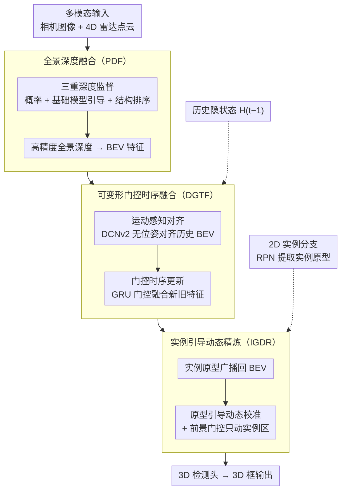

# R4Det: 4D Radar-Camera Fusion for High-Performance 3D Object Detection

**会议**: CVPR 2026  
**arXiv**: [2603.11566](https://arxiv.org/abs/2603.11566)  
**代码**: 无  
**领域**: 自动驾驶  
**关键词**: 4D毫米波雷达, 雷达-相机融合, 3D目标检测, 深度估计, 时序融合

## 一句话总结

提出 R4Det，通过三个即插即用 BEV 模块——全景深度融合（PDF）、可变形门控时序融合（DGTF）、实例引导动态精炼（IGDR）——系统性解决 4D 雷达-相机融合中的深度估计不准、无位姿时序融合以及小目标检测三大难题，在 TJ4DRadSet 上 3D mAP 达 47.29%（+5.47%），VoD 上 mAP 66.69%。

## 研究背景与动机

**领域现状**：4D 毫米波雷达因全天候、远距离、低成本而成为自动驾驶感知的重要传感器，但其点云稀疏且噪声大，需要与相机融合。现有方法（CRN、SGDet3D、CVFusion 等）在 BEV 空间进行多模态融合已取得初步进展。

**挑战一——深度估计不准**：现有框架（SGDet3D、RCBEVDet）仅对前景点施加绝对深度监督，导致深度监督稀疏，全景深度估计质量差，3D 定位不准确。同时，强大的相对深度模型（Metric3D）虽有很好的泛化能力，但如何有效利用其能力获得准确的全景绝对深度尚未解决。

**挑战二——无位姿时序融合**：时序信息对遮挡物体检测至关重要，但 TJ4DRadSet 等主流数据集缺乏自车位姿。现有方法仅靠简单 BEV 特征拼接，效果有限。

**挑战三——小目标检测**：远处骑行者等小目标可能在图像中可见但完全没有雷达回波，此时必须依赖视觉先验。现有 Transformer 方案提取 instance proposal 但与 CNN 框架不兼容。

## 方法详解

### 整体框架

R4Det 是渐进式 BEV 特征纯化流水线：(1) **PDF** 从多模态输入生成高精度 BEV 特征；(2) **DGTF** 无位姿时序对齐 + 门控聚合；(3) **IGDR** 用 2D 实例原型净化 BEV 特征 → 3D 检测头。基座为 SGDet3D 的 BEV 范式（Neighborhood Cross-Attention + LSS）。

### 关键设计

**1. 全景深度融合（PDF）：把"只盯前景点"的稀疏深度监督，扩成覆盖全场景且结构连贯的三重监督**

针对的痛点很直接——SGDet3D、RCBEVDet 这类框架只对前景点施加绝对深度监督，监督信号稀疏，背景和远处区域几乎没人管，全景深度估计因此质量很差，3D 定位也跟着不准。PDF 的做法是叠加三种互补的监督。第一种是**概率监督**：用稀疏 LiDAR 深度把每个有标注的像素构造成一个高斯目标分布，再让网络预测的深度概率 $\mathcal{P}_i$ 去逼近它，最小化 KL 散度，

$$\mathcal{L}_{prob} = \frac{1}{|\mathcal{M}_{\text{sparse}}|} \sum_{i \in \mathcal{M}_{\text{sparse}}} \text{KL}(\mathcal{G}(d_{g_i}^{\text{sparse}}) \| \mathcal{P}_i)$$

这保证了关键点上的深度精度。第二种是**基础模型引导监督**：同时拿稀疏雷达和密集的 Metric3D 伪 GT 做 Smooth L1 绝对深度损失，前者给关键点精度、后者把监督铺满全场景，弥补稀疏点覆盖不到的地方。

但前两种监督本质都只在"逐点"层面给约束，深度图整体的相对结构（谁前谁后、边界在哪跳变）仍然没人保证，这正是 PDF 的核心创新——**结构排序监督**。它对成对像素施加相对深度排序损失，$s_{ij}$ 表示伪 GT 中 $i$ 是否该比 $j$ 近：

$$\mathcal{L}_{pair}(i,j) = \text{Softplus}(-s_{ij}(\hat{d}_i - \hat{d}_j))$$

为了不让平坦区域里两个深度本就接近的点产生噪声排序信号，再配一个深度自适应的动态阈值过滤掉这类对子，$\tau_{ij} = \max(\tau_{abs},\, \tau_{rel} \cdot (d_{g_i}^{\text{dense}} + d_{g_j}^{\text{dense}})/2)$。在采样上还特意做**前景偏向**：$\mathcal{L}_{edge}$ 专门在膨胀 mask 环（物体边界外侧）和物体内部之间取对子，强迫网络学会在物体边缘处给出锐利的深度跳变。三重监督叠在一起，单独的概率或绝对监督只能给出局部正确、却整体松垮的深度，而排序约束补上了全局结构，最终得到的全景深度既准又连贯。

**2. 可变形门控时序融合（DGTF）：在拿不到自车位姿的数据集上，也能把历史帧 BEV 特征对齐并融合进来**

时序线索对遮挡目标很关键，但 TJ4DRadSet 这类主流数据集根本不提供自车位姿，没法用几何变换把历史 BEV 对齐到当前帧，现有方法只能简单拼接历史特征，效果有限。DGTF 把"对齐"和"更新"这两件本该分开的事显式拆成两个分支。**运动感知对齐分支**用 DCNv2 从当前帧 $X_t$ 和历史隐状态 $H_{t-1}$ 预测可变形偏移 $\Delta p$ 与调制 mask $m$，再把历史特征按偏移采样过来，

$$\tilde{H}_{t-1} = \text{DCNv2}(H_{t-1}, \Delta p, m)$$

学到的偏移其实隐式重建了帧间的相对运动流，调制 mask 则顺手抑制掉那些不可靠的背景区域——这一步替代了原本需要位姿才能完成的几何对齐。**门控时序更新分支**接手对齐后的特征，用 GRU 风格的门控把新旧信息融起来：重置门 $r_t$ 决定丢弃多少历史、更新门 $z_t$ 平衡新旧贡献，$H_t = (1 - z_t) \odot X_t + z_t \odot \tilde{H}_t$。这样拆开的好处是各司其职——传统 RNN 把对齐和更新揉在一起既低效又容易互相干扰，而 DCN 专管空间矫正、GRU 专管时序演化，分工后两边都做得更准。

**3. 实例引导动态精炼（IGDR）：用干净的 2D 实例语义当"模板"去校准被污染的 BEV 特征，救回那些没有雷达回波的远处小目标**

融合后的 BEV 特征会有两类问题：相互重叠的实例会彼此污染，远处骑行者这种小目标可能图像里看得见却完全没有雷达回波、在 BEV 上一片模糊。IGDR 借 2D 检测分支里相对干净的实例语义来补救，但它不是把实例特征直接糊上去（那会顺带引入背景噪声），而是走一条更间接、也更鲁棒的"原型生成校准参数"路线。先从 2D RPN 提取实例特征并池化投影成实例原型 $E_{proj}$，再按 LSS 投影得到的空间分布 $S_{BEV}$ 做 Softmax 加权，把原型广播回 BEV 空间：

$$E_{BEV} = \text{BMM}(\text{Softmax}(S_{BEV}/\tau),\, E_{proj})$$

核心创新在于**原型引导的动态校准**：$E_{BEV}$ 不直接相加，而是经 Conv 层预测出逐位置的仿射参数 $(\gamma_{BEV}, \beta_{BEV})$，对可能含噪的融合特征 $F_{RC}$ 做 feature-wise 仿射变换 $F_{calibrated} = F_{RC} \odot \gamma_{BEV} + \beta_{BEV}$——相当于让实例语义去"调"主特征流的增益和偏置，而不是粗暴覆盖。最后用**前景门控**保证只在该动的地方动：把所有实例的 $S_{BEV}$ 求和，过 Gate-conv + Sigmoid 得到门控 $G_{bg}$，仅在实例区域施加校准，背景维持原样，

$$F_{final} = (1 - G_{bg}) \odot F_{RC} + G_{bg} \odot F_{calibrated}$$

### 损失函数 / 训练策略

- **深度损失**：$\mathcal{L}_{depth} = \lambda_1 \mathcal{L}_{prob} + \lambda_2 \mathcal{L}_{found} + \lambda_3 \mathcal{L}_{relative}$，权重 $\lambda_1=0.1, \lambda_{abs}=0.01, \lambda_{dense}=0.03, \lambda_3=0.05$
- **两阶段训练**：(i) 15 epoch 空间感知预训练（冻结 DGTF/IGDR/检测头）初始化 PDF 和 2D 实例分支；(ii) 15 epoch 全参数端到端微调
- **优化器**：AdamW，lr=4e-4，cosine 衰减
- **IGDR 训练策略**：严格使用 2D 检测器动态生成的 proposal 而非 GT bbox，避免曝光偏差

## 实验关键数据

### 主实验

**TJ4DRadSet 测试集**：

| 方法 | 模态 | mAP$_{3D}$ | mAP$_{BEV}$ | Cyclist AP | 提升 |
|---|---|---|---|---|---|
| SGDet3D | R+C | 41.82 | 47.16 | 51.30 | 基线 |
| CVFusion | R+C | 40.00 | 44.07 | 49.41 | - |
| **R4Det** | **R+C** | **47.29** | **54.07** | **62.84** | **+5.47/+6.91** |

**VoD 验证集**：

| 方法 | 模态 | mAP$_{EAA}$ | mAP$_{DC}$ | FPS |
|---|---|---|---|---|
| SGDet3D | R+C | 59.75 | 77.42 | 9.2 |
| CVFusion | R+C | 65.41 | 82.42 | 5.4 |
| **R4Det** | **R+C** | **66.69** | **83.68** | **8.3** |

### 消融实验

**逐模块堆叠（TJ4DRadSet Val）**：

| PDF | DGTF | IGDR | mAP$_{BEV}$ | mAP$_{3D}$ | 说明 |
|---|---|---|---|---|---|
| | | | 45.15 | 39.86 | SGDet3D 基线 |
| ✓ | | | 46.86 | 41.41 | +1.71 (深度提升) |
| ✓ | ✓ | | 50.41 | 44.86 | +3.55 (时序融合) |
| ✓ | ✓ | ✓ | **54.07** | **47.29** | +3.66 (实例精炼) |

**DGTF 模块消融**：

| 配置 | BEV mAP | 3D mAP | 说明 |
|---|---|---|---|
| 无时序 | 46.86 | 41.41 | 基线 |
| +Concat | 47.82 | 42.01 | 简单拼接 |
| +DCN | 48.86 | 43.32 | 可变形对齐 |
| **+DCN+ConvGRU** | **50.41** | **44.86** | 完整 DGTF |

### 关键发现

- Cyclist（小目标）提升最显著：**+11.54 AP**（51.30→62.84），验证了 IGDR 对小目标的有效性
- 三个模块完全即插即用：应用到 BEVFusion/RCBEVDet 分别提升 **+6.34/+5.34 mAP**
- DGTF 中 ConvGRU 带来最大增益（+3.45 3D mAP），SE 模块反而无益
- IGDR 的 Conv 校准器 > Attention 校准器 > MLP 校准器，局部空间模式比全局 attention 更有效
- PDF 的 edge 排序损失（边界采样）对深度边缘锐利度贡献关键

## 亮点与洞察

1. **问题驱动的模块化设计**：三个明确的技术挑战 → 三个解耦的模块，工程和研究价值都高
2. **无位姿时序融合**：DCN+GRU 的解耦设计优雅解决了缺乏自车位姿的时序融合难题
3. **结构排序损失的边界采样**：dilated ring 采样策略迫使网络关注深度跳变边缘，是一个有实用价值的技巧
4. **即插即用验证充分**：不仅在自建框架验证，还成功移植到 BEVFusion/RCBEVDet，增强了可信度

## 局限与展望

1. 依赖 Metric3D 作为伪 GT，其自身误差会传播到深度监督
2. DGTF 采用类 GRU 递推，长时序下可能存在信息衰减；可探索 Transformer 时序建模
3. IGDR 的 2D 实例分支依赖 RPN 质量，弱检测器可能限制精炼效果
4. 仅在 TJ4DRadSet 和 VoD 两个相对小规模数据集验证，未在 nuScenes 等大数据集评估

## 相关工作与启发

- **SGDet3D**：直接基线，R4Det 在其 BEV 框架上添加三模块
- **Metric3D**：提供密集伪深度 GT，使全景深度监督成为可能
- **BEVFormer**：在 BEV 中做时序融合但依赖 ego pose，与 DGTF 的无位姿方案互补
- **启发**：(a) "用干净的并行特征校准主特征流"（IGDR）是处理 BEV 特征污染的通用思路；(b) 深度估计中结合绝对/相对/结构排序三重监督可推广到其他深度任务

## 评分

- 新颖性: ⭐⭐⭐⭐ (三模块各有创新点，尤其 DGTF 和 IGDR 设计精巧)
- 实验充分度: ⭐⭐⭐⭐⭐ (两数据集 SOTA + 即插即用验证 + 详细逐模块消融)
- 写作质量: ⭐⭐⭐⭐ (问题-方案对应清晰，消融设计合理)
- 价值: 待评

<!-- RELATED:START -->

## 相关论文

- [\[CVPR 2025\] RaCFormer: Towards High-Quality 3D Object Detection via Query-based Radar-Camera Fusion](../../CVPR2025/autonomous_driving/racformer_towards_high-quality_3d_object_detection_via_query-based_radar-camera_.md)
- [\[ICCV 2025\] CVFusion: Cross-View Fusion of 4D Radar and Camera for 3D Object Detection](../../ICCV2025/autonomous_driving/cvfusion_cross-view_fusion_of_4d_radar_and_camera_for_3d_object_detection.md)
- [\[CVPR 2026\] Look Before You Fuse: 2D-Guided Cross-Modal Alignment for Robust 3D Detection](look_before_you_fuse_2d-guided_cross-modal_alignment_for_robust_3d_detection.md)
- [\[CVPR 2025\] V2X-R: Cooperative LiDAR-4D Radar Fusion with Denoising Diffusion for 3D Object Detection](../../CVPR2025/autonomous_driving/v2x-r_cooperative_lidar-4d_radar_fusion_with_denoising_diffusion_for_3d_object_d.md)
- [\[CVPR 2026\] CCF: Complementary Collaborative Fusion for Domain Generalized Multi-Modal 3D Object Detection](ccf_complementary_collaborative_fusion_for_domain_generalized_multi-modal_3d_obj.md)

<!-- RELATED:END -->
