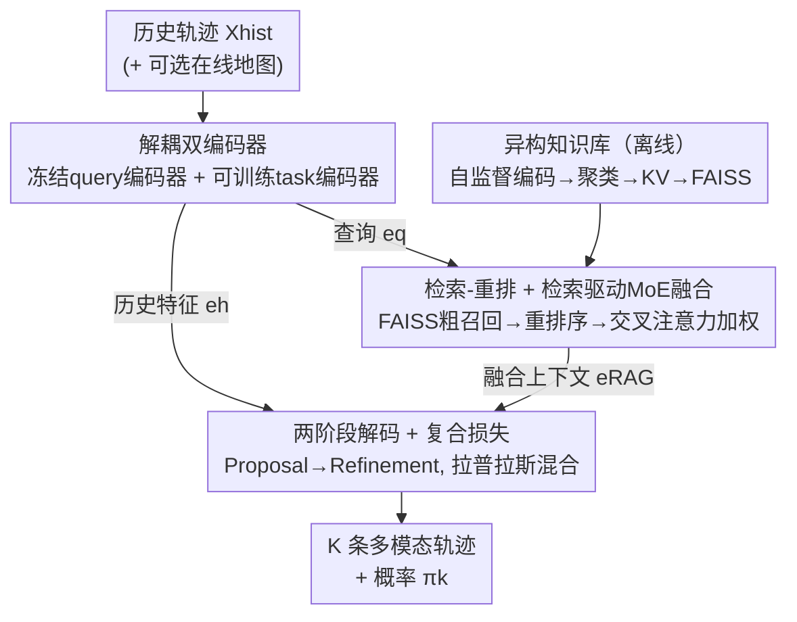

# RAG-TP: A General Framework for Vehicle Trajectory Prediction via Retrieval-Augmented Generation

**会议**: CVPR 2026  
**论文**: [CVF Open Access](https://openaccess.thecvf.com/content/CVPR2026/html/Wang_RAG-TP_A_General_Framework_for_Vehicle_Trajectory_Prediction_via_Retrieval-Augmented_CVPR_2026_paper.html)  
**代码**: 无  
**领域**: 自动驾驶 / 轨迹预测  
**关键词**: 轨迹预测, 检索增强生成, 混合专家, 跨域泛化, 知识库

## 一句话总结
把车辆轨迹预测从"依赖在线感知先验"重构为"从大规模离线知识库检索历史经验"的检索增强（RAG）问题，并用一个检索驱动的 MoE 把检索到的先验动态融合进解码器，在 Argoverse / WOMD 上同时逼平 map-based SOTA、超越 map-free 方法，并在零样本跨域迁移上展现明显优势。

## 研究背景与动机

**领域现状**：主流车辆轨迹预测把知识静态地编码进模型参数，要么依赖高精地图（HD map）作为强拓扑先验，要么走 map-free 路线、从智能体交互中隐式学习交通规则。两类方法都在标准 benchmark 上把精度刷得很高。

**现有痛点**：把知识"焊死"在参数里带来两个具体问题。其一，分布外（OOD）场景下性能急剧下滑——模型更像是背下了训练集模式，而非学到稳健的驾驶原则，换个城市/数据集就崩，这对安全是致命的。其二，map-based 方法受制于高精地图的维护成本和地域差异，map-free 方法又因为缺少显式几何约束，难以保证复杂场景下长程轨迹的合理性。

**核心矛盾**：无论 map-based 还是 map-free，它们的根本瓶颈都是**对在线感知输入的强依赖**——预测能力和当前这一帧的在线先验（地图、感知）绑死在一起，泛化上限因此被锁死。

**本文目标**：把"通用推理能力"与"可扩展的外部知识"解耦，让模型在面对没见过的场景时，不靠重训、而靠检索就能补上缺失的先验。

**切入角度**：作者借鉴 NLP 里的检索增强生成（RAG）——预测时不再只靠参数记忆，而是动态去一个结构化知识库里捞相似的历史经验当 prior。难点在于把这套范式搬到非语言的时空预测架构上：(1) 如何从异构数据源构建统一知识库；(2) 如何智能地动态融合检索到的先验。

**核心 idea**：用"从离线知识库检索历史驾驶经验"替代"依赖不确定的在线感知"，并把检索到的若干知识单元当作动态专家、用交叉注意力加权融合，从而缓解模型幻觉、补偿不可靠先验、增强跨域鲁棒性。

## 方法详解

### 整体框架
RAG-TP 把轨迹预测建模为在外部知识库 $K$ 条件下的后验 $p(Y|X_{hist}, K)$，整条管线是一个 encoder-retriever-decoder：先把历史轨迹 $X_{hist}$ 编码成查询，去结构化离线知识库里检索相关的"驾驶经验"，再用一个 MoE 模块把这些先验融合成稠密上下文，最后由多模态解码器吐出 $K$ 条带概率的未来轨迹。沿用 RAG 范式，后验被写成对检索到的知识单元 $v$ 做边缘化：$p(Y|X_{hist}) = \sum_{v \in K} p_\eta(v|X_{hist}) \cdot p_\theta(Y|X_{hist}, v)$，前者是检索器、后者是生成器。由于对整个知识库精确边缘化不可行，作者改为把 top-N 检索先验投到共享隐空间、做特征级连续融合来近似。

整个系统分三个阶段：离线知识库构建、在线检索与融合、概率轨迹解码。下面四个贡献节点（解耦双编码器 → 异构知识库 → 检索重排+MoE 融合 → 两阶段解码与复合损失）正好对应四个关键设计。

### 关键设计

**1. 检索增强重构与解耦双编码器：把预测从"在线先验"里拆出来**

针对"对在线感知强依赖锁死泛化"这个根本矛盾，RAG-TP 不再让模型独自从当前帧硬推未来，而是把预测重构为一次检索任务，从离线知识库捞历史经验当 prior。关键工程问题是：用来检索的查询表示必须和离线 FAISS 索引保持语义对齐，否则检索会漂移；而用于下游预测的表示又得端到端可训练以保住预测能力。作者用一组**解耦双编码器**化解这对张力：查询编码器 $E_{query}$（由预训练的历史编码器 $E_{hist}$ 初始化）**严格冻结**，把 $X_{hist}$ 编码成查询 $e_q$ 去库里做相似检索；另一条独立的任务编码器 $E_{task}$ **完全可训练**，把 $X_{hist}$ 编码成稠密历史特征 $e_h$ 喂给解码器。冻结的一路保证检索语义稳定不漂移，可训的一路保证预测容量，二者分工是这套范式能落地的前提。

**2. 异构知识库构建：把杂乱的多源驾驶数据蒸馏成结构化键值对**

map-free 方法之所以"长程不合理"，是因为缺少高质量、结构化的几何/行为先验。RAG-TP 离线把 Argoverse 2、WOMD 等大规模数据标准化成统一数据集 $D_{std}$，再三步蒸馏成知识库（Algorithm 1）：(1) **自监督多分支自编码**——为 history / scene / future 三个模态各训一对独立 encoder-decoder，得到解耦表示 $e_h, e_m, e_f$，用联合重建损失 $L_{joint} = \lambda_h L_{hist} + \lambda_m L_{scene} + \lambda_f L_{fut}$ 优化，保证每个嵌入空间都抓到本模态的稳健特征；(2) **行为聚类**——对拼接的 $[e_h; e_m]$ 做 K-Means，最小化簇内平方误差 $\arg\min_C \sum_j \sum_{[e_h;e_m]\in C_j} \|[e_h;e_m]-\zeta_j\|_2^2$，每个簇对应一种驾驶模式（如左转、变道），从每簇取离质心最近的 $N_s$ 个实例组成代表集 $S$，既保质量又保覆盖；(3) **键值构建**——每个实例用历史嵌入 $e_{h,i}$ 当 key $k_i$、拼接的场景+运动嵌入 $[e_{m,i}; e_{f,i}]$ 当 value $v_i$，并在所有 key 上用 FAISS 建近似最近邻（ANN）索引。结构化聚类（而非随机采样）正是知识库有效的关键，消融里去掉聚类会明显掉点。

**3. 检索-重排序与检索驱动 MoE 融合：把检索到的先验当动态专家**

光检索还不够，怎么"智能融合"才是 RAG 用在时空预测上的核心难点。检索分两步：给定冻结查询 $e_q$，先用余弦相似度从 FAISS 召回 $N_{cand}$ 个候选，再用一个可学习的相似度网络（两个独立 MLP $F_q, F_k$）重排序，算出精细分数 $\omega_i = \frac{F_q(e_q) F_k(k_i)^T}{\|F_q(e_q)\|_2 \|F_k(k_i)\|_2}$，取 top-N 进入融合。融合用**检索驱动 MoE**：不同于传统参数化 MoE 的静态分支，这里把每个检索到的知识单元当成一个"专家"，用共享非线性投影 $\phi_{expert}$ 把先验映到统一空间（保证置换等变、避免 rank 过拟合），再用以 $e_q$ 为查询的交叉注意力门控算路由权重 $\alpha = \text{Softmax}\!\left(\frac{(e_q W_Q)(K_{retrieved} W_K)^T}{\sqrt{d_k}}\right)$，得到增强上下文 $e_{RAG} = \sum_{i=1}^N \alpha_i \cdot \phi_{expert}(v_i)$。和常规 MoE 不同，作者**故意不加负载均衡损失**：检索到的专家本身已按余弦相关度天然排序，强行让路由均匀分布反而会破坏这层语义层级——去掉它才能让交叉注意力自然偏向最相关的 episodic 先验。

**4. 两阶段解码与复合拉普拉斯损失：在成熟解码骨架上隔离 RAG 的增益**

为了把实验增益干净地归因到 RAG 模块本身、而不是解码器的花活，作者直接复用 MTR 风格的成熟 Proposal-Refinement 两阶段解码：提案解码器 $D_{propose}$ 先用任务历史特征 $e_h$（加可选在线地图）生成初始轨迹，精化解码器 $D_{refine}$ 再用富上下文 $e_{RAG}$ 去调整提案、产出最终预测。训练时把 $K$ 模态分布参数化为**拉普拉斯混合模型**，用复合损失 $L_{total} = \lambda_{prop} L_{prop} + \lambda_{ref} L_{ref} + L_{cls}$：回归项用 winner-takes-all，对最接近真值的单一模态 $k^*$ 在提案和精化两阶段都算拉普拉斯负对数似然（用两个独立单变量拉普拉斯建模 $x,y$ 的空间不确定性）；分类项 $L_{cls}$ 用交叉熵优化各模态概率 $\pi_k$。

### 损失函数 / 训练策略
离线阶段先用联合重建损失 $L_{joint}$ 预训三分支自编码器以建库；在线预测阶段用复合损失 $L_{total}$ 端到端训练任务编码器、相似度重排网络、MoE 门控与两阶段解码器，查询编码器全程冻结。关键超参为 top-N 检索数、候选池 $N_{cand}$、聚类数 $C$、每簇采样数 $N_s$ 以及各损失权重 $\lambda_{prop}, \lambda_{ref}$。⚠️ 各权重具体取值原文未在正文给出，以原文/附录为准。

## 实验关键数据

### 主实验
评测指标为 $minADE_6$、$minFDE_6$、$MR_6$（K=6，结果为 3 次运行均值，$minADE_6$ 标准差稳定低于 0.02）。map-based 用 Argoverse 2 的 5s→6s 任务，map-free 用 Argoverse 1 的 2s→3s 任务。

| 设置 | 模型 | minADE6↓ | minFDE6↓ | MR6↓ |
|------|------|----------|----------|------|
| Map-based (AV2) | QCNet | 0.67 | 1.27 | 0.16 |
| Map-based (AV2) | DeMo++ | 0.62 | 1.16 | 0.13 |
| Map-based (AV2) | MTR | 0.82 | 1.55 | 0.22 |
| Map-based (AV2) | MTR + RAG | 0.76 | 1.39 | 0.18 |
| Map-based (AV2) | Forecast-MAE | 0.80 | 1.40 | 0.17 |
| Map-based (AV2) | Forecast-MAE + RAG | 0.73 | 1.28 | 0.15 |
| Map-based (AV2) | **RAG-TP (Ours)** | **0.60** | **1.14** | **0.13** |
| Map-free (AV1) | STAM-P | 0.82 | 1.30 | 0.15 |
| Map-free (AV1) | MLB-Traj | 0.77 | 1.25 | 0.14 |
| Map-free (AV1) | **RAG-TP (Ours)** | **0.72** | 1.31 | **0.13** |

map-based 设置下 RAG-TP 全面领先；把 RAG 模块即插即用地接到 MTR、Forecast-MAE 上都能稳定涨点，验证其作为增强组件的通用性。map-free 设置下 $minADE_6$ 和 $MR_6$ 超过专门的 map-free 模型，仅在 $minFDE_6$ 上略逊于 MLB-Traj / STAM-P——即用检索先验替代实时地图依然能给出稳健预测。

### 消融实验
在 Argoverse 2 验证集上逐组件消融（M1 基线 → M5 全模型）：

| 配置 | Retrieval | Map in RAG | Clustering | MoE | minADE6↓ | minFDE6↓ | MR6↓ |
|------|-----------|-----------|-----------|-----|----------|----------|------|
| M1 Baseline | × | × | × | × | 0.81 | 1.51 | 0.21 |
| M2 w/o Map Info | ✓ | × | ✓ | ✓ | 0.73 | 1.34 | 0.18 |
| M3 w/o Clustering | ✓ | ✓ | × | ✓ | 0.68 | 1.27 | 0.16 |
| M4 w/o MoE Fusion | ✓ | ✓ | ✓ | × | 0.65 | 1.21 | 0.15 |
| M5 Full Model | ✓ | ✓ | ✓ | ✓ | **0.60** | **1.14** | **0.13** |

### 关键发现
- **检索本身贡献最大**：M1→M2 仅引入检索（还没用地图）就把 $minADE_6$ 从 0.81 拉到 0.73，是单步最大跃升。
- **聚类不可省**：M3 用随机采样替代聚类，$minADE_6$ 退到 0.68，证明结构化知识库才有效。
- **MoE 融合不可省**：M4 去掉 MoE 融合退到 0.65，说明"智能上下文整合"是必要的。
- **零样本跨域是最大亮点**：在 Argoverse 2↔WOMD 跨域统一协议（4s 历史→5s 未来）下，MTR / AutoBot 等重训基线迁移到 OOD 目标域后明显掉点；RAG-TP 只需把检索库换成目标域知识库，源域训练的模型就能显著提升目标域表现、实现免重训零样本适配；用统一多源库检索的版本拿到最佳综合结果。⚠️ 跨域表格中不同列对应不同"训练域/检索库/评测域"组合，数值不可直接横向比大小。

## 亮点与洞察
- **把 RAG 范式干净地搬到非语言时空预测**：核心不是"套个检索"，而是设计了从异构数据建统一知识库 + 检索驱动 MoE 融合这两块，恰好补上了 RAG 用在轨迹预测上的两个真空。
- **"故意不加负载均衡损失"是反直觉的好洞察**：常规 MoE 怕门控塌缩才加均衡损失，但这里专家是按相关度排序的检索单元，均衡反而会抹掉语义层级——这个反向决策值得迁移到其他"检索结果当专家"的场景。
- **解耦推理与知识、即插即用**：把 RAG 模块挂到 MTR / Forecast-MAE 都能涨点，说明这是一种可叠加在现有预测器上的通用增强，而非又一个封闭架构。
- **冻结查询编码器换检索稳定性**：用冻结编码器对齐离线索引、用独立可训编码器保预测容量，这种"双路分工"是检索增强落地时防止表示漂移的可复用 trick。

## 局限与展望
- **map-free 的 $minFDE_6$ 仍落后**：终点误差上不及 MLB-Traj / STAM-P，说明纯靠检索补几何约束在长程终点精度上还有差距。
- **依赖离线知识库的质量与覆盖**：聚类/采样若覆盖不到罕见场景，检索就捞不到合适先验；库的构建和更新成本、以及防数据泄漏的训练/建库划分都需要谨慎工程。
- **解码器复用而非创新**：作者明确说沿用 MTR 骨架是为隔离 RAG 增益，因此解码侧本身没有方法贡献；与更强解码器结合时增益是否叠加仍待验证。
- **改进方向**：把重排序网络与 MoE 门控做得更轻、支持在线增量更新知识库，或引入更细的几何一致性约束来补 $minFDE$ 短板。

## 相关工作与启发
- **vs map-based（QCNet / MTR / DeMo++）**：它们靠在线高精地图当强拓扑先验，受限于地图维护成本与地域差异；RAG-TP 把地图知识沉淀进离线库、用检索补，map-based 设置下还略胜并能即插即用增强它们。
- **vs map-free（STAM-P / MLB-Traj / CRAT-Pred）**：它们从交互隐式学规则、缺显式几何约束导致长程不合理；RAG-TP 用检索到的离线几何知识补先验，$minADE_6/MR_6$ 反超，仅 $minFDE_6$ 略逊。
- **vs Driving-RAG**：同受 RAG 启发，但 Driving-RAG 偏语言式检索；RAG-TP 是面向非语言时空预测架构的专用框架，核心贡献是统一异构知识库的构建与检索，解决了前者未系统处理的跨域泛化问题。

## 评分
- 新颖性: ⭐⭐⭐⭐⭐ 首次把 RAG 系统性落到非语言时空轨迹预测，检索驱动 MoE + 去负载均衡的设计有真洞察。
- 实验充分度: ⭐⭐⭐⭐☆ 三大数据集、即插即用验证、跨域零样本都有，但 map-free 终点误差仍落后、跨域表格可比性需谨慎。
- 写作质量: ⭐⭐⭐⭐☆ 范式动机清晰、算法与公式完整，部分超参取值正文未给。
- 价值: ⭐⭐⭐⭐⭐ "解耦推理与知识"为可扩展、可泛化的预测系统提供了一条可复用的技术路径。

<!-- RELATED:START -->

## 相关论文

- [\[CVPR 2026\] Den-TP: A Density-Balanced Data Curation and Evaluation Framework for Trajectory Prediction](den_tp_a_density_balanced_data_curation_and_evaluation_framework_for_trajectory.md)
- [\[AAAI 2026\] RAST: A Retrieval Augmented Spatio-Temporal Framework for Traffic Prediction](../../AAAI2026/autonomous_driving/rast_a_retrieval_augmented_spatio-temporal_framework_for_traffic_prediction.md)
- [\[ECCV 2024\] UniTraj: A Unified Framework for Scalable Vehicle Trajectory Prediction](../../ECCV2024/autonomous_driving/unitraj_a_unified_framework_for_scalable_vehicle_trajectory_prediction.md)
- [\[CVPR 2026\] W2W: Language-Model-Based Trajectory Prediction with Reinforcement Learning](w2w_language-model-based_trajectory_prediction_with_reinforcement_learning.md)
- [\[CVPR 2026\] A Prediction-as-Perception Framework for 3D Object Detection](a_prediction-as-perception_framework_for_3d_object_detection.md)

<!-- RELATED:END -->
