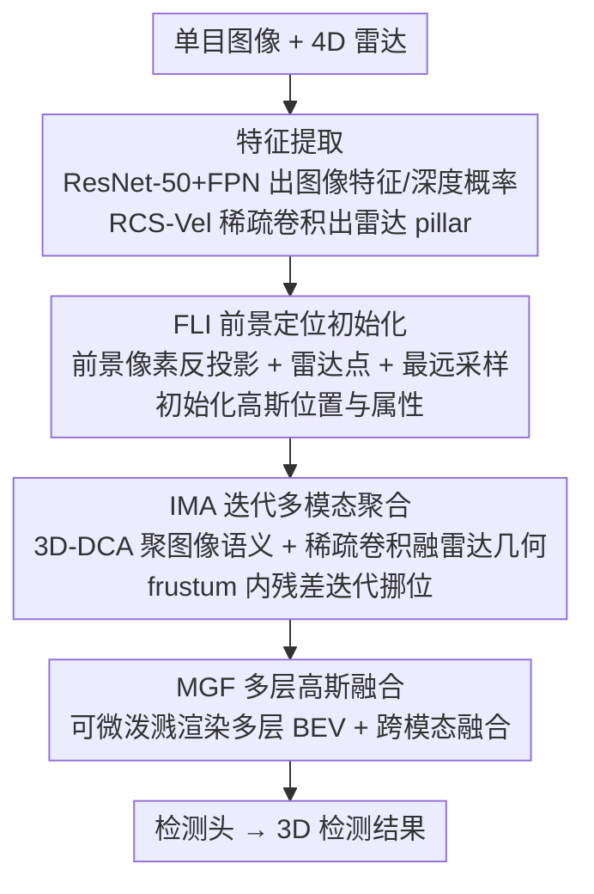

# RaGS: Unleashing 3D Gaussian Splatting from 4D Radar and Monocular Cue for 3D Object Detection

**会议**: CVPR 2026  
**论文**: [CVF Open Access](https://openaccess.thecvf.com/content/CVPR2026/html/Bai_RaGS_Unleashing_3D_Gaussian_Splatting_from_4D_Radar_and_Monocular_CVPR_2026_paper.html)  
**代码**: https://github.com/shawnnnkb/RaGS  
**领域**: 3D视觉 / 自动驾驶  
**关键词**: 4D毫米波雷达, 相机融合, 3D高斯泼溅, 3D目标检测, BEV

## 一句话总结
RaGS 把场景建模成一片连续的 3D 高斯场，用单目图像的前景线索初始化高斯、再迭代地吸收雷达几何与图像语义把高斯往前景物体上"挪"，最后渲染成多层 BEV 特征做检测，在 VoD / TJ4DRadSet / OmniHD-Scenes 三个 4D 雷达-相机基准上取得 SOTA。

## 研究背景与动机
**领域现状**：4D 毫米波雷达能同时给出距离、速度、高度且在恶劣天气下鲁棒，相机给出高分辨率语义，两者互补，是自动驾驶 3D 感知的有力组合。当前主流的雷达-相机融合分两派：instance-based（先用 2D 检测器出 proposal，再用雷达特征对齐细化）和 BEV-based（把多模态特征投到固定网格的俯视空间里做全局推理）。

**现有痛点**：instance-based 方法依赖 2D 检测质量、被级联结构束缚，缺乏全局场景理解；BEV-based 方法用预定义的体素网格和固定 anchor 采样图像语义，会把大量算力浪费在背景聚合上，网格分辨率刚性、不灵活。

**核心矛盾**：3D 目标检测任务本质是**稀疏**的（前景物体只占场景一小部分），却又需要对整个场景有全局理解。固定网格的密集表示与这种稀疏性天然错配——你为了全局感知不得不密集建模整张图，但 90% 的算力花在了无关背景上。

**本文目标**：找到一种既能把资源动态集中到稀疏前景、又能保留全局场景感知的灵活表示，并用它来融合 4D 雷达与单目图像。

**切入角度**：3D 高斯泼溅（3DGS）是一种紧凑、连续、各向异性的场景表示，天生稀疏、可微、物理可解释，本来用于神经渲染。作者观察到它"动态分配资源、自适应调整注意力"的特性恰好对齐检测任务的稀疏需求——但此前 GS 几乎只被用在渲染/占据预测上，没人拿它做多模态融合与检测。

**核心 idea**：用一片连续的 3D 高斯场代替固定 BEV 网格来融合雷达与图像——高斯能自适应地往前景物体聚集（object-centric 精度），又靠连续概率分布保留全局感知，再渲染成 BEV 特征喂给检测头。

## 方法详解

### 整体框架
RaGS 是一条级联流水线：先把单目图像和 4D 雷达分别编码成特征，再用 **FLI** 模块借单目前景线索初始化一批 3D 高斯的位置，接着 **IMA** 模块反复地把图像语义和雷达几何/速度信息聚到高斯上、并把高斯往前景物体方向迭代挪位，最后 **MGF** 模块把多个层级的高斯渲染成多尺度 BEV 特征、与雷达 pillar 跨模态融合后送进检测头。每个高斯由显式物理属性（位置 $\mathbf{P}$、旋转 $\mathbf{R}$、尺度 $\mathbf{S}$、不透明度 $\mathbf{O}$）和一个隐式特征嵌入 $\mathbf{F}^\text{I}$ 共同描述，整条管线就是不断初始化→精炼→渲染这片高斯场。

### 关键设计

**1. FLI 前景定位初始化：用单目线索给高斯一个"扎根前景"的起点**

固定网格方法把整张俯视图都铺满采样点，背景冗余严重；纯可学习 embedding 初始化又只能拟合数据集的统计先验、缺乏当前帧的结构。FLI 改用**单目线索**来初始化每个高斯的位置：先从分割 logits $\mathbf{L}$ 和度量深度 $\mathbf{D}$ 里选 top-K 前景像素，把像素 $(u,v)$ 连同深度 $d$ 反投影到 3D，$\mathbf{P}_\text{unproj} = d\cdot \mathbf{K}^{-1}(u,v,1)^T$（$\mathbf{K}$ 为相机内参）；再补上 4D 雷达点 $\mathbf{P}_\text{radar}$，以及在视锥空间里按最远点采样得到的候选点 $\mathbf{P}_\text{sample}$（用来扩大覆盖、抵消前景识别不稳）。三者拼成 $\mathbf{P}=\text{Concat}(\mathbf{P}_\text{unproj},\mathbf{P}_\text{sample},\mathbf{P}_\text{radar})\in\mathbb{R}^{N\times3}$。其中度量深度由深度概率对 bins 加权求和得到 $D=\sum_{d=1}^{D}P_d\cdot d$。这样初始化的高斯全部落在视场内、且天然聚在稀疏前景上，不像 BEV 那样从一开始就平摊到整个场景。位置之外再配上可学习的 $\mathbf{R},\mathbf{S},\mathbf{O}$ 拼成显式属性 $\mathbf{F}^\text{E}\in\mathbb{R}^{N\times11}$，外加隐式查询特征 $\mathbf{F}^\text{I}$，每个高斯记作 $G=\{\mathbf{F}^\text{E},\mathbf{F}^\text{I}\}$。

**2. IMA 迭代多模态聚合：让高斯一边吸语义/几何、一边往物体上挪**

初始化的高斯只是"粗定位"，需要把图像语义和雷达几何吸进来并精修位置。IMA 分三步迭代：① **语义聚合**不直接把高斯投到 2D 做可变形注意力，而是先把图像特征 $\mathbf{F}^\text{2D}$ 与深度概率 $\mathbf{D}^\text{prob}$ 做外积构成一个**深度感知的 3D 图像特征空间**，再在其中做 3D 可变形交叉注意力（3D-DCA），让高斯在 3D 里与几何对齐的图像特征交互：$\mathbf{F}^\text{I}=\sum_{n=1}^{T}\mathbf{A}_n\mathbf{W}\cdot\phi(\mathbf{F}^\text{2D}\otimes\mathbf{D}^\text{prob}, \mathcal{P}(\mathbf{P})+\Delta\mathbf{q})$，其中 $\phi$ 是三线性插值、$\Delta\mathbf{q}$ 是可学习偏移。② **几何聚合**把每个高斯当成体素 $\mathbf{V}^\text{gs}$，并把雷达 pillar 沿高度复制成 $\mathbf{V}^\text{radar}$ 后与之拼接、做稀疏卷积，$\mathbf{F}^\text{I}\leftarrow\mathbf{V}^\text{gs}=\text{Spconv}(\text{Concat}(\mathbf{V}^\text{gs},\mathbf{V}^\text{radar}))[:N]$——RCS-速度感知的 pillar 给出清晰物理含义，雷达速度作为运动线索隐式引导高斯的空间分布。③ **位置精修**把高斯重投到视锥空间，用 MLP 条件于其隐式特征和投影位置预测一个残差 $\Delta\mathbf{p}=(\Delta h,\Delta w,\Delta d)=\text{MLP}(\text{Concat}(\mathbf{F}^\text{I},\mathcal{P}(\mathbf{P})))$，加到视锥坐标后再变回 3D：$\mathbf{P}\leftarrow\mathcal{P}^{-1}(\mathcal{P}(\mathbf{P})+\Delta\mathbf{p})$。整个过程迭代多轮，把高斯逐步收拢到稀疏物体上（可视化显示约 30% 的高斯被激活），而不是像固定网格那样在背景上反复无效采样。

**3. MGF 多层高斯融合：把高斯场渲染成多尺度 BEV 再做检测**

IMA 产出的是一组 $M$ 个不同层级（语义/几何抽象程度不同）的高斯集合，单看任一层都嫌稀疏、分辨率低，需要融合成统一表示。MGF 对每个高斯 $G_i=(\mu_i,\Sigma_i,O_i,\mathbf{F}^\text{I}_i)$（中心由位置给出、协方差由旋转尺度导出）做**可微高斯泼溅**渲染到 BEV：某 BEV 像素 $\mathbf{q}$ 的特征是所有投影高斯按 $\sum_n O_{i,n}\exp(-\tfrac{1}{2}(\mathbf{q}-\mu_{i,n})^\top\Sigma_{i,n}^{-1}(\mathbf{q}-\mu_{i,n}))\mathbf{F}^\text{I}_{i,n}$ 的加权累积，由 CUDA 光栅化器高效实现。取最后 $L$ 层高斯渲染成多层 BEV 特征图 $\{\mathbf{F}^{(l)}_\text{bev}\}$，卷积融合成 $\mathbf{F}^\text{gs}$，再经跨模态融合器（CMF）与雷达 pillar $\mathbf{F}^\text{pillar}$ 结合得到最终 BEV 特征 $\mathbf{F}^\text{BEV}=\text{CMF}(\mathbf{F}^\text{gs},\mathbf{F}^\text{pillar})$。这套多层渲染弥补了单层高斯稀疏、低分辨率的短板，同时保留了"算力向前景倾斜"的好处。

### 损失函数 / 训练策略
分两段：预训练阶段用深度损失与透视分割损失监督原始特征提取，$\mathcal{L}_\text{pretrain}=\mathcal{L}_\text{depth}+\mathcal{L}_\text{seg}$；联合训练阶段在 3D 检测损失 $\mathcal{L}_\text{det}$ 之外加上渲染辅助损失（透视渲染深度损失 + BEV 渲染分割损失），$\mathcal{L}_\text{total}=\mathcal{L}_\text{det}+\lambda(\mathcal{L}_\text{depth\_render}+\mathcal{L}_\text{seg\_render})$，其中 $\lambda=0.1$。渲染出的深度由 LiDAR 监督、BEV 分割图由占据信息引导，靠这些损失把高斯动态拉向物体中心区域。体素尺寸 0.32 m，4×RTX 4090，每卡 batch 4，AdamW。

## 实验关键数据

> 指标说明：**mAP** 为平均精度；**ODS** 是 OmniHD-Scenes 自带的检测综合分；**AP3D / APBEV** 分别为 3D 框 / 俯视框平均精度；VoD 上 **mAPEAA**（Entire Annotated Area，整个标注区）与 **mAPDC**（Driving Corridor，行车走廊）分别衡量全区与可行驶区精度；**FPS** 为帧率。

### 主实验

| 数据集 | 指标 | 之前最好 | RaGS | 提升 |
|--------|------|----------|------|------|
| OmniHD-Scenes | mAP / ODS | 34.88 / 43.00 (RCFusion/BEVFusion) | 35.88 / 43.45 | +1.00 / +0.45 |
| TJ4DRadSet | AP3D / APBEV | 41.82 / 47.16 (SGDet3D) | 41.95 / 51.04 | +0.13 / +3.88 |
| VoD (val) | mAPEAA / mAPDC | 59.75 / 77.42 (SGDet3D) | 61.86 / 81.63 | +2.11 / +4.21 |
| VoD vs DETR系 | mAPEAA | 54.44 (RaCFormer) | 61.86 | +7.42 |

VoD 上对比强 BEV 基线 LXL，mAPEAA / mAPDC 分别 +5.55 / +8.70；帧率 10.5 FPS（高于 LXL 6.1、RCFusion 9.0），兼顾精度与实时性。

### 消融实验

| 配置 | mAPEAA | mAPDC | 说明 |
|------|--------|-------|------|
| baseline (仅雷达) | 55.33 | 72.32 | 4D 雷达基线 |
| + FLI | 57.40 | 75.80 | 加前景初始化 |
| + FLI + IMA | 59.12 | 76.68 | 再加迭代聚合 |
| + FLI + IMA + MGF (Full) | 59.45 | 76.98 | 完整模型 |

FLI 内部拆解（Frustum / Radar / Depth 三类初始化点）逐项叠加 55.33→57.40；IMA 内部（3D-DCA / Pillars / Frustum 精修）逐项叠加 57.40→59.45，三步都各有贡献。

### 关键发现
- **三模块各有贡献且 IMA 增益最大**：FLI 提供粗初始化（+2.07 mAPEAA），IMA 的迭代多模态聚合贡献最大（+1.72），MGF 再补一刀（+0.33）。
- **高斯锚点数 N 有甜点**：N 从 3200 增到 12800，mAPEAA 从 54.77 升到 59.45、FLOPs 从 599 升到 640；再加到 19200 几乎不再涨（59.47）反而更费算力，说明约 12800 个高斯就够覆盖稀疏前景。
- **对标定扰动和恶劣天气更鲁棒**：在 ±5°/±0.5m 标定扰动下 RaGS 仍达 56.66 mAPEAA（LXL 仅 50.25）；模拟雨/雾/弱光下 RaGS 均稳定领先 LXL 约 4-5 个点，印证连续高斯表示对噪声的容忍度。

## 亮点与洞察
- **把"渲染工具"3DGS 改造成"融合介质"**：以往 GS 只做渲染/占据，RaGS 第一个证明高斯场能当多模态聚合器——显式物理属性让融合可解释，又比 DETR 那种纯隐式 query 框架（FUTR3D 49.03、RaCFormer 54.44 vs RaGS 61.86）更"看得懂"。
- **稀疏性对齐是核心 insight**：检测任务稀疏、GS 表示也稀疏，二者天生契合，所以能"动态把算力倒向前景"——这套"任务结构匹配表示结构"的思路可迁移到占据预测、车道线等同样稀疏的感知任务。
- **深度感知 3D 图像空间 + 3D-DCA**：不在 2D 平面做可变形注意力，而是先用深度概率把图像特征"撑"成 3D 体，再在 3D 里聚合，避免了 2D 投影丢失几何一致性，这个 trick 对任何"图像特征要喂给 3D query"的任务都有借鉴价值。

## 局限与展望
- **多视角初始化仍是 ongoing work**：作者明说在 OmniHD-Scenes 这类环视场景下，更优雅的初始化先验还在探索中，当前单目前景初始化对环视并非最优。
- **依赖前景分割与深度质量**：FLI 的高斯位置来自分割 logits + 单目深度，若前景分割或深度估计在远处/遮挡严重时退化，初始化会偏，虽然补了雷达点和随机采样兜底，但弱光/远距下仍可能受限。⚠️ 论文未单独消融"分割质量→检测精度"的传导，这块影响幅度待确认。
- **训练依赖 LiDAR 监督渲染深度**：渲染深度由 LiDAR 监督、BEV 分割需占据引导，意味着训练阶段仍需要 LiDAR/占据标注，纯雷达-相机部署虽可行但训练成本不低。
- **改进方向**：把单目初始化换成多视角一致的几何先验、或引入时序高斯（跨帧复用高斯）以进一步压缩冗余、提速。

## 相关工作与启发
- **vs instance-based（CenterFusion / CRAFT / RADIANT）**：它们靠 2D proposal 再对齐雷达，缺全局感知、受级联结构限制；RaGS 用连续高斯场天然兼顾 object-centric 精度与全局感知。
- **vs BEV-based（RCFusion / LXL / BEVFusion）**：它们用固定体素网格 + 固定 anchor 采样，背景冗余、刚性；RaGS 用可自适应挪位的高斯，把采样资源动态倒向前景，VoD 上对 LXL +5.55/+8.70。
- **vs DETR 系（FUTR3D / RaCFormer）**：纯隐式 end-to-end query 缺物理可解释性；RaGS 的高斯具备显式属性，作为可解释的多模态聚合器，VoD mAPEAA 61.86 显著超过 RaCFormer 54.44。
- **vs 室内 GS 检测（3DGS-DET / Gaussian-Det）**：它们在室内把 3DGS 用于前景拟合，RaGS 把这一 insight 拓展到**室外**雷达-相机的开放道路场景。

## 评分
- 新颖性: ⭐⭐⭐⭐⭐ 首个把 3DGS 用于 4D 雷达-相机融合 3D 检测，表示与任务稀疏性对齐的视角很正
- 实验充分度: ⭐⭐⭐⭐⭐ 三个基准 SOTA + 模块/锚点数/标定扰动/恶劣天气多维消融
- 写作质量: ⭐⭐⭐⭐ 方法叙述清晰，但公式排版有 OCR 噪声、部分模块（CMF）细节略简
- 价值: ⭐⭐⭐⭐ 为雷达-相机融合提供了高斯这条新表示路线，工程实时性（10.5 FPS）也站得住

<!-- RELATED:START -->

## 相关论文

- [\[CVPR 2026\] R4Det: 4D Radar-Camera Fusion for High-Performance 3D Object Detection](r4det_4d_radar-camera_fusion_for_high-performance_3d_object_detection.md)
- [\[CVPR 2026\] RPGFusion: 4D Radar Prior-Guided Multi-Modal Fusion for 3D Detection](rpgfusion_4d_radar_prior-guided_multi-modal_fusion_for_3d_detection.md)
- [\[ICCV 2025\] CVFusion: Cross-View Fusion of 4D Radar and Camera for 3D Object Detection](../../ICCV2025/autonomous_driving/cvfusion_cross-view_fusion_of_4d_radar_and_camera_for_3d_object_detection.md)
- [\[CVPR 2026\] ParkGaussian: Surround-view 3D Gaussian Splatting for Autonomous Parking](parkgaussian_surround-view_3d_gaussian_splatting_for_autonomous_parking.md)
- [\[CVPR 2026\] ReManNet: A Riemannian Manifold Network for Monocular 3D Lane Detection](remannet_a_riemannian_manifold_network_for_monocular_3d_lane_detection.md)

<!-- RELATED:END -->
