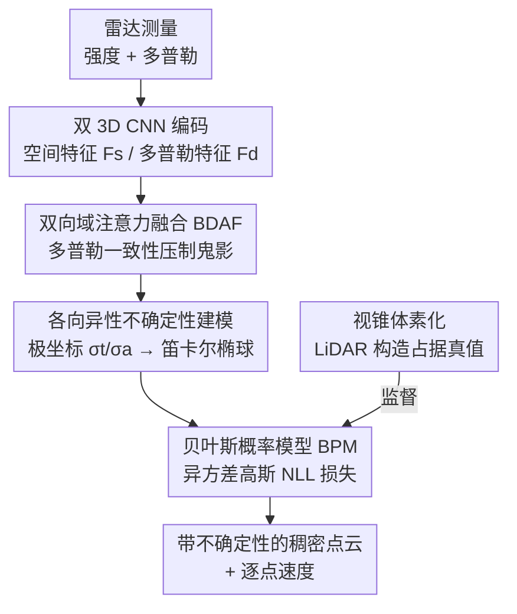

# RaUF: Learning the Spatial Uncertainty Field of Radar

**会议**: CVPR 2026  
**论文**: [CVF Open Access](https://openaccess.thecvf.com/content/CVPR2026/html/Wang_RaUF_Learning_the_Spatial_Uncertainty_Field_of_Radar_CVPR_2026_paper.html)  
**代码**: 无（项目页 https://shengpeng.wang/rauf ）  
**领域**: 自动驾驶感知 / 毫米波雷达 / 不确定性建模  
**关键词**: 毫米波雷达, 空间不确定性, 各向异性高斯, 多普勒一致性, 点云重建

## 一句话总结
RaUF 把"低保真雷达点云重建"重新表述成一个学习**空间不确定性场**的贝叶斯问题：用各向异性高斯刻画雷达"新月形"的方位/距离不确定性，把原本相互冲突的"特征→标签"监督转成可学习的置信度信号；同时用双向域注意力把多普勒一致性注入空间特征以压制鬼影，在 Coloradar / RaDelft / 自采数据上重建精度与下游任务可靠性都显著领先。

## 研究背景与动机
**领域现状**：毫米波雷达能在雨雾、黑夜等恶劣环境下稳定工作，且自带多普勒（径向速度）信息，是自动驾驶/机器人全天候感知的关键补充。但雷达原始测量稀疏、噪声大、角分辨率低，难以直接用于稠密感知，因此主流做法是用相机/LiDAR 这类高分辨率传感器做**由粗到细的跨模态监督**，把稀疏雷达"超分"成稠密点云（RadarHD、Radar-Diffusion、SDDiff 等）。

**现有痛点**：作者指出两个被忽视的根本问题。其一，**几何推断是病态的**——从稀疏雷达线索"脑补"出高分辨率结构，本质上缺乏物理保真度；同一类雷达特征在不同样本里可能对应不同标签（feature-to-label 映射有歧义），网络被迫去调和这些相互冲突的监督信号，最后往往收敛到一个"折中平均"的几何位置，既不属于真实分布的任何一个模态，又破坏了优化稳定性和泛化。其二，**过度依赖强度（amplitude）线索**——很多方法只看回波强度，忽略多径反射和噪声造成的鬼影点（ghost points），导致检测不可靠。

**核心矛盾**：现有方法把雷达感知当成一个**确定性回归**（一个特征确定地映射到一个占据标签），但雷达测量天然带有方向各异的不确定性，强行确定性拟合就会在冲突监督下崩成折中解。

**切入角度**：作者回到雷达的物理本质做了两个观察。① **各向异性**：受限于有效到达角天线数量，方位向（azimuth）不确定性远大于距离向（range），单帧测量在空间上呈现特征性的"新月形"分布——这和 LiDAR 的各向同性完全不同。② **多普勒一致性**：真实静止目标的多普勒速度由雷达自速度和散射体方向向量唯一决定（Theorem 1），其时序相干性可作为物理可靠的线索来识别并抑制鬼影。

**核心 idea**：与其确定性地"超分"雷达点云，不如学习一个**空间不确定性场**——用各向异性高斯把"新月形"不确定性显式建模进贝叶斯似然，把冲突监督变成有信息的置信度学习信号；并用多普勒一致性做物理先验压制虚假反射。

## 方法详解

### 整体框架
RaUF 的输入是带强度与多普勒两个通道的雷达测量张量 $x \in \mathbb{R}^{R\times A\times E\times 2}$（距离 $R$、方位 $A$、俯仰 $E$），输出是带各向异性不确定性的稠密空间占据（点云），同时附带逐点速度预测。整条管线分三步走：先用两支独立的 3D CNN 把强度和多普勒分别编码成空间特征 $F_s$ 与多普勒特征 $F_d$；再用 **双向域注意力融合（BDAF）** 让两者互相增强——空间特征引导多普勒、多普勒回过头来精化空间，得到增强后的空间表征 $F_s'$；最后由解码器在 **贝叶斯概率模型（BPM）** 下输出定位预测 $f_\theta(x)$ 与各向异性不确定性 $g_\phi(x)$，用异方差高斯的负对数似然（NLL）损失训练。监督信号（占据真值）则由 **基于视锥的体素化策略** 从 LiDAR 点云构造。

### 关键设计

**1. 贝叶斯概率模型（BPM）：把冲突监督变成可学的不确定性**

针对"病态几何推断导致折中平均"的痛点，RaUF 不再让网络确定性地回归一个占据标签，而是把任务重定义为同时估计定位模型 $f_\theta(x)$ 和不确定性量化模型 $g_\phi(x)$。在平坦先验下，学习 $(\theta,\phi)$ 等价于最小化负对数后验，并进一步退化为负对数似然。关键在于似然建模：考虑雷达各向异性，作者用**异方差高斯**刻画数据生成过程，即 $y_i = f_\theta(x_i) + \epsilon_i$，其中 $\epsilon_i \sim \mathcal{N}\!\big(0,\, g_\phi(x_i)\big)$，噪声协方差随输入而变。由此得到的 NLL 损失为

$$\mathcal{L} = \sum_{i=1}^{N}\Big[\, \|\epsilon_i(\theta)\|^2_{g_\phi(x_i)} + \log\det\big(g_\phi(x_i)\big) \,\Big]$$

其中 $\|\epsilon_i\|^2_\Sigma = \epsilon_i^\top \Sigma^{-1}\epsilon_i$ 是马氏距离。第一项让网络在考虑预测不确定性的前提下拟合数据——当某个样本本身歧义大、$g_\phi$ 估得大时，该样本的拟合误差被自动降权，于是冲突监督不再硬拉网络去折中；第二项 $\log\det(g_\phi)$ 惩罚过大的不确定性，防止网络偷懒把所有点都标成"高不确定"的平凡解。这样一来，原本相互矛盾的"特征→标签"映射被转成了对目标区域细粒度置信度的有信息学习，既稳住了优化又提升了物理可解释性。

**2. 各向异性不确定性表征：用"新月→椭球"的物理建模刻画雷达**

设计 1 里的 $g_\phi(x)$ 要输出什么形状的协方差，是这篇论文最物理的地方。普通方法（如 S3E、UTR）假设各向同性的标量置信度，无法表达雷达"距离准、方位糊"的事实。RaUF 在**极坐标**下分别预测径向不确定性 $\sigma_t$ 和角向不确定性 $\sigma_a$，再通过一阶误差传播把极坐标的不确定性变换到笛卡尔系（Theorem 2）。具体地，测量点 $p$ 在 $(r,\alpha,\beta)$ 附近做一阶泰勒展开，其扰动为 $\delta p = J\,[\delta r,\ \delta\alpha,\ \delta\beta]^\top$，雅可比 $J$ 由 $\sin/\cos(\alpha,\beta)$ 与 $r$ 组成。由于 $\delta r,\delta\alpha,\delta\beta$ 是独立高斯变量，$\delta p$ 仍是高斯，协方差为

$$\Sigma = J\, D\, J^\top,\qquad D = \mathrm{diag}(\sigma_r^2,\ \sigma_\alpha^2,\ \sigma_\beta^2)$$

直观上：方位/俯仰的角误差经雅可比里 $r\sin/r\cos$ 的放大，在远距离会被拉长成横向很宽的"椭球"，恰好把图 1 里观测到的"新月形"不确定性近似成笛卡尔系下的各向异性高斯置信度。把这个 $\Sigma = g_\phi(x)$ 代回设计 1 的 NLL（公式 6 即 $\mathcal{L}_{spatial}$），网络就能学到方向各异、物理自洽的置信场，而不是一个圆形的标量分数。

**3. 双向域注意力融合（BDAF）：让多普勒一致性回灌空间特征压鬼影**

针对"只看强度、抗不住鬼影"的痛点，RaUF 用多普勒一致性做物理先验。Theorem 1 指出静止正样本散射体的多普勒径向速度 $v^r_{i,j}$ 完全由雷达自速度 $v^r$ 和散射方向 $(\alpha,\beta)$ 决定，因此符合该运动学约束的是真实反射、偏离的多半是多径鬼影。BDAF 由两层交叉注意力构成：先把空间特征 $F_s$ 与多普勒特征 $F_d$ patch 化并加位置编码成序列 $S_p, D_p \in \mathbb{R}^{L\times C}$（$L = HW/p^2$）。**第一阶段**用空间线索做 query 增强多普勒：$S_p \to D_p' = \mathrm{Softmax}\!\big(Q_s K_d^\top / \sqrt{d_k}\big) V_d$，其中 $Q_s = W_s^q S_p,\ K_d = W_d^k D_p,\ V_d = W_d^v D_p$，让网络聚焦于"多普勒与自运动一致"的区域；$D_p'$ 残差融合回 $\tilde D_p$ 后，再经一个轻量残差瓶颈的 **Domain Projection** 网络投影成"类占据"潜在表示 $D_p''$，相当于把多普勒分布翻译成可微的空间似然先验。**第二阶段**反过来，用 $D_p''$ 当 query 去精化空间特征：$S_p' = \mathrm{Attention}(Q_d = W_d^q D_p'',\ K_s = W_s^k S_p,\ V_s = W_s^v S_p)$，最终增强空间表征 $F_s' = \mathrm{ResNet}(\mathrm{Concat}(S_p, S_p'))$。这种"空间↔多普勒"双向精化让空间精度与多普勒相干性互补，把强度域里看似有效、但多普勒不一致的虚假反射压下去。$F_s'$ 和 $\tilde D_p$ 分别送入解码器算空间 NLL 损失和辅助速度回归损失。

**4. 视锥体素化：从 LiDAR 构造"反映雷达不确定性"的占据真值**

要监督不确定性学习，真值本身就不能是"一个点对一个点"的硬标签。RaUF 用**基于视锥（frustum）的体素化**从 LiDAR 点云造占据真值：依据雷达内参，沿距离/方位/俯仰发射射线张成视锥形区域，落在该视锥内的所有 LiDAR 点都视为对应该雷达检测的潜在反射。这样得到的占据真值天然带"一块区域而非一个点"的形态，与雷达测量内在的方向不确定性相匹配，给设计 1/2 的各向异性 NLL 提供了形状自洽的监督目标。

### 损失函数 / 训练策略
总损失 = 空间 NLL 损失 $\mathcal{L}_{spatial}$（公式 6，带各向异性协方差）+ 辅助多普勒速度回归损失 $\mathcal{L}_{doppler}$。为保证协方差正定与数值稳定，网络预测方差项的指数（exp）而非直接预测方差。占据与速度的 MSE 监督权重系数为 0.001。优化器 AdamW，初始学习率 $2\times10^{-4}$，在 4×RTX 4090 上训练约 6 天。

## 实验关键数据

数据集：公开的 Coloradar（43k 帧，单芯片+级联雷达，室内外）、RaDelft（长程级联雷达，城市场景）、自采数据集（11k+ 帧，单芯片/级联，室内外，用 Fast-Livo2 提供速度真值）。指标：有效性用 Chamfer Distance（CD↓）与 F-score（FS↑）；可靠性用自定义 **Clutter Point Ratio（CPR）** $\eta = |P_c|/|P|$，其中 $P_c$ 是离任一真值点距离 $> \zeta$（取 0.5 m）的杂波点，CPR 越低点云越干净；可扩展性看下游任务表现。

### 主实验（Coloradar 级联雷达，CD↓ / FS↑）

| 场景 | OS-CFAR | RPDNet | RadarHD | SDDiff | RaUF（本文） |
|------|---------|--------|---------|--------|-------------|
| Armyroom | 2.14 / 0.04 | 1.81 / 0.05 | 1.08 / 0.23 | 0.86 / 0.43 | **0.50 / 0.47** |
| Hallways | 2.19 / 0.06 | 1.84 / 0.15 | 1.38 / 0.19 | 1.92 / 0.15 | **1.10 / 0.36** |
| Longboard | 12.99 / 0.04 | 13.75 / 0.02 | 4.66 / 0.19 | 9.00 / 0.08 | **3.79 / 0.36** |

RaUF 在 CD 上几乎全面领先，相比传统 CFAR 在平均 CD 上提升约 **70.1%**、F-score 约 **5×**。值得注意的是扩散类 SOTA（SDDiff）在长程/复杂场景（Longboard 9.00、Hallways 1.92）明显退化，而 RaUF 凭不确定性校准保持稳健（Longboard 3.79）。⚠️ 论文按"去地面点云"评测（更贴合下游需求），与部分做全场景重建的 baseline 口径略有差异。

### 消融实验（Coloradar 级联，CD↓ / FS↑）

| 配置 | Armyroom | Longboard | 说明 |
|------|----------|-----------|------|
| Ours (w/o NLL) | 0.58 / 0.45 | 7.97 / 0.20 | 去掉不确定性校准（退回确定性回归） |
| Ours (w/o BDA) | 0.99 / 0.40 | 5.98 / 0.28 | 去掉双向域注意力（只用强度） |
| Ours (w/o GS) | 0.50 / 0.49 | 3.86 / 0.37 | 去掉某分组/几何监督项 ⚠️ 以原文为准 |
| Ours（完整） | 0.50 / 0.47 | 3.79 / 0.36 | 完整模型 |

整体上，不确定性校准（NLL）使 CD 降低 **30.55%–37.18%**、F-score 提升 **27.27%–38.71%**，说明各向异性不确定性建模给出了更物理自洽、无冲突的几何表征；BDA 模块相比"仅强度"基线提升 **14.98%–15.95%**，验证了多普勒一致性对压制杂波的贡献。

### 下游案例研究（变换估计 TE / 自速度估计 EVE）

| 方法 | EVE 40% 误差↓ | EVE 80% 误差↓ | TE 平移 T.(m)↓ | TE 旋转 R.(deg)↓ |
|------|--------------|--------------|----------------|------------------|
| ICP | 0.41 | 1.03 | 0.99 | 0.63 |
| GICP | 0.38 | 1.26 | 0.54 | 0.50 |
| RANSAC | 0.32 | 0.85 | 0.86 | 0.65 |
| RaUF（本文） | **0.25** | **0.77** | **0.42** | **0.39** |

用 RaUF 的"带不确定性"点云做变换估计，平移/旋转精度均比 GICP 提升约 **22%**——因为 GICP 的协方差只来自局部几何统计，捕捉不到雷达测量内在的物理不确定性；自速度估计上超过经典 RANSAC，并与端到端的 RadarEVE 持平。这印证了学到的不确定性表征对下游任务的可迁移价值。

### 关键发现
- **不确定性校准贡献最大**：去掉 NLL 后 Longboard 这种长程复杂场景从 3.79 退化到 7.97（CD 翻倍），说明病态几何推断在难场景下尤其致命，不确定性建模是稳健性的主要来源。
- **BDA 在杂波场景增益明显**：多普勒一致性主要在多径/杂波严重的环境压住鬼影，贡献约 15% 的提升。
- **泛化与可扩展性**：在 RaDelft 与自采数据上微调能快速适配不同雷达配置，且学到的不确定性能直接当先验喂给定位/速度估计等下游任务。

## 亮点与洞察
- **把"超分"问题换框成"学不确定性场"**：最巧的一步是认识到雷达点云重建的病态性来自冲突监督，于是不去消除歧义、而是显式建模歧义（异方差高斯），让网络对模糊样本自动降权——这是处理"一对多映射"监督的可复用范式。
- **物理驱动的各向异性协方差**：用极坐标 $(\sigma_t,\sigma_a)$ + 一阶误差传播把"新月形"近似成笛卡尔椭球，把传感器物理特性直接焊进损失函数，而不是让网络盲学协方差，可解释性强。
- **多普勒一致性作为物理先验**：BDAF 用 Theorem 1 的运动学约束区分真实/鬼影，思路可迁移到任何带多普勒/速度通道的感知任务（如 4D 成像雷达目标检测）。

## 局限与展望
- 训练成本不低（4×RTX 4090、约 6 天），且依赖 LiDAR 做占据真值的视锥监督，纯雷达自监督尚未解决。
- 多普勒一致性的核心假设（Theorem 1）针对**静止散射体**成立，对动态目标的鬼影抑制是否同样有效，正文未充分展开，存疑 ⚠️。
- 各向异性高斯是对"新月形"分布的一阶近似，对极端非高斯/重尾的杂波分布可能不够；可考虑混合分布或更高阶误差传播。
- 消融里 "GS" 项含义在缓存正文中未明确定义（疑为某几何/分组监督），⚠️ 以原文为准。

## 相关工作与启发
- **vs CFAR 系（OS-CFAR / 变体）**：传统信号处理受天线数限制，点云稀疏噪声大；RaUF 用学习式跨模态监督 + 不确定性建模，CD/FS 大幅领先。
- **vs 扩散类重建（Radar-Diffusion / RaLD / SDDiff）**：它们靠扩散去噪做空间超分但重度依赖强度线索，易受多径伪影影响、且迭代推理慢；RaUF 用多普勒一致性物理压鬼影、单次前向，复杂场景更稳。
- **vs 各向同性不确定性（GICP / S3E / UTR）**：这些方法用局部几何统计或注意力给出各向同性置信，捕捉不到雷达距离-角分辨率差异导致的各向异性；RaUF 是首个为雷达学习**空间各向异性不确定性场**的工作，并在下游 TE/EVE 上证明其优于结构化估计器。

## 评分
- 新颖性: ⭐⭐⭐⭐⭐ 首个把雷达点云重建重构为各向异性空间不确定性场学习，物理动机扎实。
- 实验充分度: ⭐⭐⭐⭐ 覆盖 3 个数据集 + 多类雷达 + 下游 TE/EVE 案例，消融清晰；但部分对比口径（去地面）与 baseline 略有差异。
- 写作质量: ⭐⭐⭐⭐ 物理推导（两个 Theorem）与方法叙述清楚，个别消融项（GS）定义交代不足。
- 价值: ⭐⭐⭐⭐⭐ 不确定性场可直接当先验喂下游感知，对自动驾驶全天候雷达感知有实用价值，且承诺开源自采数据集。

<!-- RELATED:START -->

## 相关论文

- [\[CVPR 2026\] SpaceDrive: Infusing Spatial Awareness into VLM-based Autonomous Driving](spacedrive_infusing_spatial_awareness_into_vlm-based_autonomous_driving.md)
- [\[CVPR 2026\] C-LaV: Conditional Latent Velocity Field Denoising for Weather-Robust LiDAR Place Recognition](c-lav_conditional_latent_velocity_field_denoising_for_weather-robust_lidar_place.md)
- [\[AAAI 2026\] Dual-branch Spatial-Temporal Self-supervised Representation for Enhanced Road Network Learning](../../AAAI2026/autonomous_driving/dual-branch_spatial-temporal_self-supervised_representation_for_enhanced_road_ne.md)
- [\[CVPR 2026\] U4D: Uncertainty-Aware 4D World Modeling from LiDAR Sequences](u4d_uncertainty-aware_4d_world_modeling_from_lidar_sequences.md)
- [\[CVPR 2026\] GSV2X: Geometry-Aware Uncertainty Modeling and Orthogonal Fusion for Robust Roadside Perception](gsv2x_geometry-aware_uncertainty_modeling_and_orthogonal_fusion_for_robust_roads.md)

<!-- RELATED:END -->
