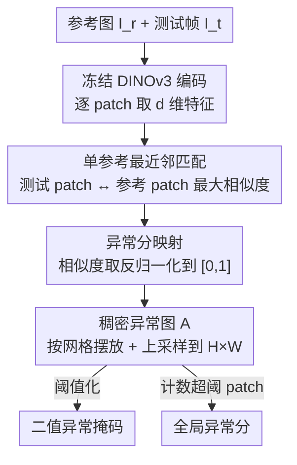

# Real-World On-Vehicle Evaluation of Embedding-Based Anomaly Detection

**会议**: CVPR2026  
**arXiv**: [2605.19744](https://arxiv.org/abs/2605.19744)  
**代码**: 无  
**领域**: 自动驾驶  
**关键词**: 异常检测, 自动驾驶, DINOv3, 单参考图像, 实车部署

## 一句话总结
这篇论文提出一个**免训练、单参考图像**的语义异常检测方法：用冻结的 DINOv3 提取 patch 级特征，把测试帧的每个 patch 与一张"正常场景"参考图做最近邻余弦相似度匹配，相似度低的区域即判为异常，并**首次把这种 embedding 异常检测真正跑在自动驾驶实车上**（12.5 Hz 实时），在 Road Anomaly 上取得 AP 70.83%。

## 研究背景与动机

**领域现状**：自动驾驶里的"语义异常检测"主要是发现训练分布之外的意外物体（动物、掉落货物、奇怪障碍物）。主流做法分两类：一类是**有监督 + anomaly exposure**，训练时喂入精选的 OOD 样本去显式学异常边界，在 Fishyscapes、SegmentMeIfYouCan 等榜单上分数最高；另一类是**无监督 / 免训练**，只对正常驾驶分布建模，测试时用密度估计、重建残差或基础模型特征相似度来发现偏离。

**现有痛点**：榜单冠军基本都是高度专门化、工程复杂的有监督方法，它们的"正常"是按 Cityscapes 那套抽象语义类别定义死的，换个真实场景就难迁移；而且这些方法几乎只在 Fishyscapes 这类 benchmark 或仿真里评测，**没有真正面对实车部署的挑战**——传感器噪声、环境多变、实时性约束。即便是和本文最接近的 Ronecker 等人的工作，也只在 CARLA 仿真数据上验证，没上过真车。

**核心矛盾**：榜单性能和"可部署性"之间存在张力——越想刷榜就越依赖大规模异常样本采集与专门训练，而真实机器人/车载场景里异常本就稀少、多样、不可预测，根本攒不出有代表性的标注数据集。

**本文目标**：做一个**简单、鲁棒、可适配、易部署**的异常检测方法，理想情况下不需要额外训练、不需要大规模数据采集，并且能在真车上实时跑。

**切入角度**：作者赌的是"基础模型的特征空间本身已经足够好"——DINOv3 这类预训练 ViT 的 patch 特征已经把语义编码得很到位，那么"正常"也许只需要**一张参考图**就能刻画，异常 = 特征空间里离参考最远的区域。这把问题从"学一个异常分类器"退化成"在冻结特征空间里做最近邻比对"。

**核心 idea**：用**单张参考图 + DINOv3 patch 特征的最近邻相似度**来代替专门训练的异常检测器，并用实车部署来检验这种极简方案在真实条件下到底够不够用。

## 方法详解

### 整体框架
方法要解决的是"给定一帧行车图像，逐像素标出哪些区域是语义异常"。整体非常轻：拿一张代表正常路况的**参考图 $I_r$** 和当前**测试帧 $I_t$**，都送进同一个冻结的 DINOv3 编码器 $f(\cdot)$，各自得到一组 patch 级特征向量；测试帧的每个 patch 去参考图所有 patch 里找"最像"的那个，最像的程度（最大余弦相似度）就是它的"正常度"，反过来就是异常分；把所有 patch 的异常分按空间网格摆好、上采样回原分辨率，得到一张稠密异常图 $A$。这张图再做两件事：阈值化得到二值异常分割掩码，或把超过阈值的 patch 数量一加得到一个全局异常分。整个过程**没有任何训练、没有梯度、backbone 全程冻结**，参考图还能在线随时替换。

### 关键设计

**1. 单参考图像建模正常：把"正常"压到一张图**

针对的痛点是现有方法要么依赖大规模 OOD 样本（有监督），要么需要一个由多张正常图构成的 memory bank / 特征数据库（如 AnomalyDINO、SubspaceAD、Ronecker 等），部署时都嫌重。本文故意走到极限：**只用一张参考图 $I_r$ 定义正常场景**。编码器把每张图切成不重叠的 patch，各映射成 $d$ 维特征，得到参考集合 $F_r=\{\mathbf{z}_i^r\}_{i=1}^{N_r}$ 和测试集合 $F_t=\{\mathbf{z}_j^t\}_{j=1}^{N_t}$。这样做的好处是部署极简、参考图可以"边开边换"（on the fly），坏处作者也直说了——参考图换一下，那些视觉上不同但其实正常的元素就可能被误触发（见局限）。这是本文有意识做的"极简 vs 鲁棒"取舍，目的就是**测一测最小化、单参考、免训练设置的能力上限**。

**2. 最近邻相似度做异常评分：测试 patch 找参考里最像的那个**

核心假设是"一个测试 patch 只要和**至少一个**参考 patch 像，就算正常"。所有特征先按欧氏范数归一化记作 $\tilde{\mathbf{z}}$，patch $j$ 的正常度定义为它与所有参考 patch 相似度的最大值：

$$s_j = \max_i s_{ij}$$

这正是特征空间里的最近邻匹配。异常分取相似度的反向；由于余弦相似度落在 $[-1,1]$，再映射到 $[0,1]$ 区间得到异常分 $a_j$：$a_j$ 越低说明和参考越像、越正常，越高说明偏离越大。"取 max" 这一步很关键——它允许场景里出现参考图里以不同空间位置存在的正常物体（只要语义上能在参考里找到对应 patch 就不报警），从而对空间布局变化有一定鲁棒性，而不是逐位置硬比。

**3. 稠密异常图 + 双输出：既能像素定位又能全局打分**

patch 级异常分 $\{a_j\}$ 按 ViT 的空间 patch 网格排列，再上采样到原图分辨率，得到稠密异常图 $A\in\mathbb{R}^{H\times W}$，实现**像素级的异常定位**而不只是一个图像级标签。在这张图上：用预设阈值二值化就得到异常分割掩码；把异常分超过阈值的 patch 数一数，就得到一个标量全局异常分，反映这帧偏离参考场景的整体严重程度 / 空间范围。这套双输出设计让同一套机制同时支撑下游的逐像素监控和帧级告警。因为方法不假设"一帧只有一个异常"，多个异常物体会在异常图上各自被单独高亮（见实车多异常场景）。

### 损失函数 / 训练策略
**无训练、无损失函数**。DINOv3 backbone 全程冻结、推理模式、不算梯度，方法没有任何可学习参数，唯一需要的"配置"是参考图、固定输入分辨率（保证参考帧与测试帧 patch 网格一致）和分割阈值。

## 实验关键数据

### 主实验
在三个标准异常 benchmark 上评测（单参考、免训练设置）。指标：AP（平均精度，越高越好）、FPR95（真正例率 95% 时的假正例率，越低越好）、AUROC（越高越好）。作者指出据其所知此前**没有免训练方法在这些榜单上的评测可对照**，故表中只列本方法自身表现。

| 数据集 | AP (%) ↑ | FPR95 (%) ↓ | AUROC (%) ↑ |
|--------|---------|-------------|-------------|
| Fishyscapes L&F | 26.43 | 92.76 | 61.95 |
| Fishyscapes Static | 41.15 | 81.70 | 74.62 |
| Road Anomaly | 70.83 | 39.82 | 92.83 |

可见在 **Road Anomaly** 上表现最好（AP 70.83%、AUROC 92.83%），因为该 benchmark 的异常多是大而显著的前景物体，正合"语义偏离参考"的判定；而 Fishyscapes L&F 的小目标 / 背景复杂场景下 FPR95 高达 92.76%，说明单参考设置容易把背景误报为异常。

### 实车部署评测（核心贡献）
这部分是本文真正的亮点，不是 benchmark 而是**首次 embedding 异常检测的实车实时评测**：

| 项目 | 配置 / 结果 |
|------|-------------|
| 平台 | CoCar NextGen 研究车（基于 Audi A6，获德国道路自动驾驶许可） |
| 集成方式 | ROS2 节点，订阅前视相机话题，在线推理 |
| backbone | 预训练 DINOv3，初始化时载入参考图、可在线热替换 |
| 输出 | PCA 嵌入可视化 + 连续异常热图 + 二值异常掩码 |
| 实时性 | **12.5 Hz**，输入 960×592 px，NVIDIA RTX A6000 |
| 测试场景 | 城市 + 乡村短序列；人为放置小轮玩具、轮胎、充气物等异常，行人被故意排除出正常集当作异常 |

### 关键发现
- **最近邻 + 单参考在显著前景异常上很work**：Road Anomaly 这种"大物体明显异常"的场景里方法表现接近实用（AP 70.83%），但在小目标 / 杂乱背景（Fishyscapes L&F）上误报严重，FPR95 极高。
- **能分离多个异常**：方法不假设一帧只有一个异常，复杂场景里多个异常物体会被各自单独高亮；异常图随场景变大会变得更宽更碎，但仍集中在显著异常区域。
- **简单场景响应更紧凑**：单个主导异常时，异常图紧凑聚焦在意外前景结构上；前景/背景的语义区分清晰。
- 论文没有给出针对各模块的定量消融表（方法本身只有一条最近邻链路），分析以 benchmark 与实车定性结果为主。

## 消融实验要点
本文是一篇**部署导向的极简方法研究**，方法只有"冻结编码 → 单参考最近邻 → 阈值"一条链路，没有可拆卸的模块，因而**没有标准的逐模块消融表**。作者用对照讨论代替消融：明确指出加入**多张参考图**会提升 benchmark 分数，但那会偏离"评估单参考、免训练设置极限"的研究目标，因此刻意不加；同时把 Fishyscapes L&F 的高 FPR95 归因于单参考对小目标 / 复杂背景的覆盖不足。可以理解为"单参考 vs 多参考"本身就是隐含的消融维度，作者主动选择了更难但更易部署的那一端。

## 亮点与洞察
- **把异常检测退化成最近邻**：核心洞见是"基础模型特征已经够好，正常性不必学、只需一张参考图比对"，这让方法零训练、零标注、参考可热替换——是把工程复杂度压到极限的典型思路，可迁移到任何有强预训练特征的领域（工业缺陷、医学其实已有同源工作 AnomalyDINO / DINO-AD）。
- **"实车实时"本身就是贡献**：大量异常检测论文止步于 benchmark 或仿真，本文把方法做成 ROS2 节点、在获牌真车上跑到 12.5 Hz，验证了 embedding 异常检测在真实传感噪声/算力约束下的可行性——这种"部署即证据"的评估范式值得借鉴。
- **取 max 相似度的小巧思**：用"和任一参考 patch 像即正常"而非逐位置比对，天然容忍正常物体的空间位移，是单参考设置下保持鲁棒的关键细节。
- **诚实的负面结果**：作者不回避 Fishyscapes L&F 上 FPR95 92.76% 的难看数字，把它如实归因于单参考的覆盖局限，这种克制反而让"简单方法的能力边界在哪"这个研究问题更有说服力。

## 局限与展望
- **单参考的根本局限（作者承认）**：参考图换一下，视觉上不同但实则正常的元素就可能被误报；榜单上小目标/复杂背景 FPR95 极高就是直接体现。多参考能缓解但被作者刻意排除。
- **定量评估偏弱**：实车部分只有定性结果（几张图、几段短序列），没有实车上的定量异常检测指标，缺乏大规模量化验证；benchmark 也只在三个数据集上、且无同类免训练方法可横向对比。
- **缺时序一致性**：逐帧独立推理，没有利用视频时序，复杂场景下异常图会变碎；作者把时序一致性列为未来工作。
- **行人当异常是人为设定**：评测时故意把行人排除出正常集当异常，这对验证"语义偏离"有用，但和真实部署里行人显然是正常交通参与者相悖，需注意结论的适用边界。
- **展望**：多参考建模、时序一致性、大规模定量评测。

## 相关工作与启发
- **vs AnomalyDINO (Damm et al. 2025)**：同样是 DINO 特征 + patch 级最近邻、免训练，但 AnomalyDINO 用一张或多张参考图构建 patch embedding 的 memory bank（可带增广/掩码），且只在工业缺陷 benchmark 上评测、无实车验证；本文砍到单参考、并上真车。
- **vs SubspaceAD (Lendering et al. 2026)**：用多张增广参考图建低维 PCA 子空间、靠重建残差判异常；本文是直接特征最近邻匹配，更轻，且做了实车部署。
- **vs DINO-AD (Huo et al. 2026)**：同用冻结 DINOv3 + 余弦相似度，但面向医学影像、用一池正常图并加聚类/选择步骤，pipeline 更复杂；本文单参考、无额外步骤、面向驾驶实时。
- **vs Ronecker et al. (2025，最接近的工作)**：同样基于 DINOv2 patch 特征 + 余弦最近邻做驾驶异常分，但依赖一个由多个正常驾驶场景构成的 embedding 数据库、可选实例分割/过滤，且**只在 CARLA 仿真上验证**；本文的差异化正是"单参考 + 真车实时部署"。

## 评分
- 新颖性: ⭐⭐⭐ 方法本身是已有 DINO 最近邻异常检测思路的极简化（单参考），创新主要在"首次实车实时部署评估"这一定位，而非算法。
- 实验充分度: ⭐⭐⭐ benchmark 只有三个且无同类对比，实车部分全是定性结果、缺定量指标，整体偏 workshop/short-paper 体量。
- 写作质量: ⭐⭐⭐⭐ 动机清晰、对单参考局限直言不讳，方法叙述简洁自洽。
- 价值: ⭐⭐⭐⭐ "把 embedding 异常检测真正搬上真车并验证实时可行"对自动驾驶安全监控有实际参考价值，部署即证据的范式值得借鉴。

<!-- RELATED:START -->

## 相关论文

- [\[CVPR 2026\] V2U4Real: A Real-world Large-scale Dataset for Vehicle-to-UAV Cooperative Perception](v2u4real_a_real-world_large-scale_dataset_for_vehicle-to-uav_cooperative_percept.md)
- [\[CVPR 2026\] WorldLens: Full-Spectrum Evaluations of Driving World Models in Real World](worldlens_full-spectrum_evaluations_of_driving_world_models_in_real_world.md)
- [\[CVPR 2026\] SimScale: Learning to Drive via Real-World Simulation at Scale](simscale_learning_to_drive_via_real-world_simulation_at_scale.md)
- [\[CVPR 2026\] Unposed-to-3D: Learning Simulation-Ready Vehicles from Real-World Images](unposed-to-3d_learning_simulation-ready_vehicles_from_real-world_images.md)
- [\[AAAI 2026\] Unlocking Efficient Vehicle Dynamics Modeling via Analytic World Models](../../AAAI2026/autonomous_driving/unlocking_efficient_vehicle_dynamics_modeling_via_analytic_world_models.md)

<!-- RELATED:END -->
