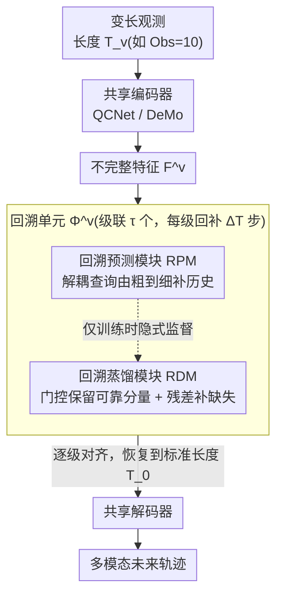

<!-- 由 src/gen_stubs.py 自动生成 -->
# Recover to Predict: Progressive Retrospective Learning for Variable-Length Trajectory Prediction

**会议**: CVPR2026  
**arXiv**: [2603.10597](https://arxiv.org/abs/2603.10597)  
**代码**: [zhouhao94/PRF](https://github.com/zhouhao94/PRF)  
**领域**: 自动驾驶  
**关键词**: 轨迹预测, 变长观测, 渐进式回溯, 知识蒸馏, 自动驾驶

## 一句话总结

提出渐进式回溯框架 PRF，通过级联回溯单元逐步将不完整观测的特征对齐到完整观测，大幅提升变长轨迹预测性能，且即插即用兼容现有方法。

## 背景与动机

1. **轨迹预测是自动驾驶核心任务**：准确预测动态交通参与者的未来运动对安全规划和碰撞避免至关重要
2. **现有方法依赖固定长度观测**：绝大多数方法在标准长度（如 50 步/20 步）输入下优化，对观测长度变化非常敏感
3. **真实场景中不完整观测普遍存在**：车辆新进入感知范围、遮挡后重新检测到、追踪丢失等场景都产生变长/不完整轨迹
4. **性能随观测缩短急剧下降**：SOTA 方法 DeMo 在 10 步观测下 mADE6 从 0.658 恶化到 0.861（Argoverse 2），大幅退化
5. **"一步映射"策略难以处理短轨迹**：已有方法（DTO、FLN、LaKD、CLLS）直接将不完整特征映射到完整特征，对信息缺口大的短轨迹效果不佳
6. **独立训练（IT）代价高收益低**：为每个长度单独训练模型虽有少量提升，但计算和存储开销巨大

## 方法详解

### 整体框架

PRF 针对的是一个很实际的痛点：现有轨迹预测器都在固定长度观测下训练，一旦车辆刚进入感知范围、遮挡后重检、或追踪丢失导致观测变短，性能就断崖式下跌（DeMo 在 Obs=10 时 mADE6 从 0.658 恶化到 0.861）。已有方法多用"一步映射"把短特征硬拽到长特征，信息缺口一大就失效。PRF 换个思路：在编码器和解码器之间插入 $\tau$ 个级联回溯单元，每个单元 $\Phi^v$ 只把长度 $T_v$ 的特征往回补 $\Delta T$ 步、对齐到 $T_{v-1}$；推理时长度 $T_v$ 的输入依次过 $\Phi^v, \Phi^{v-1}, \dots, \Phi^1$ 逐级恢复到标准长度 $T_0$，再送进共享解码器预测。每个回溯单元内部由两个模块协同：回溯蒸馏模块 RDM 负责把特征对齐（推理时使用），回溯预测模块 RPM 在训练时为 RDM 提供隐式监督（推理时关闭）。所有变长观测共享同一个 encoder 和 decoder，因此 PRF 对 QCNet、DeMo 等现有方法即插即用。

### 关键设计

**1. 回溯蒸馏模块 RDM：用残差蒸馏补缺失时步，又不破坏可靠分量**

共享编码器对不同长度的同一条轨迹会给出冲突的特征，直接对齐容易把本来对的部分也带偏。RDM 因此把缺失时步建模为可学习的残差，而非整体重写：先用 cross-attention 把 agent 特征和 HD Map 特征 $\mathbf{F}_m$ 融合注入场景上下文，再走双分支——Logit 分支（self-attention → MLP → Sigmoid）产出逐元素门控向量 $\mathbf{g}^v$，Residual 分支（self-attention → MLP → ReLU）学习残差特征 $\mathbf{F}_r^v$。

两者经门控融合 $\tilde{\mathbf{F}}^{v-1} = \mathbf{g}^v \odot \mathbf{F}^v + \mathbf{F}_r^v$：门控负责保留输入里可靠的分量，残差只补缺失信息，这样每一步回溯都是"加增量"而不是"推倒重来"。

**2. 回溯预测模块 RPM：用解耦查询由粗到细地把缺的历史"预测"回来**

光对齐特征还不够，得真的恢复出缺失的 $\Delta T$ 个历史时步。RPM 用两组解耦查询做由粗到细：先用 $K$ 个 Anchor-Free Mode Queries（MLP 初始化 → cross-attention 提场景特征 → self-attention 建模模式交互）预测多模态粗略轨迹提案；再用 $\Delta T$ 个 Anchor-Based State Queries（MLP 初始化 → cross-attention + Mamba 建模时序动态）以粗提案为 anchor 做精细化。因为回溯固定 $\Delta T$ 步，所有单元共享同一个 RPM，训练时可批处理加速。

关键是 RPM 只在训练时用——它为 RDM 提供隐式监督，推理时直接关掉，所以即插即用又不增加任何推理开销。

### 一个完整示例

以 Argoverse 2 上一条 Obs=10 的短观测为例：它先进入对应的回溯单元 $\Phi$，RDM 把它对齐、RPM 隐式监督它补出 $\Delta T$ 步历史，得到等效 Obs=20 的特征；接着这个特征再过下一个单元变成 Obs=30……如此级联，每级只弥合一个小的 $\Delta T$ 间隔，直到恢复成标准长度 Obs=50 才送进共享解码器。正因为每一跳的学习难度都小，10 步这种信息缺口最大的输入才能被一步步救回来——代价是它要走完全部 $\tau$ 个单元，推理时间约为标准长度的 1.9 倍（0.268s vs 0.140s）。

### 损失函数 / 训练策略

训练用滚动起点策略 RSTS 制造变长样本：从一条序列除标准样本 $([1,50], [51,110])$ 外，还截出 $([1,40],[41,100])$、$([1,30],[31,90])$、$([1,20],[21,80])$，于是 Argoverse 2 上一条序列能产生 4 个 decoder 样本和 {4,3,2,1} 个回溯单元样本——越短的观测越难回溯，恰好分到越多训练数据。

整体端到端三部分损失：Decoder 损失（Smooth-L1 轨迹回归 + 交叉熵模式分类，沿用 QCNet/DeMo）、RPM 损失 $\mathcal{L}_{rpm} = \frac{1}{\tau}\sum_{v=1}^{\tau}(\mathcal{L}_{mq}^v + \mathcal{L}_{sq}^v)$（分别监督 mode/state queries）、RDM 损失 $\mathcal{L}_{rdm} = \frac{1}{\tau}\sum_{v=1}^{\tau}\text{SmoothL1}(\tilde{\mathbf{F}}^{v-1}, \mathbf{F}^{v-1})$。

## 实验关键数据

### 变长轨迹预测（Argoverse 2 验证集，mADE6/mFDE6）

| 方法 | Obs=10 | Obs=20 | Obs=30 | Obs=40 | Obs=50 | Avg-Δ50 |
|------|--------|--------|--------|--------|--------|---------|
| DeMo-Ori | 0.861/1.533 | 0.700/1.358 | 0.671/1.306 | 0.662/1.288 | 0.658/1.278 | 0.066/0.093 |
| DeMo-CLLS | 0.641/1.258 | 0.630/1.249 | 0.623/1.234 | 0.614/1.225 | 0.615/1.223 | 0.012/0.019 |
| **DeMo-PRF** | **0.617/1.183** | **0.603/1.155** | **0.598/1.143** | **0.599/1.145** | **0.596/1.142** | **0.008/0.015** |
| QCNet-CLLS | 0.735/1.247 | 0.727/1.232 | 0.725/1.227 | 0.719/1.222 | 0.714/1.215 | 0.013/0.017 |
| **QCNet-PRF** | **0.727/1.213** | **0.711/1.181** | **0.706/1.169** | **0.702/1.164** | **0.702/1.166** | **0.010/0.016** |

### 标准预测 Argoverse 2 排行榜（b-mFDE6）

| 方法 | b-mFDE6 | mADE6 | mFDE6 | MR6 |
|------|---------|-------|-------|-----|
| DeMo+ReMo | 1.84 | 0.61 | 1.17 | 0.13 |
| **DeMo-PRF** | **1.81** | **0.60** | **1.14** | **0.13** |

### 消融实验（Argoverse 2 验证集，DeMo backbone）

| RDM | RPM | RSTS | Obs=10 | Obs=50 |
|-----|-----|------|--------|--------|
| ✗ | ✗ | ✗ | 0.876/1.455 | 0.725/1.256 |
| ✓ | ✗ | ✗ | 0.655/1.257 | 0.639/1.231 |
| ✓ | ✓ | ✗ | 0.652/1.241 | 0.635/1.208 |
| ✓ | ✓ | ✓ | **0.617/1.183** | **0.596/1.142** |

- RDM 贡献最大：Obs=10 时 mADE6 从 0.876 降到 0.655（↓25.2%）
- RPM 在 RDM 基础上继续降低 mFDE6 约 1.3%
- RSTS 全面提升各长度性能，Obs=10 时 mADE6 再降 5.3%
- 渐进蒸馏 vs 直接蒸馏：Obs=10 时 mADE6 0.652 vs 0.663，短序列优势更大
- Mamba vs GRU vs Attention（RPM 时序建模）：Mamba 在 mFDE6 上全面最优
- 推理开销：每增加一个回溯阶段仅增加约 0.07G FLOPs + 0.03s 延迟

## 亮点

1. **渐进式回溯思想简洁有效**：将"长距离特征对齐"分解为多个"短距离对齐"，大幅降低学习难度，t-SNE 可视化清晰验证
2. **即插即用设计**：插入 encoder-decoder 之间，成功适配 QCNet 和 DeMo 两种 SOTA 方法
3. **RPM 仅训练时使用**：提供隐式监督但不增加推理开销，工程友好
4. **RSTS 数据增强策略巧妙**：利用变长特性从一条序列生成多个样本，短轨迹获得更多训练数据
5. **标准+变长双赛道 SOTA**：不仅变长预测全面领先，标准 Argoverse 2 排行榜也刷新记录

## 局限与展望

1. **观测长度离散化**：只支持 $\Delta T$ 整数倍的观测长度，中间长度需截断到最近的合法值（如 32→30），可能浪费信息
2. **推理延迟随缺失增加线性增长**：最短观测需经过全部 $\tau$ 个回溯单元，10 步观测推理时间是标准的 1.9 倍（0.268s vs 0.140s）
3. **仅验证了两种 backbone**：虽然声称即插即用，但只在 QCNet 和 DeMo 上验证，未测试 Diffusion/GPT 类预测器
4. **缺少更极端短观测的讨论**：如只有 1-5 步观测时的效果未探索
5. **训练成本未详细对比**：RSTS 生成多倍样本，8×RTX4090 训练 60 epochs 的总时间未与基线对比
6. **真实部署场景验证缺失**：所有实验在离线数据集上，未展示在线/实车部署效果

## 与相关工作的对比

| 方法 | 策略 | 短轨迹表现 | 推理开销 | 兼容性 |
|------|------|-----------|---------|--------|
| DTO | 教师-学生蒸馏 | 中等 | 无额外 | 中 |
| FLN | 时域不变表示 | 中等 | 无额外 | 中 |
| LaKD | 长度无关蒸馏 | 较好 | 无额外 | 中 |
| CLLS | 对比学习 | 较好 | 无额外 | 中 |
| **PRF** | **渐进回溯蒸馏** | **最佳** | **少量增加** | **高（即插即用）** |

核心区别：上述方法都是"一步映射"短特征到长特征，PRF 则通过级联单元渐进对齐——信息缺口越大优势越明显。

## 评分

- 新颖性: ⭐⭐⭐⭐ （渐进回溯+残差蒸馏+解耦查询组合有新意，思路简洁优雅）
- 实验充分度: ⭐⭐⭐⭐⭐ （两数据集+两backbone+六基线+详尽消融+t-SNE+效率分析）
- 写作质量: ⭐⭐⭐⭐ （结构清晰，公式规范，图表丰富）
- 价值: ⭐⭐⭐⭐ （变长观测是真实驾驶的关键痛点，方法实用且 SOTA）

<!-- RELATED:START -->

## 相关论文

- [\[ECCV 2024\] Progressive Pretext Task Learning for Human Trajectory Prediction](../../ECCV2024/autonomous_driving/progressive_pretext_task_learning_for_human_trajectory_prediction.md)
- [\[CVPR 2026\] Den-TP: A Density-Balanced Data Curation and Evaluation Framework for Trajectory Prediction](den_tp_a_density_balanced_data_curation_and_evaluation_framework_for_trajectory.md)
- [\[CVPR 2026\] MetaDAT: Generalizable Trajectory Prediction via Meta Pre-training and Data-Adaptive Test-Time Updating](metadat_generalizable_trajectory_prediction_via_meta_pre-training_and_data-adapt.md)
- [\[CVPR 2026\] FoSS: Modeling Long-Range Dependencies and Multimodal Uncertainty in Trajectory Prediction via Fourier–State Space Integration](foss_modeling_long_range_dependencies_and_multimodal_uncertainty_in_trajectory_p.md)
- [\[CVPR 2026\] MindDriver: Introducing Progressive Multimodal Reasoning for Autonomous Driving](minddriver_introducing_progressive_multimodal_reasoning_for_autonomous_driving.md)

<!-- RELATED:END -->
