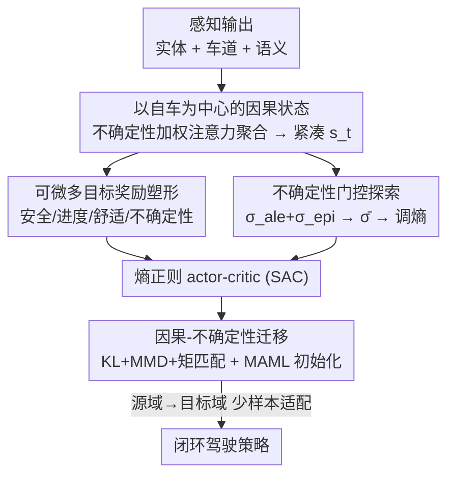

# Reliable Policy Transfer for Safety-Aware End-to-End Driving with Deep Reinforcement Learning

**会议**: CVPR 2026  
**论文**: [CVF Open Access](https://openaccess.thecvf.com/content/CVPR2026/html/Borhan_Reliable_Policy_Transfer_for_Safety-Aware_End-to-End_Driving_with_Deep_Reinforcement_CVPR_2026_paper.html)  
**代码**: https://github.com/szu-ai/safe-driving-drl/  
**领域**: 自动驾驶  
**关键词**: 端到端驾驶, 深度强化学习, 不确定性建模, 策略迁移, 安全控制

## 一句话总结
本文提出一个围绕「控制层可靠性接口」组织的端到端驾驶深度强化学习框架：用同一个归一化不确定性信号 $\bar{\sigma}$ 同时驱动以自车为中心的关系注意力、门控策略熵、并正则化跨域迁移对齐，在 CARLA 恶劣天气与跨城闭环测试中比强基线显著提升成功率、降低违规率并改善车道贴合。

## 研究背景与动机
**领域现状**：端到端（E2E）自动驾驶已经从模块化感知-规划-控制流水线，走向把场景理解与控制耦合在一起的统一网络，并用强化学习（RL）直接优化闭环行为。这类方法在开环精度和架构可扩展性上很强，评测也开始强调成功率、每公里违规数这类在线指标。

**现有痛点**：但在分布漂移、密集车流、恶劣天气下闭环鲁棒性仍然很差，作者把根因归为四个互相割裂的环节——（1）状态编码器把感知压成全局张量，丢掉了「哪些实体在因果上影响自车」以及置信度；（2）奖励稀疏或带阈值跳变，在安全关键控制处梯度弱、不连续；（3）不确定性估计方式各异，且很少真正回路去调节探索；（4）迁移大多只对齐感知特征，忽略控制层的因果语义与不确定性统计。

**核心矛盾**：这四件事被当成四个独立模块各做各的，导致不确定性这个本该贯穿「感知 → 决策 → 探索 → 迁移」的信号，在每个环节被重新定义、彼此对不上，于是闭环行为脆弱、迁移后退化。

**本文目标**：在控制层把因果性与不确定性对齐，使安全感知的 E2E 驾驶策略能在分布漂移下可靠迁移。具体拆成：构造暴露因果影响的紧凑控制状态、给出处处可微的多目标奖励、联合估计两类不确定性并门控探索、跨域对齐策略/注意力/不确定性统计。

**切入角度**：作者观察到上述四个环节其实可以共享同一个标量信号——决策时刻归一化不确定性 $\bar{\sigma}\in[0,1]$。如果让它「一处计算、四处复用」，四个模块就被串成一个一致的可靠性接口。

**核心 idea**：用一个统一的不确定性信号 $\bar{\sigma}$ 同时（a）加权关系注意力、（b）进入奖励项、（c）门控策略熵、（d）正则化迁移对齐，替代各模块各自为政的不确定性处理。

## 方法详解

### 整体框架
闭环驾驶被建模成 MDP $\mathcal{M}=(S,A,r,P,s_0,\gamma)$：动作是连续控制 $a_t=[a_t^{\text{thr}},a_t^{\text{brk}},a_t^{\text{str}}]$（油门/刹车/转向），策略 $\pi_\theta$ 用熵正则的 actor-critic（SAC）训练以最大化折扣回报 $J(\theta)=\mathbb{E}\big[\sum_t\gamma^t r(s_t,a_t,s_{t+1})\big]$。整个框架的「主轴」是决策时刻不确定性被分解为 aleatoric（数据噪声）与 epistemic（模型认知）两部分 $\sigma_{\text{dec}}^2=\sigma_{\text{ale}}^2+\sigma_{\text{epi}}^2$，再归一化成单一标量 $\bar{\sigma}$，这个 $\bar{\sigma}$ 就是贯穿四个模块的控制层可靠性接口。

数据流：感知输出经「以自车为中心的关系图」聚合成紧凑决策状态 $s_t$（同时把每条边的 aleatoric 方差注入注意力）；$s_t$ 喂给随机策略产生控制；可微多目标奖励用 $\bar{\sigma}$ 塑形安全/进度/舒适反馈；critic 集成给出 epistemic 方差、与 aleatoric 合成 $\bar{\sigma}$ 去门控策略熵（低置信→收敛、保守，高置信→恢复探索）；最后因果-不确定性迁移目标在源域/目标域之间对齐策略分布、注意力、不确定性统计，并配 MAML 初始化做少样本适配。critic 集成与 MAML 只在训练期工作，推理时只走一次 actor 前向 + top-K 关系聚合，几乎零额外开销。

### 关键设计

**1. 以自车为中心的因果关系状态：让策略看见「谁在影响我、有多确信」**

针对全局张量编码丢掉因果与置信度的痛点，本文把场景里每个实体 $i$ 建成一条指向自车节点的有向边，边特征 $\mathbf{e}_i^t=[\Delta p_i,\Delta v_i,c_i,\kappa_i,\sigma_i^2]$ 同时携带相对位置/速度、语义类别（车/行人/信号灯）、局部车道几何（曲率、航向偏移）和该边的 aleatoric 方差。关键在于注意力权重不是学出来的黑箱，而是显式由距离和不确定性决定：$\alpha_i=\mathrm{softmax}_i\!\big(-\tfrac{\|\Delta p_i\|_2^2}{\sigma_i^2+\varepsilon}\big)$，聚合得 $z_t=\sum_i \alpha_i W_e \mathbf{e}_i^t$。这一形式让「越近 + 越确信」的实体权重越大，把噪声远处目标自动压低——既可解释又全程可微。决策状态再拼上控制相关标量 $s_t=[z_t;v_{\text{ego}};a_{\text{ego}}^{t-1};d_{\text{goal}};\phi_{\text{lane}};\sigma_{\text{ale}}^2]$，把自车动力学、车道几何、路径进度、聚合 aleatoric 不确定性都暴露给 $\pi_\theta$，使梯度能直接捕捉安全关键交互。

**2. 可微多目标奖励塑形：把稀疏/跳变惩罚换成处处可导的安全反馈**

针对稀疏阈值奖励导致梯度弱、跨域不稳的痛点，本文把每步奖励写成凸组合 $r_t=w_s r_s+w_p r_p+w_c r_c+w_u r_u$（权重非负且归一）。四项全部连续有界可微：安全项 $r_s=1-\kappa_L\psi_L(d_L,\mu_A)-\kappa_P\psi_P-\kappa_R\rho_t$ 用软屏障 $\psi_L=\tanh(d_L/\tau_d)$ 罚车道偏移、用 $\psi_P=\exp(-\text{dist}/\tau_p)$ 罚过近、用 $\rho_t$ 罚闯红灯/越停止线；进度项 $r_p=\tanh(\Delta s_t/\tau_s)$ 沿路径弧长前进；舒适项 $r_c=-\kappa_j j_t^2-\kappa_\delta\dot{\delta}_t^2$ 二次惩罚纵向急动度与转向率；不确定性项 $r_u=1-\bar{\sigma}$ 鼓励在高置信状态下行动。这里 $\mu_A\in[0,1]$ 是上下文隶属度（车流密、能见度低、急弯时收紧可容许车道走廊 $\epsilon(\mu_A)=\epsilon_{\min}+(\epsilon_{\max}-\epsilon_{\min})\mu_A$）。与把不确定性当独立惩罚的旧做法不同，$r_u$ 复用的正是驱动注意力（式 7）和门控熵的同一个 $\bar{\sigma}$，让奖励成为统一置信度接口的一部分；整体经拉格朗日松弛 $\max_\theta\mathbb{E}[\sum_t\gamma^t(r_d-\boldsymbol{\lambda}^\top\boldsymbol{\phi}_t)]$ 把车道/安全/舒适惩罚作为约束并入。

**3. 不确定性门控探索：让置信度直接调节策略熵**

针对「不确定性只做诊断、不回路调探索」的痛点，本文联合估计两类不确定性：aleatoric 来自每条边的 $\sigma_i^2$ 并注入注意力（自动降低远/噪声实体权重），epistemic 来自 critic 集成 $\sigma_{\text{epi}}^2(s_t,a_t)=\mathrm{Var}_k[Q_{\phi_k}(s_t,a_t)]$，两者经温度缩放的 min-max/logistic 校准合成稳定的 $\bar{\sigma}\in[0,1]$。核心机制是用 $\bar{\sigma}$ 调制熵项系数：$\mathcal{L}_{\text{ent}}=-\beta(\bar{\sigma})H(\pi_\theta(\cdot|s_t))$，其中 $\beta(\bar{\sigma})=\beta_0(1-\bar{\sigma})$。于是低置信（$\bar{\sigma}\uparrow$）时熵被压低、减少冒险动作，高置信时恢复探索——把「风险容忍度」和「置信度」绑在一起。训练目标为 $\min_{\theta,\phi}\mathcal{L}_{\text{RL}}(\theta,\phi;r_d)+\lambda_{\text{ent}}\mathcal{L}_{\text{ent}}$。critic 集成只在训练用，推理单 actor 前向无开销。

**4. 因果-不确定性迁移：跨域对齐策略、注意力与不确定性，而非感知特征**

针对「迁移只对齐感知特征、控制层因果与不确定性错位」的痛点，本文定义因果-不确定性迁移损失 $\mathcal{L}_{\text{trans}}=\mathcal{L}_{\text{KL}}+\lambda_\alpha\,\mathrm{MMD}(\boldsymbol{\alpha}_s,\boldsymbol{\alpha}_t)+\lambda_u\|u_s-u_t\|_2^2$，三项分别对齐源/目标策略的动作分布（$\mathcal{L}_{\text{KL}}=\mathrm{KL}(\pi_{\theta_s}\|\pi_{\theta_t})$）、不确定性加权注意力（MMD）、以及 $\bar{\sigma}$ 与每边 $\sigma_i^2$ 的不确定性矩。配 MAML 风格初始化 $\theta^\star=\arg\min_\theta\sum_{d}\mathcal{L}_{\text{RL}}^{(d)}(\theta-\alpha\nabla_\theta\mathcal{L}_{\text{RL}}^{(d)}(\theta))$ 做少样本适配。完整目标 $\min_{\theta,\phi}\mathcal{L}_{\text{RL}}+\lambda_{\text{ent}}\mathcal{L}_{\text{ent}}+\lambda_T\mathcal{L}_{\text{trans}}$ 把三件事统一。它对齐的是控制层语义和置信度校准，所以换城市/天气后注意力和不确定性画像仍保持一致；MAML 与对齐都只在训练期，目标策略推理无需集成或元梯度。

### 损失函数 / 训练策略
完整训练目标见式：$\min_{\theta,\phi}\mathcal{L}_{\text{RL}}(\theta,\phi;r_d)+\lambda_{\text{ent}}\mathcal{L}_{\text{ent}}+\lambda_T\mathcal{L}_{\text{trans}}$，其中 $r_d$ 为可微多目标奖励、拉格朗日惩罚 $\boldsymbol{\lambda}^\top\boldsymbol{\phi}_t$ 并入回报。优化沿用标准 SAC：回放缓冲 $2\times10^5$、批大小 512、$\gamma=0.99$、目标网络更新系数 $\tau=5\times10^{-3}$、Adam 学习率 $3\times10^{-4}$、$\beta_0\in\{0.5,1.0\}$ 在验证集上选；训练 $5\times10^5$ 步、每 10k 步评测。训练在 Town10HD 的「夜间大雨浓雾」恶劣工况（云量 90%、降水 90%、雾密度 40%、太阳高度 $-25^\circ$）下进行。

## 实验关键数据

### 主实验
CARLA 0.9.15、20 Hz 同步步进、Tesla Model 3 自车，对比 ST-P3、ThinkTwice、TransFuser、RaSc（同条件重训）。跨城/零样本闭环结果（Town02 跨城迁移，Town05 零样本，Town10HD 源域）：

| 域 | 变体 | SR(%) | RC(%) | DS | IS | Coll./km |
|----|------|-------|-------|----|----|----------|
| Town10HD（源） | Source agent | 91.2 | 94.1 | 94.1 | 1.00 | 0.000 |
| Town05（零样本） | Source agent | 100.0 | 94.6 | 94.6 | 1.00 | 0.000 |
| Town02（跨城） | 仅目标训练 | 72.1 | 75.2 | 188.6 | 0.88 | 0.007 |
| Town02（跨城） | 源域 | 80.3 | 82.6 | 205.7 | 0.92 | 0.006 |
| Town02（跨城） | 本文（全迁移） | 85.0 | 84.1 | 214.3 | 0.94 | 0.005 |

单模块对比（Town10HD）：因果关系状态把平均 CTE 降到 0.65（比 ST-P3 低 28.6%、比 RaSc 低 11.0%），航向误差 0.31（比 ST-P3 低 47.5%）；越界率从 ST-P3 的 10.8% 降到 4.1%（降 62%），目标到达率升到 79.5%；可微奖励使平均回合奖励达 265.3（比 RaSc 高 45.1%）；不确定性门控把探索方差降到 0.62、碰撞率从 0.011 降到 0.006、稳定性升到 0.91。

### 消融实验
组件级消融（Town10HD / Town02）：

| 变体 | CTE↓ | Coll./km↓ | DS(T02)↑ | Stab.↑ |
|------|------|-----------|----------|--------|
| w/o 不确定性注意力 | 0.76 | 0.008 | 203.5 | 0.84 |
| w/o critic 集成 | 0.68 | 0.009 | 208.1 | 0.87 |
| w/o 熵门控 | 0.71 | 0.008 | 206.7 | 0.86 |
| 事件式奖励 | 0.74 | 0.009 | 195.9 | 0.83 |
| w/o 迁移目标 | 0.65 | 0.006 | 194.1 | 0.91 |
| w/o MAML | 0.65 | 0.006 | 200.8 | 0.91 |
| 完整模型（本文） | 0.65 | 0.006 | 214.3 | 0.91 |

### 关键发现
- **不确定性加权注意力最关键**：去掉它 CTE 升 0.11、航向误差升 0.07，是稳定性的主要来源——置信度感知的优先级排序不可或缺。
- **熵门控直接管安全探索**：去掉后探索方差升 21%、碰撞 +0.002/km，验证了 $\bar{\sigma}$-epistemic-随机性三者耦合。
- **可微奖励 vs 事件奖励**：换成事件式惩罚 DS 掉 18.4 分、CTE 升 0.09，印证稀疏跳变惩罚带来的优化不稳定。
- **迁移与 MAML 互补**：去掉迁移目标 Town02 DS 掉到 194.1、去掉 MAML 掉到 200.8，两者贡献可分离。Town05 零样本 SR 达 100%（CTE 0.192 m、航向误差 0.021 rad），说明控制层接口能泛化到拓扑全异的地图与混合天气。
- **超参不敏感**：$\beta_0\in\{0.5,1.0\}$ 改变碰撞率 $\le0.001$/km；$\lambda_\alpha,\lambda_u$ 在 $\{0.05,0.1,0.2\}$ 扫描 Town02 DS 波动 <3.5 分。

## 亮点与洞察
- **一个标量打通四个模块**：把 $\bar{\sigma}$ 设计成「一处算、四处用」的可靠性接口，是本文最 elegant 的地方——不确定性不再是各模块各自的补丁，而是贯穿注意力、奖励、探索、迁移的统一信号，天然保证四者口径一致。
- **注意力权重写成解析式而非纯学习**：$\alpha_i\propto\exp(-\|\Delta p_i\|^2/\sigma_i^2)$ 把「近 + 确信优先」直接编码进 softmax，既可解释、又把噪声远目标自动降权，这个 trick 可迁移到任何需要按距离/置信度聚合邻居的图编码任务。
- **训练重、推理轻**：critic 集成和 MAML 只在训练期，推理单 actor 前向 + top-K 聚合仅加 $\le3$ ms，兼顾了不确定性建模与实时部署，是落地友好的工程取舍。

## 局限与展望
- 作者承认仅在 CARLA 仿真验证，未做 Sim2Real 与真车部署；未来计划上 CARLA Leaderboard 与 Bench2Drive。
- 不确定性仍是相关式建模，作者提到要扩展到「介入式因果建模」，说明当前因果对齐更接近统计对齐而非真正的反事实推理。⚠️ 论文未给 $\bar{\sigma}$ 校准（min-max/logistic）的完整细节，跨域校准是否真稳健需以原文/代码为准。
- critic 集成在训练期带来额外开销，作者列为待优化项；集成规模 $K$ 与稳定性的权衡未充分扫描。
- 基线均为作者重训复现，且部分对比图（CTE、奖励等）以柱状/折线给出而非完整表格，跨方法绝对值比较需注意复现一致性这一前提。

## 相关工作与启发
- **vs ST-P3 / ThinkTwice（时空张量状态）**: 它们把观测压成全局特征张量，控制层不知道哪些实体在因果上重要；本文用以自车为中心的关系图 + 不确定性加权注意力，显式暴露边级影响与置信度，CTE/越界率全面更低。
- **vs TransFuser（BEV+相机融合）**: 它强调感知融合的几何对齐但边级影响可解释性有限；本文把语义、几何、不确定性融进紧凑控制向量，更贴近控制需求。
- **vs RaSc（模仿 + 风险感知）**: 它在模仿学习上加风险意识但用全局地图、且不确定性不回路调探索；本文用 $\bar{\sigma}$ 门控策略熵，使风险容忍度随置信度自适应，碰撞率更低、在雾天/行人场景能提前减速避撞。
- **vs 仅感知特征迁移的方法 [13,20]**: 它们对齐像素/BEV 特征；本文转而对齐控制层的策略分布、注意力与不确定性统计，跨城迁移 DS 从 188.6（仅目标训练）升到 214.3。

## 评分
- 新颖性: ⭐⭐⭐⭐ 「单一不确定性信号统一四模块」的接口式设计有清晰洞见，虽各组件多为已知技术的组合。
- 实验充分度: ⭐⭐⭐⭐ 跨城/零样本/恶劣天气 + 组件消融 + 超参敏感性较完整，但仅限 CARLA 仿真、无真车。
- 写作质量: ⭐⭐⭐⭐ 四模块围绕 $\bar{\sigma}$ 主线组织清晰，公式与图配合到位。
- 价值: ⭐⭐⭐⭐ 对安全感知 E2E 驾驶的不确定性一致化建模有较强参考价值，工程上训练重推理轻易落地。

<!-- RELATED:START -->

## 相关论文

- [\[CVPR 2026\] Scaling-Aware Data Selection for End-to-End Autonomous Driving Systems](scaling-aware_data_selection_for_end-to-end_autonomous_driving_systems.md)
- [\[CVPR 2026\] WOD-E2E: Waymo Open Dataset for End-to-End Driving in Challenging Long-tail Scenarios](wod-e2e_waymo_open_dataset_for_end-to-end_driving_in_challenging_long-tail_scena.md)
- [\[CVPR 2026\] ActiveAD: Planning-Oriented Active Learning for End-to-End Autonomous Driving](activead_planning-oriented_active_learning_for_end-to-end_autonomous_driving.md)
- [\[NeurIPS 2025\] DriveDPO: Policy Learning via Safety DPO For End-to-End Autonomous Driving](../../NeurIPS2025/autonomous_driving/drivedpo_policy_learning_via_safety_dpo_for_end-to-end_autonomous_driving.md)
- [\[CVPR 2026\] ResAD: Normalized Residual Trajectory Modeling for End-to-End Autonomous Driving](resad_normalized_residual_trajectory_modeling_for_end-to-end_autonomous_driving.md)

<!-- RELATED:END -->
