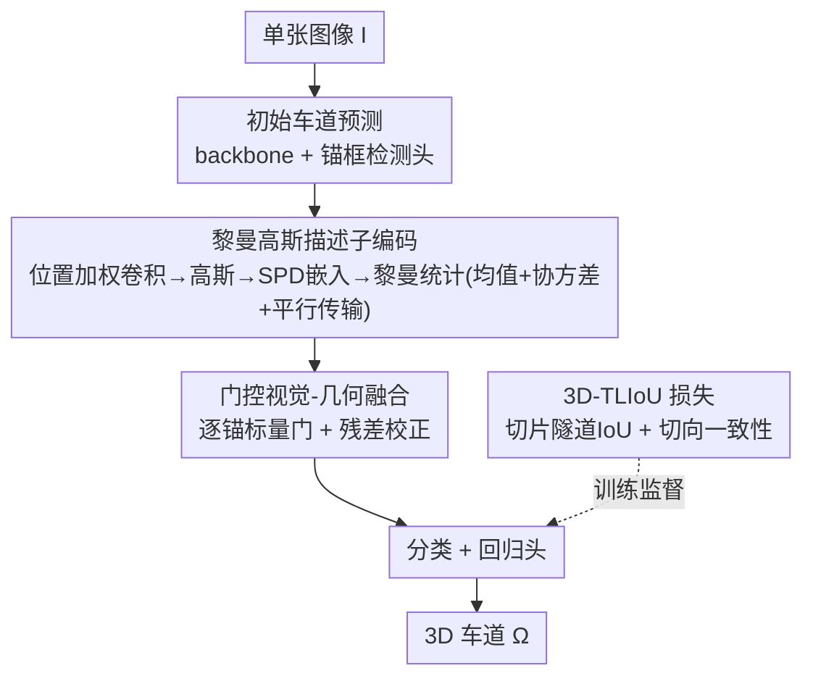

# ReManNet: A Riemannian Manifold Network for Monocular 3D Lane Detection

**会议**: CVPR 2026  
**论文**: [CVF Open Access](https://openaccess.thecvf.com/content/CVPR2026/html/Hong_ReManNet_A_Riemannian_Manifold_Network_for_Monocular_3D_Lane_Detection_CVPR_2026_paper.html)  
**代码**: https://github.com/changehome717/ReManNet  
**领域**: 自动驾驶 / 3D 车道线检测  
**关键词**: 单目3D车道检测, 黎曼流形, SPD矩阵, 流形学习, 几何一致性

## 一句话总结
针对单目 3D 车道线检测中"2D→3D 抬升因缺乏几何不变量而崩塌（凹陷、鼓包、扭曲）"的痛点，提出"道路是 $\mathbb{R}^3$ 中光滑 2D 流形、车道是嵌入其上的 1D 子流形"的道路流形假设，把车道几何编码为对称正定（SPD）流形上的黎曼高斯描述子并门控融合进视觉特征，再配一个切片式 3D 隧道车道 IoU 损失，在 OpenLane 上 F1 比基线提升 +8.2%、比此前最优 +1.8%。

## 研究背景与动机

**领域现状**：单目 3D 车道检测大致三类：(i) 深度引导——先估深度/体素再把图像证据抬到 3D；(ii) BEV 中心——把图像特征投到鸟瞰图回归车道，隐含地面平面假设；(iii) 线建模——用锚框、多项式/样条曲线或关键点显式参数化车道。

**现有痛点**：这些方法有个共同倾向——**把 2D 图像特征当作主预测信号**，重金投资深度图、BEV 特征、平面重建这类图像派生中间表示，而把真正的 3D 车道坐标降格为辅助角色（只当 RoI 采样目标、训练监督或弱几何正则）。结果是 3D 坐标作为"度量约束与拓扑结构载体"的价值被浪费。深度引导对深度质量极其敏感、误差逐级传播；BEV 方法的平面假设在坡道、起伏、超高弯道上系统性失真；线建模在视觉退化时局部线索缺失会让点预测与线模型的匹配不稳定。

**核心矛盾**：缺少车道与道路面之间**不变的"度量-拓扑耦合"**。直接从高维观测学习而不施加显式结构，是病态且脆弱的（维数灾难）——一旦把预测车道抬到 3D，重建出的道路空间就会结构性坍塌，表现为虚假的凹陷、鼓包和扭曲。即便是重建中心或图优化方法，也是在欧氏空间外在地恢复曲面，继承的是弦长欧氏度量而非道路面上的内蕴测地度量，这种度量不兼容会抹平细结构、扭曲曲率、产生虚假拓扑捷径。

**本文目标**：建立一个内蕴一致的表示，让度量与拓扑结构在道路面、车道曲线、采样点三个层级上对齐，从根上稳住 2D→3D 抬升。

**切入角度**：道路几何设计原则要求线形连续、曲率与坡度渐变，因此尽管全局起伏，**每个局部邻域都能用光滑非奇异曲面良好逼近**。据此作者提出道路流形假设，并用 SPD 矩阵在切空间里建模局部相关性来落地这一假设。

**核心 idea**：把车道几何从"欧氏空间里的坐标点"升级为"黎曼流形（SPD 锥）上的高斯描述子"，用内蕴测地度量保住度量与拓扑不变量，再与视觉特征门控融合，做几何一致的 3D 车道推理。

## 方法详解

### 整体框架
ReManNet 输入单张图像 $I \in \mathbb{R}^{3\times H\times W}$，输出一组 3D 车道 $\Omega = \{L_j\}_{j=1}^K$，每条车道是类别标签加固定长度点序列。流程是：先用图像 backbone + 锚框检测头（沿用 Anchor3DLane）给出初始 3D 车道预测，把初始点序列堆成张量 $X_{in}\in\mathbb{R}^{Q\times K\times 3}$；经位置加权卷积编码出紧凑几何特征后，对其做 K-Means 分组、把每组用高斯分布汇总并嵌入到 SPD 流形，计算流形均值、切空间协方差与平行传输后的局部特征，得到黎曼高斯描述子；再把 SPD 矩阵经矩阵对数映到李代数、向量化并投影成紧凑欧氏特征，由门控模块与视觉特征自适应融合，最后接分类/回归头出预测。整条线由几何一致的 3D-TLIoU 损失连同常规回归/分类目标端到端训练。

下面四个关键设计中，设计 1（道路流形假设）是支撑设计 2 的几何前提，设计 2/3/4 依次对应框架图里"几何描述子编码 → 门控融合 → 损失监督"的贡献节点。

### 关键设计

**1. 道路流形假设：把"道路是光滑流形"显式写成几何前提**

针对"欧氏空间缺度量不变量导致抬升崩塌"，作者不再把车道当散点，而是显式假设：道路面是 $\mathbb{R}^3$ 中一个光滑嵌入的二维流形 $\mathcal{M}$，容许一族欧氏图卡（chart）的光滑图册；车道是嵌入其上的光滑一维子流形 $\gamma\subset\mathcal{M}$，从 $\mathcal{M}$ 继承局部光滑与全局连贯；车道点是这些子流形上足够稠密的采样。配上由环境欧氏度量回拉到 $\mathcal{M}$ 的度量 $g$，$(\mathcal{M}, g)$ 构成黎曼流形，提供内蕴距离、支持坐标无关的目标与正则。作者特别强调：很多 SPD 网络直接套黎曼运算却没验证数据是否真有良定义的流形结构；本文把这一要求显式化为道路流形假设，作为全方法的几何地基——这是把"度量与拓扑跨曲面/曲线/点集对齐"落地的依据。

**2. SPD 流形上的黎曼高斯描述子：用内蕴测地度量编码局部车道几何**

这是把假设变成可学表示的核心模块。先用**位置加权卷积**强化空间关系：对车道 $j$ 第 $i$ 个采样点，在邻域 $E_i=\{i-1,i,i+1\}$ 上做距离感知加权 $x^{out}_{i,j}=\sum_{i'\in E_i}\alpha^{(j)}_{i,i'} \tilde{W}_r x^{in}_{i',j}$，权重 $\alpha^{(j)}_{i,i'}\propto \exp(-\frac{1}{\tau}|y^j_i-y^j_{i'}|)$ 由可学温度 $\tau$ 调节、相对位置核 $\tilde W_r$ 区分 $r\in\{-1,0,+1\}$。接着对编码特征做 K-Means 分成 $S$ 组，每组用高斯 $\mathcal{N}(\mu_s,\Sigma_s)$ 汇总，再按 Gaussian-to-SPD 构造映成**单位行列式 SPD 矩阵** $P_s$（Schur 补保证 $\det(P_s)=1$ 去掉尺度依赖、且 $P_s\in\mathrm{Sym}^{d+\rho}_+$ 正定）。然后在仿射不变黎曼度量（AIRM）下做黎曼统计：测地距离 $d_R(A,B)=\|\log(A^{-1/2}BA^{-1/2})\|_F$，黎曼均值 $P_m$ 由 log-average-exp 迭代求解；为把切向特征统一到同一坐标系，沿 AIRM 测地线做**平行传输** $\tilde X_s=CX_sC^\top$ 到可学 SPD 参考点 $P_{ref}$，再算切空间协方差 $P_c$，得到均值-协方差对（黎曼高斯描述子）。最后把 SPD 经矩阵对数映到李代数、用半直积参数化耦合均值坐标与协方差 Cholesky 因子、过可学下三角变换并投回 SPD 锥，再取对数、向量化、线性投影成紧凑融合描述子 $H\in\mathbb{R}^{d_h}$。整条链条始终在内蕴几何上操作，保住坐标不变性、各向异性与相关性。

**3. 门控视觉-几何融合：让几何描述子做"残差校正"而非喧宾夺主**

几何描述子要和视觉特征融合，但不能盖过主视觉信号。设锚级视觉特征 $F_{anchor}\in\mathbb{R}^{B\times A\times d_a}$、几何描述子 $H$ 沿锚维广播成 $\tilde H$，拼接后预测一个**逐锚标量门** $s_{gate}=ZW_{gate}$，再把视觉锚特征投到几何通道维 $F'_{anchor}=F_{anchor}W_a$，以 $g=\sigma(s_{gate})$ 做逐锚门控残差更新 $F=F'_{anchor}+g\odot\tilde H$。这里视觉锚特征是主分支、几何描述子提供门控残差校正——融合特征再送入分类/回归头。这种"主视觉 + 几何残差"的设计让几何信息在视觉线索可靠时退让、在弱视觉/强几何变化场景下补位。

**4. 3D 隧道车道 IoU 损失：从逐点距离升级为切片式形状级监督**

传统逐点距离损失独立打分各采样点、低估每个点对全局车道形状的贡献，对局部离群和抖动敏感、易过拟合点标注。受 2D 的 LineIoU 启发，作者沿 $Y_{ref}$ 把每条车道切成 $Q$ 个切片，在每个切片平面内用单调代理度量等半径圆盘的重叠：$\widehat{IoU}_i=\frac{2r_{tube}-d_i}{2r_{tube}+d_i}$（$d_i$ 为预测点与真值点距离，可为负以表分离程度）；再用切向余弦相似度 $Sim_i$ 算方向惩罚 $C_i=\frac{1-Sim_i}{2}$。聚合得曲线级目标 $\mathcal{L}_{3D\text{-}TLIoU}=1-\frac{\sum_i(2r_{tube}-d_i)}{\sum_i(2r_{tube}+d_i)}+\lambda_{sim}\frac{1}{Q-1}\sum_{i=2}^Q C_i$，同时奖励管状邻域重叠、正则切向一致性，对小噪声更鲁棒、沿车道的几何保真更好。总损失 $\mathcal{L}_{total}=\lambda_{cls}\mathcal{L}_{cls}+\lambda_{reg}(\mathcal{L}_x+\mathcal{L}_z)+\lambda_{tliou}\mathcal{L}_{3D\text{-}TLIoU}$。

### 损失函数 / 训练策略
位置加权卷积输出 $d=3$ 通道；K-Means 取 $S=30$ 组、20 次迭代；嵌入维 $\rho=1$；几何描述子维 $d_h=256$。3D-TLIoU 管半径 $r_{tube}=1.5$ m、余弦权 $\lambda_{sim}=0.4$；全局权重 $\lambda_{cls}=1,\lambda_{reg}=1,\lambda_{tliou}=0.5$。OpenLane/ApolloSim 分别训 60K/50K 次迭代，AdanW 优化器（lr $2\times10^{-4}$，weight decay $1\times10^{-4}$），batch size 4，单张 RTX 4090。

## 实验关键数据

### 主实验
评测指标：F1、类别准确率（Cate Acc）、近/远程横向纵向误差 Ex/N、Ex/F、Ez/N、Ez/F（near 0–40 m，far 40–100 m），匹配阈值 $\tau=1.5$ m、且至少 75% 采样点落入阈值才算 TP。OpenLane 主结果：

| 方法 | F1(%)↑ | Cate Acc↑ | Ex/N↓ | Ex/F↓ | Ez/N↓ | Ez/F↓ |
|------|--------|-----------|-------|-------|-------|-------|
| Anchor3DLane (R50)† 基线 | 57.5 | 91.6 | 0.233 | 0.246 | 0.080 | 0.106 |
| LATR (R50) | 61.9 | 92.0 | 0.219 | 0.259 | 0.075 | 0.104 |
| Glane3D (R50) 此前最优 | 63.9 | – | 0.193 | 0.234 | 0.065 | 0.090 |
| **ReManNet (R18)** | 63.5 | 92.8 | 0.222 | 0.265 | 0.069 | 0.089 |
| **ReManNet (R50)** | **65.7** | **94.7** | **0.189** | **0.205** | **0.060** | **0.072** |

ReManNet (R50) 拿下 SOTA：F1 比 Anchor3DLane R50 基线 +8.2%、比此前最优 Glane3D R50 +1.8%，并取得最高类别准确率与近/远程最低定位误差。场景级 F1 在大多数设置领先，增益集中在弱视觉/强几何变化场景：Extreme Weather +6.6%、Intersection +5.2%、Night +5.1%、Up & Down +5.0%；Merge & Split 偏低，作者归因于复杂拓扑交互局部违反流形一致性。在 ApolloSim 上 ReManNet (R50) 远程误差最均衡，Visual Variations 子集 F1 比此前最优 +1.6%。

### 消融实验
OpenLane 上的组件消融（基线 = Anchor3DLane R50，F1 57.5）：

| 配置 | F1(%)↑ | 相对基线 |
|------|--------|---------|
| Baseline | 57.5 | — |
| + 3D-TLIoU 损失 | 60.5 | +3.0 |
| + 黎曼高斯模块 | 62.0 | +4.5 |
| Full ReManNet | **65.7** | **+8.2** |

3D-TLIoU 损失内部再消融（基线 57.5）：

| 配置 | F1(%)↑ | 相对基线 |
|------|--------|---------|
| + $C_i$（切向余弦惩罚） | 58.6 | +1.1 |
| + 3D LIoU 项 | 59.9 | +2.4 |
| Full 3D-TLIoU | 60.5 | +3.0 |

### 关键发现
- **两大模块互补且超加性**：单加 3D-TLIoU 损失 +3.0%、单加黎曼高斯模块 +4.5%，两者合起来 +8.2% > 两者之和，证明几何编码与形状级监督相辅相成。
- **黎曼高斯模块单项贡献更大**（+4.5% vs +3.0%），说明把几何描述子搬到 SPD 流形确实增强了空间推理稳定性。
- **3D-TLIoU 两项也互补**：切向一致性 $C_i$（+1.1%）管方向、3D LIoU 项（+2.4%）管几何重叠，合起来 +3.0%，分别超过单项 +1.9%/+0.6%。
- **几何越关键的场景增益越大**：极端天气、夜间、坡道、路口这些弱视觉/强几何场景增益最高，印证"内蕴几何一致性"在视觉退化时的补位价值。

## 亮点与洞察
- **把"流形假设的合法性"显式化**：作者点破很多 SPD 网络套黎曼运算却没验证数据真有流形结构，本文用道路几何设计原则论证道路局部可被光滑曲面逼近，给黎曼运算一个站得住的前提——这种"先验自检"的思路对其他几何深度学习同样有借鉴意义。
- **用内蕴测地度量替代弦长欧氏度量**：直击重建/图优化方法"度量不兼容导致细结构坍塌、虚假拓扑捷径"的病根，是从度量层面而非网络容量层面解决问题。
- **几何作残差、视觉作主干**的门控融合，避免几何流盖过视觉信号，是一种稳妥可迁移的多模态融合范式。
- **3D-TLIoU 把 2D LineIoU 升到 3D 隧道形状监督**，用切片管状邻域重叠 + 切向一致性把"形状级对齐"显式写进损失，可迁移到其他曲线/管状结构的 3D 检测。

## 局限与展望
- **Merge & Split 场景偏低**：复杂拓扑交互（车道增减、分合流）局部违反流形光滑/一致性假设，是道路流形假设的盲区。
- **依赖初始预测质量**：黎曼几何编码建立在 backbone+锚框给出的初始车道点上，初始预测若严重缺失，几何描述子也难补救。
- **SPD 流形运算的开销与数值稳定**：矩阵对数/指数、平行传输、协方差求逆等需要 ridge 正则等技巧保数值稳定，工程上有一定门槛；论文未给推理时延对比。
- **改进方向**：为分合流等拓扑突变区设计局部多图卡/分段流形建模，或引入自适应管半径让 3D-TLIoU 适配不同曲率车道。

## 相关工作与启发
- **vs 深度引导（如 SALAD）**：它们坐标推断依赖中间深度图、误差逐级传播；ReManNet 不显式估深度，而在内蕴几何上约束 3D 结构，绕开了深度质量瓶颈。
- **vs BEV 中心（如 3DLaneNet/PersFormer）**：它们隐含地面平面假设，在坡道/起伏/超高弯道系统失真；ReManNet 的道路流形假设只要求局部光滑、不假设全局平面，坡道与起伏场景增益明显。
- **vs 线建模与重建/图优化（Anchor3DLane/LaneCPP/GLane3D/GP）**：它们用锚框、样条、关键点或欧氏重建，依赖宽度/平行/平滑等不普适的几何先验、且继承弦长欧氏度量；ReManNet 用 AIRM 测地度量保内蕴不变量，在 OpenLane 上反超 GLane3D +1.8% F1。

## 评分
- 新颖性: ⭐⭐⭐⭐⭐ 把单目 3D 车道检测重构到 SPD 黎曼流形并显式化流形假设，几何视角新颖且自洽。
- 实验充分度: ⭐⭐⭐⭐☆ OpenLane/ApolloSim 双榜 + 场景级 + 两层消融充分，但缺推理效率/时延对比、Merge&Split 仍弱。
- 写作质量: ⭐⭐⭐⭐☆ 几何动机与公式推导严谨完整，门槛偏高，普通读者需补黎曼几何背景。
- 价值: ⭐⭐⭐⭐⭐ 为几何感知的 3D 车道/道路重建提供了可迁移的内蕴几何建模与形状级监督范式。

<!-- RELATED:START -->

## 相关论文

- [\[CVPR 2026\] RaGS: Unleashing 3D Gaussian Splatting from 4D Radar and Monocular Cue for 3D Object Detection](rags_unleashing_3d_gaussian_splatting_from_4d_radar_and_monocular_cue_for_3d_obj.md)
- [\[CVPR 2025\] Rethinking Lanes and Points in Complex Scenarios for Monocular 3D Lane Detection](../../CVPR2025/autonomous_driving/rethinking_lanes_and_points_in_complex_scenarios_for_monocular_3d_lane_detection.md)
- [\[CVPR 2026\] HG-Lane: High-Fidelity Generation of Lane Scenes under Adverse Weather and Lighting Conditions without Re-annotation](hg-lane_high-fidelity_generation_of_lane_scenes_under_adverse_weather_and_lighti.md)
- [\[CVPR 2026\] A Prediction-as-Perception Framework for 3D Object Detection](a_prediction-as-perception_framework_for_3d_object_detection.md)
- [\[AAAI 2026\] Difficulty-Aware Label-Guided Denoising for Monocular 3D Object Detection](../../AAAI2026/autonomous_driving/difficulty-aware_label-guided_denoising_for_monocular_3d_object_detection.md)

<!-- RELATED:END -->
