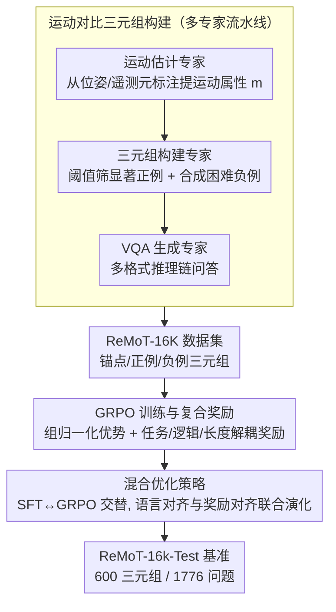

# ReMoT: Reinforcement Learning with Motion Contrast Triplets

**会议**: CVPR 2026  
**arXiv**: [2603.00461](https://arxiv.org/abs/2603.00461)  
**代码**: 无  
**领域**: 视觉语言模型 / 时空推理  
**关键词**: 运动对比三元组, GRPO, 时空推理, VLM, 数据构建

## 一句话总结

提出 ReMoT——一个统一训练范式，通过规则驱动的多专家协同构建 16.5K 运动对比三元组数据集 (ReMoT-16K)，结合带逻辑一致性奖励和长度正则化的 GRPO 强化学习优化，系统性解决 VLM 在导航、机器人操作和自动驾驶等场景中的细粒度时空推理缺陷。

## 研究背景与动机

**领域现状**：VLM（如 GPT-4o、Claude、Gemini、Qwen3-VL）已成为通用感知系统，但在需要跨帧/跨视角理解物理变化的任务中表现差。它们经常混淆相机旋转与物体运动、误判夹爪状态、错误推断角色运动方向。

**现有痛点**：
1. 现有 VLM 训练数据以静态图文对为主，缺少对细粒度运动属性的显式建模
2. 架构修改或数据增强的既有尝试只是零散修补，未提供覆盖数据-训练-评估的系统方案
3. 用 VLM 直接生成三元组数据存在 55% 格式错误率，且 API 成本高昂

**核心矛盾**：VLM 擅长语义对齐但缺乏物理-空间规律的深层理解，而获取大规模高质量运动对比训练数据又极其困难。

**本文目标**：如何高效构建大规模运动对比数据，并找到最优训练范式提升 VLM 的时空推理能力？

**切入角度**：从数据、训练、评估三个维度系统出发——规则驱动的多专家数据构建替代昂贵人工标注，GRPO 替代 SFT 实现更好的推理一致性，构建首个细粒度运动对比基准进行严格评估。

**核心 idea**：运动对比三元组 + GRPO 优化 = VLM 时空推理能力的系统性提升。

## 方法详解

### 整体框架

ReMoT 针对的是 VLM 一个具体短板：它们能做语义对齐，却常把相机旋转当成物体运动、误判夹爪开合、搞错角色运动方向，本质是训练数据里缺少对细粒度运动属性的显式建模。ReMoT 不做零散修补，而是从数据、训练、评估三个维度一起补：数据维度用多专家协同流水线造出 ReMoT-16K 运动对比三元组；训练维度系统比较 SFT、GRPO 及顺序/交替混合策略并配复合奖励；评估维度建 ReMoT-16k-Test 基准（600 评估三元组 / 1776 问题）做严格测量。

### 关键设计

**1. 运动对比三元组构建：用规则驱动的多专家流水线替代昂贵又易错的 VLM 生成**

直接用 VLM 生成三元组有 55% 格式错误率、API 还贵，人工标注更不可扩展。ReMoT 改用三个专家分工的规则化流水线来批量造数据：每个三元组 $(I_{anchor}, I_{pos}, I_{neg})$ 里，锚点-正例对展示某个运动属性 $m$，锚点-负例对视觉相似但运动属性相反——

- *运动估计专家* $g: (I_t, I_{t'}, \mathcal{A}) \to m$，从结构化元标注（如 $SE(3)$ 位姿矩阵、机器人遥测）里提运动属性；
- *三元组构建专家* 用属性阈值 $\phi(I_t, I_{t'}, m)$ 筛显著正例（如相机旋转角在 $[10°, 50°]$），再用几何变换合成或属性检索造困难负例 $\mathcal{N}(I_{anchor}, I_{pos}, m)$；
- *VQA 生成专家* 为每个三元组设计多角度推理链问答，覆盖选择、判断、填空、比较推理等格式。

因为属性来自确定性的元标注而非模型猜测，这条流水线的数据质量和扩展性都远胜 VLM 生成（实验里前者平滑扩展，后者波动饱和于 ~0.49）。

**2. GRPO 训练与复合奖励：用组归一化优势 + 解耦奖励压住推理的逻辑矛盾**

SFT 只学着对齐答案 token，难以保证推理链自洽（基线 31.4% 错误来自逻辑矛盾）。ReMoT 以 Qwen3-VL-4B-Thinking 为底座改用 GRPO：对一组 $G$ 个采样响应算组归一化优势 $\hat{A}_i = \frac{R_i - \bar{R}}{\sigma(\{R_j\})}$，奖励则拆成 $R_i = R_{task} + \lambda_1 R_{logic} + \lambda_2 R_{length}$ 三块解耦——CoT 长度正则 $R_{length}(o_i) = -\max(0, |o_i^{think}| - L_{target})$ 抑制冗余推理，逻辑一致性奖励检查答案间的传递性（如 $L_1 < L_2, L_2 < L_3$ 却 $L_3 < L_1$ 即矛盾）给出 $R_{logic} \in \{-1, 0, +1\}$，整体权重比为 $3.5:3.5:1.3:1.7$（格式:准确性:简洁性:逻辑一致性）。

把逻辑一致性单独拎成一项奖励是关键洞察：它直接惩罚"违反传递性"这类错误，实验里把准确率从 68.6% 抬到 78.0%。

**3. 混合优化策略：让语言对齐和奖励对齐联合演化**

纯 SFT 稳但不会推理、纯 GRPO 会推理但冷启动不稳，所以 ReMoT 又试了两种混合：顺序混合 (SFT→GRPO) 先用 SFT 给个稳定初始化再切 GRPO 精炼；交替混合 (SFT↔GRPO) 让两种步骤周期性交替，使语言对齐和奖励对齐一起往前走。最终交替混合最优，比基线 Qwen3-VL 高 +17.3 Overall / +25.1 Partial。

### 损失函数 / 训练策略

SFT 阶段用交叉熵，且只对 `<answer>` 内的 token 算损失：$\mathcal{L}_{SFT} = -\sum_{u \in \text{<answer>}} \log \pi_\theta(y_u | q)$。GRPO 阶段用标准 PPO 目标加 KL 正则（系数 0.01）。每轮训练 2 个 epoch，8×A800，混合精度。

## 实验关键数据

### 主实验（ReMoT-16k-Test 基准）

| 模型 | Overall Acc. | Partial Acc. |
|------|-------------|-------------|
| Qwen2.5-VL-7B | 5.1 | 25.4 |
| Qwen3-VL-CoT-4B (基线) | 20.7 | 38.9 |
| InternVL3-8B | 12.2 | 28.9 |
| LLaVA-One-Vision | 9.7 | 27.9 |
| GRPO (Ours) | 33.6 | 61.6 |
| SFT→GRPO (Ours) | 35.0 | 63.3 |
| **SFT↔GRPO (Ours)** | **38.0** | **64.0** |

交替混合策略相对基线 Qwen3-VL 实现 +17.3 Overall / +25.1 Partial 的飞跃。

### 消融实验

| 训练数据组成 | Overall Acc. | Partial Acc. |
|-------------|-------------|-------------|
| 无训练 (Qwen3-VL) | 20.7 | 38.9 |
| 仅 Manipulation | 23.9 | 46.7 |
| + Navigation | 32.4 | 57.6 |
| + Simulation | **38.0** | **64.0** |

| 逻辑奖励消融 | Overall | Partial | 逻辑一致性 |
|-------------|---------|---------|-----------|
| Qwen3-VL 基线 | 16.2 | 39.6 | 46.6% |
| GRPO 无逻辑奖励 | 68.6 | 77.3 | 98.6% |
| **GRPO 含逻辑奖励** | **78.0** | **81.3** | **99.3%** |

### 关键发现

- GRPO 显著优于 SFT，且交替混合 (SFT↔GRPO) 是最优策略
- 多专家构建数据的扩展性远优于 VLM 生成数据（平滑扩展 vs 波动饱和于 ~0.49）
- 逻辑一致性奖励将准确率从 68.6% 提升至 78.0%，解耦设计至关重要
- 导航数据对空间关系推理的贡献最大（+8.4%），验证了空间推理的核心地位

## 亮点与洞察

- **系统性方案**：首次从数据-训练-评估三个维度系统性解决 VLM 时空推理问题，而非零散修补
- **多专家流水线的工程智慧**：规则驱动替代 VLM 生成，从根本解决格式错误和扩展性问题
- **逻辑一致性奖励的洞察**：31.4% 错误来自逻辑矛盾（如违反传递性），显式建模这种一致性极为有效
- **小模型超大模型**：ReMoT-4B 在时空基准上超越 7.5× 大的 Qwen3-VL-30B，甚至匹配 GPT-4o

## 局限与展望

- 数据来源依赖有位姿等元标注的视频数据集，未涵盖所有场景域
- 仅在 Qwen3-VL-4B 上验证，更大基础模型的效果待探索
- 运动属性仅涵盖离散类别（左/右/上/下/开/合），连续运动量级的推理未涉及
- 交替混合策略的最优周期长度 $(K_{SFT}, K_{GRPO})$ 未充分消融

## 相关工作与启发

- **vs 3D/4D 感知方法**：这些方法通过深度/重建整合几何先验，但需要昂贵传感器且静态编码器弱化空间-时序关联；ReMoT 从对比学习和推理优化角度解决
- **vs DPO/RLHF**：DPO 依赖偏好数据且一致性有限；GRPO 的组归一化优势避免了偏好对标注，逻辑奖励额外保证了推理链的自洽
- **启发**：运动对比三元组的构建范式可推广到任何需要"相似但不同"辨别的任务；逻辑一致性奖励可集成到任何 CoT 推理的 RL 训练中

## 评分

- 新颖性: ⭐⭐⭐⭐⭐ 首个从数据/训练/评估三维度系统解决 VLM 时空推理的工作
- 技术深度: ⭐⭐⭐⭐ 多专家流水线设计精巧，复合奖励设计有理论动机
- 实验充分度: ⭐⭐⭐⭐⭐ 自建基准+7 个外部基准，消融详尽，比较全面
- 写作质量: ⭐⭐⭐⭐ 结构系统清晰，图示有效
- 实用价值: ⭐⭐⭐⭐⭐ 数据构建流水线和训练范式可直接复用，提升幅度显著

<!-- RELATED:START -->

## 相关论文

- [\[ICML 2026\] Constrained Multi-Objective Reinforcement Learning with Max-Min Criterion](../../ICML2026/autonomous_driving/constrained_multi-objective_reinforcement_learning_with_max-min_criterion.md)
- [\[ICML 2025\] GoIRL: Graph-Oriented Inverse Reinforcement Learning for Multimodal Trajectory Prediction](../../ICML2025/autonomous_driving/goirl_graph-oriented_inverse_reinforcement_learning_for_multimodal_trajectory_pr.md)
- [\[CVPR 2026\] SHARP: Short-Window Streaming for Accurate and Robust Prediction in Motion Forecasting](sharp_short-window_streaming_for_accurate_and_robust_prediction_in_motion_foreca.md)
- [\[CVPR 2026\] FlashCap: Millisecond-Accurate Human Motion Capture via Flashing LEDs and Event-Based Vision](flashcap_millisecond-accurate_human_motion_capture_via_flashing_leds_and_event-b.md)
- [\[NeurIPS 2025\] BayesG: Bayesian Ego-Graph Inference for Networked Multi-Agent Reinforcement Learning](../../NeurIPS2025/autonomous_driving/bayesian_ego-graph_inference_for_networked_multi-agent_reinforcement_learning.md)

<!-- RELATED:END -->
