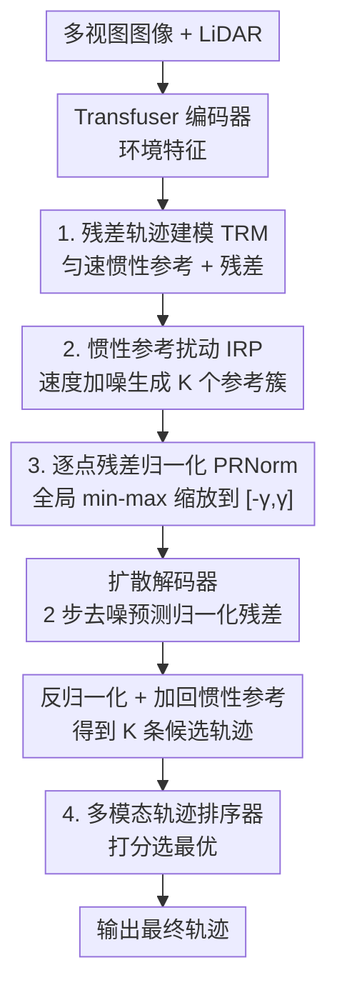

# ResAD: Normalized Residual Trajectory Modeling for End-to-End Autonomous Driving

**会议**: CVPR 2026  
**论文**: [CVF Open Access](https://openaccess.thecvf.com/content/CVPR2026/html/Zheng_ResAD_Normalized_Residual_Trajectory_Modeling_for_End-to-End_Autonomous_Driving_CVPR_2026_paper.html)  
**代码**: https://duckyee728.github.io/ResAD （项目页）  
**领域**: 自动驾驶 / 端到端规划  
**关键词**: 端到端自动驾驶, 残差轨迹建模, 惯性参考, 扩散规划, NAVSIM

## 一句话总结
ResAD 把端到端驾驶的轨迹预测从"直接预测未来轨迹"改成"预测相对惯性参考轨迹的归一化残差"，再用扰动惯性参考做多模态生成 + 扩散解码 + 轨迹排序，仅 2 步去噪就在 NAVSIM v1/v2 上拿到 88.8 PDMS / 85.5 EPDMS 的 SOTA。

## 研究背景与动机

**领域现状**：端到端自动驾驶（E2EAD）想绕开"感知→预测→规划"级联管线的误差传播，直接从原始传感器（多视图相机 + LiDAR）映射到一条未来轨迹。近期工作的发力点集中在更强的表征、传感器融合和架构（UniAD、VAD、DiffusionDrive、GoalFlow 等），但它们回答的都是同一个问题——"未来轨迹是什么样的？"

**现有痛点**：作者指出原始轨迹数据本身存在**时空不均衡**，直接预测会带来两个具体毛病。其一是**虚假相关（spurious correlations）**：把高维传感器数据硬映射到一条完整轨迹，模型容易学到捷径（比如"看到前车刹车灯就跟着刹车"），而没学到背后真正的驾驶逻辑（前车是因为红灯才停），导致危险的跟车闯灯。其二是**规划地平线困境（planning horizon dilemma）**：轨迹越往远处越不确定，远端路点的预测误差天然很大、loss 数值高，优化时会被这些远端大误差主导，反而牺牲了对碰撞安全最关键的近端路点精度。

**核心矛盾**：原始轨迹既有"均值漂移 + 方差随时间增大"的分布问题（图 1a），又把"学驾驶决策"和"学时空动力学"两件事混在一起，模型容量被复杂的时空模式吃掉，留给真正决策的容量不足。

**本文目标**：在不改变 E2EAD 基本输入输出的前提下，重构学习目标，让模型把容量集中在"该往哪偏、为什么偏"上，同时缓解远端不确定性对优化的支配。

**切入角度**：人开车时其实是在一个"什么都不操作就会沿着当前速度匀速滑行"的默认路径基础上做修正。把这个匀速外推路径当作确定性物理先验（惯性参考），模型只需要学相对它的偏差。

**核心 idea**：把任务从"未来轨迹是什么"改写成"轨迹为什么必须改变"——预测相对惯性参考的**残差**，并对残差做**逐点归一化**消除时空尺度差异，再靠**扰动惯性参考**生成上下文相关的多模态候选。

## 方法详解

### 整体框架
ResAD 接收多视图图像 + LiDAR 点云，用 Transfuser 风格编码器融合成环境表征。它先从自车当前状态（位置 + 速度）用匀速模型外推一条**惯性参考轨迹**，再对初始速度加高斯扰动生成一簇（K 个）参考，得到一簇对应残差；残差经逐点归一化后作为扩散解码器要去噪的数据样本，解码器以环境特征 + 各参考的位置编码为条件迭代去噪，输出归一化残差，再反归一化、加回各自的惯性参考得到一簇候选轨迹；最后由轨迹排序器打分选出最优轨迹。整条管线推理时仅用 DDIM 走 2 步去噪。

### 关键设计

**1. 残差轨迹建模（TRM）：用确定性物理先验把"学轨迹"变成"学修正量"**

针对"直接预测整条轨迹容易学虚假相关、且容量被时空动力学吃掉"的痛点，ResAD 不再从零预测轨迹，而是先建立一条**惯性参考** $\tau_{ref}$：设自车当前位置 $p_0=(x_0,y_0)$、速度 $v_0=(v_{x,0},v_{y,0})$，未来时刻 $t_i$ 的参考点用匀速模型外推 $p_{t_i}=p_0+v_0\cdot\Delta t_i$，代表"无任何控制输入时车会走的路径"。真正要预测的是**残差** $r=\tau_{gt}-\tau_{ref}$，即真值轨迹相对参考的逐点偏差。这样模型的学习目标从"未来轨迹是什么"变成"驾驶员为了避障/让行/转弯做了哪些修正"，把物理可预测的匀速部分交给先验、把容量集中在上下文驱动的决策上。消融里 TRM 是涨点主力（DAC +2.3、EP +2.5、PDMS +1.2），印证了它逼模型学真实驾驶逻辑而非捷径。

**2. 惯性参考扰动（IRP）：靠扰动初始速度生成上下文相关的多模态候选**

驾驶本质是多模态任务，但 DiffusionDrive、Hydra-MDP 这类方法依赖**固定轨迹词表**，词表里大多数选项和当前场景无关，既低效又限制了词表之外的最优解。IRP 换了个思路：直接对初始速度加零均值高斯扰动 $\delta_{v,k}\sim\mathcal{N}(0,\Sigma)$（$\Sigma=\mathrm{diag}(\sigma_{vx}^2,\sigma_{vy}^2)$ 控制纵/横向探索范围），得到 K 个扰动初速 $v'_{0,k}=v_0+\delta_{v,k}$，各自经匀速模型生成 K 条不同的惯性参考及对应残差。这样做有双重好处：一是天然生成多样且物理合理的意图假设（在原惯性参考邻域内采样，不会跑出可行范围）；二是逼模型对 GPS/IMU 等自车传感器噪声鲁棒。IRP 是单项最大增益（M3→M4，PDMS +1.6、EP +2.0、DAC +0.8），因为它给排序器提供了高质量且不塌缩的候选集。

**3. 逐点残差归一化（PRNorm）：消除残差的时空尺度方差，防远端误差支配优化**

即便改成残差，远端路点的残差数值仍然偏大，优化还是会被远场误差主导、忽略近场安全关键的细微调整。PRNorm 对残差做**全局**逐分量 min-max 归一化：在整个训练集上预计算每个维度 $d\in\{x,y\}$ 的极值 $r^d_{min},r^d_{max}$（跨所有轨迹和时间步），再把每个分量映射到对称区间 $[-\gamma,\gamma]$：

$$\tilde{r}^d_t = 2\gamma\left(\frac{r^d_t-r^d_{min}}{r^d_{max}-r^d_{min}+\epsilon_0}\right)-\gamma$$

其中超参 $\gamma>0$ 控制输出分布的边界、$\epsilon_0$ 保数值稳定。归一化后残差 $\tilde r=\mathrm{PRNorm}(r)$ 才作为扩散去噪的数据样本，推理时再反变换回真实残差。它把"数值小但安全关键"的近场调整和远场大偏差放到同一尺度上，使 loss 下降更快、收敛更稳（图 4），消融里把 EP 从 80.3 提到 81.4。

**4. 多模态轨迹排序器：从一簇候选里蒸馏规则规划器知识选最优**

扩散解码器吐出 K 条候选后需要选一条输出。排序器借鉴 VADv2/Hydra-MDP，把候选轨迹做位置编码 $V=\mathrm{PosEmb}(v_k)$，再用 Transformer 与环境表征 $E_{env}$ 交叉注意力交互、并注入自车状态 $E$，最后用一组 MLP 头预测每条候选在 PDMS/EPDMS 各子指标上的分数 $\hat S^m_i$。训练时用真值分数和真值轨迹做监督，把规则规划器的知识蒸馏进来：

$$\mathcal{L}_{ranker}=\sum_{i=1}^k y_i\log(\hat S^m_i)+\sum_{m,i}\mathrm{BCE}(S^m_i,\hat S^m_i),\quad y_i=\frac{e^{-(\tau_{gt}-\hat\tau_i)^2}}{\sum_j e^{-(\tau_{gt}-\hat\tau_j)^2}}$$

推理时对规划头输出打分、取加权分最高的轨迹作为最终输出。注意单独加排序器（M0→M1）几乎不涨点（PDMS +0.2），它必须配合 IRP 给出的高质量多样候选才有用。

### 损失函数 / 训练策略
扩散部分用普通 DDPM：对 PRNorm 后的残差簇加噪 $z^{(i)}_k=\sqrt{\bar\alpha_i}\tilde r_k+\sqrt{1-\bar\alpha_i}\epsilon$，解码器 $f_\theta$ 接 K 条带噪归一化残差预测去噪结果，重建损失 $\mathcal{L}_{diff}=\sum_{k=1}^K \mathcal{L}_{rec}(\hat r_k,r_k)$（$\mathcal{L}_{rec}$ 为 L1 或 MSE）。条件 $c$ 由编码器查询特征 + 时间步嵌入 + 各扰动参考的位置编码构成，后者让模型区分不同意图假设。NAVTRAIN 上从零训 100 epoch，时间步 T=1000，训练模式数 $K_{train}=20$、推理 $K_{infer}=200$，DDIM 仅 2 步去噪；预测 $T_f=8$ 个路点、步长 0.5s；8×L20 GPU、batch 512、AdamW。

## 实验关键数据

### 主实验
在 NAVSIM v1 NAVTEST（PDMS）与 v2（EPDMS）上对比（NAVSIM 基于真实 NuPlan 数据，2Hz 采样）。指标含义：NC 无碰撞、DAC 可行驶区域合规、EP 自车进度、TTC 碰撞时间、C 舒适度，PDMS/EPDMS 为综合分。

| 数据集 / 骨干 | 指标 | ResAD | 此前最佳 | 说明 |
|--------|------|------|----------|------|
| NAVSIM v1 / ResNet-34 | PDMS | **88.8** | 88.3 (WoTE) / 88.1 (DiffusionDrive) | 同骨干 SOTA |
| NAVSIM v1 / V2-99 | PDMS | **90.6** | 90.3 (GoalFlow / Hydra-MDP) | 更强骨干进一步领先 |
| NAVSIM v2 / ResNet-34 | EPDMS | **85.5** | 84.5 (DiffusionDrive) | DAC 97.2 vs 95.9、EP 88.2 vs 87.5 |

ResAD 在 v2 的提升主要来自更强的路线完成（EP）和可行驶区域合规（DAC），且仅用 2 步去噪。

### 消融实验
逐组件累加（NAVSIM v1，ResNet-34）：

| 配置 | 描述 | DAC ↑ | EP ↑ | PDMS ↑ | 说明 |
|------|------|-------|------|--------|------|
| M0 | Base Model | 94.2 | 78.1 | 84.9 | 直接预测轨迹 |
| M1 | + Ranker | 94.3 | 77.8 | 85.1 | 单加排序器几乎不涨（+0.2） |
| M2 | + TRM | 96.6 | 80.3 | 86.3 | 残差建模是涨点主力（+1.2） |
| M3 | + PRNorm | 96.7 | 81.4 | 87.2 | 稳收敛、EP +1.1 |
| M4 | + IRP | 97.5 | 83.4 | 88.8 | 单项最大增益（+1.6） |

即插即用验证（Tab. 4）：把 TRM(+PRNorm) 挂到 Transfuser（MLP 规划器）上，PDMS 84.0→85.2→85.6；挂到 TransfuserDP（扩散规划器）上同样涨点，说明 NRTM 是方法无关的 drop-in 策略。

### 关键发现
- **TRM 和 IRP 是两大功臣**：TRM 让模型学真实驾驶逻辑（DAC/EP 大涨），IRP 解锁真正上下文相关的多模态（单项 +1.6）。排序器只有配上 IRP 的高质量候选才有意义。
- **效率优势**：相比 DiffusionDrive，ResAD 多出的参数和推理时间几乎全来自排序器；本文额外引入平均 PDMS（$P_m$，衡量多模态候选整体质量）指标，ResAD 的 $P_m$=86.1 远高于 DiffusionDrive 的 60.3，说明它生成的候选整体更靠谱而非只有 Top-1 好。推理 11.4ms / 37 FPS（4090）。
- **PRNorm 加速收敛**：相比普通 min-max 归一化，PRNorm 让 L1 loss 下降更快、每步 PDMS 也更高（图 4）。

## 亮点与洞察
- **把"预测轨迹"重构成"预测残差"是个很轻但很有效的范式切换**：不改输入输出、不改骨干，只换学习目标和归一化，就能 drop-in 提升多种规划器，迁移性极强——这套 NRTM 思路可以直接搬到任何输出轨迹的 E2EAD 方法上。
- **用扰动惯性参考替代固定轨迹词表做多模态**，避开了词表"大多数选项与场景无关"的低效，生成的候选天然贴合当前场景，这是相比 DiffusionDrive/Hydra-MDP 最巧的差异点。
- **引入 $P_m$（平均候选质量）作为评测维度**，提醒大家多模态规划不能只看 Top-1，候选整体质量同样重要——这是个可复用的评测视角。

## 局限与展望
- 惯性参考用的是**匀速模型**外推，在剧烈加减速或大曲率场景下参考本身偏差很大，虽然残差能修正，但极端工况下参考质量是否会拖累优化值得深究。
- PRNorm 的极值 $r^d_{min},r^d_{max}$ 在**整个训练集上**预计算，换数据集/传感器配置需重新统计，且对训练集长尾极值敏感（⚠️ 论文未讨论极值鲁棒性）。
- 评测局限在 NAVSIM（开环、规则打分），真实闭环驾驶的表现仍需更多验证；附录提到有真车 demo 但正文未给定量闭环结果。
- 超参 $\gamma$、扰动协方差 $\Sigma$、$K_{train}/K_{infer}$ 的敏感性正文着墨不多，实际部署调参成本未知。

## 相关工作与启发
- **vs DiffusionDrive / Hydra-MDP（固定词表）**：它们从静态预定义轨迹词表里选/锚定，多数选项与场景无关、且无法生成词表外的最优解；ResAD 直接从高斯噪声去噪生成、靠扰动参考探索，候选上下文相关且不受离散集限制。
- **vs GoalFlow（目标条件生成）**：GoalFlow 先选目标点再用 Flow Matching 生成；ResAD 不显式选目标，而是用物理先验（惯性参考）+ 残差把生成问题简化，结构更可解释。
- **vs UniAD / VAD（直接预测轨迹）**：同样是端到端，但它们回答"轨迹是什么"，ResAD 回答"轨迹为什么改变"，把可预测的匀速部分交给先验、容量留给决策。

## 评分
- 新颖性: ⭐⭐⭐⭐ 残差轨迹建模 + 扰动参考多模态是清晰且实用的范式切换，虽然每个组件都不算颠覆，但组合到位
- 实验充分度: ⭐⭐⭐⭐ NAVSIM v1/v2 双榜 SOTA + 逐组件消融 + 即插即用验证 + 效率对比，较扎实；闭环验证偏弱
- 写作质量: ⭐⭐⭐⭐⭐ 动机图（图 1）和框架图清晰，"从 what 到 why"的叙事很有说服力
- 价值: ⭐⭐⭐⭐ drop-in 特性使其易被后续 E2EAD 方法吸收，实用价值高

<!-- RELATED:START -->

## 相关论文

- [\[ICLR 2026\] ResWorld: Temporal Residual World Model for End-to-End Autonomous Driving](../../ICLR2026/autonomous_driving/resworld_temporal_residual_world_model_for_end-to-end_autonomous_driving.md)
- [\[CVPR 2026\] ActiveAD: Planning-Oriented Active Learning for End-to-End Autonomous Driving](activead_planning-oriented_active_learning_for_end-to-end_autonomous_driving.md)
- [\[CVPR 2026\] Scaling-Aware Data Selection for End-to-End Autonomous Driving Systems](scaling-aware_data_selection_for_end-to-end_autonomous_driving_systems.md)
- [\[CVPR 2026\] DriveMoE: Mixture-of-Experts for Vision-Language-Action Model in End-to-End Autonomous Driving](drivemoe_mixture-of-experts_for_vision-language-action_model_in_end-to-end_auton.md)
- [\[CVPR 2026\] MeanFuser: Fast One-Step Multi-Modal Trajectory Generation and Adaptive Reconstruction via MeanFlow for End-to-End Autonomous Driving](meanfuser_fast_one-step_multi-modal_trajectory_generation_and_adaptive_reconstru.md)

<!-- RELATED:END -->
