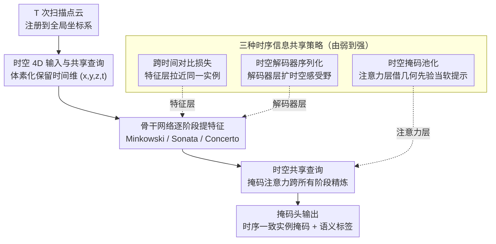

# ReScene4D: Temporally Consistent Semantic Instance Segmentation of Evolving Indoor 3D Scenes

**会议**: CVPR 2026  
**arXiv**: [2601.11508](https://arxiv.org/abs/2601.11508)  
**代码**: [项目主页](https://www.easteine.com/rescene4d/)  
**领域**: 自动驾驶 / 3D视觉 / 实例分割  
**关键词**: 4D语义实例分割, 时序一致性, 室内场景变化, 对比学习, 时空查询

## 一句话总结

定义并形式化了时间稀疏的 4D 室内语义实例分割（4DSIS）任务，提出 ReScene4D 方法通过时空对比损失、时空掩码池化和时空序列化三种时序信息共享策略，将 3D 实例分割架构扩展到 4D 维度，在 3RScan 数据集上实现 SOTA，同时提出新的 t-mAP 指标联合评估分割质量和时序身份一致性。

## 研究背景与动机

1. **领域现状**：3D 语义实例分割（3DSIS）在静态场景上取得了优异表现，代表方法包括 Mask3D、SPFormer、Relation3D 等基于查询的 Transformer 架构。同时，4D 激光雷达全景分割方法（Mask4D、Mask4Former）在密集采样的自动驾驶序列上取得进展。大规模自监督点云编码器（Sonata、Concerto）在多种 3D 任务上刷新了 SOTA。

2. **现有痛点**：(a) 3DSIS 方法独立处理每次观测，忽略时序身份连续性——两次扫描中同一把椅子会被割裂为两个独立实例；(b) 4D 激光雷达方法依赖高频密集采样和极小帧间变化的假设（光流跟踪、运动模型）——但室内场景的观测间隔可能是天、月甚至年，此间物体位置、外观甚至拓扑发生重大变化；(c) 变化检测方法能发现差异但不建立语义或实例级对应关系；(d) 没有现有指标能联合评估分割质量和时序身份一致性。

3. **核心矛盾**：室内环境的4D理解面临一个独特挑战——观测在时间上稀疏（间隔数天到数年），但场景变化可以很大（物体移动、出现或消失），传统依赖连续观测或运动模型的方法完全失效。需要在没有密集观测的情况下维持跨时间扫描的实例身份一致性。

4. **本文目标**：(1) 形式化定义时间稀疏 4DSIS 任务；(2) 设计无需密集观测的时序信息共享方法；(3) 提出联合评估分割和时序一致性的指标。

5. **切入角度**：跨时间观测共享信息——即使场景发生变化——不仅改善 4DSIS 也能提升单阶段 3DSIS。可以灵活利用几何和语义先验而非硬性要求几何对齐。

6. **核心 idea**：用时空查询联合预测所有时间阶段的实例掩码，通过三种渐进式时序信息共享策略（对比损失、时空掩码、时空序列化）在不依赖密集观测的前提下实现时序一致的实例分割。

## 方法详解

### 整体框架

ReScene4D 要解决的是这样一个场景：同一个房间在不同时间（间隔可能是几天到几年）被扫描了 $T$ 次，每次扫描之间家具搬动了、东西多了少了，要给所有扫描里的实例做语义分割，并且让"同一把椅子"在所有扫描里拿到同一个身份。它在 Mask3D 这个基于查询的掩码 Transformer 上做 4D 扩展：先把 $T$ 次扫描注册到同一坐标系，但体素化时保留时间维度（即每个点带 $(x,y,z,t)$ 四维），骨干网络对每个时间阶段独立提特征；然后一组**时空共享查询**通过掩码注意力跨所有时间阶段反复精炼，最终由掩码头一次性吐出在整个序列里身份一致的实例掩码和语义标签。真正让跨时间身份对齐起来的，是三个作用在架构不同层级的时序信息共享模块——对比损失（特征层）、时空掩码（注意力层）、时空序列化（解码器层），它们由弱到强地把"这是同一个物体"的信号注入网络。

### 关键设计

**1. 时空 4D 输入与共享查询：不叠帧、不压时间**

LiDAR 4D 方法（如 Mask4D）习惯把多帧点云叠加成一团 3D 点再处理，这隐含了一个假设——空间上对齐的点属于同一实例。在帧间几乎不动的自动驾驶序列里这没问题，但室内扫描间隔可能是几个月，物体早就挪走了，叠帧只会把不同物体糊在一起。ReScene4D 反其道而行：把序列点云注册到全局坐标系后形成 $\mathcal{P} \in \mathbb{R}^{N \times 4}$，第四维就是时间标签，体素化时**不**把时间压掉，不同时间观测的点在体素网格里保持独立。身份对齐不靠几何叠加，而靠一组时空共享查询联合预测所有阶段的掩码，省掉了事后再做实例匹配的步骤；位置编码用 4D 傅里叶特征把时间也编进去。为了抑制同一物体在不同时间被重复预测，未匹配的查询会吃一个更重的 no-object 语义惩罚（$\lambda_{noobj}=0.2$）。

**2. 跨时间对比损失：在特征层就把同一实例拉到一起**

第一个、也是最轻量的信息共享方式，完全不动网络结构，只加一项损失。它在池化后的超点特征上做监督式对比学习：用实例标注构建一个二元关系矩阵 $R_{GT} \in \{0,1\}^{S \times S}$，同一实例的超点是正对、不同实例是负对，而且正负对的采样**横跨整个时间序列**——这样"第一次扫描里的椅子"和"第三次扫描里同一把椅子"就被当成正对拉近。具体用 InfoNCE 形式

$$\mathcal{L}_{cont} = -\frac{1}{|S^+|}\sum_{i \in S^+}\log\frac{\sum_{j \in P(i)}\exp(L_{ij})}{\sum_k \exp(L_{ik})}$$

逼着网络学出时序一致的特征：同一实例跨时间的特征靠拢，不同实例的特征推开。因为只是训练时的信号注入、不改推理结构，它是三种策略里成本最低的一种，对"长得像但其实是不同物体"的模糊实例尤其管用。

**3. 时空掩码池化：用几何对齐当软提示，而不是硬约束**

对比损失只在特征层起作用，注意力层还可以再加一层共享。掩码注意力每轮会用上一轮的辅助掩码来决定查询关注哪些体素；这里的做法是把**不同时间阶段**的辅助掩码做一次逻辑 OR 时间池化，让某个时间步的查询也能去关注其它时间步里对齐的体素位置。关键在于它是自适应的：粗分辨率层级体素大、跨时间重叠概率高，信息共享强；细分辨率层级体素小、重叠变少，掩码自然退回各自独立精炼。它从不强制"空间对齐的点必须共享标签"——有重叠就借几何先验引一引注意力，没重叠就不产生任何影响。这正好贴合室内场景"大部分家具没动、少数挪了位置"的特点，对位移小但局部几何变化大的非刚性变化最有帮助。

**4. 时空解码器序列化：把感受野从纯空间扩到时空**

最后一个针对 PTv3 类骨干（Sonata / Concerto）。PTv3 的注意力建立在序列化之上——点云先用空间填充曲线（Z-order、Hilbert 等）排成一维序列再做注意力，改序列化顺序就等于改有效感受野。ReScene4D 把这个机制从纯空间扩到时空：在解码器里先把所有时间阶段的点云合并，再生成时空序列化模式，并和原始的纯空间序列化模式随机混合喂给解码器，这样解码器精炼某个点时能顺手看到其它时间步的互补邻居。编码器则保持预训练时的固定空间序列化、冻结参数不动，避免序列化方式一改就引入域偏移、毁掉预训练学到的表示。

### 损失函数 / 训练策略

- 主损失沿用 Mask3D 的掩码预测损失（包含语义分类和二值掩码损失）
- 附加跨时间对比损失 $\mathcal{L}_{cont}$
- 未匹配查询使用更高的 no-object 惩罚权重
- 混合训练集：3RScan 双阶段序列与 ScanNet 单扫描以 1.0:0.8 比例混合
- 对于 PTv3 骨干，编码器冻结（利用预训练权重），解码器从头训练

## 实验关键数据

### 主实验

**4DSIS 评估（3RScan 数据集）**：

| 方法 | t-mAP | t-mAP50 | t-mAP25 | mAP | mAP50 | mAP25 |
|------|-------|---------|---------|-----|-------|-------|
| Mask4D | 1.3 | 2.9 | 8.7 | 2.1 | 5.5 | 21.2 |
| Mask4Former | 17.0 | 38.9 | 59.1 | 21.7 | 45.6 | 66.3 |
| Mask3D+语义匹配 | 20.1 | 32.9 | 38.6 | 25.9 | 42.3 | 73.9 |
| Mask3D+几何匹配 | 20.7 | 43.1 | 62.4 | 29.7 | 54.1 | 70.9 |
| ReScene4D (Mink.) | 31.6 | 49.5 | 61.6 | 39.2 | 60.7 | 74.1 |
| ReScene4D (Sonata) | 33.2 | 50.7 | 63.3 | 40.9 | 62.8 | 79.1 |
| **ReScene4D (Concerto)** | **34.8** | **52.5** | **66.8** | **43.3** | **64.3** | **81.9** |

**单阶段 3DSIS 性能（4D 预测按阶段独立评估）**：

| 方法 | Stage | mAP | mAP50 | mAP25 |
|------|-------|-----|-------|-------|
| Mask3D (纯3D) | - | 46.4 | 68.5 | 78.5 |
| Mask3D+几何匹配 | 2 | 21.9 | 46.4 | 68.4 |
| **ReScene4D (C)** | 1 | **47.8** | 68.4 | **82.0** |
| **ReScene4D (C)** | 2 | **48.3** | **69.8** | **83.0** |

### 消融实验

**时序信息共享策略消融（Concerto 骨干）**：

| 对比损失 | ST-序列化 | ST-掩码 | t-mAP | t-mREC | 模糊实例 | 刚性变化 | 非刚性变化 |
|---------|----------|--------|-------|--------|---------|---------|----------|
| × | × | × | 28.4 | 41.8 | 20.4 | 44.9 | 62.1 |
| ✓ | × | × | 34.1 | 49.6 | 42.8 | 48.4 | 63.2 |
| × | ✓ | × | 32.9 | 48.8 | 43.2 | 40.9 | 67.0 |
| × | × | ✓ | 32.4 | 48.5 | 42.3 | 40.2 | 70.7 |
| ✓ | ✓ | × | **34.8** | 52.1 | 47.2 | 48.6 | 66.5 |

### 关键发现

- **LiDAR 方法在室内稀疏 4D 场景上严重退化**：Mask4D 的 t-mAP 仅 1.3，因为其 LiDAR 特定骨干从头训练在有限 3RScan 数据上效果很差。Mask4Former 依赖密集观测和平滑运动假设，也表现不佳。
- **骨干选择决定最佳时序策略**：Concerto 骨干最优策略是对比损失+ST序列化；Sonata 最优是 ST序列化+ST掩码；Minkowski 从对比损失获益最多。不同骨干的特征表示和潜在空间差异导致最优时序策略不同。
- **4D 联合推理反过来提升 3D 性能**：ReScene4D 的单阶段 mAP（47.8/48.3）超越了专门训练的 Mask3D（46.4），说明时序信息共享相当于一种数据和观测增强。
- **不同变化类型对策略的需求不同**：对比损失对模糊实例和刚性变化最有效（通过负对区分视觉相似实例），ST掩码对非刚性变化最有效（通过空间对齐帮助局部几何变化大但位移小的物体）。

## 亮点与洞察

- **t-mAP 指标设计**非常精心——使用 min-IoU 跨时间阶段取最小值，确保时序任一阶段的身份不一致都会被惩罚；同时通过迭代赋值策略处理模糊实例组（如一组外观相同的椅子互换位置不应算错）。这个指标可以直接被整个室内 4D 理解社区采用。
- **"不叠加、不对齐、不匹配"的设计哲学**：不像 LiDAR 方法将多帧叠加到 3D 中，ReScene4D 保持 4D 独立性但通过柔性策略共享信息，对稀疏观测和大幅变化的鲁棒性远超硬对齐方法。
- **将 ScanNet 单扫描数据混合训练**是一个实用技巧——因为模型不需要显式的时序瓶颈，可以同时处理单阶段和多阶段输入，利用更大规模的 ScanNet 数据增强语义覆盖。

## 局限与展望

- 受限于 3RScan 数据集的规模和标注质量：仅 17% 的验证集实例发生变化，时序标注不一致（主要针对前景物体），限制了时序策略的充分验证。
- 目前仅支持 $T=2$ 的序列长度，更长的时间序列（$T>2$）下的可扩展性未验证。
- PTv3 编码器由于计算限制未进行端到端微调，仅冻结使用——作者指出微调可能带来进一步提升。
- 小物体（如枕头）的分割仍然困难——3RScan 中小物体的非系统性标注导致模型倾向于忽略它们。
- 需要更大规模、更多样的 4D 室内场景数据集来推动此方向的研究。

## 相关工作与启发

- **vs Mask4D**: Mask4D 跨连续扫描传播实例查询但缺乏显式时序信息共享——后续扫描无法修正前面的预测或在共享上下文中对齐实例特征。ReScene4D 的联合时空查询精炼和信息共享策略直接解决了这个问题。
- **vs Mask4Former / SP2Mask4D**: 在叠加扫描上操作以强制空间对齐——适合 LiDAR 的微小帧间变化但不适合室内场景的重大变化。ReScene4D 不假设对齐而是柔性利用几何先验。
- **vs RescanNet**: 归纳式地逐步关联实例，依赖真值分割初始化和手工制作的分割/配准/匹配管道。ReScene4D 联合端到端预测所有时间阶段的一致实例掩码。
- **vs MORE**: 联合重建和重定位但依赖真值掩码过滤和启发式匹配。ReScene4D 不需要这些中间步骤。

## 评分

- 新颖性: ⭐⭐⭐⭐⭐ 形式化定义新任务、新指标、新方法三位一体，开辟了室内 4DSIS 这个新方向
- 实验充分度: ⭐⭐⭐⭐ 三种骨干×三种策略的全面消融、基线对比充分，但受限于数据集单一（仅 3RScan）
- 写作质量: ⭐⭐⭐⭐⭐ 问题定义清晰严谨，t-mAP 指标的设计论证（含 toy example）非常到位
- 价值: ⭐⭐⭐⭐ 为室内场景的长期动态理解提供了系统性的任务定义和基准方法，对数字孪生、设施管理等应用有直接价值

<!-- RELATED:START -->

## 相关论文

- [\[CVPR 2026\] Monocular Open Vocabulary Occupancy Prediction for Indoor Scenes (LegoOcc)](monocular_open_vocabulary_occupancy_prediction_for_indoor_scenes.md)
- [\[CVPR 2026\] TopoHR: Hierarchical Centerline Representation for Cyclic Topology Reasoning in Driving Scenes with Point-to-Instance Relations](topohr_hierarchical_centerline_representation_for_cyclic_topology_reasoning_in_d.md)
- [\[CVPR 2026\] CogDriver: Integrating Cognitive Inertia for Temporally Coherent Planning in Autonomous Driving](cogdriver_integrating_cognitive_inertia_for_temporally_coherent_planning_in_auto.md)
- [\[CVPR 2026\] EditSSC: Toward Editable Semantic Occupancy Scenes with Unconditional Diffusion Models](editssc_toward_editable_semantic_occupancy_scenes_with_unconditional_diffusion_m.md)
- [\[ECCV 2024\] Monocular Occupancy Prediction for Scalable Indoor Scenes](../../ECCV2024/autonomous_driving/monocular_occupancy_prediction_for_scalable_indoor_scenes.md)

<!-- RELATED:END -->
