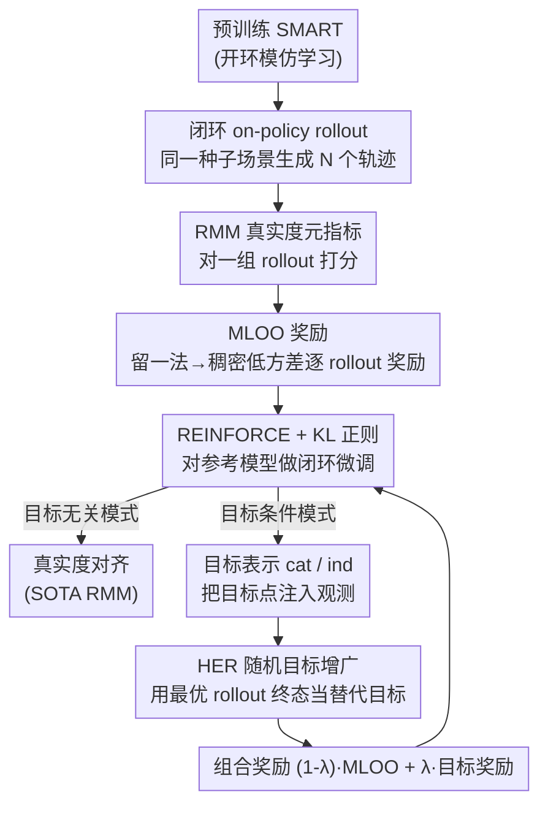

# RLFTSim: Realistic and Controllable Multi-Agent Traffic Simulation via Reinforcement Learning Fine-Tuning

**会议**: CVPR2026  
**arXiv**: [2605.19033](https://arxiv.org/abs/2605.19033)  
**代码**: [项目主页](https://ehsan-ami.github.io/rlftsim)  
**领域**: 自动驾驶 / 交通仿真  
**关键词**: 多智能体交通仿真、强化学习微调、Realism Meta-metric、目标条件控制、Hindsight Experience Replay  

## 一句话总结
把预训练好的模仿学习交通仿真模型（SMART）放进闭环里用强化学习再微调：以 Waymo 的真实度元指标 RMM 为奖励，但用一种 Leave-One-Out 改造（MLOO）把它变成低方差、稠密的逐 rollout 奖励，从而在 WOMD 上拿到 SOTA 真实度；再借助目标条件化与 HER，把"可控生成指定场景"的能力也蒸馏进来。

## 研究背景与动机
**领域现状**：多智能体交通仿真是自动驾驶测试的基础设施——要验证一辆 AV 安全，需要它在仿真里跑相当于数百万公里的场景。早期靠规则仿真器（IDM、恒速模型、日志回放），近年转向学习式模型，把多智能体仿真当作"下一 token 预测"问题，代表作 SMART 在十亿级 motion token 上训练、拿到 WOMD Sim Agents Challenge 的 SOTA 真实度。

**现有痛点**：这些学习式模型几乎都是**开环（open-loop）模仿学习**训出来的——训练时每一步都喂真值历史，但部署时是**闭环**自回归 rollout。开环训练无法捕捉真实驾驶里那种动态的多智能体交互，闭环部署时误差会逐步累积（distribution shift），还会引发因果混淆（causal confusion），让 agent 漂到没见过的、不真实的状态。即使是真值日志回放，因为 agent 不反应（non-reactive），闭环里同样不真实。

**核心矛盾**：要让模型对抗闭环误差累积，训练就必须在闭环里做；但闭环 RL 微调缺一个好的奖励信号。最直接的奖励——仿真轨迹和真值轨迹的平均距离误差 ADE——并不合适：一旦 agent 因随机性偏离真值轨迹，"猛地拉回预录真值"往往不是最真实的动作（比如已经进入了一个临界安全场景，回到真值反而违反物理/交通规则）。而 WOSAC 官方的真实度元指标 RMM 虽然综合、对随机性不敏感，却是**把一组 32 个 rollout 映射成一个标量**——天然稀疏，且只有 4 个 rollout 一组时方差又太大，从没人拿它直接当 RL 的优化目标。

**本文目标**：(1) 为闭环 RL 微调设计一个既稠密又低方差、且直接对齐"真实度"的奖励信号；(2) 在保持真实度的同时，把"可控性"（指定 agent 去某个目标点）也蒸馏进仿真模型。

**切入角度**：作者受"可验证奖励的 RL 能给基础模型注入新技能"启发，主张把 RMM 这个官方真实度指标本身改造成 RL 奖励——既然它就是榜单的评判标准，直接优化它就直接对齐了真实度。问题只剩"怎么把一个 population-level 的稀疏标量变成逐 rollout 的稠密信号"。

**核心 idea**：用 **Meta-metric Leave-One-Out（MLOO）**——通过"留一法"把 RMM 拆成每个 rollout 的相对贡献，得到一个零均值、低方差（方差随 rollout 数 $N$ 平方衰减）、稠密的逐样本奖励，配 REINFORCE + KL 正则做闭环微调；再叠加目标条件化 + HER 蒸馏可控性。

## 方法详解

### 整体框架
RLFTSim 是一个**后训练（post-training）框架**：输入是一个已经用开环模仿学习预训练好的交通仿真模型（这里用 SMART-tiny 作参考模型），输出是一个真实度更高、且可按目标点控制的微调模型。整个流程是闭环 on-policy 的——对数据集里的一个种子场景，模型自回归地生成一组 $N$ 个 rollout（每个 rollout 是全场所有 agent 在 $T$ 步内的联合轨迹），用真实度指标给这组 rollout 打分、转成逐 rollout 奖励，再用 REINFORCE 更新策略。

框架按两种模式运行：**目标无关模式（goal-free）** 只追求真实度对齐，奖励就是 MLOO；**目标条件模式（goal-conditioned, GCFT）** 在真实度之上追加"到达指定目标点"的可控性，奖励是 MLOO 与目标到达奖励的加权组合，并用 HER 缓解目标奖励的稀疏。两种模式共用同一套 REINFORCE 框架，只是奖励项和观测输入不同。

问题被建模成一个上下文 MDP $(S_t, A_t, S_{t+1}, R_{t+1}, C, G)$：状态 $S_t$ 是最多 $N_a$ 个 agent 的有限历史，动作 $A_t$ 是每个 agent 在离散 token 词表 $\mathcal{V}$ 上的决策，上下文 $C$ 含静态/动态地图特征，可选目标 $G=\{\mathbf{x}_g^j\}$ 指定一部分 agent 的目标坐标（$G=\emptyset$ 即 goal-free）。

### 关键设计

**1. MLOO：把稀疏的 RMM 元指标改造成稠密、低方差的逐 rollout 奖励**

这是全文核心。WOSAC 的真实度元指标 RMM（公式 1）是把 $N=32$ 个仿真 rollout 和真值轨迹在动力学、交互、地图三类特征上离散成 $K=20$ 个 bin，比较经验分布的吻合度，最终汇成一个标量：

$$\mathrm{RMM}=\sum_{d=1}^{D} w_d \left[\prod_{(a,t)\in V}\hat{P}_{d,a}(k^*_{d,a,t})\right]^{\frac{1}{|V|}}$$

其中 $\hat{P}_{d,a}(k)$ 是用仿真 rollout 估出的 agent $a$ 在特征维 $d$、bin $k$ 上的经验概率，$k^*$ 是真值所在 bin。问题在于：它是"一组 rollout → 一个标量"的映射，天然稀疏（一个 batch 只有一个奖励值），无法直接喂给 RL；若改成每 4 个 rollout 算一次以增加密度，每次估计样本太少、方差又爆了。

MLOO 用留一法绕开这个密度-方差两难。定义第 $i$ 个 rollout 的奖励为：

$$\mathrm{RMM}_i^{\mathrm{MLOO}}=\frac{1}{N}\sum_{j=1}^{N}\mathrm{RMM}_{-j}-\mathrm{RMM}_{-i}$$

$\mathrm{RMM}_{-i}$ 是**排除第 $i$ 个 rollout** 后用其余 $N-1$ 个算的 RMM。这样每个 rollout 都拿到自己的奖励（稠密），且构造上 $\sum_i \mathrm{RMM}_i^{\mathrm{MLOO}}=0$——它衡量的是每个 rollout 对整组真实度的**相对贡献**（拿掉它会让 RMM 变好还是变差），而非直接估 RMM 标量。优化用 REINFORCE，梯度 $g=\sum_i \nabla_\theta \log\pi_\theta(\tau_i)\,\mathrm{RMM}_i^{\mathrm{MLOO}}$，并对参考模型加 KL 散度正则保稳定。作者还给出两条理论性质：该梯度估计**无偏**（命题 1，目标是 $\nabla_\theta\mathbb{E}[\mathrm{RMM}(\tau_{1:N-1})]$，大 $N$ 下与真目标差异可忽略）；且 MLOO 的方差为 $O(1/(N^2 T))$，相比 RLOO 的 $O(1/T)$ 实现**对 rollout 数的平方级方差衰减**（命题 2-3）。直观上 RLOO 是"单 rollout 奖励减基线"，单 rollout 的 RMM 方差大且不随 $N$ 改善；MLOO 用的是"$N-1$ 个 rollout 的 RMM"，本身就更稳，多采样直接受益。这正是 RLFTSim 比启发式搜索类微调省样本的根源。

**2. 目标条件化的两种目标定义与表示：把"去哪"塞进观测，而不破坏真实度**

要可控，得让模型"看得到"目标。作者先定义目标判据：**硬目标（hard）** 要求 agent 最终位移落在目标坐标 2.0 米内；**软目标（soft）** 只要 rollout 过程中任意时刻经过目标 2.0 米内即算到达。由于目标常和地图相关，还引入**目标 polyline** $P_g^i=\arg\min_{\mathbf{m}\in\mathcal{M}}\lVert\mathbf{m}-\mathbf{x}_g^i\rVert$（离目标坐标最近的地图折线），它不改目标坐标，只提供额外地图上下文。

目标怎么注入观测有两种做法：**拼接（cat）** 直接把连续目标坐标接到 agent 状态向量后面；**指示（ind）** 在 agent 与道路 token 之间的相对位置编码上，额外加一个"是否目标 polyline"的二值指示位。实验里 ind 比 cat 更好地保住了真实度——因为 cat 硬塞连续坐标会扰动原状态表示，而 ind 是轻量地标注地图结构，对原模型分布扰动更小。

**3. HER 随机目标增广：用模型自己够得着的目标缓解奖励稀疏**

到达一个具体目标点是稀有事件，目标奖励极稀疏，纯靠它训不动。作者借鉴 Hindsight Experience Replay：对同一历史先验 $S_{<t}$ 生成一组 rollout（每步在 top-32 trajectory token 上做温度采样保证随机性），按 RMM 选出**最优 rollout**，把它里各 agent 的终态当作"替代目标" $\hat{X}_g$ 去增广数据集（算法 1）。训练这些样本时，把原目标 $\mathbf{x}_g^i$ 换成替代目标 $\hat{\mathbf{x}}_g^i$，并按 hindsight policy gradient 重算策略比率 $\hat{r}_{i,t}(\theta)=\frac{\pi_\theta(S_{\geq t}^i\mid S_{<t}^i,\hat{\mathbf{x}}_g^i,C)}{\pi_\theta(S_{\geq t}^i\mid S_{<t}^i,\mathbf{x}_g^i,C)}$。核心是：在 agent 够不到真值目标的难场景里，提供一个"它确实能到达"的中间目标，让稀疏的目标信号变得可学，软硬目标都适用。

**4. GCFT 组合奖励：在同一 REINFORCE 框架里平衡真实度与可控性**

目标条件微调（GCFT）的奖励把真实度和到达目标融在一起：

$$R_i^{\mathrm{GCFT}}=(1-\lambda)\,\mathrm{RMM}_i^{\mathrm{MLOO}}+\lambda\,R_i^{\mathrm{goal}}$$

$R_i^{\mathrm{goal}}$ 是被评估 agent 上二值"是否到达目标"奖励的均值，$\lambda\in[0,1]$ 调真实度与可控性的权衡。这个组合奖励直接进设计 1 那套 REINFORCE，无需另起炉灶——这也是为什么可控性能作为"对齐问题的一部分"被统一蒸馏进来。

### 损失函数 / 训练策略
- 基座 SMART-tiny 先在 WOMD 上按原配置训 32 epoch；RLFT 阶段只微调 1 epoch 即可拿到提升。
- 优化器超参：学习率 3e-6，目标 KL 散度 0.01 nats，每组 4 个 rollout，batch size 8；评估时按 WOSAC 原配置用 32 个 rollout。
- 训练目标为 REINFORCE 策略梯度（奖励为 MLOO 或 GCFT 组合奖励）+ 对参考模型的 KL 正则，KL 防止模型偏离预训练分布太远而崩。

## 实验关键数据

数据集为 Waymo Open Motion Dataset（WOMD），评测用 WOSAC 真实度元指标（RMM 为主指标，分动力学 / 交互 / 地图三个子维度）。

### 主实验

WOSAC 私有测试集榜单（v2025 权重，↑越大越好），RLFTSim 以 SMART-tiny 为基座微调 1 epoch：

| 模型 | RMM↑ | Kinematic↑ | Interactive↑ | Map-based↑ |
|------|------|------|------|------|
| TrajTok | 0.7861 | 0.4887 | 0.8116 | 0.9231 |
| UniMM | 0.7839 | 0.4914 | 0.8089 | 0.9188 |
| SMART-tiny (参考基座)† | 0.7824 | 0.4854 | 0.8089 | 0.9180 |
| SMART-tiny CAT-K | 0.7856 | 0.4931 | 0.8106 | 0.9205 |
| **RLFTSim (ours)** | **0.7867** | 0.4927 | **0.8129** | 0.9210 |

RLFTSim 在主指标 RMM 和交互维度上拿到 SOTA，且优于同样以 SMART-tiny 为基座的另一种微调法 CAT-K；相比自家基座，三个子维度全面提升。

### 消融实验

奖励函数消融（全验证集，括号为标准误）：

| 奖励 | RMM↑ | Kinematic↑ | Interactive↑ | Map-based↑ | minADE↓ |
|------|------|------|------|------|------|
| SMART-tiny 参考基座 | 0.7804 | 0.4904 | 0.8032 | 0.9167 | 1.3016 |
| minADE$^{\mathrm{RLOO}}$ | 0.7801 | 0.4897 | 0.8032 | 0.9161 | 1.3202 |
| RMM$^{\mathrm{RLOO}}$ | 0.7821 | 0.4913 | 0.8065 | 0.9169 | 1.3229 |
| **RMM$^{\mathrm{MLOO}}$ (本文)** | **0.7830** | **0.4924** | **0.8070** | **0.9182** | 1.3150 |
| Collision+Offroad+ADE | 0.7803 | 0.4896 | 0.8039 | 0.9162 | 1.3313 |
| Collision+Offroad | 0.7786 | 0.4891 | 0.8037 | 0.9117 | 1.3461 |

目标条件可控性消融（目标表示 × 判据，全验证集，Passing Miss Rate 越低越可控）：

| 配置 | Passing Miss Rate↓ | Kinematic↑ | Interactive↑ | Map-based↑ | RMM↑ |
|------|------|------|------|------|------|
| Goal-Free (RLFTSim) | 16.631 | 0.4924 | 0.8070 | 0.9182 | 0.7830 |
| (Concatenation, Soft) | 10.473 | 0.4794 | 0.8045 | 0.9134 | 0.7776 |
| (Concatenation, Hard) | 14.978 | 0.4791 | 0.8045 | 0.9129 | 0.7774 |
| **(Indication, Soft)** | **9.180** | 0.4887 | 0.8068 | 0.9175 | 0.7819 |
| (Indication, Hard) | 13.393 | 0.4916 | 0.8068 | 0.9179 | 0.7827 |

### 关键发现
- **直接优化 RMM 比模仿式奖励更对路**：用 minADE（模仿真值轨迹）当奖励几乎没提升真实度（RMM 0.7801，还略低于基座），印证了动机里"偏离真值后硬拉回不真实"的论断；直接拿 RMM 当目标才有效。
- **MLOO 略胜 RLOO，且更稳**：RMM$^{\mathrm{MLOO}}$（0.7830）> RMM$^{\mathrm{RLOO}}$（0.7821）。更重要的是经验方差分析（图 2）确认 MLOO 方差按 $1/N^2$ 衰减、拟合曲线吻合，而 RLOO 方差在大 $N$ 时**平台化、不随采样改善**——这是 MLOO 训练更稳、更省样本的实证支撑。
- **启发式奖励管不好真实度**：Collision+Offroad 这类启发式奖励虽能优化自己那项目标，却在接近最优阶段无法真正提升真实度（RMM 反而掉到 0.7786）。
- **可控性几乎不以真实度为代价**：所有 GCFT 变体都比 goal-free 基线显著降低 miss rate；其中 **indication + soft** 综合最好（miss rate 9.180，RMM 仍保持 0.7819）；indication 比 concatenation 更能保住真实度，soft 判据比 hard 更易达成。

## 亮点与洞察
- **"指标即奖励"的优雅闭环**：直接把榜单官方真实度指标 RMM 拿来当 RL 奖励，避免了交通仿真里"人类驾驶没有显式奖励、reward 难设计"的老大难；难点只剩"稀疏标量怎么变稠密信号"，而 MLOO 漂亮地解决了它。
- **MLOO 的留一构造同时拿到三个好处**：稠密（逐 rollout）、零均值（天然当成优势/基线用）、方差 $O(1/N^2T)$ 平方衰减，且有无偏性证明背书——这套构造不止用于 RMM，作者指出它可推广到**任何 population-based 指标**，迁移价值高。
- **把"可控性"重述为"对齐问题的一部分"**：可控生成不被当成另一个独立任务，而是用同一 REINFORCE 框架、只换奖励项 + 观测注入 + HER 就蒸馏出来，工程上很省。
- **HER 在交通仿真里的巧用**：用"模型按 RMM 选出的最优 rollout 的终态"当替代目标，既保证目标可达（缓解稀疏），又保证替代目标本身是真实的——一举两得。

## 局限与展望
- **token 表示限制响应性**：把轨迹切成 0.5 秒的 token 段，作者承认这在高动态场景下可能降低反应灵敏度。
- **可控性仍不完美**：GCFT 的 miss rate 最好也还有 9% 左右，目标到达率有提升空间；硬目标判据下尤其差。
- **RMM 本身是真实度的代理**：作者坦言 RMM 只是真实度的 proxy，它的"饱和"可能反映指标自身的不足而非仿真真的收敛了——这意味着一味优化 RMM 存在天花板，需要更好的真实度指标。
- **依赖强基座**：方法是后训练框架，效果建立在 SMART 这种已很强的预训练模型上，对弱基座是否同样有效未验证；提升幅度也相对温和（RMM 从 0.7824→0.7867），更多是在高位上的精修。

## 相关工作与启发
- **vs CAT-K（Closest-Among-Top-K）**: CAT-K 靠从离线演示里挑"最接近真值的候选动作"做闭环学习，但缺显式对齐目标，难保证守交通规则/物理约束；RLFTSim 直接把真实度指标当奖励、显式对齐，且在同基座下真实度更高（RMM 0.7867 vs 0.7856）。
- **vs DPA-OMF（Direct Preference Alignment from Occupancy Measure Feedback）**: DPA-OMF 避开了人工标注，但是**离线**方法、靠过采样 rollout 再只用其中一部分，样本低效；RLFTSim 是 **on-policy**，靠 MLOO 把所有 rollout 都用上做闭环真实度对齐。
- **vs 基于人类偏好的 RLHF 类对齐**: 这类方法依赖昂贵的人工反馈（给一个交通仿真排序要 40 秒以上），难规模化；RLFTSim 用可自动计算的 RMM 当可验证奖励，绕开人工标注。
- **vs 单智能体安全 RL 微调（如 [19]）**: 那类工作把模仿学习策略加安全奖励微调、在稀有场景减碰撞 38%，但聚焦单 agent 规划，不直接扩展到多智能体仿真；本文专门解决多智能体仿真的对齐与可控。

## 评分
- 新颖性: ⭐⭐⭐⭐ 首次成功把 WOSAC 官方 RMM 用作 RL 微调奖励，MLOO 的留一构造 + 平方级方差衰减证明扎实且可推广。
- 实验充分度: ⭐⭐⭐⭐ WOMD 私测榜 SOTA、奖励/可控性双消融、经验方差曲线 + 配对 t 检验俱全；但提升幅度温和、只验证了单一基座。
- 写作质量: ⭐⭐⭐⭐ 动机—问题—方法逻辑清晰，理论命题与工程实现衔接好。
- 价值: ⭐⭐⭐⭐ 给"学习式交通仿真闭环对齐 + 可控生成"提供了一条可复用、省样本的后训练范式，MLOO 对其他 population-based 指标也有迁移潜力。

<!-- RELATED:START -->

## 相关论文

- [\[ICLR 2026\] SMART-R1: Advancing Multi-agent Traffic Simulation via R1-Style Reinforcement Fine-Tuning](../../ICLR2026/autonomous_driving/advancing_multi-agent_traffic_simulation_via_r1-style_reinforcement_fine-tuning.md)
- [\[AAAI 2026\] WorldRFT: Latent World Model Planning with Reinforcement Fine-Tuning for Autonomous Driving](../../AAAI2026/autonomous_driving/worldrft_latent_world_model_planning_with_reinforcement_fine-tuning_for_autonomo.md)
- [\[CVPR 2026\] Beyond Rule-Based Agents: Active Markov Games for Realistic Multi-Agent Interaction in Autonomous Driving](beyond_rule-based_agents_active_markov_games_for_realistic_multi-agent_interacti.md)
- [\[ECCV 2024\] Improving Agent Behaviors with RL Fine-tuning for Autonomous Driving](../../ECCV2024/autonomous_driving/improving_agent_behaviors_with_rl_fine-tuning_for_autonomous_driving.md)
- [\[CVPR 2026\] Unsupervised Multi-agent and Single-agent Perception from Cooperative Views](unsupervised_multi-agent_and_single-agent_perception_from_cooperative_views.md)

<!-- RELATED:END -->
