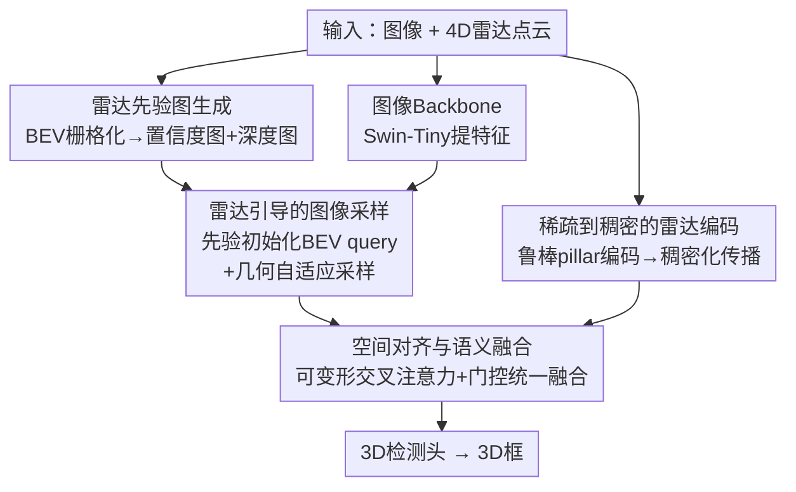

# RPGFusion: 4D Radar Prior-Guided Multi-Modal Fusion for 3D Detection

**会议**: CVPR 2026  
**论文**: [CVF Open Access](https://openaccess.thecvf.com/content/CVPR2026/html/Qiu_RPGFusion_4D_Radar_Prior-Guided_Multi-Modal_Fusion_for_3D_Detection_CVPR_2026_paper.html)  
**代码**: 无（论文未公开）  
**领域**: 自动驾驶 / 3D检测 / 多传感器融合  
**关键词**: 4D毫米波雷达, 雷达-相机融合, BEV感知, 3D目标检测, 稀疏到稠密

## 一句话总结
RPGFusion 把 4D 雷达的物理先验（置信度图 + 深度图）注入相机的图像到 BEV 变换过程，同时对稀疏含噪的雷达点云做鲁棒编码与稠密化，再经空间对齐和语义融合得到一致的 BEV 表征，在 VoD 和 TJ4DRadSet 上把雷达-相机 3D 检测刷到 SOTA（VoD 全标注区 69.31% mAP）。

## 研究背景与动机
**领域现状**：自动驾驶的 3D 检测越来越倾向在鸟瞰图（BEV）空间做多传感器融合，因为 BEV 把不同传感器统一到几何一致的坐标系，物体尺度归一化、跨模态天然对齐。把图像抬升到 BEV 主要有两条路：Lift-Splat-Shoot（LSS，前向投影显式抬升）和 BEV Query（后向投影，用可学习 query 隐式聚合图像信息）。4D 毫米波雷达相比传统 3D 雷达多了俯仰维，能给出距离、方位、俯仰、多普勒速度和强穿透能力，在恶劣天气下依然稳定，是补相机短板的理想模态。

**现有痛点**：两条 BEV 抬升路线各有硬伤。LSS 缺乏深度细化，BEV 特征随距离越来越稀疏（近密远疏），远处几乎是空的；BEV Query 虽然几何推理更准，但同一条视线（viewing ray）上的多个 query 会采到高度相似的图像特征，产生**空间歧义**——分不清前后。而直接把雷达 BEV 特征和图像 BEV 特征相加/拼接也不行：雷达点云本身稀疏、分布不规则、含噪，得到的雷达 BEV 特征空间关系断裂、不连续，跟稠密规整的图像特征强行融合会引入错位、稀释有用信号。

**核心矛盾**：4D 雷达明明带着丰富的物理先验（RCS 反射强度隐含类别信息、多普勒速度给运动上下文、高度量测帮 BEV↔图像平面对齐），但这些先验在 2.5D/3D 雷达时代因点云空间相干性弱、噪声大而难以利用；如今 4D 雷达让这些先验变得可靠，却没被充分用来引导图像 BEV 的构建。

**本文目标**：把 4D 雷达的物理先验真正用起来，分解为三件事——① 用雷达先验引导图像到 BEV 的采样，缓解视线歧义和近密远疏；② 对雷达点云本身做鲁棒去噪 + 稀疏到稠密的特征传播；③ 把对齐后的雷达和图像 BEV 做语义互补融合。

**切入角度**：作者观察到雷达点的空间分布和 RCS 反射强度可以离散化成两张稠密的 BEV 先验图——置信度图（哪里有物体）和深度图（物体多远），这两张图能直接当作图像采样的"几何锚点"。

**核心 idea**：用雷达派生的置信度/深度先验图去锚定并调制图像 BEV query 的初始化与采样，同时对雷达分支做"鲁棒编码 → 稠密化"两步走，最后用可变形交叉注意力做空间对齐 + 语义融合，端到端产出一致互补的 BEV 表征。

## 方法详解

### 整体框架
RPGFusion 的输入是单帧图像 + 4D 雷达点云，输出是 3D 检测框。整条 pipeline 是双分支渐进式编码融合：图像分支经 backbone 提特征后，被雷达派生的先验图引导着采样进 BEV；雷达分支则把原始点云先鲁棒编码成 pillar 特征、再稠密化、再展平成雷达 BEV 特征；两路 BEV 特征经空间对齐和语义融合，最后统一融合送入检测头。关键在于雷达不只是被融合的一路，它还充当"指挥棒"——先验图全程指导图像 BEV 的初始化与采样。

### 关键设计

**1. 雷达先验图：把点云变成可直接采样的置信度图与深度图**

针对"图像抬升 BEV 时近密远疏 + 视线歧义"这个痛点，作者不在图像平面上做高斯扩散（投影和标定误差会扭曲几何），而是直接在 BEV 空间把雷达点云栅格化成两张稠密先验图。对每个 BEV 栅格 $g$，先算每个雷达点的径向距离 $D_i=\sqrt{x_i^2+y_i^2}$ 和归一化反射权重 $w_i=\text{Norm}(\text{RCS}_i)$，再让每个点通过一个以 $(x_i,y_i)$ 为中心的高斯核贡献到周围栅格，形成置信度图 $M_{\text{conf}}[g]=\sum_i w_i\exp(-d_{g,i}^2/2\sigma_1^2)$ 和深度图 $M_{\text{depth}}[g]=\frac{\sum_i w_i D_i\exp(-d_{g,i}^2/2\sigma_2^2)}{\sum_i w_i\exp(-d_{g,i}^2/2\sigma_2^2)}$。置信度图编码物体在平面上的几何分布（哪里有反射、哪里可靠），深度图编码距离信息。这两张图在 BEV 空间生成，保留了雷达真实的空间结构，给后续图像采样提供物理可测的显式引导。

**2. 雷达引导的图像采样：用先验锚定 query 初始化与采样位置**

这是消除视线歧义的核心。图像 BEV query 的初始化融合三种信息：可学习的语义基嵌入 $E_{\text{base}}$、正弦余弦位置编码经 MLP 得到的几何位置嵌入 $E_{\text{pos}}$、以及雷达先验嵌入 $E_{\text{prior}}$。先验嵌入用一个交叉调制方案让深度图和置信度图互相条件化——$A=\sigma(\text{Conv}_{1\times1}(M_{\text{depth}}))$、$B=\sigma(\text{Conv}_{1\times1}(M_{\text{conf}}))$，再 $E_{\text{prior}}=\text{Conv}_{3\times3}(\text{Concat}(M_{\text{conf}}\odot A,\ M_{\text{depth}}\odot B)+\text{Conv}_{1\times1}(M_{\text{conf}}+M_{\text{depth}}))$，让深度线索抑制虚假反射、置信线索强化可靠区域。初始 query 为 $Q^{(0)}=E_{\text{prior}}+E_{\text{pos}}+E_{\text{base}}$。采样时把每个 BEV 栅格用 4D 雷达提供的高度 $z=h_g$ 投影回图像平面（这正是俯仰维带来的好处，保证垂直定位准确），再加可学习偏移 $\Delta^{\text{learned}}_{g,m}$ 取多个采样点；聚合时注意力权重还被雷达先验放大：$\hat Q_j=\sum_{m\in S_j}\alpha_{j,m}(1+\lambda M_{\text{conf}}[g_j]+M_{\text{depth}}[g_j])V_{j,m}$，其中 $\lambda$ 是可学习标量，自适应放大高置信雷达区域的贡献。三层迭代更新后 reshape 成图像 BEV 特征 $B_I$。

**3. 稀疏到稠密的雷达编码：先鲁棒去噪再向空洞栅格传播**

针对雷达点云稀疏含噪导致 BEV 特征断裂的痛点，分两步走。**鲁棒编码**：把点云离散成 BEV pillar，对非空格用均值/中位数统计量 $t_g=[x^{\text{mean}}_g,y^{\text{mean}}_g,z^{\text{median}}_g,u^{\text{median}}_g,\text{RCS}^{\text{mean}}_g,n_g]$（中位数对多径/动态物体造成的离群反射更鲁棒），再引入邻域加权 RCS 置信度 $c_i=\frac{\sum_{j\in N_i}\text{RCS}_j}{\sum_{k\in P}\text{RCS}_k+\epsilon}$——空间孤立或 RCS 分布异常的点拿到低置信（$c_i\approx0$），空间一致的反射拿高权重，从而压住孤立噪声；pillar 特征按 $\hat t_g=\text{MLP}(t_g)\odot(\frac{1}{|P_g|}\sum_{i\in P_g}c_i)$ 加权。**稠密化**：因为大量 BEV 格没有量测，每个空格按空间邻近度 + 特征相似度的权重 $\alpha_{i,g}\propto\exp(c_i\cdot\exp(-d_{j,i}^2/2\sigma^2)\cdot\text{sim}(t_g,t_i))$ 从邻域多尺度地聚合特征 $\hat M_{\text{dense}}[g]=\sum_{i\in N_g}\alpha_{i,g}t_i$，再和原始 pillar 特征经残差卷积融合成稠密雷达 BEV 特征 $B_R$。消融显示稠密化比鲁棒编码贡献更大。

**4. 空间对齐与语义融合：可变形交叉注意力对齐 + 门控统一融合**

图像和雷达 BEV 特征先各自经 LayerNorm + $3\times3$ 卷积 + BN + ReLU 标准化，再做**空间对齐**：对每个 query 在局部几何邻域内做可变形交叉注意力 DCMA，用可学习偏移 $\Delta p_{hmjk}$ 自适应采样邻域、实现精确几何对齐，得到 $B^{\text{align}}_I,B^{\text{align}}_R$。然后**语义融合**用固定采样位置的可变形交叉注意力让两模态互换语义线索——$\hat B_I=\text{DCMA}(B^{\text{align}}_I,P_I,B^{\text{align}}_R)$，对方模态当 key/value。最后**统一融合**不用简单相加/拼接（会放大噪声或稀释信号），而是生成门控图 $G=\sigma(\text{Conv}_{1\times1}([B^{\text{align}}_I\|B^{\text{align}}_R]))$，按 $B_{\text{mix}}=G\odot B^{\text{align}}_I+(1-G)\odot B^{\text{align}}_R$ 逐格调制——图像负责细粒度物体细节、雷达负责 BEV 空间里准确的朝向，门控让每个 BEV 格自适应决定信谁多一点。

## 实验关键数据

### 主实验
在 View-of-Delft（VoD）验证集和 TJ4DRadSet 测试集上评测。VoD 报告全标注区（EAA）和驾驶走廊区（DCA）两套 mAP，IoU 阈值汽车/卡车 0.5、行人/骑车人 0.25。

| 数据集 | 区域/指标 | RPGFusion | 之前SOTA(CVFusion) | 提升 |
|--------|-----------|-----------|--------------------|------|
| VoD val | 全标注区 mAP | **69.31%** | 65.41% | +3.90% |
| VoD val | 驾驶走廊 mAP | **86.20%** | 82.42% | +3.78% |
| TJ4DRadSet | 3D mAP | **43.05%** | 40.00% | +3.05% |
| TJ4DRadSet | BEV mAP | **46.86%** | 44.07% | +2.79% |

分类别看 VoD 全标注区：汽车 67.37%（CVFusion 60.87%）、行人 59.94%、骑车人 80.62%，三类全面领先。换不同 2D backbone（ResNet-50/101、Swin-Tiny）也一致超越同 backbone 的对手，如 ResNet-101 下 RPGFusion 全标注区 67.24% vs HGSFusion 58.96%。

### 消融实验
四组消融分别拆解先验图、鲁棒编码+稠密化、空间对齐+语义融合、统一融合策略（数值为 VoD 全标注区 mAP）。

| 配置 | VoD-EAA mAP | 说明 |
|------|-------------|------|
| Full model | 69.31% | 完整模型 |
| Query Init 去置信图 | 64.72% (↓4.59) | query 初始化少了置信先验 |
| Query Init 去两图 | 58.29% (↓11.02) | 先验图对 query 初始化不可或缺 |
| Image Sampling 去两图 | 52.47% (↓16.84) | 先验对图像采样更关键 |
| 去鲁棒编码+稠密化 | 54.10% | 雷达分支不增强 |
| 仅稠密化(无鲁棒编码) | 66.68% | 稠密化贡献最大 |
| 仅鲁棒编码(无稠密化) | 59.34% | 鲁棒编码次之 |

### 关键发现
- **先验图对图像采样比对 query 初始化更关键**：在图像采样模块去掉两张先验图，VoD-EAA mAP 暴跌 16.84%（69.31→52.47），远大于 query 初始化去两图的 11.02%，说明雷达先验最大的价值是消除后向投影的视线歧义、锚定采样位置。
- **稠密化是雷达分支的涨点主力**：单加稠密化 mAP 到 66.68%，单加鲁棒编码只到 59.34%，二者都有则 69.31%——稀疏点云的稠密传播比去噪更能补上 BEV 特征的空洞。
- **语义融合方向敏感**：双向语义融合都关掉时 VoD-EAA 掉 16.52%，其中"相机从雷达更新自己"这一支单独关掉就掉 11.73%，说明图像分支很依赖雷达提供的空间/物理线索来消歧。

## 亮点与洞察
- **把雷达从"被融合者"提升为"引导者"**：先验图不参与最终预测，而是去锚定图像 query 的初始化和采样位置——这是一种轻量但高效的先验注入方式，避免了重型雷达分支也能显著降低图像抬升 BEV 的歧义。
- **BEV 空间生成先验图而非图像平面**：作者特意指出在图像平面做高斯扩散会被投影/标定误差扭曲几何，改在 BEV 空间扩散保留真实空间结构——这个 trick 对任何想用稀疏几何先验引导稠密特征的任务都可借鉴。
- **门控统一融合按格自适应**：用 sigmoid 门控 $G$ 逐 BEV 格决定信图像还是信雷达，比固定权重相加更能处理"近处信图像细节、远处信雷达几何"的空间异质性。
- **邻域加权 RCS 置信度**是个巧妙的去噪信号：用反射强度的空间一致性区分真实物体反射和多径噪声，几乎零额外参数。

## 局限与展望
- 论文未公开代码，复现需自行实现可变形交叉注意力 + 雷达先验图生成等多个模块。⚠️
- 只在 VoD 和 TJ4DRadSet 两个相对小规模的 4D 雷达数据集上验证，未在更大规模/更多类别或夜间/雨雾极端天气子集上单独评测——而 4D 雷达的卖点正是恶劣天气鲁棒性，缺这块直接证据。⚠️
- VoD 官方测试服务器未开放，结果报在验证集上（作者明确说明），与其他在测试集报告的方法横向比较时需留意此 caveat。
- 方法仍是单帧融合，未利用多普勒速度做时序聚合——而雷达的运动线索本可进一步提升动态物体检测，是明显的扩展方向。
- 高斯核 spread $\sigma_1=\sigma_2=1.6$m、邻域半径 $r=2.0$m 等先验图超参对不同数据集的雷达密度可能敏感，论文未给跨数据集的超参敏感性分析。

## 相关工作与启发
- **vs CVFusion / RaGS（雷达-相机 BEV 融合 SOTA）**：它们也在 BEV 做融合，但 RPGFusion 把雷达先验更显式地注入到图像 BEV 的"构建"过程（query 初始化 + 采样锚定），而非仅在融合阶段用雷达，因而在 VoD 全标注区超 CVFusion 3.90% mAP。
- **vs LSS / BEV Query 抬升范式**：LSS 近密远疏、BEV Query 视线歧义，RPGFusion 用雷达深度/置信先验同时缓解这两个问题——本质是给后向投影补上了缺失的空间分离信号。
- **vs SMURF（雷达稀疏性处理）**：SMURF 用核密度估计 + 多表示融合缓解雷达稀疏，RPGFusion 的稀疏到稠密编码则结合邻域加权置信度去噪 + 特征相似度引导的稠密传播，并把稠密化证明为雷达分支的最大增益来源。

## 评分
- 新颖性: ⭐⭐⭐⭐ 雷达先验引导图像采样 + 稀疏到稠密编码的组合较新，但单个模块（BEV query、可变形注意力、pillar 编码）多为已有组件的精巧拼装。
- 实验充分度: ⭐⭐⭐⭐ 两数据集 + 多 backbone + 四组细致消融，但缺恶劣天气子集和大规模数据集验证。
- 写作质量: ⭐⭐⭐⭐ 动机推导清晰、公式完整、图示到位；部分符号（如统一融合的残差归一化）描述略简。
- 价值: ⭐⭐⭐⭐ 把 4D 雷达先验用法做实，对自动驾驶低成本雷达-相机感知有直接参考价值。

<!-- RELATED:START -->

## 相关论文

- [\[CVPR 2026\] R4Det: 4D Radar-Camera Fusion for High-Performance 3D Object Detection](r4det_4d_radar-camera_fusion_for_high-performance_3d_object_detection.md)
- [\[CVPR 2026\] RaGS: Unleashing 3D Gaussian Splatting from 4D Radar and Monocular Cue for 3D Object Detection](rags_unleashing_3d_gaussian_splatting_from_4d_radar_and_monocular_cue_for_3d_obj.md)
- [\[CVPR 2026\] Look Before You Fuse: 2D-Guided Cross-Modal Alignment for Robust 3D Detection](look_before_you_fuse_2d-guided_cross-modal_alignment_for_robust_3d_detection.md)
- [\[CVPR 2025\] RaCFormer: Towards High-Quality 3D Object Detection via Query-based Radar-Camera Fusion](../../CVPR2025/autonomous_driving/racformer_towards_high-quality_3d_object_detection_via_query-based_radar-camera_.md)
- [\[ICCV 2025\] CVFusion: Cross-View Fusion of 4D Radar and Camera for 3D Object Detection](../../ICCV2025/autonomous_driving/cvfusion_cross-view_fusion_of_4d_radar_and_camera_for_3d_object_detection.md)

<!-- RELATED:END -->
