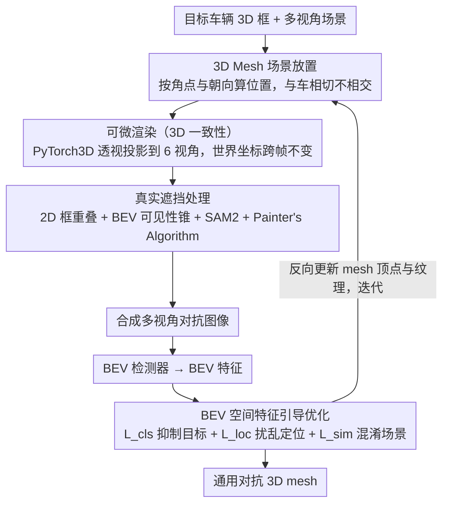

<!-- 由 src/gen_stubs.py 自动生成 -->
# SABER: Spatially Consistent 3D Universal Adversarial Objects for BEV Detectors

**会议**: CVPR2026  
**arXiv**: [2505.22499](https://arxiv.org/abs/2505.22499)  
**代码**: [项目页](https://npucvr.github.io/SABER)  
**领域**: 自动驾驶  
**关键词**: 对抗攻击, BEV 3D检测, 非侵入式攻击, 可微渲染, 通用对抗物体, 多视角一致性

## 一句话总结

提出首个面向BEV 3D检测器的非侵入式、3D一致的通用对抗物体生成框架SABER，通过在场景中放置优化后的3D mesh来干扰多视角多帧检测，揭示BEV模型对环境上下文先验的过度依赖。

## 研究背景与动机

**BEV检测广泛部署**：纯视觉BEV 3D检测（BEVDet、BEVFormer等）因低成本被大量车企采用，其对抗鲁棒性直接关系行车安全

**现有攻击需侵入目标**：当前主流方法（对抗贴图/纹理）需要物理接触并修改目标车辆，在真实场景中不可行且不可扩展

**2D攻击缺乏3D一致性**：已有的非侵入式攻击大多基于2D patch粘贴，忽略3D空间结构，无法在多视角和多帧间保持攻击效果

**遮挡建模不合理**：Adv3D等基于NeRF的方法从单一视角渲染后"粘贴"到图像上，无法正确处理场景中的遮挡关系

**场景级攻击更危险**：相比修改单个目标，在环境中放置恶意物体可造成大规模、不可预测的检测失败，威胁更大

**揭示模型脆弱性**：需要系统化方法来评估BEV模型是否过度依赖学习到的环境共现先验，而非真正理解场景

## 方法详解

### 整体框架

SABER 要回答的问题是：纯视觉 BEV 检测器能不能被一个放在车旁、不接触目标的 3D 物体骗倒。它的 pipeline 分三步：先在 3D 场景里自动给对抗 mesh 选个合适位置，再用可微渲染把它渲成多视角一致的对抗图像、并用遮挡处理模块保证物理合理，最后通过 BEV 空间特征引导的优化让攻击跨视角、跨帧都有效；优化得到的梯度反向更新 mesh 的顶点与纹理，迭代直到攻击收敛。

### 关键设计

**1. 3D Mesh 场景放置：把对抗物放在车旁而不是贴在车上**

主流对抗攻击要物理接触并改目标车，真实场景里不可行也没法规模化。SABER 改在目标 3D 边界框底部角点附近放一个对抗 mesh：根据车辆 8 个角点坐标和朝向角算放置位置，让 mesh 与车相切但不相交，距离 $d$ 可调以支持不同偏移。mesh 用显式表面表示（顶点 $\mathcal{V}$、面片 $\mathcal{F}$、纹理 $\mathcal{T}$），天然兼容物理引擎，为后面打到物理世界留好接口。

**2. 可微渲染保证 3D 一致性：让攻击在六个视角和多帧间都成立**

2D patch 贴图忽略 3D 结构，换个视角或换一帧就失效。SABER 用 PyTorch3D 对每个相机视角做透视投影渲染：mesh 顶点 $v_j$ 先经相机外参 $(R_i, T_i)$ 变到相机系，再经内参 $K_i$ 投到 2D，输出 RGB 图像 $I_{\mathcal{M},i}^{\text{rgb}}$ 和 soft mask $I_{\mathcal{M},i}^{\text{mask}}$；多帧场景里 mesh 保持世界坐标不变。因为同一个 3D mesh 被一致地渲到所有视角和帧，攻击才具备真正的 3D 一致性而非单视角假象。

**3. 真实遮挡处理模块：让"被挡住"这件事在渲染里真的发生**

Adv3D 这类方法从单视角渲染后直接"粘贴"到图像上，遮挡关系是错的。SABER 用两阶段过滤判定遮挡：先在各视角做 2D 包围框重叠检查（公式2），再在 BEV 平面构建从相机原点到 mesh 顶点的可见性锥 $\mathcal{F}_{\mathcal{M},i}^{\text{BEV}}$（公式3），检查场景物体是否落入锥内；对确认的遮挡物用 SAM2 分割其 mask 并更新 mesh 透明度（公式4），多 mesh 场景则用 Painter's Algorithm 从远到近依次 alpha 混合（公式5）。这样渲染出的对抗图像在视觉上是物理合理的，不会出现"该被挡却浮在前面"的破绽。

**4. BEV 空间特征引导优化：不止骗最终框，直接扰乱特征**

只攻击最终预测框的攻击迁移性差。SABER 把损失打到 BEV 特征层，由三项构成：目标抑制 $\mathcal{L}_{\text{cls}}$ 最小化目标区域内的置信度响应（公式6），定位扰乱 $\mathcal{L}_{\text{loc}}$ 最大化预测框与 GT 框的 L1 距离（公式7），场景混淆 $\mathcal{L}_{\text{sim}}$ 最小化对抗图像与原图 BEV 特征的余弦相似度（公式8）来诱导全局误检。直接扰动特征表示，使攻击在不同视角和距离下更稳，也正是它能暴露"模型过度依赖环境共现先验"的原因。

### 损失函数 / 训练策略

总体目标同时优化 mesh 顶点和纹理：

$$\min_{\mathcal{V},\mathcal{T}} \mathcal{L}_{\text{attack}} = \mathcal{L}_{\text{cls}} + \alpha \mathcal{L}_{\text{loc}} + \beta \mathcal{L}_{\text{sim}}$$

其中 $\alpha = \beta = 10$。

## 实验

### 实验设置

- **数据集**：nuScenes（训练集28,130帧，验证集6,019帧，6相机360°覆盖）
- **被攻击模型**：BEVDet (ResNet-50)、BEVDet4D (ResNet-50)、BEVFormer (ResNet-101)
- **评估指标**：ASR（攻击成功率，IoU阈值0.3-0.7）、mAP、NDS
- **初始mesh**：圆柱体（半径0.3m，高度2.0m），放置在目标车辆右后底角0.1m处

### 主实验结果

| 模型 | Clean mAP | Adv mAP | mAP下降 | Clean NDS | Adv NDS | NDS下降 |
|------|-----------|---------|---------|-----------|---------|---------|
| BEVDet (无遮挡) | 0.309 | 0.130 | 57.9% | 0.394 | 0.210 | 46.7% |
| BEVDet (有遮挡) | 0.309 | 0.160 | 48.2% | 0.394 | 0.267 | 32.2% |
| BEVDet4D (无遮挡) | 0.314 | 0.156 | 50.3% | 0.447 | 0.276 | 38.3% |
| BEVFormer (无遮挡) | 0.370 | 0.165 | 55.4% | 0.478 | 0.288 | 39.7% |

### 与现有方法对比

与Adv3D对比（Tab.2）：SABER在NDS上造成41.4%下降 vs Adv3D的19.3%，mAP下降55.6% vs 44.0%，且Adv3D的baseline已因随机渲染两辆车导致严重自遮挡而大幅下降。

与UAP对比（Tab.3）：在低/中IoU阈值（ASR₀.₁=0.568 vs 0.405，ASR₀.₃=0.613 vs 0.514）显著优于UAP，而UAP需要侵入式贴片直接覆盖目标。

### 消融实验

**初始形状**：圆柱体、立方体、球体均可有效攻击。立方体因类车几何形状在场景级攻击中略有优势（NDS降至0.205），但圆柱体因光滑表面更适合实际部署。

**攻击距离**：0.1m至1.0m范围内攻击效果稳定（Adv NDS在0.263-0.276之间），证明不依赖特定偏移量。

**随机放置数量**：1/3/5/7/10个可见mesh的ASR₀.₃分别为0.175/0.300/0.401/0.590/0.793，攻击效果随数量线性增长。

### 关键发现

- 非对抗灰色圆柱体（Init）本身造成的性能下降很小，而优化后的对抗mesh（Adv）造成显著额外下降，说明攻击利用了模型的上下文推理漏洞
- BEVFormer优化出的对抗物体呈现行人纹理，暗示模型学到了语义错误的关联，可能源于数据集缺陷
- 物理实验证实：将3D打印的对抗mesh放置在真实车辆旁，可导致定位错误和误检

## 亮点

- **首创非侵入式3D一致对抗攻击**：无需接触目标，仅通过环境放置mesh即可造成场景级检测失败
- **完整的物理合理性保证**：遮挡处理模块结合2D+BEV双重检查和SAM2分割，渲染结果视觉上合理
- **BEV特征级攻击**：超越仅攻击最终预测框的范式，直接扰乱特征表示，提升跨视角/距离鲁棒性
- **揭示深层脆弱性**：证明BEV模型过度依赖物体共现先验，对环境上下文不具备鲁棒性
- **物理实验验证**：从数字域到物理世界的概念验证，增强了实用性论证

## 局限性

- 白盒攻击设定，需要完整模型访问权限，黑盒迁移性未充分验证
- 遮挡处理依赖SAM2分割质量和GT标注，实际部署时可能不可用
- 物理实验仅为概念验证（单场景），未进行大规模户外测试
- Mesh初始化为简单几何体，未探索更复杂/更隐蔽的伪装形状
- 仅评估了3个BEV检测器，未涵盖最新的流式/端到端架构

## 相关工作

- **侵入式3D攻击**：对抗纹理[Athalye 2018]、对抗迷彩[Wu 2020]，需修改目标，不实际
- **非侵入式2D攻击**：UAP[38]在车辆表面贴patch，Brown 2017的对抗patch，缺乏3D一致性
- **Adv3D** [15]：基于NeRF生成对抗车辆，但从单一视角渲染后粘贴，遮挡和透视不正确
- **LiDAR攻击** [Chen 2024, Tu 2020]：修改点云分布，与本文纯视觉设定不同
- **融合攻击** [Abdelfattah 2021]：在车辆上放置对抗mesh攻击多模态管线，仍为侵入式

## 评分

- 新颖性: ⭐⭐⭐⭐ — 首次系统化研究非侵入式3D一致对抗攻击，威胁模型新颖
- 实验充分度: ⭐⭐⭐⭐ — 3个模型+物理实验+丰富消融，但黑盒迁移和大规模物理验证欠缺
- 写作质量: ⭐⭐⭐⭐ — 问题定义清晰，方法阐述详尽，图表辅助说明到位
- 价值: ⭐⭐⭐⭐ — 对BEV感知安全性有重要警示意义，暴露了模型对环境先验的依赖

<!-- RELATED:START -->

## 相关论文

- [\[CVPR 2026\] Learning to Identify Out-of-Distribution Objects for 3D LiDAR Anomaly Segmentation](learning_to_identify_out-of-distribution_objects_for_3d_lidar_anomaly_segmentati.md)
- [\[CVPR 2026\] ReScene4D: Temporally Consistent Semantic Instance Segmentation of Evolving Indoor 3D Scenes](rescene4d_temporally_consistent_semantic_instance_segmentation_of_evolving_indoo.md)
- [\[CVPR 2026\] Learning Mutual View Information Graph for Adaptive Adversarial Collaborative Perception](learning_mutual_view_information_graph_for_adaptive_adversarial_collaborative_pe.md)
- [\[ICCV 2025\] Counting Stacked Objects](../../ICCV2025/autonomous_driving/counting_stacked_objects.md)
- [\[ICML 2026\] Plug-and-Play Label Map Diffusion for Universal Goal-Oriented Navigation](../../ICML2026/autonomous_driving/plug-and-play_label_map_diffusion_for_universal_goal-oriented_navigation.md)

<!-- RELATED:END -->
