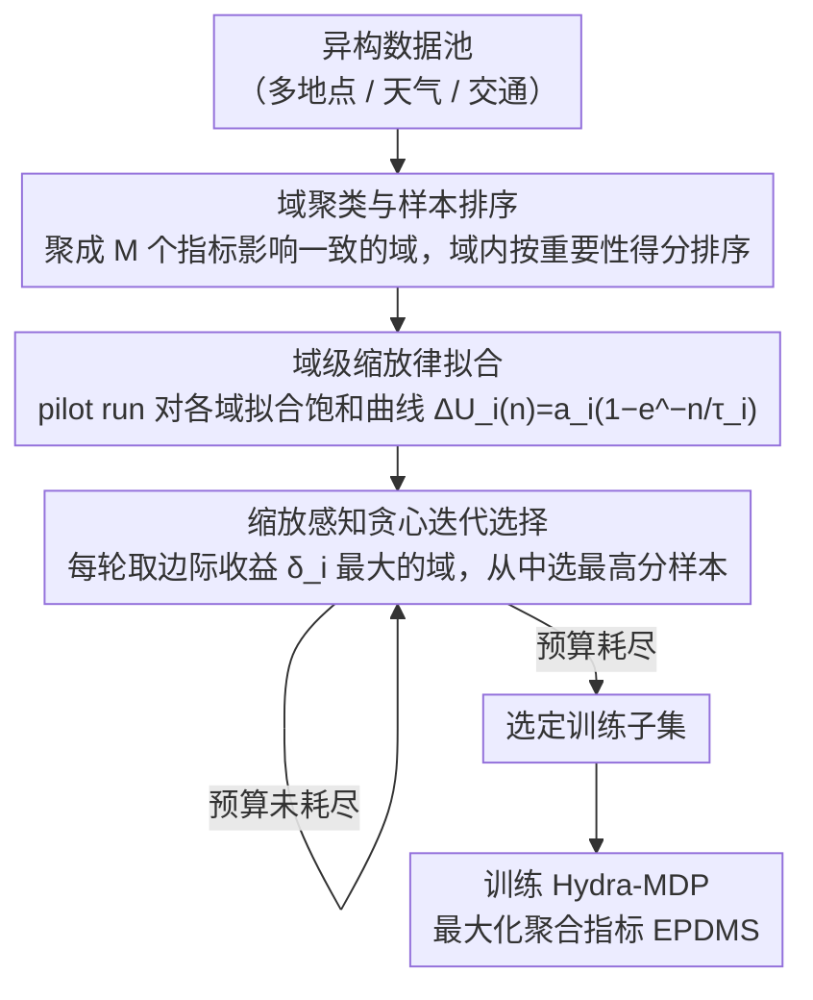

# Scaling-Aware Data Selection for End-to-End Autonomous Driving Systems

**会议**: CVPR 2026  
**arXiv**: [2604.08366](https://arxiv.org/abs/2604.08366)  
**代码**: 无  
**领域**: 自动驾驶  
**关键词**: 数据选择, 神经缩放律, 数据混合优化, 端到端自动驾驶, EPDMS

## 一句话总结

提出MOSAIC框架——通过聚类数据、拟合各域对评估指标的缩放律、贪心迭代选择边际收益最大的数据簇样本，实现端到端自动驾驶模型的高效数据选择，用80%更少的数据达到甚至超越基线性能。

## 研究背景与动机

1. **领域现状**：大规模深度学习模型依赖多样化训练数据，尤其在自动驾驶等物理AI应用中，数据覆盖不同地点、天气和交通条件。但训练全部数据计算成本极高，需要智能数据选择策略。
2. **现有痛点**：(A) 影响力估计和主动学习方法在特征空间操作，但不考虑不同数据如何影响不同评估指标；(B) 现有数据混合方法（如DoReMi, ADO）假设域已明确定义且同质，忽略了数据源对不同指标的异构影响率；(C) 物理AI系统需要同时优化多个潜在竞争的指标（如路线进度 vs 驾驶舒适度 vs 碰撞避免）。
3. **核心矛盾**：同一训练样本对不同指标有不同贡献率，现有框架无法建模这种"数据-指标"的多对多且异质的影响关系。
4. **本文目标** 在有限数据预算下，从异构数据池中选择能最大化聚合指标（EPDMS）的训练子集。
5. **切入角度**：将数据池聚类为具有相似指标影响的域，对每个域单独拟合缩放律，再通过迭代贪心选择最优混合比例。
6. **核心 idea**：先聚类、后拟合缩放律、再贪心选择——将复杂的多指标数据选择问题分解为可独立估计的域级缩放问题。

## 方法详解

### 整体框架

MOSAIC 想回答一个很实际的问题：当训练全部自动驾驶数据成本太高、只能挑一个子集来训时，应该挑哪些、各域挑多少，才能让聚合驾驶指标 EPDMS 最大化？它的思路是把这个棘手的多指标选择问题拆成三步逐层求解：先把异构数据池**聚类成若干个"内部影响一致"的域**，再对每个域单独**拟合一条"加多少数据换多少指标增益"的缩放律**，最后用**贪心迭代**逐个从当前边际收益最高的域里取样本，直到把预算花完。整条流水线的关键在于：把"哪些数据有用"这个全局耦合的问题，降维成每个域内部"再加一个样本值不值"的局部判断。

### 关键设计

**1. 域聚类与样本排序：把异构数据池切成"指标影响一致"的子集**

自动驾驶数据天然异构——匹兹堡的弯道和拉斯维加斯的城区，对碰撞避免、路线进度这些指标的贡献率完全不同，直接在整池上估计"加数据有多少收益"会被这种异质性搅乱。MOSAIC 先用特征表示（语义描述、地理位置等）把数据池聚成 $M$ 个域，让每个域内部的样本对各指标的影响大致一致；这样后续在域内拟合缩放律才有一个稳定的统计前提。域内部再按重要性得分排序，得分定义为当前模型在该样本上的聚合指标值 $\mathcal{I}(x) = U(\{\mathcal{G}_r(f(\cdot; \mathcal{D}_{train}), x)\}_{r=1}^R)$，选数据时优先取高分样本，保证同等数量下挑到的是域里最有价值的那批。聚类负责"解耦异质影响"，排序负责"域内优中选优"，两者一起把全局选择拆成可独立处理的域级问题。

**2. 域级缩放律拟合：用一条饱和曲线刻画每个域的"边际收益递减"**

要做贪心选择，先得知道"从某个域再加 $n$ 个样本，聚合指标会涨多少"。MOSAIC 在这里下了一个关键假设——各域对混合效用的贡献可以线性分离：

$$\Delta U_{mix}(n_1,\dots,n_M) \approx \sum_{i=1}^M \Delta U_i(n_i)$$

于是组合爆炸的联合优化被拆成 $M$ 个独立的单域估计。对每个域，它拟合一条饱和指数缩放律 $\Delta \hat{U_i}(n) = a_i(1 - e^{-n/\tau_i})$，其中 $a_i$ 是这个域能带来的渐近增益上限、$\tau_i$ 是逼近上限的速率；参数靠几次小规模 pilot run（用不同数量的域数据训练小模型）拟合出来。这个饱和形式刚好对应"数据越加越多、单个样本的边际贡献越来越小"的直觉，也让"从哪个域再加一个样本最划算"变成一个可以直接算的量。

**3. 缩放感知贪心迭代选择：对凹目标做一阶差分的贪心上升**

有了每个域的缩放曲线，怎么在固定预算下分配各域名额？MOSAIC 维护每个域已选样本数 $b_i$，每轮算出各域当前的边际收益

$$\delta_i(b_i) = \Delta\hat{U_i}(b_i+1) - \Delta\hat{U_i}(b_i)$$

挑边际收益最大的域 $j = \arg\max_i \delta_i(b_i)$，从它排好序的未选样本里取出排名最高的那个，预算减一，重复到预算耗尽。因为 $\Delta\hat{U_i}(n)$ 是凹函数，每个域被选得越多边际收益越低，贪心会自动把名额从"快饱和的域"转向"还有上升空间的域"，从而在跨域之间形成平衡分配。本质上这是对一个凹（次模）目标做一阶差分的梯度上升，享有贪心的近似最优保证，又比网格搜索或联合优化混合比例高效得多。

### 一个完整示例

> ⚠️ 以下数字为示意，用来说明贪心迭代怎么走，非原文报告值。

假设聚出 3 个域，pilot run 拟合出的缩放律为：城区 $a=10,\tau=200$、高速 $a=6,\tau=400$、弯道 $a=8,\tau=150$，预算只够再选 4 个样本。

- 起始 $b=(0,0,0)$，各域首样本边际收益约为 $a/\tau$：城区 $0.050$、高速 $0.015$、弯道 $0.053$ → 选**弯道**，$b=(0,0,1)$。
- 弯道边际略降到 $0.052$，仍最高 → 再选**弯道**，$b=(0,0,2)$。
- 弯道继续降到 $0.052$ 附近，城区 $0.050$ 仍略低 → 第三次仍取**弯道**或与城区接近，假设转向**城区**，$b=(1,0,2)$。
- 第四轮城区与弯道边际收益持平、都已高于高速 → 取边际更高者，$b$ 收敛到约 $(1,0,3)$。

整个预算几乎没分给"饱和慢、上限不高"的高速域，而是集中到边际收益高的弯道，正是缩放律 + 贪心自动做出的"指标敏感"分配——这也是它优于"按域均分"或纯多样性 CoreSet 的直接原因。

### 损失函数 / 训练策略

- 使用Hydra-MDP模型（NAVSIM 2024冠军），VoVNetV2-99骨干，轨迹词汇量16,384
- 评估指标：EPDMS（9个规则合规指标的聚合），包含罚项（NC, DAC, DDC, TLC）和加权平均项（EP, TTC, LK, HC, EC）
- Pilot runs用于估计缩放律参数，主训练使用选定子集

## 实验关键数据

### 主实验

OpenScene实验（从31,539选取）：

| 预算 | 方法 | EPDMS ↑ | BRMR ↓ |
|------|------|---------|--------|
| 250 | Random | 72.84 | 1.00 |
| 250 | Coreset | 76.26 | 0.20 |
| 250 | MOSAIC | **77.38** | **0.15** |
| 1000 | Random | 75.84 | 1.00 |
| 1000 | MOSAIC | **81.68** | **0.18** |
| 4000 | Random | 80.38 | 1.00 |
| 4000 | MOSAIC | **84.25** | **0.18** |

Navtrain实验：

| 预算 | 方法 | EPDMS ↑ | BRMR ↓ |
|------|------|---------|--------|
| 100 | Random | 84.66 | 1.00 |
| 100 | MOSAIC | **86.29** | **0.30** |
| 1600 | Random | 88.62 | 1.00 |
| 1600 | MOSAIC | **90.18** | **0.37** |

MOSAIC用约18-30%的随机选择数据量即可达到同等EPDMS性能（BRMR 0.15-0.37）。

### 消融实验

EPDMS子指标分解（OpenScene, 4000 clips）：

| 方法 | NC ↑ | DAC ↑ | EP ↑ | TTC ↑ | LK ↑ | EPDMS ↑ |
|------|------|-------|------|-------|------|---------|
| Base | 94.05 | 83.9 | 85.96 | 92.95 | 93.26 | 72.0 |
| Random | 96.32 | 90.53 | 86.36 | 95.66 | 95.68 | 80.38 |
| Uncertainty | 94.67 | 85.11 | 84.26 | 93.72 | 93.26 | 73.46 |
| Coreset | 97.11 | 92.93 | 86.65 | 96.42 | 96.66 | 83.63 |
| MOSAIC | 96.97 | **93.59** | **87.14** | 96.18 | 96.62 | **84.25** |

### 关键发现

- Uncertainty采样反而最差——高熵样本可能是噪声或边缘情况，强化这些反而拉低整体性能
- MOSAIC在所有预算水平上都优于Coreset，且差距在小预算时更明显（说明缩放律在数据稀缺时指导更关键）
- 聚类+缩放律的组合远优于单独聚类（Chameleon）——即使聚类不完美，缩放律的域级改善估计也能补偿
- MOSAIC用约42%的数据达到全量训练的EPDMS性能
- 不同域（如匹兹堡弯道 vs 拉斯维加斯城区）确实对不同指标有不同贡献率，验证了异构影响假设

## 亮点与洞察

- **缩放律作为数据选择信号**：不同于影响函数或不确定性等样本级信号，缩放律是域级信号，更稳定且天然建模了收益递减，适合大规模数据选择
- **贪心算法的巧妙之处**：对凹目标函数，逐步选择边际收益最大的域等价于一阶离散优化，既简单又有理论保证。这一策略可直接迁移到LLM数据混合等场景
- **BRMR指标**：提出的"匹配随机基线所需预算比"指标简洁直观地衡量数据效率，值得推广
- 聚类方法的灵活性——论文表明无论用语义描述还是地理位置聚类，MOSAIC都一致优于基线，说明核心收益来自缩放律指导而非聚类质量

## 局限与展望

- 线性分离假设忽略了域间交互效应——某些域的组合可能产生超/次加性效果
- 缩放律拟合需要多次pilot runs，本身有计算开销
- 仅在NAVSIM/OpenScene上验证，未在实际闭环驾驶或其他物理AI系统中测试
- 聚类数M的选择依赖先验知识（论文中用地图元数据4个域）
- 可改进方向：引入域间交互项的非线性缩放律模型；在线自适应缩放律参数；推广到其他多指标优化场景（如机器人操作、多任务学习）

## 相关工作与启发

- **vs Chameleon**：Chameleon用模型特征空间的核岭得分做域加权，但不显式建模数据量-性能的缩放关系；MOSAIC在Chameleon的聚类基础上叠加缩放律，所有设置上都优于Chameleon
- **vs ADO**：ADO在训练中在线拟合缩放估计器做混合重加权，但不建模域级独立缩放且需要时间平均等多个超参数；MOSAIC的离线缩放律拟合+贪心选择更简洁稳定
- **vs CoreSet**：CoreSet追求特征空间多样性，在MOSAIC的多数设置下排第二，说明多样性是重要但不够——考虑指标敏感的选择更优

## 评分

- 新颖性: ⭐⭐⭐⭐ 将缩放律引入多指标数据选择的框架设计新颖，贪心算法虽简单但适配性好
- 实验充分度: ⭐⭐⭐⭐ 两个数据集、多基线、多预算、细粒度指标分解、鲁棒性分析
- 写作质量: ⭐⭐⭐⭐ 问题建模清晰，算法描述规范，但部分数学符号可更简化
- 价值: ⭐⭐⭐⭐ 对数据高效训练有实用指导意义，framework通用性强，但验证场景可更广泛

<!-- RELATED:START -->

## 相关论文

- [\[CVPR 2026\] ActiveAD: Planning-Oriented Active Learning for End-to-End Autonomous Driving](activead_planning-oriented_active_learning_for_end-to-end_autonomous_driving.md)
- [\[CVPR 2026\] ResAD: Normalized Residual Trajectory Modeling for End-to-End Autonomous Driving](resad_normalized_residual_trajectory_modeling_for_end-to-end_autonomous_driving.md)
- [\[CVPR 2026\] DriveMoE: Mixture-of-Experts for Vision-Language-Action Model in End-to-End Autonomous Driving](drivemoe_mixture-of-experts_for_vision-language-action_model_in_end-to-end_auton.md)
- [\[CVPR 2026\] Reliable Policy Transfer for Safety-Aware End-to-End Driving with Deep Reinforcement Learning](reliable_policy_transfer_for_safety-aware_end-to-end_driving_with_deep_reinforce.md)
- [\[ICCV 2025\] Unraveling the Effects of Synthetic Data on End-to-End Autonomous Driving](../../ICCV2025/autonomous_driving/unraveling_the_effects_of_synthetic_data_on_end-to-end_autonomous_driving.md)

<!-- RELATED:END -->
