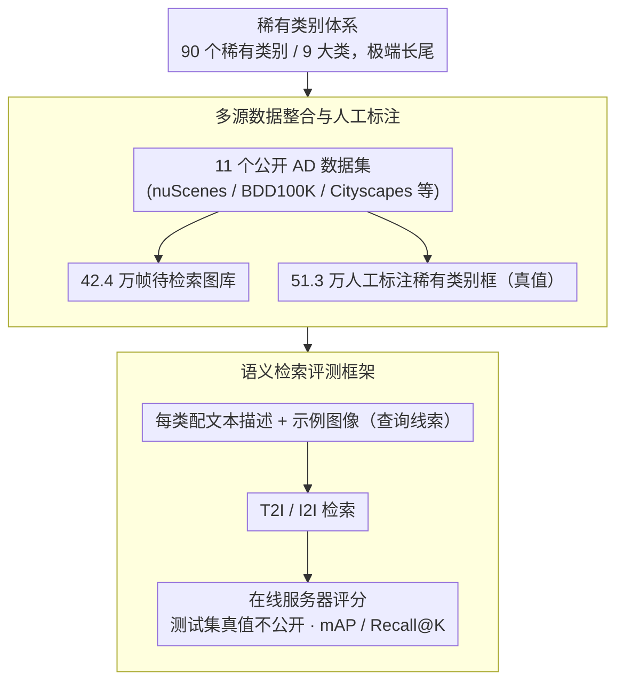

# SearchAD: Large-Scale Rare Image Retrieval Dataset for Autonomous Driving

**会议**: CVPR 2026  
**arXiv**: [2604.08008](https://arxiv.org/abs/2604.08008)  
**代码**: [https://github.com/iis-esslingen/searchad_devkit](https://github.com/iis-esslingen/searchad_devkit)  
**领域**: 自动驾驶 / 数据集  
**关键词**: 稀有图像检索, 自动驾驶, 长尾分布, 语义检索, 数据集基准

## 一句话总结

SearchAD 构建了首个面向自动驾驶的大规模稀有图像检索数据集，包含42万+帧图像、51万+标注框、90个稀有类别，支持文本到图像和图像到图像检索，并通过全面评估揭示当前多模态检索模型在稀有物体检索上的不足。

## 研究背景与动机

**领域现状**：自动驾驶（AD）系统的安全性高度依赖于对稀有和安全关键场景的处理能力。随着数据集规模持续增长（已达百万帧级别），关键挑战从"收集更多数据"转向"如何高效找到最相关的样本"。

**现有痛点**：(1) 现有自动驾驶数据集主要关注常见类别（车辆、行人、自行车等），对稀有物体（如拐杖行人、动物、异常路面标记等）覆盖极少；(2) 现有图像检索基准主要面向实例级检索（同一物体的不同视角），而非自动驾驶场景需要的语义级检索（找到包含特定稀有类别的图像）；(3) 缺少统一的大规模基准来评测和推动稀有驾驶场景的检索技术。

**核心矛盾**：稀有安全关键场景的出现频率极低（"大海捞针"问题），但对 AD 系统的安全性至关重要。现有方法没有专门针对这种极端长尾分布的检索能力进行评估。

**本文目标**：构建首个专注于自动驾驶场景下稀有物体/场景检索的大规模数据集和基准，填补该领域的空白。

**切入角度**：整合 11 个已有 AD 数据集的数据，通过人工标注 90 个稀有类别的边界框，创建一个统一的检索基准。

**核心 idea**：针对自动驾驶中的"大海捞针"问题，构建大规模稀有图像检索数据集，支持语义级的文本到图像和图像到图像检索。

## 方法详解

### 整体框架

SearchAD 要解决的是自动驾驶里"大海捞针"式的稀有场景挖掘——给定一个稀有类别（比如"使用拐杖的行人"），如何从百万帧量级的图库里把所有包含它的图像捞出来。整个工作不是训一个新模型，而是把这件事变成一个可以被公平评测的检索任务：先从 11 个公开 AD 数据集汇集 423,798 帧图像作为待检索库，再人工标出 90 个稀有类别共 513,265 个边界框作为真值，给每个类别配上文本描述和示例图像两套"查询线索"，最后用一个带隐藏测试集的公开服务器统一打分。下面三个设计分别回答"检索什么、从哪检索、怎么评分"。

### 关键设计

**1. 稀有类别体系：把"安全关键但极少出现"的物体定义成可检索的目标**

自动驾驶数据集动辄百万帧，但绝大多数帧都是车、人、自行车这类常见类别，真正决定安全的反而是那些罕见情形——一旦碰上却没见过，系统就可能失效。SearchAD 把这类物体梳理成 90 个稀有类别，并归到 9 个大类下：Animal（动物）、Human（特殊行人状态，如拄拐、坐轮椅）、Marking（异常路面标记）、Object（道路障碍物）、Rideable（可骑行设备）、Scene（特殊场景）、Sign（非标准交通标志）、Trailer（拖车）、Vehicle（特殊车辆）。这套两级结构既能在大类粒度上评测，也能下钻到细类；而"稀有"在这里是字面意义的——部分类别在整个 42 万帧里出现不足 50 次，跨类别的频次落差超过三个数量级，正是这种极端长尾让检索难度远超常规基准。

**2. 多源数据整合与人工标注：用 11 个数据集的多样性逼近真实世界的稀有分布**

单个数据集的传感器、地域、天气都偏固定，稀有物体本就少见，若只取一处更难凑齐多样的出现条件。SearchAD 因此横向整合了 Lost and Found、WildDash2、ACDC、IDD、KITTI、Cityscapes、Mapillary Vistas、ECP、nuScenes、BDD100K、Mapillary Sign 共 11 个来源，每个来源带来不同的相机配置、地理分布和天气光照，使同一稀有类别能以多种视觉形态出现，更贴近真实部署中遇到的分布。所有 51 万多个稀有类别边界框都是人工标注而非自动伪标，保证了真值质量——这对评测稀有、小尺寸物体尤其关键，因为这类目标用现成检测器自动标注极易漏检。

**3. 语义检索评测框架：以"类别含义"而非"具体实例"作为检索准绳**

传统图像检索基准（如 Oxford5K）做的是实例级检索——给一张地标照片，找同一地标的其它视角；但自动驾驶的数据挖掘需求是语义级的——开发者要的是"找出所有包含动物的图像"，而不是"找到这只特定的狗"。SearchAD 据此为每个稀有类别同时提供语言支持集（文本描述）和视觉支持集（示例图像），让模型既能做文本到图像（T2I）检索、也能做图像到图像（I2I）检索，再用 mAP 和 Recall@K 衡量它在大库里捞出正确帧的能力。测试集真值不公开、统一走在线服务器评分，从机制上避免了在测试集上调参带来的虚高，保证了不同方法的横向可比。

### 损失函数 / 训练策略

SearchAD 是数据集与基准工作，本身不提出新模型，但给出了两类 baseline：一是零样本检索，直接拿预训练多模态模型（CLIP、SigLIP、RegionCLIP 等）算查询与图像的相似度；二是微调 baseline，在 SearchAD 训练集上用标准对比学习损失（InfoNCE）继续训练检索模型。两类都用 mAP、Recall@1/5/10 等标准检索指标衡量。

## 实验关键数据

### 主实验

| 方法类型 | 模型 | mAP (T2I) | Recall@10 (T2I) | 说明 |
|---------|------|-----------|-----------------|------|
| 全局特征 | CLIP | 基线水平 | 较低 | 全局语义匹配 |
| 全局特征 | SigLIP | 略优于CLIP | 略优 | 更强的预训练 |
| 空间对齐 | RegionCLIP | 零样本最佳 | 零样本最佳 | 空间视觉-语言对齐最优 |
| 微调 | CLIP-ft | 显著提升 | 显著提升 | 微调极大改善 |
| 图像到图像 | CLIP (I2I) | 低于T2I | 低于T2I | 图像检索弱于文本 |

### 消融实验

| 分析维度 | 发现 | 说明 |
|---------|------|------|
| 文本 vs 图像检索 | 文本优于图像 | 文本的语义先验更强 |
| 稀有度影响 | 越稀有越难检索 | 出现<50次的类别检索极困难 |
| 物体尺寸影响 | 小物体更难 | 小尺寸稀有物体检索精度最低 |
| 微调效果 | 显著提升但仍不足 | 绝对检索能力仍不尽人意 |

### 关键发现

- 文本到图像检索显著优于图像到图像检索，说明语言的语义定位能力对稀有物体检索至关重要
- 直接对齐空间视觉特征与语言的模型（如 RegionCLIP）在零样本检索中表现最佳
- 即使经过微调，对极端稀有类别（<50次出现）的检索精度仍然很低，说明该问题远未解决
- 数据集中的长尾分布是核心挑战——90个类别的出现频率跨度超过三个数量级

## 亮点与洞察

- **独特的问题定义**：聚焦"大海捞针"的稀有安全关键场景检索，这是一个被忽视但极其重要的问题。在自动驾驶中，系统对一次性的稀有事件的反应能力可能决定生死
- **数据集规模和质量的平衡**：42万+帧整合了11个数据集的多样性，51万+人工标注的边界框确保了标注质量。90个稀有类别的设计体现了对自动驾驶安全需求的深入理解
- **揭示了当前方法的不足**：即使最好的模型微调后，稀有物体的检索能力仍不够。这为社区指明了清晰的改进方向

## 局限与展望

- 标注仅限于 2D 边界框，缺少 3D 标注和语义分割掩码，限制了更精细的检索评估
- 90 个稀有类别虽已覆盖主要安全场景，但现实世界的长尾分布可能更加极端
- 目前只支持静态单帧检索，时序检索（找到包含稀有事件的视频片段）未涉及
- 数据集中的稀有类别分布受限于源数据集的地理分布，可能存在地域偏见
- 未来可考虑结合主动学习或少样本检测技术来提升稀有物体的检索能力

## 相关工作与启发

- **vs nuScenes/Waymo 检索**: 传统AD数据集的检索主要基于元数据标签，SearchAD 强调基于多模态语义的检索
- **vs Oxford5K/Paris6K 检索基准**: 传统检索基准面向地标等实例级检索，SearchAD 面向语义级的稀有类别检索
- **vs OpenImages/LVIS 长尾检测**: 这些数据集关注长尾检测，SearchAD 关注长尾检索，侧重点不同但问题结构相似

## 评分

- 新颖性: ⭐⭐⭐⭐ 首个面向AD稀有场景的大规模语义检索基准，问题定义有价值
- 实验充分度: ⭐⭐⭐⭐ 多种baseline对比全面，分析深入
- 写作质量: ⭐⭐⭐⭐ 数据集构建过程描述清晰
- 价值: ⭐⭐⭐⭐ 数据集+基准+公开服务器，对社区贡献明确

<!-- RELATED:START -->

## 相关论文

- [\[CVPR 2026\] Ghost-FWL: A Large-Scale Full-Waveform LiDAR Dataset for Ghost Detection and Removal](ghost-fwl_a_large-scale_full-waveform_lidar_dataset_for_ghost_detection_and_remo.md)
- [\[ECCV 2024\] H-V2X: A Large Scale Highway Dataset for BEV Perception](../../ECCV2024/autonomous_driving/h-v2x_a_large_scale_highway_dataset_for_bev_perception.md)
- [\[CVPR 2026\] Learning to Drive is a Free Gift: Large-Scale Label-Free Autonomy Pretraining from Unposed In-The-Wild Videos](learning_to_drive_is_a_free_gift_large-scale_label-free_autonomy_pretraining_fro.md)
- [\[CVPR 2025\] Towards Satellite Image Road Graph Extraction: A Global-Scale Dataset and A Novel Method](../../CVPR2025/autonomous_driving/towards_satellite_image_road_graph_extraction_a_global-scale_dataset_and_a_novel.md)
- [\[CVPR 2026\] Traffic Scene Generation from Natural Language Description for Autonomous Vehicles with Large Language Model](traffic_scene_generation_from_natural_language_description_for_autonomous_vehicl.md)

<!-- RELATED:END -->
