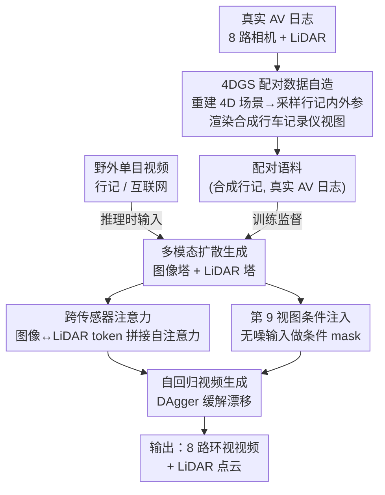

# Sensor2Sensor: Cross-Embodiment Sensor Conversion for Autonomous Driving

**会议**: CVPR 2026  
**arXiv**: [2605.22809](https://arxiv.org/abs/2605.22809)  
**代码**: 无（Waymo，未开源）  
**领域**: 自动驾驶 / 生成式世界模型 / 扩散模型  
**关键词**: 跨具身传感器转换、4D 高斯泼溅、多模态扩散、LiDAR 生成、行车记录仪

## 一句话总结
针对自动驾驶缺乏长尾数据的痛点，本文用 4DGS 把真实 AV 日志反渲染成"行车记录仪风格"视频从而**自造配对数据**，再训练一个条件扩散模型把单目行车记录仪视频转换成目标车辆的完整多视角相机 + LiDAR 传感器套件，FID 6.47、Chamfer 距离比 X-Drive 降 13.4%，并能把互联网上的事故/夜间长尾视频"翻译"成可用的多模态 AV 日志。

## 研究背景与动机
**领域现状**：自动驾驶系统（ADS）的训练和验证需要海量、多样、覆盖长尾场景的数据。但车队自采的专有数据虽然是高保真多模态（8 路环视相机 + LiDAR），却受限于规模、传感器配置多样性、地理与长尾行为覆盖；与之相反，行车记录仪、互联网视频这类"野外（in-the-wild）"数据规模和多样性极大、天然偏向长尾（罕见事件才会被录下来分享），但它们是**单目、非结构化**的，和 ADS 期望的结构化多模态输入不兼容。

**现有痛点**：补数据缺口有两条路，都各有硬伤。第一条是用生成模型**凭空合成场景**（如 GAIA-1、Cosmos），但生成数据常有"合理性鸿沟"（非物理的动力学）和"真实性问题"（传感器保真度低），不适合做 ADS 验证。第二条是**利用野外第三方数据**，它天然扎根物理现实、没有事件合理性问题，但存在严重的**具身鸿沟（embodiment gap）**：野外数据通常是单目、缺 360° 多相机视角、更完全没有 LiDAR 这类关键模态，和目标 ADS 平台在传感和几何上严重错位。

**核心矛盾**：把单目无标定视频转成连贯、时序一致的多模态传感器套件，本质是一个**极难的无配对域转换**任务。经典无配对转换方法（如 CycleGAN 类）压根 hold 不住这么大的域差距——它们缺乏强几何先验和模态生成能力，无法从单一视频流凭空补出几何正确的环视 + 点云。而要监督训练，又**根本没有大规模配对的 (行车记录仪, AV 日志) 数据**。

**核心 idea**：用 4D 高斯泼溅（4DGS）把已有的高保真 AV 日志重建成 4D 场景，再从中渲染"合成行车记录仪视角"——这样就**人工造出了完美配对的训练数据** (合成行车记录仪, 真实 AV 日志)，把无监督的跨具身难题转化为完全监督的、几何锚定的生成任务；然后用条件扩散模型完成"单目视频 → 多视角相机 + LiDAR"的转换。

## 方法详解

### 整体框架
Sensor2Sensor 的核心洞察是：**缺的不是生成能力，而是配对数据**——而真实 AV 日志本身就含 360° 覆盖和丰富 3D 信息，足以反推出"如果用一个行车记录仪从某个角度拍这同一场景，会拍成什么样"。于是整条 pipeline 分三个阶段：

1. **配对数据自造（4DGS 仿真）**：把约 10 万段 10 秒的 AV 场景用支持动/静态物体的 4DGS 重建成 4D 表示，再用虚拟相机（采样真实行车记录仪的内外参分布）渲染出合成行车记录仪视图。每一帧合成行车记录仪都与原始 8 路相机 + LiDAR **时间同步、空间对齐**，天然成对。
2. **多模态扩散生成**：训练一个条件扩散模型，输入单帧"第三方相机"视图，**同时**生成 8 路环视图像和 LiDAR 点云。图像和 LiDAR 各有自己的 VAE 和 U-Net 塔，多视角一致性靠 3D 注意力维持，跨模态一致性靠跨传感器注意力维持，输入则作为"第 9 个视图"做条件注入。
3. **自回归视频生成**：把单帧模型扩展到视频，逐帧自回归地以上一帧自身生成结果为条件；并用 DAgger 算法缓解自回归漂移。

下面这张图给出三个阶段的数据流（4DGS 造出的配对语料只在训练时提供监督，野外单目视频只在推理时输入）：

### 关键设计

**1. 4DGS 配对数据自造：把"无配对"难题转成"全监督"**

这是全文最关键的一招，直接拆掉"没有配对数据"这个死结。作者把约 10 万段 10 秒、含 360° 多视角相机和 LiDAR 的 AV 场景用一个支持动态刚体（车）和可变形物体（行人）的 3DGS 变体重建成 4D 表示，LiDAR 用来初始化和正则化高斯几何（可选）；运动物体的高斯用一个规范物体模型累积，以获得更完整的物体覆盖。重建好后，就能用**虚拟相机**渲染：内参 $\mathbf{p}_i$ 采样真实行车记录仪的焦距、主点、畸变系数 $\boldsymbol{\kappa}$（模拟低成本广角镜头的畸变），外参 $\mathbf{p}_e=[\mathbf{R}\,|\,\mathbf{t}]$ 采样 6-DoF 位姿（模拟不同车型、不同安装位置如驾驶侧、以及安装误差带来的俯仰/偏航/翻滚扰动 $\theta_p,\theta_y,\theta_r$）。由于这是同一个 4DGS 场景渲染出来的，每个合成行车记录仪帧都与真值传感器**完美时间同步、空间对齐**，于是无监督跨具身转换被转化成几何锚定的全监督生成。一个工程细节：因为 3DGS 纯属重建性质，最佳渲染质量只在原相机位姿的有界邻域内成立；为支持鱼眼光学，他们把原始 3DGS 的光栅化换成了**基于光线追踪**的渲染。

**2. 多模态扩散：双塔 + 跨传感器注意力，让图像和 LiDAR 互相"看见"**

模型基于 Latent Diffusion，要同时生成多视角图像 $C=\{\mathbf{c}_i\}_{i=1}^N$（$N=8$）和 LiDAR 点云 $L$，二者各有独立的 VAE 和 U-Net 分支。图像分支沿用多视角扩散，把原 LDM 的 2D 注意力换成 **3D 注意力**（1D 跨视角 + 2D 空间），在所有图像上联合计算注意力来保证多视角一致；相机位姿用 **raymap**（编码每个像素的光线起点和方向，相对第一台相机归一化后按通道拼接）来精确控制。LiDAR 则用**距离视图自旋图像**表示——形状 $[H_L, W_L, D_L]$、$D_L=4$ 通道分别是 range（深度，150 米截断后归一化到 $[0,1]$）、intensity、elongation、validity（有无回波的 0/1 掩码），行列对应仰角和方位角，可与 3D 欧氏坐标互相投影。关键的跨模态耦合发生在 **跨传感器注意力模块**：在每个 U-Net block 卷积层后，把图像特征 $\mathbf{f}_C^i$ 和 LiDAR 特征 $\mathbf{f}_L^i$ 各展平成 token 序列 $\mathbf{T}_C^i\in\mathbb{R}^{K_C\times d^i}$、$\mathbf{T}_L^i\in\mathbb{R}^{K_L\times d^i}$，拼成统一序列 $\mathbf{T}_U^i\in\mathbb{R}^{(K_C+K_L)\times d^i}$ 后做自注意力——由于两个分支共享 U-Net 架构、特征维度 $d^i$ 一致，图像和 LiDAR 的特征可以直接交互，从而学到一个连贯的底层 3D 表示（生成的 LiDAR 点能对齐到生成图像里对应的物体）。

**3. 第 9 视图条件注入：把输入当成一个"已知、无噪"的额外视角**

如何把第三方行车记录仪的视觉上下文喂进模型？作者没有简单地通道拼接（CC），而是把输入作为一个**额外的第 9 个条件视图**注入——它区别于要生成的 $N=8$ 个目标视图。具体做法：输入经编码器得到 latent，再拼上对应的 raymap 和一个**二值条件 mask**（明确告诉模型这一视图是已知、无噪的条件，区别于要去噪的 8 个噪声 latent）；然后沿视图维度与原 8 个视图的 latent 拼成 $(N+1)\times H\times W\times C$ 张量送进扩散层。这样 8 个目标视图就能通过注意力与条件视图交互，把整个环视场景的合成"锚"在行车记录仪上下文上。这个第 9 视图**不计入损失**，确保网络容量集中在准确生成 8 个目标视图上。消融证明这种**视图拼接（VC）**显著优于通道拼接（CC）——见下文。

**4. 自回归 + DAgger：抑制视频长程漂移**

把单帧模型扩展到视频时，目标是建模 $P(C_t, L_t \mid \mathbf{x}_t, C_{t-1}, L_{t-1})$，即第 $t$ 帧以当前输入帧 $\mathbf{x}_t$ 和**上一帧自己的生成结果**为条件（$t=0$ 时只以 $\mathbf{x}_0$ 为条件）。朴素自回归有典型的**漂移**问题：训练时喂的是真值上下文，推理时却要以自己不完美的生成为条件，误差在长 rollout 中累积。作者引入 **DAgger** 算法——迭代地用当前模型 rollout 生成视频，再用这些"自己生成的上下文"训练新模型，逐步缩小训练-测试不匹配；同时保留 0.2 概率仍用原始真值上下文训练以维持鲁棒性。

### 损失函数 / 训练策略
LiDAR VAE 用一个多项加和损失联合编码 range / intensity / elongation / validity：

$$\mathcal{L}^{\text{TOTAL}} = \mathcal{L}^{\text{L1}}_{\text{range}} + \mathcal{L}^{\text{L1}}_{\text{elongation}} + \mathcal{L}^{\text{L1}}_{\text{intensity}} + \mathcal{L}^{\text{BCE}}_{\text{validity}} + \mathcal{L}^{\text{LPIPS}}_{\text{normals}} + \mathcal{L}^{\text{LPIPS}}_{\text{elongation}} + \mathcal{L}^{\text{LPIPS}}_{\text{intensity}} + \mathcal{L}^{\text{LPIPS}}_{\text{validity}} + \mathcal{L}^{\text{KL}}$$

即对连续量（range/elongation/intensity）用 L1，对 validity 掩码用 BCE，再叠加多项 LPIPS 感知损失（含从 range 算出的法向量 normals）和 VAE 的 KL 正则。扩散部分是标准条件扩散，第 9 条件视图被排除在去噪损失之外；视频阶段以 DAgger 迭代微调。

## 实验关键数据

### 主实验
评测指标：图像真实性用 FID↓，视频真实性用 FVD↓；配对真值比较用 PSNR↑/SSIM↑/LPIPS↓；并辅以人工评测。由于"第三方→AV"配对生成是全新任务、无公开数据集，作者自建了 (a) 1000 段配对的"固定相机→AV"序列（约 3 秒，固定相机是 AV 前左保险杠相机）和 (b) 野外数据集（手采行车记录仪、互联网视频、手机录像、其他 ADAS 录像）。无直接 baseline，故改造了重建类（VGGT、$\pi^3$）和生成类（X-Drive、把 CAT3D 改成 LiDAR + 通道拼接条件，即"Ours w/o VC"）方法对比。

**多视角图像生成（固定保险杠相机 → AV，表 1）**：

| 方法 | FID ↓ | PSNR ↑ | SSIM ↑ | LPIPS ↓ |
|------|-------|--------|--------|---------|
| VGGT | 250.93 | 14.73 | 0.433 | 0.491 |
| $\pi^3$ | 246.27 | 14.93 | 0.470 | 0.458 |
| X-Drive | 8.30 | 18.61 | 0.536 | 0.345 |
| Ours w/o VC | 6.88 | 18.69 | 0.531 | 0.346 |
| **Ours** | **6.47** | **19.06** | **0.539** | **0.316** |

重建类方法 FID 高达 ~250（纯重建无法补出未观测区域），生成类 X-Drive FID 8.30，本文 FID 6.47、LPIPS 0.316 全面最优。

**多视角视频生成（表 2，仅前视图计算，因重建类其他视图大片空洞）**：

| 方法 | FVD ↓ | PSNR ↑ | SSIM ↑ | LPIPS ↓ |
|------|-------|--------|--------|---------|
| VGGT | 2373.15 | 14.73 | 0.433 | 0.491 |
| $\pi^3$ | 2007.35 | 14.93 | 0.470 | 0.458 |
| Ours w/o VC | 293.73 | 22.07 | 0.622 | 0.204 |
| **Ours** | **278.12** | **22.42** | **0.623** | **0.186** |

本文 FVD 278.12 远优于重建类的 2000+（重建-only 设计无法产出连贯新视角），也优于 Ours w/o VC 的 293.73。

**LiDAR 生成（表 3，Chamfer 距离）**：

| 方法 | Chamfer Distance ↓ | 提升 |
|------|-------------------|------|
| X-Drive | 10.02 | — |
| **Ours** | **8.68** | **13.37%** |

**野外数据人工评测（表 4，26 名评测者，40×3 样本）**：本文在行车记录仪数据上 image 顶选率 83.46%、LiDAR 68.08%；互联网数据上 image 84.62%、LiDAR 58.46%。两两对比中，本文相对 X-Drive 在图像上 >94%、LiDAR 上 >85% 被偏好。

### 消融实验

| 配置 | FID ↓ | PSNR ↑ | SSIM ↑ | LPIPS ↓ | 说明 |
|------|-------|--------|--------|---------|------|
| CAT3D + CC（仅图像） | 6.63 | 18.91 | 0.542 | 0.314 | 通道拼接条件 |
| CAT3D + VC（仅图像） | 6.20 | 19.12 | 0.543 | 0.307 | 视图拼接条件 |
| CAT3D + CC + LiDAR | 6.88 | 18.69 | 0.531 | 0.346 | 加联合 LiDAR |
| **CAT3D + VC + LiDAR（ours）** | 6.47 | 19.06 | 0.539 | 0.316 | 完整模型 |

DAgger 消融（视频，表 6）：

| 配置 | 前视 FVD ↓ | 前视 FID ↓ |
|------|-----------|-----------|
| 无 DAgger | 288.90 | 24.65 |
| **有 DAgger（ours）** | **278.12** | **21.54** |

### 关键发现
- **VC（视图拼接）始终优于 CC（通道拼接）**：无论是否带 LiDAR，VC 的 FID/PSNR/LPIPS 都更好（如仅图像时 6.20 vs 6.63），印证"把输入当第 9 视图、通过注意力与目标视图交互"比通道层面硬塞条件更有效。
- **联合 LiDAR 训练对图像指标略有牺牲**：CAT3D+VC 仅图像 FID 6.20，加 LiDAR 后升到 6.47——多模态共训会让图像质量微降，但换来了 LiDAR 这一关键模态，作者认为这个 trade-off 值得。
- **DAgger 对视频时序稳定性贡献明显**：前视 FVD 288.90→278.12、FID 24.65→21.54，定性上明显减少长 rollout 的闪烁和物体不一致。

## 亮点与洞察
- **"用重建当几何先知（geometric oracle）来造监督"是最漂亮的一招**：把 4DGS 从"渲染产物"重新定位成"数据机器"，用已有 AV 日志反推配对行车记录仪视图，一举把无配对域转换变成全监督任务——这个思路可迁移到任何"目标域数据丰富、源域数据稀缺但二者可由同一 3D 场景渲染"的跨模态/跨视角转换问题。
- **第 9 视图条件注入 + 条件 mask** 是个干净的多视角扩散条件化技巧：不改架构、不加额外编码器，只是把条件当成一个"已知无噪、不计损失"的视图塞进视图维度，让注意力天然完成条件融合，比通道拼接更优且通用。
- **跨传感器注意力靠"共享 U-Net 维度 + token 拼接自注意力"** 实现图像↔LiDAR 双向耦合，结构极简却能学出连贯 3D 表示，让生成点云对齐到生成图像里的物体。
- **真正打通了"互联网长尾视频 → 可用 AV 多模态日志"**：能把夜间近碰撞、事故、突发事件这类几乎不可能车队自采的长尾场景转成训练/验证可用数据，这是对 ADS 数据瓶颈的实质突破。

## 局限性 / 可改进方向
- **4DGS 渲染质量受限于"原相机位姿的有界邻域"**：作者自己承认纯重建性质决定了远离原始视角的渲染会退化，这意味着合成行车记录仪视角的外参采样范围被实际约束，过大偏移的配对数据质量存疑。
- **生成 LiDAR 仍只用 Chamfer 距离单指标量化**，且只比了一个 baseline（X-Drive），LiDAR 侧的定量评测相对单薄；intensity/elongation 的物理保真度缺少专门量化。
- **无开源、依赖 Waymo 内部约 10 万段日志**：4DGS 自造数据的可复现性对外部团队几乎为零，方法虽通用但门槛高。
- **下游有效性未直接验证**：论文证明了生成数据"看起来真"（FID/人评），但没有用生成日志去训练/验证一个真实感知或规划模型来证明"对 ADS 真有用"，从"realism"到"utility"还差一个闭环实验。
- **自回归漂移虽被 DAgger 缓解但未根除**：FVD 仍有 278，长视频的累积误差是否随时长进一步恶化没有给出曲线。

## 相关工作与启发
- **vs 生成式世界模型（GAIA-1 / Cosmos）**：它们做"凭空合成场景"用于闭环仿真和未来预测，目标与本文正交且有合理性/真实性鸿沟；本文不造新事件，而是"转换"已扎根现实的野外视频，规避了合理性问题。
- **vs 同具身传感器转换（LiDMs camera→LiDAR / X-Drive 多传感器共生成）**：它们在同一具身内做模态转换；本文把条件扩散扩展到更难的**跨具身**设置——单目流 → 几何正确的多传感器 AV 日志，并被改造成本文的 baseline，被全面超越。
- **vs 重建式世界模型（PAGS / Driv3R / DriveDreamer4D / VGGT / $\pi^3$）**：它们用多视角输入做 4D 重建和视角增广；本文不止用它增广视角，而是把重建当"几何先知"来**解决配对数据瓶颈**，把跨具身难题转成全监督生成。实验也显示纯重建类（VGGT/$\pi^3$）在补未观测区域上彻底失败（FID ~250、FVD 2000+）。

## 评分
- 新颖性: ⭐⭐⭐⭐⭐ "用 4DGS 反渲染自造配对数据 + 跨具身扩散转换"这一范式是真正的新问题新解法，第 9 视图条件化也很巧。
- 实验充分度: ⭐⭐⭐⭐ 图像/视频指标 + 大规模人评扎实，但 LiDAR 量化单薄、且缺下游 utility 闭环验证。
- 写作质量: ⭐⭐⭐⭐⭐ 动机推导清晰，方法三阶段层次分明，图表对照到位。
- 价值: ⭐⭐⭐⭐⭐ 直击 ADS 长尾数据瓶颈，能解锁海量互联网/行车记录仪数据，工业价值高（Waymo 出品）。

<!-- RELATED:START -->

## 相关论文

- [\[CVPR 2026\] VGGDrive: Empowering Vision-Language Models with Cross-View Geometric Grounding for Autonomous Driving](vggdrive_empowering_vision-language_models_with_cross-view_geometric_grounding_f.md)
- [\[CVPR 2026\] x2-Fusion: Cross-Modality and Cross-Dimension Flow Estimation in Event Edge Space](x2-fusion_cross-modality_and_cross-dimension_flow_estimation_in_event_edge_space.md)
- [\[CVPR 2026\] SpaceDrive: Infusing Spatial Awareness into VLM-based Autonomous Driving](spacedrive_infusing_spatial_awareness_into_vlm-based_autonomous_driving.md)
- [\[CVPR 2026\] Unifying Language-Action Understanding and Generation for Autonomous Driving](unifying_language-action_understanding_and_generation_for_autonomous_driving.md)
- [\[CVPR 2026\] MindDriver: Introducing Progressive Multimodal Reasoning for Autonomous Driving](minddriver_introducing_progressive_multimodal_reasoning_for_autonomous_driving.md)

<!-- RELATED:END -->
